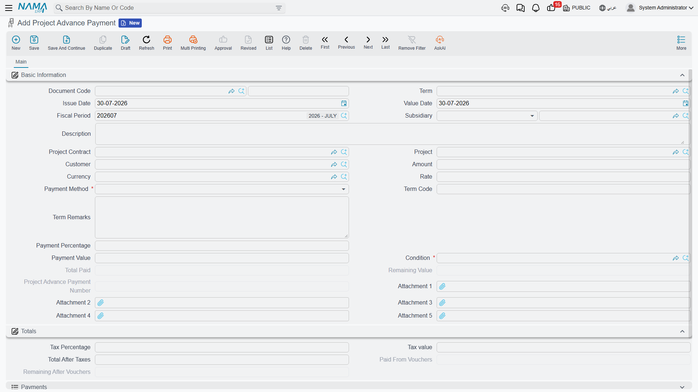

# Project Advance Payments

Nobody mobilises a tower crane out of goodwill. On most construction contracts the owner pays a slice of the value — 10%, 20% — before a shovel goes in the ground, so that the contractor can buy the first materials, put up the site offices and hire the plant. That money is not revenue. It is a loan against future certificates, and every certificate has to give a piece of it back.

**Project Advance Payment** (دفعة مشروع مقدمة) is the document that records that money and, from then on, tracks its own repayment automatically. You set the rule once; the [extracts](/modules/contracting/project-contracting/contracting-project-extracts.md) do the rest.

## Where to find it

| | |
|---|---|
| Menu | Contracting > Project Contracting > Project Advance Payment |
| Kind | Document |
| Document term | Required — it supplies the accounts and the default recovery rule |
| Licence | `contracting` |

## The screen

The header splits into three ideas, and it is worth reading it that way rather than field by field.

**Who and how much.** The **Project Contract** (required — an advance always belongs to a contract), and the **Project** and **Customer** that come with it. The **Subsidiary**, which is the account this money sits against. The **Amount**, its **Currency** and **Rate**. In the Totals group, a **Tax Percentage** and the **Tax Value** it produces, giving a **Total After Tax** — the figure that recovery actually works against.

**How it comes back.** The **Payment Method**, and depending on which one you pick, a **Payment Percentage** or a **Payment Value**. Then the **Condition** — required — which is the [contract condition](/modules/contracting/setup/contracting-conditions.md) the recovery will appear as on each extract, and which carries the accounts the recovery is booked through. Optionally a **Term Code**, if the advance relates to one BOQ term rather than the contract as a whole; if you fill it, it must be a term that exists on the contract.

**What has happened since.** All system-maintained: **Total Paid** (how much has been recovered by extracts so far), **Remaining**, **Paid From Vouchers** and **Remaining After Vouchers** (the cash side — how much of the advance the customer has actually handed over), and the advance's sequence number among the contract's advances. The **Payments** list underneath shows the receipt vouchers that brought the cash in.

Note the two independent "how much is left" figures. *Remaining* is about **recovery** — how much of the advance the extracts still have to claw back. *Remaining after vouchers* is about **collection** — how much of the advance the customer still owes you in cash. They answer different questions and move at different times.

## The recovery rule

**Payment Method** is the whole mechanism, condensed into one field:

| Payment method | What each extract recovers |
|---|---|
| **First Next Extract** | the entire balance, on the very next extract. Suits a small mobilisation advance that everyone wants off the books at once |
| **Fixed Value With Every Extract** | the fixed **Payment Value** — or the balance, if that is smaller. Suits an advance repaid in agreed monthly slices |
| **Percentage With Every Extract** | the **Payment Percentage** applied to the advance's *own* total after tax. A steady, predictable amount per certificate |
| **Percentage From Due Value With Every Extract** | the **Payment Percentage** applied to *that extract's* works value. Recovery scales with progress: a big month repays more |
| **Final Extract** | nothing until the end, and then the whole balance on the Final extract |

The last two are the ones worth thinking about, because they encode two different commercial agreements. *Percentage With Every Extract* says "you will give back 25% of the advance each time, regardless of how much you billed". *Percentage From Due Value* says "you will give back 20% of whatever you bill". On a slow month those produce very different cheques.

Whichever you choose, every recovery is capped at what is left. An advance can never be over-recovered by more than its balance — the extract refuses to commit if a deduction would push the remaining below zero, unless the advance's own document term allows a negative remaining.

## How an extract recovers it

The mechanism is entirely automatic, and it runs through the extract's conditions grid rather than through any field of its own:

1. When conditions are collected — by the *Collect Conditions* button or automatically on save, depending on the extract term's setting — the extract looks for every **committed** advance on its contract that still has a remaining balance and is dated **on or before** the extract's value date. On a **Final** extract the date filter is dropped, so even future-dated advances are swept in.
2. Each one becomes a **deduction** row in *Additions And Deductions*: the advance in the condition-document column, the advance's condition, its term code, and a deduction amount worked out from the payment method above. If the advance carried tax, a proportional share of the remaining tax is taken off the recovered amount.
3. On commit, the recovery is written back: the advance's **Total Paid** goes up, its **Remaining** goes down, and a record is kept of which extract recovered how much. That record is what makes the figures on the advance trustworthy after a dozen certificates.
4. Any residue of a hundredth or less is snapped to zero, so a Final extract is never blocked by a rounding tail.

Cancelling the extract reverses all of it.

## What the advance itself books

The advance is a real accounting document in its own right, and it is processed the same way every contracting document is: on commit it raises a **business request**, and the journal entry appears when that request is processed in the background. A failure — a closed period, an unconfigured account — is retried from the **Business Requests** list view with **More → Reprocess** or **Recommit**.

The entry is short. The amount goes to one account pair on the document term, and the tax value to a second pair. Each pair is booked only when **both** of its sides are configured, so a half-configured term silently books nothing — always check both.

The usual wiring puts the credit on **Advances received from customers** (a liability: you owe this work) and the debit on bank, cash, or a clearing account that the receipt voucher then settles. The recovery later moves in the opposite direction, debiting that same advances-received account and crediting the customer's receivable, which is how the liability is worked off against the new bill. The accounts for *that* leg live on the **condition**, not on the advance's term — see [Contract Conditions](/modules/contracting/setup/contracting-conditions.md).

The advance can also be reported to the tax authority as an invoice in its own right, with a single line at its amount.

## What blocks a commit

- **The project contract is required.**
- **A term code, if given, must exist on the contract.**
- **The payment value or percentage the method needs must be filled** — a fixed-value method with no value, or a percentage method with no percentage, is refused.
- **The payment value cannot exceed the due value of the term code** it is attached to.
- **The total after tax cannot fall below what has already been recovered.** Once extracts have clawed back 23,000, the advance cannot be edited down to 20,000.
- **The amount cannot be edited at all once a Final extract exists** on the contract, because the closing certificate has already settled against it.
- **A contract that already has a Final extract cannot take a new advance.**

Deleting is guarded in the same spirit: an advance from which anything has been recovered cannot be deleted. Cancel the extracts first.

## Worked example

Our contract from the [extracts page](/modules/contracting/project-contracting/contracting-project-extracts.md): **PC-2026-001** for *Al-Fanar Development* on project *Tower A*, value **230,000**.

**PAP-001**, value date 1 February:

| Field | Value |
|---|---|
| Amount | **46,000** — 20% of the contract value |
| Tax percentage | 0, so the total after tax is 46,000 |
| Payment Method | Percentage With Every Extract |
| Payment Percentage | **25** |
| Condition | *ADV-REC — advance recovery*, whose accounts are debit *Advances received from customers*, credit *Trade receivable* |

25% of the advance's own 46,000 is **11,500**, so every certificate is expected to give back 11,500 until the advance is exhausted — four extracts, if the certificates are big enough to carry it.

| | On commit of the advance | After EXT-001 | After EXT-002 | On the Final extract |
|---|---|---|---|---|
| Recovered this time | — | 11,500 | 11,500 | 23,000 |
| Total Paid | 0 | 11,500 | 23,000 | 46,000 |
| **Remaining** | **46,000** | **34,500** | **23,000** | **0** |

Read across the bottom row and you have the sentence the finance team cares about: the 46,000 advance was drawn down from 46,000 to 34,500 to 23,000 across the two interim certificates, and the Final extract sweeps the last 23,000 in one go — ignoring the 25% rule, because a Final extract always takes the whole balance and refuses to commit if anything is left behind.

On the certificates themselves the recovery is one line in the deductions grid:

| Extract | Works incl. VAT | Retention | **Advance recovered** | Net payable |
|---|---|---|---|---|
| EXT-001 | 70,150 | (6,100) | **(11,500)** | 52,550 |
| EXT-002 | 77,510 | (6,740) | **(11,500)** | 59,270 |

::: tip Choosing between the two percentage methods
Had PAP-001 used *Percentage From Due Value With Every Extract* at 25% instead, EXT-001 would have recovered 25% of its 61,000 works value — 15,250, not 11,500 — and EXT-002 25% of its 67,400, or 16,850, so the advance would be all but cleared after three certificates rather than four. Same advance, same percentage, different agreement. Decide which base the contract actually says before you pick the method.
:::

## Where to go next

- [Project Extracts](/modules/contracting/project-contracting/contracting-project-extracts.md) — where the recovery happens.
- [Contract Conditions](/modules/contracting/setup/contracting-conditions.md) — the condition the recovery rides on, and its accounts.
- [Project Fines](/modules/contracting/project-contracting/contracting-project-fines.md) — the other document that arrives on an extract as a deduction.
