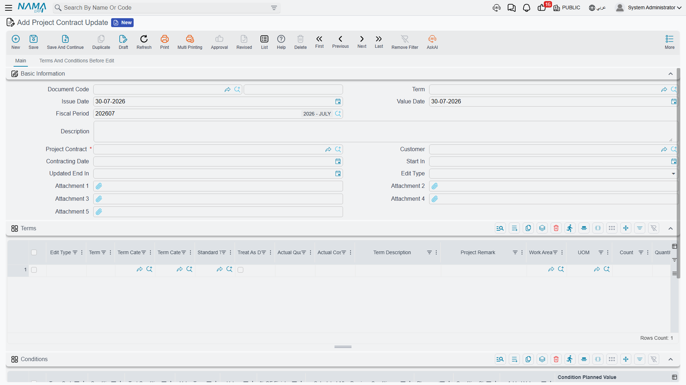
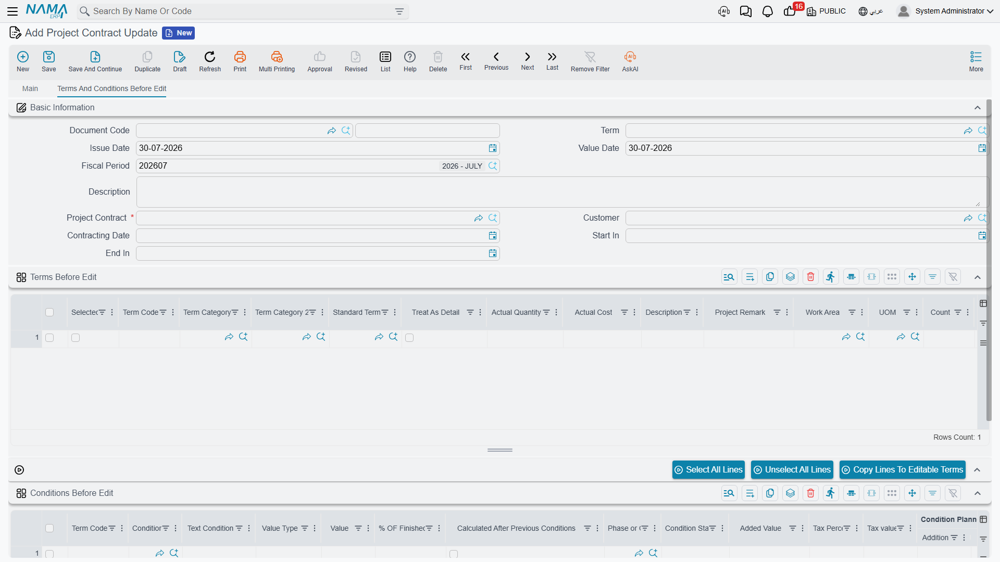

# Project Contract Updates

Clients change their minds. A quantity turns out to have been under-measured, a rate is renegotiated, an item nobody thought of has to be added, the completion date slips by a month. On a small job you would simply open the contract and edit it — and early in a contract's life that is exactly what you do. But [the project contract](/modules/contracting/project-contracting/contracting-project-contract.md) freezes its prices, quantities and conditions as soon as the first extract has been issued against it, and from that point on the only sanctioned way to change it is this document.

The project contract update is the **variation order**. It is worth pausing on what kind of record it is, because it is the odd one out in this part of the module:

::: tip The only real document in the owner-side contract chain
The project, the contract and the addendum are all master files. The update is a genuine **document**: it has a book, a document code, an issue date, a value date, a fiscal period and the platform's full audit trail. That is the point of it — a change to a signed contract needs a dated, numbered, attributable record of its own, and that record is this document rather than a silent edit to the master file.

It does have a *Document Term* field, because every document does, but **there are no contracting term options for this document type** and nothing on it reads a term. And it produces **no journal entry** — a variation order changes the contract's numbers; the money consequence appears later, on the next extract.
:::

You will find it at **Contracting > Project Contracting > Project Contract Update**, under licence `contracting`. The subcontractor side has its own, identically-behaving equivalent — see [subcontract updates](/modules/contracting/contractor-contracting/contracting-contractor-contract-updates.md).

Our worked example is contract **`PC-2026-001`** — the **Tower A** project for **Al-Fanar Development** — six months in: contract value **230,000**, two extracts already issued, the contract therefore frozen. The client now wants **300 m³ more excavation, waterproofing and painting added, and four extra weeks**.

## What it does to the contract — the headline

::: warning The contract is overwritten in place. There is no versioning.
There is no contract-version table, no effective-dated contract, no "contract revision" record. Committing an update opens the contract, rewrites its terms and conditions, and re-commits it. The contract row you look at tomorrow is simply the amended one.

That means the *history* of the contract lives outside the contract: in the chain of update documents (each of which carries its own frozen "before" snapshot), in the platform's record audit trail on the contract itself, and in the list of updates on the contract's *Related Documents* page. To answer "what did this contract look like in March?" you read the update documents in order — you cannot ask the contract.
:::

## Filling one in

**1. Name the contract.** The **Project Contract** field is mandatory, and choosing it does a great deal of work. It fills in the customer, the contracting date and the start date — all three then read-only, because a variation order does not change who you contracted with or when — and it **snapshots every term line and every condition line of the contract** into the two "before" grids on page 2.

**2. Set the new end date, if it is moving.** Page 1 carries **Updated End In** (ينتهي في المعدل) — the *new* completion date. Page 2 shows the *old* one. On `PC-2026-001` we set 28 January where the contract said 31 December.

**3. Choose the lines you are changing.** This happens on page 2, and it is what the "before" grids are really for.

The *Terms Before Edit* grid is the contract as it stands, entirely read-only, with one extra column — **Selected**. Tick the lines you intend to change, set the header **Edit Type**, and press **Copy Lines To Editable Terms** (نقل السطور الي البنود المعدلة). The ticked lines are converted into editable rows in the *Terms* grid on page 1, already stamped with that edit type, and the ticks are cleared. **Select All Lines** and **Unselect All Lines** save you the clicking on a long contract.

You do not have to go through the snapshot: typing a term code by hand into the *Terms* grid on page 1 finds the matching snapshot line and clones it into your row, line by line. Both the term-code and the *Add After* pickers on page 1 suggest from the snapshot rather than from the database, so they only ever offer codes this contract actually has.

The captions on the "before" grids are not always word-for-word identical to the live grids for the same columns — read them by position and meaning rather than by matching the exact wording.

**4. Say what each change is.** Every line in the *Terms* grid carries its own **Edit Type**, and it is the line's value that is obeyed. The header field is only a convenience default: change it and it is stamped onto every line already in the grid.

| Edit Type | What it does to the contract |
|---|---|
| **Add** (إضافة) | Creates a new contract term line and inserts it immediately after the line whose code you put in **Add After**. If you add several lines against the same anchor they queue up behind it in order. |
| **Edit** (تعديل) | Finds the contract line with the same term code and overwrites its content — **without touching the system progress figures**. Quantities already executed, already extracted, already costed and the line's place in the term tree all survive. Revising a rate does not erase the record of what has been billed. |
| **Delete** (حذف) | Finds the contract line with the same term code and removes it from the contract. |

For *Add* and *Delete*, and for *Edit*, the code has to be findable — if the contract has no line with that code, or no line matching the *Add After* anchor, the commit fails with *"Could not find term line with the code …"* against the offending cell.

**Add After** is mandatory whenever the edit type is *Add*. The term code, on the other hand, you can leave blank: the system derives it from the anchor by incrementing the anchor's last dotted segment until it finds an unused code, and after the contract is committed it writes the code the contract actually ended up with back onto your line, so the document shows the real result.

**5. Save and commit.** On commit the document rebuilds the contract's term list: it writes the snapshot back first, re-establishing the pre-amendment state, then applies your Add, Edit and Delete lines on top, then sets the contract's end date from *Updated End In* if you filled it, and re-commits the contract. If both the *Terms* and the *Conditions* grids are empty, nothing happens at all — an update document with no lines is a no-op.

## The Tower A variation order, end to end

The contract before, with the quantities the two certificates have already billed:

| Code | Term | Qty | Unit price | Total price | Billed so far |
|---|---|---|---|---|---|
| `1` | Earthworks | | | 50,000 | |
| `1.01` | Excavation | 1,000 m³ | 50.00 | 50,000 | 700 m³ |
| `2` | Structure | | | 54,000 | |
| `2.01` | Reinforced concrete | 60 m³ | 900.00 | 54,000 | 40 m³ |
| `3` | Masonry and finishes | | | 126,000 | |
| `3.01` | Blockwork | 2,000 m² | 46.00 | 92,000 | 1,100 m² |
| `3.02` | Plastering | 1,000 m² | 34.00 | 34,000 | 200 m² |

Total price **230,000**, total cost 200,000, retention 10% = 23,000, total due 207,000.

The update document:

1. New update, value date 1 July, **Project Contract** = `PC-2026-001`. Customer, contracting date and start date fill themselves; *End In* on page 2 reads 31 December; all seven term lines are snapshotted.
2. **Updated End In** = 28 January.
3. On page 2, tick `1.01`, set header **Edit Type** = *Edit*, press **Copy Lines To Editable Terms**. One row appears in *Terms*. Change its quantity from 1,000 to **1,300**.
4. Add a row by hand: **Edit Type** = *Add*, standard term *Waterproofing*, **Add After** = `3.02`, 500 m² at 30.00, unit cost 24.00. Leave the term code blank.
5. Add a second row the same way: **Edit Type** = *Add*, standard term *Painting*, **Add After** = `3.02`, 3,000 m² at 8.00, unit cost 6.50. Term code blank again.
6. Commit.

The contract after:

| Code | Term | Qty | Unit price | Total price | Billed so far |
|---|---|---|---|---|---|
| `1` | Earthworks | | | **65,000** | |
| `1.01` | Excavation | **1,300 m³** | 50.00 | **65,000** | 700 m³ — *preserved* |
| `2` | Structure | | | 54,000 | |
| `2.01` | Reinforced concrete | 60 m³ | 900.00 | 54,000 | 40 m³ — *preserved* |
| `3` | Masonry and finishes | | | **165,000** | |
| `3.01` | Blockwork | 2,000 m² | 46.00 | 92,000 | 1,100 m² — *preserved* |
| `3.02` | Plastering | 1,000 m² | 34.00 | 34,000 | 200 m² — *preserved* |
| `3.03` | **Waterproofing** | 500 m² | 30.00 | **15,000** | 0 |
| `3.04` | **Painting** | 3,000 m² | 8.00 | **24,000** | 0 |

Total price **284,000**, total cost 243,500, retention 10% now planned at **28,400**, total due **255,600**, and the contract's end date is 28 January. Both new lines were numbered automatically from the `3.02` anchor and slotted in behind it, the parent lines re-totalled themselves — `1` up by the 15,000 of extra excavation, `3` up by the 39,000 of new work — and the billed quantities on the four original leaf lines came through untouched.

And — the point that matters most — **none of this produced a journal entry**. The extra 54,000 of contract value reaches the ledger only when the next [extract](/modules/contracting/project-contracting/contracting-project-extracts.md) bills some of it.

## Conditions behave differently from terms

This is the single most important thing to get right on this screen, and it does not work the way the terms grid does.

::: warning The Conditions grid replaces the contract's conditions wholesale
Condition lines have no edit type and there is no line-by-line diffing. The rule is binary:

- Leave the **Conditions** grid **empty** and the contract's conditions are left completely alone.
- Put **anything** in the Conditions grid and it becomes the contract's **complete new list of conditions** — every condition currently on the contract that is not in your grid is deleted.

So if `PC-2026-001` carries a retention clause and an advance-recovery clause, and you raise an update that adds a penalty clause, you must list **all three** in the grid. Listing only the penalty deletes the other two.

The *Conditions Before Edit* grid on page 2 is where you get them: it holds the contract's current conditions, and it is the reliable place to read the full set before you build your replacement list.
:::

## Refresh the snapshot before you commit

The mechanism that makes the "before" grids do double duty as both a pick-list and an undo image has one consequence worth guarding against.

::: warning A stale update document deletes lines it never saw
The contract's term list after commit is **the snapshot plus your changes**. Any contract line that is not in *Terms Before Edit* is dropped. Normally that is invisible, because the snapshot was taken from the whole contract when you picked it. But if you drafted the update in May, somebody added lines to the contract in June by another route, and you commit in July, **those June lines are deleted**.

The fix is simple: on an update document that has been sitting around, re-pick the **Project Contract** field before committing. That re-snapshots the contract as it is now.

The same reasoning applies in reverse when you cancel. Cancelling the document restores the contract from the snapshot, which means the contract's progress figures go back to what they were **when the snapshot was taken** — so cancel an old update and expect to re-check those figures afterwards.
:::

Duplicating an update document (نسخة مماثلة) deliberately clears both "before" grids, precisely so that the copy re-snapshots from the contract's current state rather than inheriting a stale image.

## What blocks a commit or a delete

| Rule | Message you will see |
|---|---|
| No **later** update may already exist for this contract. The check compares value dates and, for same-day documents, the order they were created in. | *"Cannot edit document … on date … because of the update document …"* |
| The contract may not be swapped once the document has been saved. | *"Cannot change contract from … to … in document …"* |
| The same term code may not appear twice with the same edit type. | *"The term code … with edit type … is repeated in lines … and …"* |
| **Add After** is required on any *Add* line. | column-required |
| Deleting the document is refused if a later update exists for the contract. | *"Cannot delete document … because of the update document …"* |

Two further families of failure surface only when the document is committed, because that is when the contract is actually rewritten. The first is the pair of *"Could not find term line with the code …"* messages described above. The second is anything **the contract itself** rejects — the update re-commits the contract through the ordinary route, so every rule on [the contract page](/modules/contracting/project-contracting/contracting-project-contract.md) applies, including the post-extract freeze. The update is a disciplined, audited path *through* the freeze, not a way around it: it can change a frozen field precisely because it records what the field was before, but it cannot break any other contract rule. If your amendment leaves a term code duplicated or a set of phase percentages that no longer adds up to 100, the commit fails and the contract is untouched.

## Where to read next

- [Project contracts](/modules/contracting/project-contracting/contracting-project-contract.md) — the record this document rewrites, and the freeze that makes it necessary.
- [Project extracts](/modules/contracting/project-contracting/contracting-project-extracts.md) — where the amended value finally becomes money.
- [The project contracting cycle](/modules/contracting/project-contracting/contracting-owner-cycle.md) — the chain this sits in.
- [Subcontract updates](/modules/contracting/contractor-contracting/contracting-contractor-contract-updates.md) — the same document on the cost side, behaving identically.
