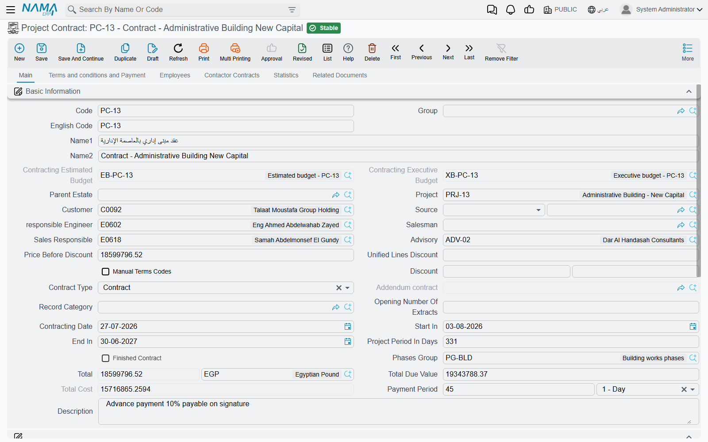

# Project Contracts

The project contract is the centre of gravity of the whole contracting module. It is the priced bill of quantities that extracts bill against, the set of commercial clauses that decide what is withheld from every payment, the place subcontracts are carved out of, the yardstick budgets are built from, and the record that accumulates — line by line, as the months pass — how much of the job has been executed, billed and actually cost.

And it is a **master file**, not a document. That single fact explains most of what surprises people about it:

::: tip What "master file" means here
A project contract has **no document book, no document code, no value date, no fiscal period and no document term (توجيه)**. It has a code, a group, an Arabic name and an English name like any other master file. And because there is no document term, there are no accounts on it — so **saving or amending a contract produces no journal entry and no stock movement whatsoever**. Money reaches the ledger only when a [project extract](/modules/contracting/project-contracting/contracting-project-extracts.md) is issued against the contract, using the accounts on the [standard terms](/modules/contracting/setup/contracting-standard-terms.md) and on the extract's own document term.
:::

The other consequence of being a master file is that the contract stays **alive**. A document is a frozen statement of a moment; this record is continuously written to. Every quantity survey, every extract, every cost document stamps its running total back onto the contract's term lines, which is exactly why the contract — and not some report — is where you look to see how the job is going.

You will find it at **Contracting > Project Contracting > Project Contract**, under licence `contracting`.

Our worked example is contract **`PC-2026-001`** — the **Tower A** project for **Al-Fanar Development**: contract value **230,000** over four priced items of work, **10% retention** withheld from every payment, and a **46,000** advance received from the client before work started.



## How terms arrive on a contract

Nobody types a bill of quantities twice, and the module offers exactly two routes for getting one onto a contract. It is worth being precise about them, because the button readers go looking for does not exist.

**Route 1 — from a bid, through the Source field.** Point the contract's **Source** (المصدر) field at a [contracting assay](/modules/contracting/project-contracting/contracting-assays.md), a [contracting offer](/modules/contracting/project-contracting/contracting-offers.md), a [term sheet](/modules/contracting/setup/contracting-term-sheets.md), an [estimated budget](/modules/contracting/budgets/contracting-estimated-budget.md) or an [executive budget](/modules/contracting/budgets/contracting-executive-budget.md), and choosing it pulls across the project, the customer and the whole terms and conditions collections. Lines marked as rejected on the bid are left behind. This is also what happens when you press *Convert Contract* on an offer or an assay — the conversion opens a new contract with the source already set and the lines already copied.

**Route 2 — from a contract template.** Choosing a [contract template](/modules/contracting/setup/contracting-contract-templates.md) in the **Contract Template** (نموذج العقد) field on the terms page copies the template's terms and conditions onto the contract. The act of selecting the template is what triggers the copy; there is no separate button to press afterwards. What the template does depends on how it was set up: a template flagged to replace terms and conditions clears whatever is already on the contract first, while a template flagged not to copy terms does nothing at all.

::: info There is no "copy terms" button, and Collect Terms is not it
No action anywhere copies terms onto an existing contract on demand. If you have signed a contract and now want a different bill of quantities on it, you either re-pick the Source, choose a template, or raise a [contract update](/modules/contracting/project-contracting/contracting-project-contract-updates.md). The action named *Collect Terms* on the assay screen (Arabic *تجميع التحليلات*) copies analysis-card **costs** onto term lines that already exist — it does not bring terms in.
:::

A third, narrower route exists per line: the **Copied From Doc** column on a term line lets you pull a single line's content from another contract.

## The header — page 1

The basic-information block is long, and most of it is either identification or a calculated figure you never type. The fields that change behaviour are these:

| Field | Why it matters |
|---|---|
| **Project** (المشروع) | the site everything is filed under; one project can carry several contracts |
| **Customer** (العميل) | the party the extracts will bill and the receivable will stand against |
| **Source** (المصدر) | where the bill of quantities came from — see above |
| **Contract Type** (نوع العقد) | *Contract*, *Addendum* or *Modify To Contract* — see below |
| **Addendum contract** (العقد الرئيسي) | despite the English caption, this is the **main, parent contract** this one hangs off; only enabled for the two addendum types |
| **Manual Terms Codes** (تكويد البنود يدويا) | switches automatic term coding off so you can type your own codes |
| **Opening Number Of Extracts** (افتتاحي أرقام المستخلصات) | seeds extract numbering, for a contract migrated in mid-life with extracts already issued elsewhere |
| **Phases Group** (مجموعة مراحل) | the default set of milestones applied to every term line |
| **Payment Period** (مدة السداد) | the agreed credit period, as a value plus a unit |
| **Parent Estate** (العقار الأعلى) | the Real Estate project this construction belongs to, when cost is to be attributed to units |

Alongside them sit the dates — **Contracting Date**, **Start In** and **End In**, with **Project Period In Days** calculated for you as the difference — and the money, all of it calculated: **Price Before Discount**, the header **Discount Percentage / Discount** pair, **Total** with its currency, **Total Due Value** and **Total Cost**. On `PC-2026-001` these read 230,000 · 0 · 230,000 · 207,000 · 200,000, and the reason *Total Due Value* is 23,000 lower than *Total* is the retention clause, which we come to below.

Two fields are filled by other records rather than by you: **Contracting Estimated Budget** and **Contracting Executive Budget** are written when a budget is linked to this contract, and **Finished Contract** (عقد منتهي) is switched on by a Final extract. And *Calculate Price From Profit When Save* works exactly as it does on an offer — tick it and prices are back-computed from cost plus the margin on each line.

Below that come the standard blocks every party-bearing master file has: **Accounts**, which makes the contract usable as an accounting subsidiary in its own right, **Taxes** with the four tax-exemption flags, and **Dimensions** — legal entity, analysis set, branch, sector, department.

## The working page — terms, conditions, tasks and payments

Page 2, *Terms and conditions and Payment*, is where the contract is actually built. It carries the contract template field, the two header tax percentages, the *Totals* block, and then four grids in sequence.


### The Terms grid — the priced bill of quantities

This is the heart of the record. One row per item of work, each pointing at a **Standard Term** — which is mandatory, and which is what supplies the unit of measure, the default rate, the permitted percentage, the phases group and, crucially, the **debit and credit accounts** the eventual extract will post to. Rows form a tree through their dotted term codes, and only **leaf** rows carry money; **parent** rows are zeroed and re-totalled from their children on every save.

For `PC-2026-001`:

| Code | Standard term | Type | UOM | Quantity | Unit cost | Total cost | Unit price | Total price |
|---|---|---|---|---|---|---|---|---|
| `1` | Earthworks | Parent | | | | **40,000** | | **50,000** |
| `1.01` | Excavation | Leaf | m³ | 1,000 | 40.00 | 40,000 | 50.00 | 50,000 |
| `2` | Structure | Parent | | | | **48,000** | | **54,000** |
| `2.01` | Reinforced concrete | Leaf | m³ | 60 | 800.00 | 48,000 | 900.00 | 54,000 |
| `3` | Masonry and finishes | Parent | | | | **112,000** | | **126,000** |
| `3.01` | Blockwork | Leaf | m² | 2,000 | 40.00 | 80,000 | 46.00 | 92,000 |
| `3.02` | Plastering | Leaf | m² | 1,000 | 32.00 | 32,000 | 34.00 | 34,000 |

Header total cost 200,000, header total price **230,000**. Note that only leaf lines with a standard term are summed into the header, and that a parent's quantity is deliberately *not* rolled up — quantities of m³ and m² cannot meaningfully be added, so only the money is.

Whether a row is a parent or a leaf is not a field you set on the line. It comes from the standard term's own type, unless the line ticks **Treat As Detail** (يعامل كبند فرعي), which forces it to behave as a priced leaf here. That checkbox is the escape hatch for "this heading term is an ordinary billable item on *this* contract".

Beyond the money columns, three groups of columns are worth knowing:

**Columns you fill.** Quantity, unit price, unit cost, additional costs, the discount and tax pairs, the permitted percentage (how much over-execution the client tolerates on this item), the payment percentage, the physical dimensions and count, the warranty block, the work area and the term categories.

**Columns the system fills.** *Quantity | From Execution*, *Quantity | From Extract*, *Quantity | From Cost Execution*, *Quantity | From Opening Extracts*, *Term Quantity From Contractors Extract*, *Actual Quantity* and *Actual Cost* are all written back by other documents. You never type them, and they are the reason this record is a master file: after two extracts on `PC-2026-001`, line `1.01` still reads 1,000 contracted, but its *Quantity | From Extract* reads 700, and its **Actual Cost** reads whatever the material issues, labour books and subcontractor extracts have actually consumed against term `1.01`. Contract value and actual cost sitting side by side in one grid is one of the few places a reader gets both numbers in one view — the other is the Statistics page.

**Columns that are reporting dimensions only.** **Work Area** (منطقة العمل) is copied forward from the contract to the execution to the extract, and it is genuinely useful for analysis, but nothing in the module filters, prices, totals or validates on it.

Above the grid sit three buttons. **Update Codes** (تحديث الأكواد) renumbers every line from scratch by walking the grid top to bottom — it will destroy manual codes, so it is the one to be careful with. **Update Empty Term Codes Only** (تحديث أكواد البنود الفارغة فقط) does the same thing but only for blank codes, avoiding collisions with codes already in use; it is the safe one. **Convert Selected Lines To Contractor Contract** is the bridge to the cost side, described further down.

### The Conditions grid — where retention and penalties are defined

A condition is not a note; it is a money rule that will be applied to every extract. Each line names a **Condition** from the [conditions catalogue](/modules/contracting/setup/contracting-conditions.md), a **Value Type** and a **Value**, and optionally a term code and a phase to restrict it to.

The value type decides what the value means:

| Value Type | The planned amount is |
|---|---|
| **Value** (قيمة) | the flat amount you typed |
| **Percentage From Total** (نسبة من الإجمالي) | that percentage of the whole contract value |
| **Percentage From Extract** (نسبة من المستحق) | that percentage of the work value on each extract |
| **Percentage From Total Due Value** | that percentage of the extract's due value |
| **Percent Of Custom Equation** | that percentage of a formula you define on the condition master file |

Whether the amount is added to or deducted from what the client owes comes from the **condition master file**, not from the line — each condition is defined once as an addition, a deduction or "other", and every contract that uses it inherits that direction. The *Condition Planned Value* columns — addition, deduction, their tax and their after-tax figures — are then calculated for you on each save, so you can see the effect of a clause before a single extract exists.

On `PC-2026-001` there is one line:

| Condition | Value Type | Value | Planned deduction | Deduction after tax |
|---|---|---|---|---|
| Retention | Percentage From Extract | 10 | **23,000** | 23,000 |

which is why the header's *Total Due Value* reads 207,000 against a *Total* of 230,000. The 10% is not deducted once — it is withheld from each extract as it is issued, and released at the end. The 23,000 in the planned column is what the clause will have withheld by the time the whole 230,000 has been certified.

Three columns in this grid are the *actual* running totals rather than plans — *Total | Deductions*, *Total | Others* and the added value — and they are disabled on screen because extracts maintain them. **Condition Status** is likewise system-maintained and starts life as not-completed.

The 46,000 advance `PAP-001` is not a condition line. An advance is [its own document](/modules/contracting/project-contracting/contracting-project-advances.md), which names a condition from the catalogue and then presents itself on later extracts as a deduction until it has been recovered in full. The same is true of [fines](/modules/contracting/project-contracting/contracting-project-fines.md). So the conditions grid holds the standing clauses; the events arrive from their own documents.

### The Tasks grid

Four columns: the execution company's tasks with remarks, and the customer's tasks with remarks, each pointing at a task from the [lookup catalogue](/modules/contracting/setup/contracting-lookups.md) — and each picker filtered so you only see tasks defined for that party. This is the obligations checklist: who supplies scaffolding, who obtains the municipal permit, who provides site power. It is documentary. Nothing validates it, no document checks whether a task is done, and no extract is blocked by an outstanding one.

### The Payments grid — the client's instalment plan

Instalment code (mandatory), description, percentage, value, paid value, remaining, payment date, and the commercial paper the instalment is settled by. You can type the lines, or choose a **Payment Template** (نموذج الدفع) and press **Generate Payments**, which asks for a number of instalments, a period, a grace period, a preferred day of week, a rounding rule and any explicit down/first/second/last amounts, then fills the grid.

Two things follow from filling this grid. First, if a payment template is set, the contract will not save unless the instalment lines add up to the contract's total price — 230,000 on `PC-2026-001`. Second, each line can create a **commercial paper** (a cheque or promissory note, received from the client) automatically when the contract is committed, if your [configuration](/modules/contracting/contracting-configuration.md) permits this document type to create them.

Three buttons work on the grid: **Select all installment lines**, **Generate Receipt Voucher** for the whole remaining amount and **Generate Receipt Voucher For Selected Payments** for the ticked lines. Both voucher buttons create cash documents against the customer, and the *Installment Payments* entry in the *More* menu opens the vouchers that settled them. None of this is revenue recognition — the receipt voucher moves cash, and the revenue was recognised on the extract.

## The other pages

**Employees** carries the staff assigned to this contract, with a from-date and a to-date on each row. Note the column is labelled *Technician* (الفني) although the page and the collection are called *Employees* and the field is a plain employee reference — read it as "assigned employee". Like tasks, these rows are documentary.

**Contactor Contracts** lists the subcontracts carved out of this contract, so you can see the whole subcontracting picture from the owner contract.

**Statistics** is the "everything that happened against this contract" dashboard, and it is the page to open when somebody asks how the job is doing. Fourteen read-only lists show the project executions, the contractor executions, the project extracts, the contractor extracts, the actual costs, the cost sources, the cost execution documents, the contracting material issues and returns, the contract addendums, and three site-quality registers whose titles are in English on both language versions of the screen (*Finishing Works CheckList*, *Digging And BackFiling CheckList*, *Test Report*). Alongside them is an *Additional Info* grid — a free scratch pad of a few numbers, texts, dates and references that you may use for anything; nothing in the system reads it.

**Related Documents** lists the [contract updates](/modules/contracting/project-contracting/contracting-project-contract-updates.md) raised against this contract, which together form the amendment history of the record.

## The three axes of the work breakdown

Readers routinely assume these nest inside one another. They do not — they are three independent ways of slicing the same contract, and a term line can carry all three at once.

```
Project Contract
├── TERM tree        (البنود)  parent / leaf hierarchy, dotted codes 1, 1.01, 1.01.01 …
│     ├── Work Area  (منطقة العمل)  a pointer into a SEPARATE work-area tree
│     └── Phases     (المراحل)      up to five flat phase slots on the line
└── CONDITIONS       (الشروط)  each optionally tied to one term code and one phase
```

**The term tree** is the one that carries money and the one extracts bill against. How a line's parent is determined is a module-wide configuration choice: either **row order in the grid is the hierarchy** — walking down the grid, a leaf after a parent descends a level — or **the dotted code is the hierarchy**, in which case a line coded `2.3.1` is filed under the nearest preceding heading coded `2.3`. Know which mode your installation runs in before you reorder rows, because in the first mode dragging a row changes the tree. A per-line **Manual Parent Term Code** column lets you say "file this line under term 2.3" without dragging: the line is physically moved to sit after that parent's last descendant, and the codes are regenerated.

**Work areas** are a separate, self-referencing tree of physical locations — building, block, floor — described on [the phases and work areas page](/modules/contracting/setup/contracting-phases-and-work-areas.md). A term line points at one work area, and that pointer is descriptive only.

**Phases** are milestones, and they are where the hard limit lives:

::: warning Phases are exactly five slots
A term line has five fixed phase slots, not a list. A phases group with more than five phases will silently fill only the first five, and the contract will then fail its "the phase price percentages must add up to 100%" check — a message that points at the contract even though the problem is in the group. Design phase groups with five phases or fewer.
:::

Phases arrive from a **Phases Group** chosen on the header or on the individual line, with the line winning if both are set. Each slot holds a phase, a percentage of the line's price billed at that phase, a payment percentage, and three system counters for the quantity executed, extracted and cost-executed at that phase. The line's **Last Achieved Phase** is advanced by extracts as the work passes each milestone.

For `PC-2026-001` we use the four-phase group `PG-TOWER` — *Substructure* 20%, *Superstructure* 40%, *Masonry* 20%, *Finishes* 20% — so each leaf line's four filled slots sum to 100 and the fifth stays empty.

## Contract, addendum, or modification

The **Contract Type** field has three values and they behave quite differently:

- **Contract** (عقد) — the ordinary case, and the default on a new record. Selecting it clears the main-contract reference.
- **Addendum** (ملحق) — this contract is an addition standing *beside* an existing one. The main-contract reference becomes mandatory, and the parent contract's Statistics page lists this record among its addendums. The two contracts remain separate: each has its own value, its own extracts and its own totals.
- **Modify To Contract** (تعديل لعقد) — this contract *revises* the parent. Here the behaviour is different in a way worth understanding: on commit, this record's terms and conditions are physically **cloned into the parent contract**, tagged as having come from here, and placed where the previous clones sat. Delete this record or change its type and the clones are removed from the parent again. So a modify-to-contract is a way of restating part of a contract through a second record, and the parent is the one that ends up carrying the combined bill of quantities.

## What blocks a save

Most of these you will never hit, but the ones that catch people are worth listing:

| Rule | Note |
|---|---|
| Currency is required | on the accounts block |
| At least one term line | an empty contract cannot be saved |
| Term codes must be unique | *"Can not insert a dublicated term"* |
| A quantity on every leaf line | can be relaxed by configuration |
| Phase price percentages must total 100% on a line that has phases | can be relaxed by configuration |
| Tax percentages must not exceed 100, and quantity, unit cost and tax percentages must not be negative | |
| A condition's term code must exist among the contract's term codes | *"This Code Is Not In Term Code"* |
| The same term code, condition and phase may not appear twice in Conditions | |
| A condition needs a value, and a completion-percent condition needs its percentage | |
| The instalment total must equal the total price — but only when a payment template is set | |
| A line discount, and the header discount, may not exceed the current user's maximum discount | which of the user's discount limits applies is a configuration setting |
| The parent estate must be a Real Estate project, and a line's estate must belong to it | |
| A payment period value needs its unit | |
| The main contract is required when the type is *Addendum* | |

## Once extracts exist, the contract freezes

This is the behaviour that sends people looking for the amendment document, so it deserves a plain statement. As soon as **any** extract has been issued against the contract — and unless your configuration explicitly allows editing prices and quantities after extracts — three sets of fields become read-only:

- on the header: the main contract, the record category, project, customer, start and end dates, phases group and all three discount fields;
- on **term lines that have been extracted or executed**: the term code, quantity, unit, prices, discounts, the standard term, the taxes, the dimensions and count, and the phase, quantity and price percentage of all five phase slots;
- on **every** condition line: the condition, value type, value, completion percentage, term code, phase and the calculated-after-previous flag.

Untouched term lines stay editable, and you can still add new lines. But for anything else you raise a [project contract update](/modules/contracting/project-contracting/contracting-project-contract-updates.md), which exists precisely for this and which rewrites the contract on your behalf. Note that the update goes through the contract's own validation, so it is subject to the same freeze — the update is a controlled, audited path through it, not a way around it.

## Two side effects on commit

Committing a contract does not post anything, but it can start two things off.

**Financial papers.** Instalment lines configured to do so mint their commercial papers, as described above.

**Real-estate cost distribution.** If your configuration nominates the project contract as the source of Real Estate cost, committing it schedules a background task that spreads the contract's total cost — or the analysis-card costs, depending on the setting — down the Real Estate tree beneath the parent estate, by unit area or by estimated cost. This is a background business request rather than something that happens as you press Save, and it is described on [the Real Estate cost bridge page](/modules/contracting/costs/contracting-realestate-cost-bridge.md).

## Carving out a subcontract

**Convert Selected Lines To Contractor Contract** (تحويل السطور المختارة لعقد مقاول باطن) is the single bridge from the owner side to the cost side. Tick the term lines you are giving away — on `PC-2026-001`, `3.01` *Blockwork*, all 2,000 m² of it — and press it. A new, unsaved [subcontract](/modules/contracting/contractor-contracting/contracting-contractor-contract.md) opens, pre-filled with this contract as its project contract, the same project and customer, the price before discount and both discount figures, the remarks, the contract type and the main-contract reference, a source reference back to this contract, and the converted term and condition lines. You review the rates you are prepared to pay, save, and the subcontractor chain takes over from there.

## Where to read next

- [The project contracting cycle](/modules/contracting/project-contracting/contracting-owner-cycle.md) — where this record sits in the chain.
- [Project contract updates](/modules/contracting/project-contracting/contracting-project-contract-updates.md) — the variation order.
- [Project execution](/modules/contracting/project-contracting/contracting-project-execution.md) and [project extracts](/modules/contracting/project-contracting/contracting-project-extracts.md) — what writes back onto the term lines, and what finally books.
- [Standard terms](/modules/contracting/setup/contracting-standard-terms.md), [conditions](/modules/contracting/setup/contracting-conditions.md), [phases and work areas](/modules/contracting/setup/contracting-phases-and-work-areas.md) and [contract templates](/modules/contracting/setup/contracting-contract-templates.md) — the vocabulary this screen is built from.
- [How project cost is built](/modules/contracting/costs/contracting-cost-model.md) — where the *Actual Cost* column's figures come from.
- [Subcontracts](/modules/contracting/contractor-contracting/contracting-contractor-contract.md) — the same record on the cost side.
