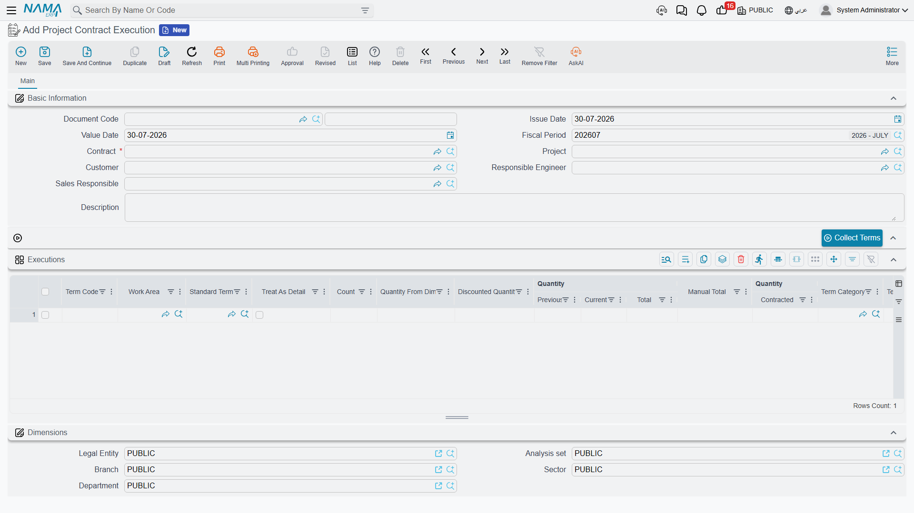

# Project Execution

A month of work has happened on site. Somebody walked the plot with a tape and a drawing set and established that 400 of the 1,000 cubic metres of excavation are finished, that 20 of the 60 cubic metres of reinforced concrete have been poured, and that 500 of the 2,000 square metres of blockwork are up. **Project Execution** (حصر كميات مشروع) is where that walk gets written down.

It is a pure quantity statement. It carries no prices, it has no document term, and it books nothing at all — no journal entry, no stock movement, no business request. Its whole job is to answer one question for one period: *how much work was actually done?* The money question comes later, on the [extract](/modules/contracting/project-contracting/contracting-project-extracts.md).

## The one thing to understand first

**An execution document records only the work done in that document, not the work done to date.**

This is the single most misunderstood behaviour in the module, so it is worth stating in the bluntest possible terms. In the Executions grid there is a column called **Quantity | Current** and a column called **Quantity | Previous**. You type the *current* one, and only the current one. It means "this period". The *previous* column is filled in by the system from the earlier executions of the same contract, the same term and the same phase, and **Quantity | Total** is simply the two added together.

The cumulative figure — "we have now executed 700 of the 1,000 cubic metres" — does not live on any execution document. It lives on the [project contract's](/modules/contracting/project-contracting/contracting-project-contract.md) own term line, in its executed-quantity field, which every committed execution updates.

So: **the document holds the increment, the contract holds the running total.** Everything else on the page follows from that.

## Recording execution is optional

You never have to raise an execution document. There are two legitimate routes from a signed contract to a billed extract:

1. **The execution route.** Raise a Project Execution for the period, then create the extract *from* it. The extract's billing lines are seeded from the execution's quantities and, by default, locked to them — the surveyor's numbers are what gets billed.
2. **The extract-only route.** Leave the extract's **From Document** field empty and press *Collect Terms* on the extract itself. The extract pulls the contract terms directly and you type the billed quantities there.

The two are mutually exclusive by design: the *Collect Terms* action on the extract refuses to run while **From Document** is filled, because that would fight with the quantities the execution has already supplied.

Businesses that run a quantity-surveying function almost always use the first route, because it separates the two decisions that ought to be separate: *what was built* (the engineer's judgement) and *what we are willing to certify and bill this month* (a commercial decision). Fit-out and finishing businesses that bill straight off a schedule often skip execution altogether.

## Where to find it

| | |
|---|---|
| Menu | Contracting > Project Contracting > Project Contract Execution |
| Kind | Document — it has a book, a code and a value date |
| Document term | None. This document has no contracting term options, and no accounts to set, because it books nothing |
| Licence | `contracting` |

## The screen

The header is short, because most of it is derived from the contract. Pick the **Contract** and the **Project** and **Customer** come with it — and they are then checked against the contract on every save, so you cannot quietly point an execution at a different customer's project. Then there is the responsible engineer and the sales responsible, the value date that decides which period the work falls in, and a description.

Above the grid sits **Collect Terms**, which pulls the contract's term lines into the grid so you only have to type quantities.

### The Executions grid — what you type and what the system paints

Only a handful of these columns are yours:

| Column | Yours or the system's | Notes |
|---|---|---|
| **Term Code** | yours | must be a term that exists on the contract |
| **Quantity \| Current** | **yours** | the quantity executed *in this document* |
| **% OF Finished** | yours, as an alternative | type a percentage instead of a quantity and the quantity is derived from the contracted quantity — the two fields are two ways of saying the same thing |
| **Count**, and the length, width and height behind it | yours, as an alternative | multiply out into **Quantity From Dimensions** |
| **Discounted Quantity** | yours | subtracted from the dimension quantity, for the void you are not paid for |
| **Phase** | yours | **required** when the contract's term line is split into [phases](/modules/contracting/setup/contracting-phases-and-work-areas.md) |
| **Quantity \| Previous** | the system's | the sum of the *current* quantities on all earlier executions for this contract, term and phase |
| **Quantity \| Total** | the system's | previous + current |
| **Quantity \| Contracted** | the system's | copied from the contract's term line |
| **Accumulative Finished Percentage** | the system's | how far this term has got, cumulatively |
| **Standard Term**, **Work Area**, **Term Category** | yours or copied | descriptive; carried forward for reporting |
| **Executive Term Code**, **Executive Term Remark** | yours | link the line to a line of the [executive budget](/modules/contracting/budgets/contracting-executive-budget.md) |
| **Assay Quantity**, **Manual Total**, **Description** | yours | free reference fields |

The three ways of arriving at a quantity are worth knowing because they cover three real site situations. Typing the **quantity** suits bulk work measured in cubic metres. Typing the **percentage** suits a term you can only judge as "about 60% done" — a staircase, a lift shaft. Typing the **dimensions** suits anything measured off a drawing: count × length × width × height, less the openings you took out.

## The worked example, carried through two months

Throughout the project-contracting pages we use one contract:

**Contract PC-2026-001** — customer *Al-Fanar Development*, project *Tower A*, total value **230,000**.

| Term code | Description | Contracted quantity | Unit | Unit price | Contract value |
|---|---|---|---|---|---|
| `1.01` | Excavation | 1,000 | m³ | 50 | 50,000 |
| `2.01` | Reinforced concrete | 60 | m³ | 900 | 54,000 |
| `3.01` | Blockwork | 2,000 | m² | 46 | 92,000 |
| `3.02` | Plastering | 1,000 | m² | 34 | 34,000 |
| | **Total** | | | | **230,000** |

### February — the first execution

**PCE-001**, value date 28 February. The engineer types three numbers, in the **Current** column — plastering has not started, so it has no line:

| Term | Previous *(system)* | **Current** *(typed)* | Total *(system)* | % of finished |
|---|---|---|---|---|
| `1.01` | 0 | **400** | 400 | 40% |
| `2.01` | 0 | **20** | 20 | 33.3% |
| `3.01` | 0 | **500** | 500 | 25% |

On commit, the contract's own term lines are updated: term `1.01` now shows an executed quantity of **400**, term `2.01` shows **20**, term `3.01` shows **500**.

### March — the second execution

**PCE-002**, value date 31 March. Plastering starts, so a fourth line appears. Note what happens to the *previous* column on the other three without anybody touching it:

| Term | Previous *(system, from PCE-001)* | **Current** *(typed)* | Total *(system)* |
|---|---|---|---|
| `1.01` | 400 | **300** | 700 |
| `2.01` | 20 | **20** | 40 |
| `3.01` | 500 | **600** | 1,100 |
| `3.02` | 0 | **200** | 200 |

The contract's term lines now read **700**, **40**, **1,100** and **200** executed. Two documents, each holding one month's work; one contract line holding the total.

::: tip Read the two documents side by side once
If you are training someone on this module, put PCE-001 and PCE-002 on screen together and ask them what term `1.01`'s executed quantity is. The answer is 700, and it is on neither document — it is on the contract. Once that clicks, the extract makes sense too, because it behaves in exactly the same way.
:::

## Back-dating an execution renumbers the others

Suppose a January execution turns up late and is entered after both of the above, with a value date of 31 January. You do not have to correct anything by hand. On commit, the system re-walks every execution of that contract in value-date order and re-stamps the previous, total and cumulative-percentage figures of the ones that come after it. PCE-001's *previous* column stops being zero, and PCE-002's follows.

This is why the previous and total columns are read-only and why you should never try to "help" the system by typing a cumulative figure into **Current**. Do that and every subsequent document double-counts.

## What blocks a save

The validations exist to stop an execution from describing work that the contract does not contain:

- **The Executions grid cannot be empty.**
- **The term code must exist on the contract.** Roll-up (parent) terms are excluded from the list of allowed codes, unless the module option that shows main term codes in executions has been switched on in [module configuration](/modules/contracting/contracting-configuration.md).
- **No term-and-phase pair may appear twice** in the same document. If you need two measurements of the same term in the same period, add them together or split the document.
- **A phase is required** whenever the contract's term line is divided into phases.
- **The project and the customer must match the contract's.**
- **The permitted percentage is a ceiling.** Each contract term line carries a permitted percentage — 5% on every term of PC-2026-001 — and the *total* executed quantity may not exceed the contracted quantity by more than that. Term `1.01` can therefore be executed up to 1,050 m³ and no further. A module option lifts the check globally when a business genuinely surveys beyond contract and settles it in a variation order.
- **A contract that already carries a committed Final extract is closed** to new executions, unless the module option that allows using finalised contracts is on.
- **A contract whose assay type marks it as a modification** cannot be used for executions or extracts at all.

One more lock is worth knowing about because it changes how teams work: a module option can prevent an execution being edited once an extract has been built on it. With that on, a mistake in the survey has to be fixed by cancelling the extract first. Without it, the extract's own consistency checks are your safety net.

## After the extract

When an extract built on this execution is committed, two things happen back here: the execution is marked as extracted, and each line's billed quantity is recorded against it. That is how the module knows which surveyed work has been turned into money and which has not, and it is what the extract's *Collect Terms* action reads when it works out a remaining quantity.

By default the extract cannot change the quantities it inherited from the execution — a term option on the [extract's document term](/modules/contracting/document-terms/contracting-terms-extracts.md) is what relaxes that, for businesses where the commercial team routinely certifies less than the surveyor measured.

## Where to go next

- [Project Extracts](/modules/contracting/project-contracting/contracting-project-extracts.md) — turning executed quantities into a certified payment application.
- [Project Contracts](/modules/contracting/project-contracting/contracting-project-contract.md) — where the cumulative executed and billed quantities live.
- [The Project Contracting Cycle](/modules/contracting/project-contracting/contracting-owner-cycle.md) — how this step fits the whole owner-side chain.
