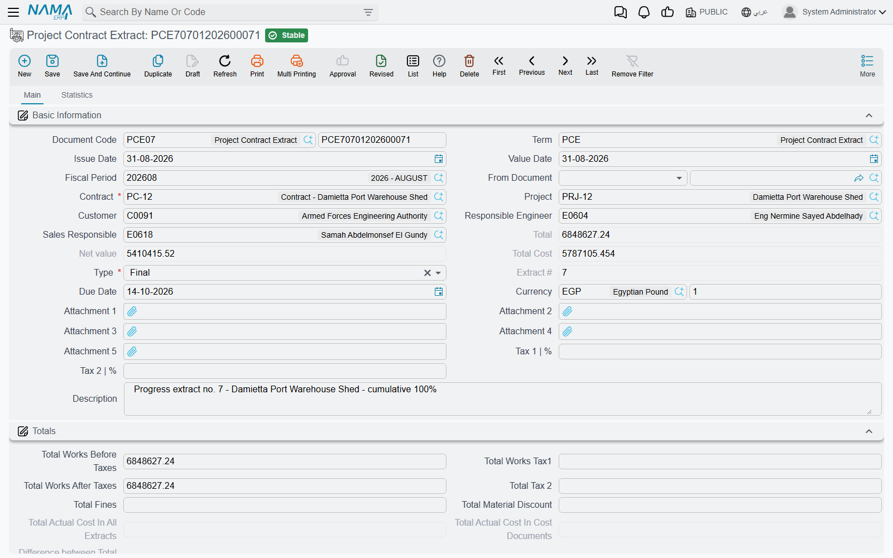
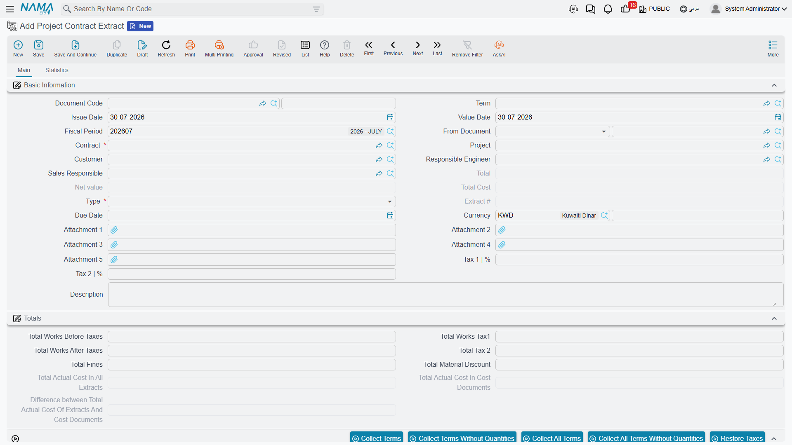
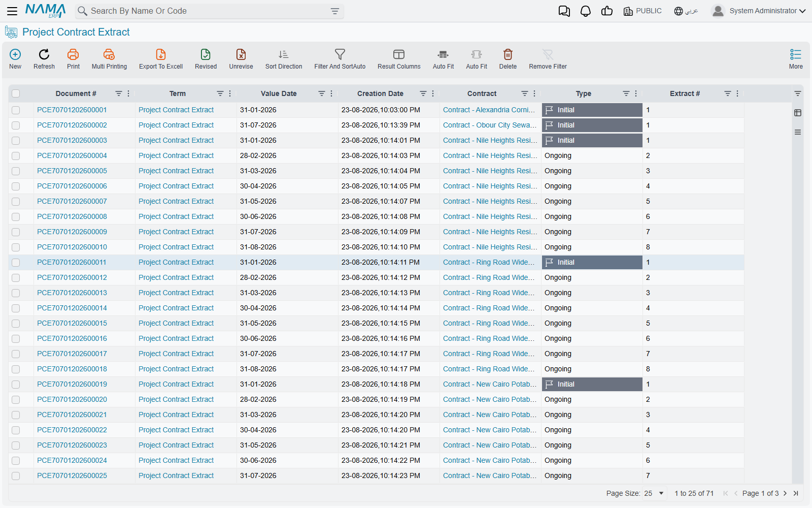

# Project Extracts

Signing a contract in Nama books nothing. Recording execution books nothing. **The extract** (مستخلص مشروع) is the document where a contracting business finally earns money: it states, term by term, how much work is being billed this time, prices it at the contract's rates, adds VAT, then subtracts everything the contract says must be withheld or recovered — retention, the advance the owner already paid, any penalties — and arrives at a **net payable**.

It is the certified payment application you send to the project owner, it is the record sent to the tax authority as an e-invoice, and on the owner side of this module it is **the only document that reaches the ledger at all**. Everything upstream of it is preparation.

That makes it the page to read carefully.



## Where to find it

| | |
|---|---|
| Menu | Contracting > Project Contracting > Project Contract Extract |
| Kind | Document |
| Document term | **Required.** Every account this document books to comes from its [document term](/modules/contracting/document-terms/contracting-terms-extracts.md) |
| Licence | `contracting` |

## The extract is incremental too

Exactly as on [execution](/modules/contracting/project-contracting/contracting-project-execution.md), **an extract bills only the work of its own period.** In the Details grid the column you fill is **Quantity | Paid Amount** — its Arabic label reads *الكمية | حالي*, "current quantity", and that is the better description of what it means: the quantity being billed *now*.

**Quantity | Previous** is derived: it is the quantity already billed on every earlier extract of this contract for the same term. **Quantity | Total** is previous plus paid, and **Finished Percentage** is that total against the contracted quantity. As on the execution, the cumulative "billed to date" figure lives on the [contract's](/modules/contracting/project-contracting/contracting-project-contract.md) term line, not on any extract.

So the netting-off of previous extracts is not something you do — it is the shape of the document. You bill 300 m³ this month because that is what happened this month; the fact that 400 m³ went out last month is why *previous* says 400 and why the contract line reads 700 afterwards.

::: details The three optional modes that price cumulatively instead
Some owners and consultants require the extract to be *presented* cumulatively: "works to date 700 m³ at 50 = 35,000, less certified previously 20,000, this certificate 15,000". Three options on the extract's document term switch the pricing to that shape. They are options — the default, and the whole of the narrative on this page, is the incremental one.

- **Calculate Prices Based On Total Qty** — the line is priced on the *total* quantity, and the sum of the previous extracts' values is then subtracted.
- **Calculate Prices Diff From Previous Extract Only** — priced on the total quantity as well, but only the immediately preceding extract is subtracted, and the resulting differences are recorded in their own difference columns, which have their own accounting pairs on the term.
- **Consider Previous Discount 1 / Discount 2 / Tax Values** — the same cumulative-then-net-off treatment applied to discounts and to taxes, so what is charged this time is the cumulative amount less what earlier extracts already took.

The first two describe two different arithmetics for the same idea, so choose one; they are not meant to be combined.
:::

## The type decides a great deal

**Type** is required, and there are three:

| Type | What is different about it |
|---|---|
| **Initial** (مبدأي) | The opening certificate. Only **one** Initial extract is permitted per contract, and contract conditions marked *With Initial Extract* are collected only here — mobilisation allowances, insurance premiums, anything payable once at the start |
| **Ongoing** (جاري) | The normal interim certificate. No special behaviour; this is what most extracts are |
| **Final** (ختامي) | The closing certificate — see *What a Final extract does differently*, below |

Once a Final extract is committed on a contract, no further extract can be saved on it, and executions and fines are refused as well — unless the module option that allows using finalised contracts has been switched on in [module configuration](/modules/contracting/contracting-configuration.md).

## Filling the Details grid

There are two routes, and they exclude one another.

**From an execution.** Put the [execution document](/modules/contracting/project-contracting/contracting-project-execution.md) in **From Document** and the billing lines are seeded from it, quantity for quantity. By default those quantities are then locked — a term option is what allows the commercial team to certify less than was surveyed.

**From the contract, using the Collect buttons.** Leave **From Document** empty and use the action block above the grid. There are four buttons because there are four real situations:

| Button | What it pulls |
|---|---|
| **Collect Terms** | only terms that still have a remaining quantity, with the quantity filled in |
| **Collect Terms Without Quantities** | the same terms, quantities left empty for you to type |
| **Collect All Terms** | *every* contract term, whether or not anything remains, with quantities filled |
| **Collect All Terms Without Quantities** | every term, quantities left empty |

The "all terms" pair matters more than it looks: it is the only way to bring in a term whose remaining quantity is already zero — a term you are re-certifying, or one whose payment percentage was less than 100% last time.

Two term options tune what the quantity comes out as: one fills the line with the *entire* remaining quantity from the previous extract, and another deliberately leaves the quantity at zero so nobody bills by accident on a document that was only opened to be looked at.

::: warning Collecting refuses to run while From Document is filled
The Collect actions and the From Document route are alternatives. Press Collect on an extract built on an execution and it declines rather than overwriting the surveyed quantities.
:::

**Restore Taxes** (its Arabic label, *احتساب الضرائب*, is the accurate one) re-reads the tax percentages of every [standard term](/modules/contracting/setup/contracting-standard-terms.md) used in the lines and recalculates the money block. Use it after somebody changes a tax policy mid-project.

### What is in the Details grid


| Column | Whose it is | Meaning |
|---|---|---|
| **Term Code** | yours | must exist on the contract, or on the source execution |
| **Standard Term** | yours or copied | supplies the tax policy, and can override the revenue accounts for this line alone |
| **Quantity \| Paid Amount** | **yours** | the quantity billed on this extract |
| **Quantity \| Previous** / **Quantity \| Total** / **Finished Percentage** | the system's | the netting-off described above |
| **Quantity \| Contracted** | the system's | from the contract term |
| **Count** and the dimensions behind it, **Discounted Quantity** | yours | the same dimension calculator as on the execution: the billed quantity becomes the dimension quantity less the discounted quantity |
| **Executed \| Quantity**, **Executed \| %** | the system's | mirrored from the contract's execution figures, so you can see how much of what was surveyed you are actually billing |
| **Prices \| Unit price** | yours or from the contract | a term option forces it to equal the contract price and blocks any other value |
| **Prices \| Original Unit Price** | the system's | the contract price, kept for comparison |
| **Prices \| Phase Price Percent** | yours | scales the unit price when the term is billed by phase |
| **Prices \| total price**, **Net value** | the system's | the line's value; the net value is **after** tax |
| **Job Value** | the system's | the cumulative works value of the term: total quantity × unit price |
| **Discount 1 \| % / value**, **Item Tax \| % / value** | yours | line-level discount and tax |
| **Additions Of Conditions**, **Deduction Of Conditions**, **Net After Discounts Fines And Additions** | the system's | conditions carrying the same term code, pushed down onto the line |
| **Previous Extracts Net / Due Value** | the system's | stamped after commit — what earlier extracts certified for this term |
| **Unit Cost**, **Total Cost** | yours or copied | the *planned* cost of this work |
| **Actual Costed Qty**, **Actual Total Cost** | the system's | the *actual* cost the extract consumed — see *Actual cost consumed by the extract*, below |
| **Phase** | yours | required when the term is split into phases |

::: tip Keep money on leaf terms
A parent term in the term tree is a roll-up heading. The revenue side of the entry deliberately skips parent lines, so a parent line carrying a quantity and a price will show on the certificate but will not produce the revenue you expect. Bill on leaf terms and let the parents total them up.
:::

## The seven grids, and who fills each

| Grid | What it is | Filled by |
|---|---|---|
| **Details** | the billing lines | the Collect buttons, the source execution, or by hand |
| **Term Phase Lines** | the same information pivoted — one row per term with a block of figures per contract phase. Only appears when the module option for phase term lines is on | the Collect buttons; on save it is copied down into Details, and after commit the totals are pushed back up |
| **Additions And Deductions** (the conditions grid) | retention, advance recovery, fines, bonuses — everything that moves the net payable away from the works value | the *Collect Conditions* button, or automatically on save |
| **Payments** | the instalment plan for *this* extract, generated from a payment template. Validated against the extract's total, so it must add up | you, via the template and the generate action |
| **Payment Documents** | the receipt vouchers that have been applied to this extract | the system, as vouchers are recorded against it |
| **Additional Info** | ten numbers, ten texts, five dates and three references — a free scratch pad for customer-specific data. Nothing in the module reads it | you |
| **Taxing Details** | the e-invoice roll-up — the detail lines grouped by tax extract term. This, not Details, is what goes to the tax authority | the system, on every save. See [Taxes on Extracts](/modules/contracting/project-contracting/contracting-extract-taxes.md) |

## Conditions — where the net payable is actually formed



This is the part people look for and cannot find, so it deserves saying plainly: **there is no "retention" field and no "advance recovery" field on the extract.** Both arrive as rows in the *Additions And Deductions* grid, and both are [conditions](/modules/contracting/setup/contracting-conditions.md) — self-contained little definitions that know their own percentage, their own base, and their own pair of accounts.

Two different populations end up in that grid.

### Contract conditions

These are copied from the contract's own conditions grid. Each condition has a **type** that decides *when* it applies:

| Condition type | Collected onto |
|---|---|
| **With Every Extract** | every extract |
| **With Initial Extract** | the Initial extract only |
| **With Final Extract** | the Final extract only |
| **Contract End** | the Final extract, once the contract is finished |
| **Related To Completion Percent** | the extract on which the term's completion percentage reaches the figure on the condition line |
| **Other** | every extract |
| **Text Condition** | never — it is contract wording, not a calculation |

And a **value type** that decides *how much*:

| Value type | The amount |
|---|---|
| **Value** | the flat amount on the condition line |
| **Percentage From Extract** | a percentage of this extract's works value, before discounts and taxes |
| **Percentage From Total** | a percentage of the whole contract value |
| **Percentage From Total Due Value** | a percentage of this extract's total due value |
| **Percentage From Term Net Value** / **Percentage From Term Due Value** | a percentage of one term's line on this extract, matched by term code |
| **Query** | the result of the query stored on the condition |
| **Percent Of Custom Equation** | a percentage of an equation you write, evaluated over the current extract's lines, the previous extract's lines, both, or the current-or-previous |

Conditions marked *do not collect in extract conditions* are skipped, as are conditions already tied to a document of their own.

### Payment documents — advances and fines

The second population is not on the contract at all. When conditions are collected, the extract looks for every committed [advance payment](/modules/contracting/project-contracting/contracting-project-advances.md) and [fine](/modules/contracting/project-contracting/contracting-project-fines.md) on this contract that still has a remaining balance and is dated on or before the extract, and turns each into a **deduction** row. How much comes off is decided by the **Payment Method** on the advance or the fine:

| Payment method | Recovered on an ordinary extract |
|---|---|
| **First Next Extract** | the whole remaining balance, on the very next extract |
| **Fixed Value With Every Extract** | the fixed amount, or the remaining balance if that is smaller |
| **Percentage With Every Extract** | that percentage of the document's own total, capped at the remaining balance |
| **Percentage From Due Value With Every Extract** | that percentage of *this extract's* works value, capped at the remaining balance |
| **Final Extract** | nothing — this one waits for the Final extract |

On a **Final** extract all of that is bypassed: the entire remaining balance of every advance and every fine is swept, and the commit is refused if anything is still outstanding afterwards.

::: info Those are the only two sources
Contract conditions, advance payments and fines are the *whole* list of things that can move an owner extract's net payable. In particular, material charge-backs — deducting the cost of materials you supplied to the party being paid — are a **subcontractor-side** mechanism only. On a [subcontractor extract](/modules/contracting/contractor-contracting/contracting-contractor-extracts.md) the materials you issued to the subcontractor come off his certificate; there is no equivalent on the owner side, because you do not issue materials to the owner.
:::

### When conditions get collected

Either you press **Collect Conditions** above the grid, or the extract does it for you on save. Which of the two applies is a term option — *Automatic Collect Payment Document With Save* — with three settings: never, on the Final extract only, or on every save.

### How a deduction becomes a smaller cheque

Two things happen to the header when the conditions grid is filled:

```
Net value      = works value including tax
               + total of the addition conditions
               − total of the deduction conditions

Total due value = the same arithmetic on the due-value side
```

and, in parallel, the amounts are pushed down onto the matching Details lines by term code, into **Additions Of Conditions** and **Deduction Of Conditions**, so a printed certificate can show the deduction against the work it relates to.

One condition setting is worth knowing because it separates two ideas people conflate: **do not affect remaining**. A condition marked that way reduces the value of the certificate but is still expected to be collected in cash, so it is added back when the extract's remaining-to-collect figure is worked out. Retention is normally *not* marked that way — you genuinely are not collecting it yet.

## The worked example — two extracts on one contract

Our contract, carried through from the [execution page](/modules/contracting/project-contracting/contracting-project-execution.md):

**PC-2026-001** — customer *Al-Fanar Development*, project *Tower A*, **230,000**, VAT 15%.

| Term | Description | Contracted | Unit price | Value |
|---|---|---|---|---|
| `1.01` | Excavation | 1,000 m³ | 50 | 50,000 |
| `2.01` | Reinforced concrete | 60 m³ | 900 | 54,000 |
| `3.01` | Blockwork | 2,000 m² | 46 | 92,000 |
| `3.02` | Plastering | 1,000 m² | 34 | 34,000 |

On the contract, one condition and one advance are waiting:

- **RET-10 Retention** — a contract condition, type *With Every Extract*, effect *Deduction*, value type *Percentage From Extract*, 10%. Its accounts, on the condition itself: debit **Retention receivable**, credit **Trade receivable**.
- **PAP-001 Advance payment** — 46,000 (20% of the contract), no tax on it, payment method *Percentage With Every Extract* at 25%, pointing at a condition whose accounts are debit **Advances received from customers**, credit **Trade receivable**.

Its document term, `EXT-STD`, is wired: trade receivable against contract revenue for the value of the work, contract revenue against output VAT payable for the tax, and cost of contract works against contract WIP for the planned cost. Conditions are collected automatically on save, and the ledger entry is shortened so repeated accounts appear once.

### Extract #1 — February

Built on execution PCE-001, type *Ongoing*, value date 28 February. The quantities come from the survey: 400 m³ of excavation, 20 m³ of concrete, 500 m² of blockwork.

| Term | Previous | **Paid** | Total | Unit price | Price | VAT 15% | Net value |
|---|---|---|---|---|---|---|---|
| `1.01` | 0 | **400** | 400 | 50 | 20,000 | 3,000 | 23,000 |
| `2.01` | 0 | **20** | 20 | 900 | 18,000 | 2,700 | 20,700 |
| `3.01` | 0 | **500** | 500 | 46 | 23,000 | 3,450 | 26,450 |
| **Header** | | | | | **61,000** | **9,150** | **70,150** |

The Totals group reads: works before tax **61,000**, tax **9,150**, works after tax **70,150**.

Conditions collected:

| Condition | Where it came from | How it is worked out | Deduction |
|---|---|---|---|
| RET-10 Retention | the contract | 10% × 61,000 works value | **6,100** |
| Advance recovery | PAP-001 | 25% of the advance's 46,000, capped at its 46,000 remaining | **11,500** |

And so:

```
Works including VAT       70,150
less retention           ( 6,100)
less advance recovered   (11,500)
Net payable               52,550     ← الصافي / Net value
```

### The journal EXT-001 produces

Committing the extract does not write the entry on the spot. It raises a **business request**, which is processed in the background — the document saves instantly and the journal appears a moment later. If the request fails (a closed period, a missing account, an unresolvable subsidiary), you find it in the **Business Requests** list view, filter for failed, select it and use **More → Reprocess** or **Recommit** once the cause is fixed. Because the request is remembered on the extract, re-committing updates the same entry instead of creating a second one.

What the entry says, in words:

| Account | Debit | Credit |
|---|---|---|
| Trade receivable — the whole certified value, VAT included | 70,150 | |
| Contract revenue — the same gross amount | | 70,150 |
| Contract revenue — the VAT taken back out of revenue | 9,150 | |
| Output VAT payable | | 9,150 |
| Retention receivable — the 10% withheld | 6,100 | |
| Trade receivable — the retention moved out of ordinary receivables | | 6,100 |
| Advances received from customers — the advance cleared | 11,500 | |
| Trade receivable — the advance netted off the bill | | 11,500 |
| Cost of contract works — the planned cost of the billed work | *planned cost* | |
| Contract WIP | | *planned cost* |

Read the two accounts that matter down their columns and the shape becomes clear:

- **Trade receivable** nets to 70,150 − 6,100 − 11,500 = **52,550** — exactly the net payable.
- **Contract revenue** nets to 70,150 − 9,150 = **61,000** — exactly the pre-VAT works value.

That second line is why the revenue account appears twice. The certified value is booked gross and the VAT is then lifted out of revenue into the VAT liability, so revenue settles at the right figure. Set the term up differently and VAT ends up inside revenue.

### What EXT-001 changed elsewhere

| Where | What |
|---|---|
| contract terms `1.01` / `2.01` / `3.01` | billed quantity now 400 / 20 / 500 |
| contract condition RET-10 | deducted value 6,100 (it accumulates, because it is a *With Every Extract* condition) |
| advance PAP-001 | total recovered 11,500, remaining **34,500** |
| execution PCE-001 | marked as extracted; its lines record the billed quantity |
| the extract | extract number 1 |

### Extract #2 — March

Built on execution PCE-002, type *Ongoing*, value date 31 March. This month: 300 m³ of excavation, 20 m³ of concrete, 600 m² of blockwork and the first 200 m² of plastering. Look at the *previous* column — it is the contract's cumulative figure, arriving without being typed.

| Term | Previous | **Paid** | Total | Price | VAT 15% | Net value |
|---|---|---|---|---|---|---|
| `1.01` | 400 | **300** | 700 | 15,000 | 2,250 | 17,250 |
| `2.01` | 20 | **20** | 40 | 18,000 | 2,700 | 20,700 |
| `3.01` | 500 | **600** | 1,100 | 27,600 | 4,140 | 31,740 |
| `3.02` | 0 | **200** | 200 | 6,800 | 1,020 | 7,820 |
| **Header** | | | | **67,400** | **10,110** | **77,510** |

Conditions: retention 10% × 67,400 = **6,740**; advance recovery again 25% of 46,000 = **11,500**, which the 34,500 remaining still covers.

```
Works including VAT       77,510
less retention           ( 6,740)
less advance recovered   (11,500)
Net payable               59,270
```

After commit, the contract's billed quantities read 700, 40, 1,100 and 200, the retention condition's cumulative deducted value is 6,100 + 6,740 = **12,840**, and the advance shows 23,000 recovered with **23,000** still outstanding.

### The certificate history, on one table

| | EXT-001 | EXT-002 | Cumulative |
|---|---|---|---|
| Works value before VAT | 61,000 | 67,400 | 128,400 |
| VAT 15% | 9,150 | 10,110 | 19,260 |
| Gross | 70,150 | 77,510 | 147,660 |
| Retention 10% | (6,100) | (6,740) | (12,840) |
| Advance recovered | (11,500) | (11,500) | (23,000) |
| **Net payable** | **52,550** | **59,270** | **111,820** |
| Advance still outstanding | 34,500 | 23,000 | — |
| Billed against the 230,000 contract | 61,000 | 128,400 | 55.8% |

And the same story told in quantities, which is where the contract's own term lines end up:

| Term | Certified to date | Contracted |
|---|---|---|
| `1.01` Excavation | 700 m³ | 1,000 m³ |
| `2.01` Reinforced concrete | 40 m³ | 60 m³ |
| `3.01` Blockwork | 1,100 m² | 2,000 m² |
| `3.02` Plastering | 200 m² | 1,000 m² |

Every figure in those tables is derived. The only numbers a human typed were the seven billed quantities.

## What a Final extract does differently

A Final extract is not just the last one; it changes behaviour in six ways:

1. **Everything outstanding is swept.** Every advance and every fine still carrying a balance is deducted in full, ignoring its own percentage or fixed value.
2. **The commit is refused if anything is still outstanding afterwards**, with a message naming the payment document and the amount left on it. Rounding residues of a hundredth or less are snapped to zero so they cannot block you.
3. **Conditions of type *With Final Extract* and *Contract End* are collected** — usually the release of the retention that has been accumulating all along.
4. **Payment documents whose method is *Final Extract*** are recovered here and nowhere else, and even future-dated payment documents are swept in.
5. **The contract is marked finished**, which closes it to further executions, extracts and fines.
6. **The cost variance is computed** — the actual cost recorded across all of the contract's extracts against the actual cost recorded on the cost documents — and the difference is booked through its own accounting pair on the term. Every contract condition is stamped as completed.

Cancelling a Final extract reverses the finished flag, so the contract reopens.

## Actual cost consumed by the extract

The extract does one more thing that has nothing to do with billing: it consumes actual cost.

On commit, each detail line looks for open [cost execution](/modules/contracting/costs/contracting-cost-execution.md) lines on the same contract and the same term code, dated before the extract, and draws from them oldest first. What it takes is recorded on the line as **Actual Costed Qty** and **Actual Total Cost**, and the whole set of draws is listed on the extract's **Statistics** page under *Cost Sources*, alongside the *Fine Documents* the extract absorbed.

Two practical notes on reading that list. Each row is stamped with a *running* unit cost and a *running* total as the line draws from successive cost batches, so do not multiply the consumed quantity by the unit cost expecting the total, and do not add the totals column up as though each row were an independent amount. And a corrective extract entered with a negative quantity reverses the value but does not put actual cost back — the actual-cost figures stay at zero on such a line, so its actual-cost pair stays silent.

## What blocks a commit

The extract is heavily validated, because it is the document that moves money. The checks worth knowing:

- **Details and conditions cannot both be empty.**
- **Every term code must exist** on the contract, or on the source execution.
- **The project must match the contract's project.**
- **Payment percentage cannot exceed 100**, and cannot be lower than the previous extract's for the same term unless the module option allowing it to decrease is on.
- **A unit price that differs from the contract's is refused** when the *Force Contract Prices* option is on.
- **The permitted percentage caps the total billed quantity** against the contract, unless the option allowing extracts to exceed contract quantities is on for that term.
- **Quantities inherited from an execution cannot be altered** unless the term allows it.
- **Nothing can be changed on an extract that has a later extract behind it** — lines, conditions, even the value date. Correct the latest one, or cancel forward.
- **Only one Initial extract**, and nothing at all after a Final one.
- **Two extracts cannot be built on the same execution.**
- **An advance or a fine may not be driven negative** by the deduction, unless that advance's term allows a negative remaining.
- **A condition's cumulative value may not exceed what the contract planned for it.**
- **A cost execution dated after this extract blocks it** — the extract cannot be re-saved once later cost has been recorded against the contract.
- **The instalment lines must add up to the extract's total.**
- **Budget term codes on the lines must exist** in the estimated and executive budgets they name.
- **The e-invoicing strategy must be complete** — see [Taxes on Extracts](/modules/contracting/project-contracting/contracting-extract-taxes.md).

Deleting is similarly guarded: an extract with later extracts behind it cannot be deleted.



## Where to go next

- [Taxes on Extracts](/modules/contracting/project-contracting/contracting-extract-taxes.md) — the tax roll-up and the e-invoice.
- [Project Advance Payments](/modules/contracting/project-contracting/contracting-project-advances.md) and [Project Fines](/modules/contracting/project-contracting/contracting-project-fines.md) — the two documents that arrive here as deductions.
- [Contract Conditions](/modules/contracting/setup/contracting-conditions.md) — how retention and the rest are defined in the first place.
- [Extract Document Terms](/modules/contracting/document-terms/contracting-terms-extracts.md) — the accounts and the options behind everything above.
- [Subcontractor Extracts](/modules/contracting/contractor-contracting/contracting-contractor-extracts.md) — the same document with the money flowing the other way.
