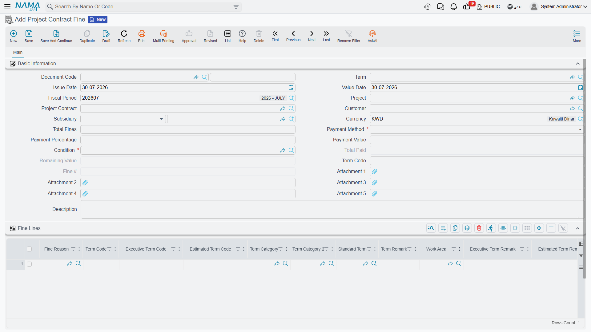

# Project Fines

Contracts have teeth. Miss the milestone and there is a daily penalty; pour concrete that fails its cube test and the consultant instructs a deduction; leave the site unfenced and the owner charges you for doing it himself. **Project Contract Fine** (سند غرامة عقد مشروع) is where those charges are recorded against the owner contract.

The behaviour worth knowing before anything else is this: **a fine does two things, not one.** It creates a journal entry of its own the moment it is committed, *and* it queues itself up to be netted off the next [extract](/modules/contracting/project-contracting/contracting-project-extracts.md). Those are not alternatives, and neither is a substitute for the other.

## Where to find it

| | |
|---|---|
| Menu | Contracting > Project Contracting > Project Contract Fine |
| Kind | Document |
| Document term | Required — it supplies the accounts and the default recovery rule |
| Licence | `contracting` |

## The screen

**The header** identifies the contract and the recovery rule. **Project Contract**, with **Project** and **Customer** following from it. **Subsidiary** — the account this charge sits against. **Currency**. **Total Fines**, a system field that simply adds up the grid. Then the same recovery block that sits on an [advance payment](/modules/contracting/project-contracting/contracting-project-advances.md): a required **Payment Method** with its **Payment Percentage** or **Payment Value**, a required **Condition** — the [contract condition](/modules/contracting/setup/contracting-conditions.md) the deduction will appear as on the extract, carrying the accounts that deduction is booked to — and the system-maintained **Total Paid**, **Remaining** and the fine's sequence number among the contract's fines.

**The Fine Lines grid** is where the penalties themselves go, one row each:

| Column | What it is |
|---|---|
| **Fine Reason** | the classification — late completion, defective work, site safety. See below |
| **Term Code** | the BOQ term the penalty is charged against. Normally mandatory |
| **Fine Value** | the amount |
| **Standard Term**, **Term Remarks**, **Work Area** | descriptive, carried for reporting |
| **Executive Term Code**, **Estimated Term Code** and their remarks | link the penalty to a [budget](/modules/contracting/budgets/contracting-executive-budget.md) line, so it shows in cost reporting against the right budget item |
| **Term Category** / **Term Category 2** | the term's own classifications |
| **Subsidiary** | overrides the header's account for this line |
| **Attachment 1** / **2**, **Description** | the consultant's instruction, the photograph, the note |

There is one behaviour here that surprises people: **if you fill the header's Term Code, it overwrites the term code on every line.** So use one approach or the other — either put the term code in the header and let it drive all the lines, or leave the header empty and set the term code line by line. Filling both and expecting the lines to win does not work.

::: tip Fine reasons are a pure classification
**Fine Reason** is a small master file with nothing but a code, a name and a group — it exists so penalties can be grouped and reported on ("we lost 180,000 to late completion last year"). Nothing in the module behaves differently because of the reason, so define as many as your reporting wants. They live with the module's other small master files on the [lookups page](/modules/contracting/setup/contracting-lookups.md).
:::

## What the fine does on commit

Three things happen, and it is worth separating them.

### 1. It creates its own journal entry

Per fine line, the fine value is booked to the debit and credit accounts on the document term. As everywhere in this module, the entry is created through a **business request** processed in the background: the document saves instantly, the entry follows, and a failure is retried from the **Business Requests** list view with **More → Reprocess** or **Recommit**.

Both sides of the pair must be configured or nothing is booked at all. A term option — *calculate accounting effects from the contracting condition* — changes where the accounts come from: with it on, the accounts on the fine's **condition** are used first and the term is only the fallback. That is the setting to use when several fine types share one document term but need different accounts.

### 2. It becomes a cost against the BOQ term

The fine is also recorded as a cost source, so it appears in the module's [cost roll-up](/modules/contracting/costs/contracting-cost-model.md) against the term code on the line. A penalty is money you lost on that piece of work, and this is how it reaches the actual cost of that piece of work — which is why the term code on a fine line matters more than it looks.

### 3. It waits to be deducted from the next extract

Exactly like an advance, the fine sits on the contract with a **Remaining** balance, and the next extract collects it as a **deduction** row in *Additions And Deductions*. The **Payment Method** decides how much:

| Payment method | Deducted from an ordinary extract |
|---|---|
| **First Next Extract** | the whole balance, on the very next extract |
| **Fixed Value With Every Extract** | the fixed amount, or the balance if smaller |
| **Percentage With Every Extract** | that percentage of the fine's own total |
| **Percentage From Due Value With Every Extract** | that percentage of the extract's works value |
| **Final Extract** | nothing until the Final extract, which then takes the balance |

On a Final extract the whole remaining balance is taken regardless, and the extract refuses to commit while any fine still carries a balance.

Unlike an advance, a fine can **never** be over-recovered — there is no option anywhere to allow a negative remaining on a fine.

::: info Why both, and not one or the other
The extract deduction is not a second expense. The fine's own entry is what recognises the charge; the deduction on the extract is what stops you being paid for it, reducing the receivable against whatever the fine's entry created. That is why the fine's own account pair and the condition's account pair have to be set up as a matched pair — the first records the penalty, the second collects it.
:::

## The lock nobody expects

**Once an extract has deducted a fine, the fine can no longer be edited or deleted.** The attempt is refused with a message naming the extract that claimed it.

This is deliberate, and it is the right behaviour — the certificate has already been issued with that deduction on it, and quietly changing the penalty afterwards would leave the two documents disagreeing. To correct a fine that has already been deducted, cancel the extract, fix the fine, and re-commit the extract.

Each extract's **Statistics** page has a *Fine Documents* list showing exactly which penalties that extract absorbed. That is the list to look at when somebody asks why a certificate is short.

## Other rules that block a commit

- **A term code is required on every fine line**, unless a term option makes it optional in cost documents.
- **Roll-up (parent) term codes are rejected** — charge the penalty against a leaf term.
- **The payment value cannot exceed the due value of its term code.**
- **The payment method's own field must be filled** — a percentage method needs a percentage, a fixed-value method needs a value.
- **The contract must not already have a Final extract.**

## Worked example

Continuing the contract from the [extracts page](/modules/contracting/project-contracting/contracting-project-extracts.md): **PC-2026-001** for *Al-Fanar Development* on project *Tower A*, on which EXT-001 (net payable 52,550) and EXT-002 (net payable 59,270) have already been certified for February and March.

In mid-April the consultant instructs a delay penalty. **PCF-001**, value date 15 April:

| Header field | Value |
|---|---|
| Project Contract | PC-2026-001 |
| Payment Method | **First Next Extract** |
| Condition | *FINE-DED*, whose accounts credit the receivable side |
| Total Fines *(system)* | **5,000** |
| Remaining *(system)* | 5,000 |

| Fine Reason | Term Code | Fine Value |
|---|---|---|
| Late completion of the concrete works | `2.01` | 5,000 |

On commit, three things are true at once: an entry has been raised for 5,000 against the accounts on the term; 5,000 has been added to the actual cost recorded against term `2.01`; and the fine sits on the contract with 5,000 remaining, waiting.

When the April certificate — EXT-003 — is prepared, the fine appears in its deductions grid on its own, without anybody typing it. Because the payment method is *First Next Extract*, the whole 5,000 comes off at once:

| EXT-003 | |
|---|---|
| Works value before VAT | *this month's billing* |
| Retention 10% | (as usual) |
| Advance recovered | (as usual — 11,500, from the 23,000 still outstanding) |
| **Fine PCF-001** | **(5,000)** |
| Net payable | works, less all three |

The fine's Remaining falls to zero, PCF-001 becomes read-only, and the extract's *Fine Documents* list shows it. Note that the two earlier certificates are untouched — a fine dated 15 April cannot reach back into a February or March extract, because only fines dated on or before the extract's value date are collected.

## Where to go next

- [Project Extracts](/modules/contracting/project-contracting/contracting-project-extracts.md) — where the deduction lands.
- [Project Advance Payments](/modules/contracting/project-contracting/contracting-project-advances.md) — the same recovery mechanism, for money you owe rather than money you were charged.
- [Contract Conditions](/modules/contracting/setup/contracting-conditions.md) — the condition the deduction rides on.
