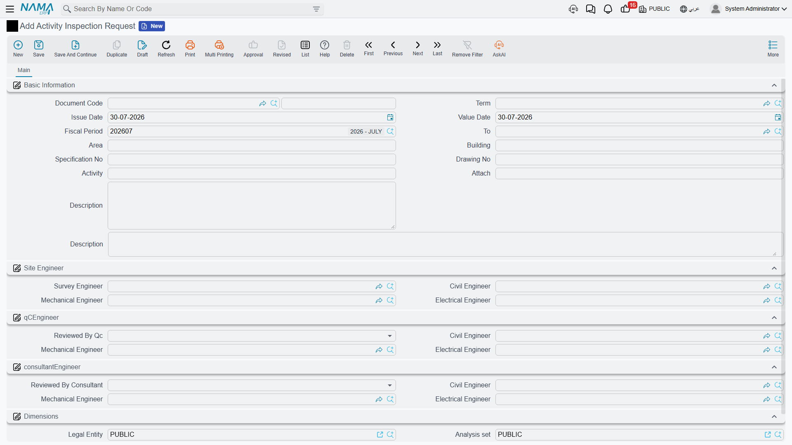

# Activity Inspection Requests

Reinforcement gets covered by concrete. Pipework gets covered by screed. Ducts disappear behind ceilings. There is a window — sometimes a few hours long — in which a piece of work can still be looked at, and once it closes, opening it again costs money. So the site engineer who has finished such a piece of work sends a request: *come and inspect this now, before we cover it.*

**Activity Inspection Request** is that request. In most contracts it is called an Inspection Request, an IR, or sometimes an RFI. It records what is ready, where it is, which drawing and specification it was built to, which engineers from each of the three parties are involved, and the verdicts that come back.

## Where to find it

| | |
|---|---|
| Menu | Contracting > Quality > Activity Inspection Request |
| Kind | Document |
| Document term | Required — nothing inspection-specific to configure on it |
| Licence | `contracting-qc` |

## What Is Being Inspected

The header answers the *what* and *where*, above the standard document book, code, term and dates.

| Field | What goes in it |
|---|---|
| **To** | the party the request is addressed to — in practice the consultant |
| **Area** | the zone of the site |
| **Building** | which building or block |
| **Specification No** | the specification section the work was built to |
| **Drawing No** | the drawing, with its revision |
| **Activity** | what is ready for inspection — the single most important box on the document |
| **Attach** | a **typed reference** to a supporting document, not a file upload. Put the document's own number here — *"Bar bending schedule BBS-104"* — and attach the actual file using the document's ordinary attachment facility |
| **Description** | anything else the inspector should know before he walks out |

::: info Set your consultant up as a customer as well
**To** is a reference to a customer record. In practice the addressee of an inspection request is the consultant, so if you want to pick the consultant here — rather than typing his name into the description — you need a customer record for him alongside the [consultant master file](/modules/contracting/setup/contracting-contractors-and-consultants.md) that the rest of the module uses. It is worth doing once at the start of a project; it is tedious to retrofit onto three hundred requests.
:::

Write **Activity** as if the reader will not see the drawing: not *"slab"* but *"Reinforcement fixing — slab level +12.00, grid C–F"*. The inspector reads this line on his phone in a lift.

## Who Signs — Three Panels of Three

Below the header the screen splits into three panels, one per party. This is the fullest sign-off model anywhere in the [quality group](/modules/contracting/quality/contracting-quality-overview.md), and it exists because an inspection request is genuinely a three-way conversation.

**The first panel is the site team.** A **Survey Engineer** — the person who set out and verified the levels — followed by the site team's **Civil Engineer**, **Mechanical Engineer** and **Electrical Engineer**.

**The second panel is quality control.** A verdict — **Reviewed By Qc** — followed by the same three discipline slots, so the QC engineer of the relevant trade signs against his own discipline.

**The third panel is the consultant.** Again a verdict, and again the three discipline slots.

Each panel offers all three disciplines because the same document is used for every trade. A slab inspection fills the civil slot in all three panels and leaves the other six blank. A chilled-water pipe run fills the mechanical ones. Nobody fills all nine.

### The two verdicts

The QC verdict and the consultant verdict each offer the same three answers:

| Verdict | What it means on site |
|---|---|
| **Acceptable** | proceed |
| **Acceptable with comments** | proceed, and fix the listed points as you go |
| **Not acceptable** | do not proceed; rework and re-raise the request |

The list shows these as short internal option names rather than translated captions, so read them by their order: acceptable first, acceptable-with-comments second, not-acceptable third.

Because the choices carry no remark box of their own, the reason for anything other than a clean *Acceptable* has to go in the document's description. Make that a rule for your QC team — a *not acceptable* with no written reason is an argument waiting to happen.

## What Approval Does — and Does Not — Unblock

**Nothing downstream depends on this document.** That is worth stating plainly, because the shape of the screen suggests otherwise: it looks like a workflow, with a request, two reviews and two verdicts.

- A verdict of **Not acceptable** does not stop anyone pouring. The pour is stopped by the site engineer who reads the verdict.
- A verdict of **Acceptable** does not release the quantity for certification. [Project Execution](/modules/contracting/project-contracting/contracting-project-execution.md) and [Subcontractor Execution](/modules/contracting/contractor-contracting/contracting-contractor-execution.md) do not look for an inspection request, and neither does either [extract](/modules/contracting/project-contracting/contracting-project-extracts.md).
- Committing the document creates no journal entry, no other document and no change to the project, contract or [ITP](/modules/contracting/quality/contracting-inspection-plans.md) it relates to.

If your procedure requires that no quantity is certified without an accepted inspection, enforce it with people and with a generic approval cycle on the inspection request itself, and audit it by reading the requests. Do not expect the extract to refuse.

## Worked Example: Before the Pour on Tower A

**Tower A**, the residential tower for **Al-Fanar Development**, is at level +12.00. The reinforcement for the slab is fixed, the formwork is closed, and the pour is booked for six o'clock the next morning. Before the concrete arrives, the steel has to be seen.

**Step 1 — the site engineer raises the request** on 03/03/2026, as `AIR-2026-0142`:

> **To** Dar Al-Handasah — the project consultant, set up as a customer record so he can be picked here
> **Area** `Zone B` · **Building** `Tower A`
> **Specification No** `SPEC-03-201` · **Drawing No** `ST-A-104 Rev.C`
> **Activity** `Reinforcement fixing — slab level +12.00, grid C–F`
> **Attach** `Bar bending schedule BBS-104`
> **Description** `Pour booked 04/03 06:00. Cover blocks 25 mm, spacers at 1.0 m c/c.`

In the first panel he names the survey engineer, *A. Mansour*, and himself as the civil engineer, *M. Fathy*. The mechanical and electrical slots stay empty — there is nothing mechanical about a slab of steel.

Note that the specification number matches row 1 of `ITP-CW-01`, the [inspection and test plan](/modules/contracting/quality/contracting-inspection-plans.md) the consultant approved in February. Nothing in the system checks that. It matches because the engineer made it match, and that is exactly why the plan's **Report Reference No** column is worth filling.

**Step 2 — QC inspects.** The company's QC engineer, *H. Salem*, walks the slab the same afternoon. Cover is right, laps are right, but two spacers are missing at the C4 corner. He records his verdict as **acceptable with comments** in the second panel, signs the civil slot, and adds to the description: *"QC 03/03 16:20 — add two spacers grid C4 before pour."*

**Step 3 — the consultant inspects.** *R. Aziz* from Dar Al-Handasah attends at 18:00, sees the spacers in place, and records **acceptable** in the third panel with his own name in the civil slot.

**Step 4 — the document is committed**, and nothing else in the system moves. The pour goes ahead at six because two engineers said it could. The next morning somebody raises a [Pre-Concrete Inspection](/modules/contracting/quality/contracting-site-checklists.md) for the formwork readiness check, and a [Post-Concrete Inspection](/modules/contracting/quality/contracting-site-checklists.md) once the sides come off — separate records, each standing on its own.

Later, when the month's [execution](/modules/contracting/project-contracting/contracting-project-execution.md) is measured and 200 m³ of concrete goes onto the [extract](/modules/contracting/project-contracting/contracting-project-extracts.md), `AIR-2026-0142` is the piece of paper that says the steel under that concrete was seen by three people before it disappeared. That is the whole job of the document, and it does it well.
