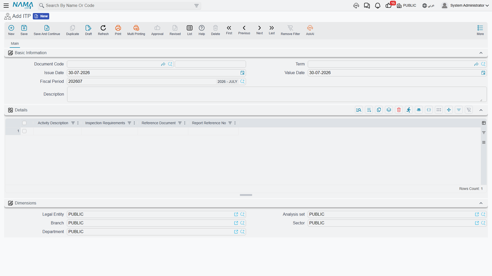

# Inspection and Test Plans

An **ITP** — an Inspection and Test Plan — is the document a contractor submits at the start of a job to answer one question in advance: for every activity on this project, what will be inspected, against which specification, and who has to witness it. It is a contractual deliverable in its own right. The consultant reads it, comments on it, sends it back, and the contractor re-issues it until it is accepted. Only then does work start being inspected against it.

Nama gives that process two screens, and the split between them is worth getting right before you type anything:

- **ITP** holds **the plan** — a list of inspectable activities and what has to happen to each one.
- **ITP Register** holds **the submission history** — one row per plan document, recording its revision number, where the submission has got to, and whether the client accepted it.

The register is emphatically *not* a log of inspections carried out. It is the "have we got our ITPs approved yet?" tracker. The inspections themselves are recorded on [Activity Inspection Requests](/modules/contracting/quality/contracting-activity-inspections.md) and on the [trade checklists](/modules/contracting/quality/contracting-site-checklists.md).

## Where to find them

| | ITP | ITP Register |
|---|---|---|
| Menu | Contracting > Quality > ITP | Contracting > Quality > ITP Register |
| Kind | Document | Document |
| Document term | Required — nothing plan-specific to configure on it | Required — same |
| Licence | `contracting-qc` | `contracting-qc` |

Both follow the [shared shape](/modules/contracting/quality/contracting-quality-overview.md) exactly, and both take it to its simplest extreme: neither screen has a single header field of its own. Everything you type is in the grid.

## The Plan

Above the grid there is nothing but the standard document header — book and code, document term, issue date, value date, fiscal period and a description. Below it, the **Details** grid, one row per activity:

| Column | What goes in it |
|---|---|
| **Activity Description** | the activity being planned — *Reinforcement fixing*, *Concrete pouring*, *Backfilling*. A long text box, so a full sentence fits |
| **Inspection Requirements** | what has to be done to inspect it, in the contract's own words — *"Slump test each truck; 6 cubes per 50 m³"* |
| **Reference Document** | the specification or standard the requirement comes from — a spec section number, a code clause |
| **Report Reference No** | the numbering series the resulting inspection reports will carry, so that a report can be traced back to the plan row that called for it |

Four columns is the whole plan. The document does not compute anything from them, does not enforce that an activity has been inspected, and does not check the reference document exists. It is a structured list — the value is that it is one list, held in one place, revisable, and attached to the project's paperwork rather than living in somebody's spreadsheet.

::: tip Use Report Reference No as a naming rule, not a number
The most useful thing to type here is the *pattern* the reports will follow — `RPT-CN-**` for concrete reports, `RPT-BF-**` for backfilling — rather than a single number. The plan row then tells whoever raises the report what to call it, and the reports sort themselves into families.
:::

## The Register

The register is where the plan meets the consultant. It has no header fields of its own either; the whole document is one grid, and each row is one submission of one plan.

| Column | What goes in it |
|---|---|
| **ITP** | a reference to a saved ITP document. This is the one document-to-document link in the whole quality family |
| **Revision** | the revision letter or number of that submission — *Rev.A*, *Rev.B* |
| **Description** | what the plan covers, in a phrase |
| **Type** | your own classification — *Civil*, *MEP*, *Civil+MEP* |
| **Approved** | the outcome of the submission |
| **Status** | where the submission has got to |
| **Status Date** | when the status was set |
| **Approved For Client** | whether the client, as distinct from the consultant, has accepted it |
| **Date** | the date of the row — normally the date the outcome came back |

**Approved**, **Status** and **Approved For Client** are free-text boxes, not fixed lists. That gives you room to record whatever wording your contract uses — *"Approved with comments"*, *"Code B"*, *"Returned for revision"* — but it also means nothing keeps two people typing the same thing two ways. Agree a short house vocabulary for these three columns before the first register is opened, and write it down; otherwise the register cannot be scanned reliably six months later.

::: info One row per submission, not one row per plan
The register is a history, so a plan submitted three times gets three rows. Do not overwrite the earlier row when a new revision goes out — add a new one. Read top to bottom, the rows are the story of how the plan got accepted.
:::

## Worked Example: Concrete Works on Tower A

**Tower A** is the residential tower being built for **Al-Fanar Development**. Its structural concrete needs an ITP before the first pour, so the QC manager creates one.

**Step 1 — the plan.** ITP `ITP-CW-01`, *Concrete works — Tower A*, with four rows:

| Activity Description | Inspection Requirements | Reference Document | Report Reference No |
|---|---|---|---|
| Reinforcement fixing | Visual check plus cover-meter reading on 100% of elements | SPEC-03-201 | RPT-RF-** |
| Formwork and pre-pour readiness | Line, level, cleanliness and prop check before every pour | SPEC-03-150 | RPT-PC-** |
| Concrete pouring | Slump test on each truck; 6 cubes per 50 m³ | SPEC-03-300 | RPT-CN-** |
| Curing and stripping | 7-day water curing record; strip only after 7-day cube result | SPEC-03-320 | RPT-CU-** |

He commits it and issues it to the consultant as Rev.A.

**Step 2 — the register, first row.** He opens ITP Register `ITPR-2026-Q1` and records the submission:

> ITP `ITP-CW-01` · Revision `Rev.A` · Description *Structural concrete ITP* · Type `Civil` · Status `Submitted to consultant` · Status Date `04/02/2026` · Approved `Returned with comments` · Approved For Client `No` · Date `11/02/2026`

The consultant's comments are that the cube frequency must rise to 6 cubes per 30 m³ and that the curing record needs a named signatory.

**Step 3 — the second row.** The QC manager edits `ITP-CW-01` to match the comments and re-issues it as Rev.B. A second row goes on the same register:

> ITP `ITP-CW-01` · Revision `Rev.B` · Type `Civil` · Status `Submitted to consultant` · Status Date `18/02/2026` · Approved `Approved with comments` · Approved For Client `No` · Date `25/02/2026`

**Step 4 — the third row.** The remaining comment is editorial, so Rev.C goes out and comes back clean, and the client countersigns:

> ITP `ITP-CW-01` · Revision `Rev.C` · Type `Civil` · Status `Approved` · Status Date `02/03/2026` · Approved `Approved` · Approved For Client `Yes` · Date `05/03/2026`

Three rows, one plan, and the whole approval history readable at a glance. From that point the site raises its inspections against the four activities in Rev.C — as [Activity Inspection Requests](/modules/contracting/quality/contracting-activity-inspections.md) before each pour, and as [pre- and post-concrete inspections](/modules/contracting/quality/contracting-site-checklists.md) on the day.

One thing the system will not do for you: nothing links an inspection back to the plan row that called for it, and nothing warns you that an activity in the plan has never been inspected. The **Report Reference No** column is your only thread between the two, which is why it is worth filling properly.
