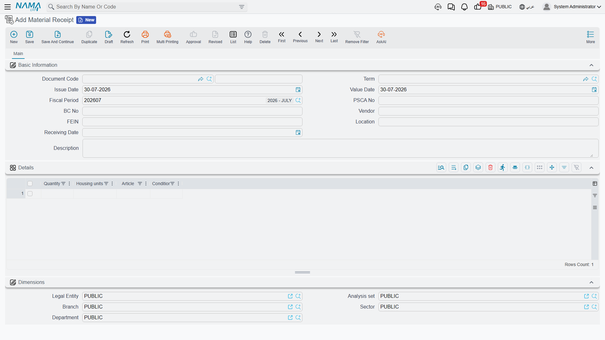

# Material Inspection on Delivery

A lorry arrives at the site gate. Somebody has to walk round it, count what is on it, read the mill certificate, look for damage, and sign that what turned up is what was ordered. In construction that signature has a name — the **Material Receiving Report**, or **MRR** — and the consultant will ask for it before he approves the material for use.

Nama gives you two screens for that:

- **Material Receipt** is the individual report: one delivery, one document.
- **MRR Register** is the log of those reports going out to the consultant and coming back approved.

## Read This First: It Is a Standalone Form

This is the first thing a reader asks, so it goes at the top rather than in a footnote.

**Material Receipt has no link to a purchase order, a goods receipt, an item or a supplier record.** It is a printable, filable, searchable form, and it stops there. Concretely:

- The **Vendor** is a name you **type**. It is not a reference to the supplier master file, so a Material Receipt cannot be listed "by supplier" and cannot be matched to a supplier's invoice.
- The purchase-order and consignment numbers in the header are **typed text** too. They are not references to a [contracting purchase order](/modules/contracting/costs/contracting-purchasing.md) or to any purchasing document, so nothing reconciles the quantity received against the quantity ordered.
- The lines carry a quantity, a unit and a **written description** of the material. There is no item reference, so the document cannot tell you *which* stock item arrived.
- Committing it **moves no stock and posts no journal entry**. Nothing enters or leaves a warehouse.

None of that makes the document useless — a signed, dated, numbered receiving inspection with a physical-condition verdict per line is exactly what a consultant wants to see, and having it in the system instead of in a lever-arch file is worth having. But it means you should be clear about which job you are doing:

| If you want to… | Use |
|---|---|
| record the QC inspection of a delivery, for the project's quality file | **Material Receipt** |
| receive material into stock so it can be issued to the project | the supply-chain receiving documents, then [Issuing Material to a Project](/modules/contracting/costs/contracting-project-materials.md) |
| match a delivery to what was ordered and to what was invoiced | [Contracting Purchase Requests and Orders](/modules/contracting/costs/contracting-purchasing.md) and the ordinary purchase invoice |

Many contractors do both: the storekeeper receives into stock through the supply-chain documents, and QC raises a Material Receipt for the quality file. The two are simply not connected to each other.

## Where to find them

| | Material Receipt | MRR Register |
|---|---|---|
| Menu | Contracting > Quality > Material Receipt | Contracting > Quality > MRR Register |
| Kind | Document | Document |
| Document term | Required — nothing receipt-specific to configure on it | Required — same |
| Licence | `contracting-qc` | `contracting-qc` |

## The Receipt

Above the standard document book, code, term and dates, the header identifies the delivery:

| Field | What goes in it |
|---|---|
| **PSCA No** | the purchase or supply-contract number the delivery is against — typed |
| **BC No** | the consignment or delivery-note number — typed |
| **Vendor** | the supplier's name — typed |
| **FEIN** | the supplier's tax or registration number |
| **Location** | where on site the material was received — the gate, the store, the stockyard. Despite the caption, which is borrowed from the warehouse screens, this is a site location and not a warehouse |
| **Receiving Date** | the day the lorry arrived, which is often not the day the document gets typed |
| **Description** | anything the reader needs — weather, the driver's name, the reason a line was queried |

Then the **Details** grid, one row per kind of material on the vehicle:

| Column | What goes in it |
|---|---|
| **Quantity** | how much of it arrived |
| the unit column | the **unit of measure** — ton, m³, bag, each. The caption on this column is borrowed from another module and reads as a housing unit; it is the unit of measure |
| **Article** | the material itself, described in words: grade, size, batch, certificate number. A long text box, so use it properly |
| the condition column | the **physical condition** of what arrived — *Accepted*, *Accepted with comments*, *Rejected*, and why. The caption reads as *condition* in the contractual sense; here it means the state of the goods |

Because there is no item reference, **Article** is doing the work that an item code would normally do. Write it as if the reader has never seen the delivery: *"Ordinary Portland cement CEM I 42.5 N, 50 kg bags, batch 4471, mill certificate attached"* rather than *"cement"*. A year later that sentence is the only description of what was accepted.

## The Register

The register tracks the reports themselves — sent to the consultant, returned with an outcome. Like the [ITP Register](/modules/contracting/quality/contracting-inspection-plans.md), it has no header fields of its own; the document is one grid.

| Column | What goes in it |
|---|---|
| **Outcome Of Activity** | what came back — *Approved*, *Approved with comments*, *Rejected* |
| **Sent Date** | the day the report went out. A real date |
| **Description** | which report this row is about |
| **Quantity** | the quantity covered, so the register totals as well as lists |
| **Receive Date** | the day the outcome came back. This is a **free-text box, not a date field**, so type it in a consistent format — the register cannot calculate turnaround time from it |
| **Remarks** | the consultant's code, comments, or anything else |

The register identifies the report it is tracking by its **Description**, so type the report's own document number there — *"MRR-2026-0031 cement delivery"* — and keep that habit. It is the only thread between a register row and the receipt it refers to.

## Worked Example: A Cement Delivery to Tower A

**Tower A** is the residential tower being built for **Al-Fanar Development**, and the raft pour needs cement on site by the ninth of March.

**Step 1 — the delivery.** On 08/03/2026 two lorries arrive against purchase order `PO-4411`. The QC inspector meets them at the gate, checks the delivery notes against the bags, reads the mill certificate, and walks the load.

**Step 2 — the receipt.** He raises Material Receipt `MRR-2026-0031`:

> **PSCA No** `PO-4411` · **BC No** `BC-2026-778`
> **Vendor** `Al-Rajhi Cement` *(typed)* · **FEIN** `FEIN-99201`
> **Location** `Site store — Gate 3` · **Receiving Date** `08/03/2026`
> **Description** `Two vehicles, 48 t total. Mill cert 4471 filed with this report.`

Two lines:

| Quantity | Unit | Article | Condition |
|---|---|---|---|
| 40 | ton | Ordinary Portland cement CEM I 42.5 N, 50 kg bags, batch 4471, mill certificate attached | Accepted |
| 8 | ton | Same batch, second vehicle — three bags torn in transit, contents lost | Accepted with comments — 3 bags short, credit requested |

He commits it. Nothing else happens in the system: no stock movement, no journal entry, no effect on `PO-4411`. Separately, the storekeeper receives the 48 tons into the site store through the supply-chain receiving documents, and the short-delivery credit is chased against the supplier's invoice by the purchasing team. Those are three unconnected pieces of work on the same delivery, and knowing that is the difference between using this document well and being confused by it.

**Step 3 — the register.** The report goes to the consultant the following morning, and a row is added to MRR Register `MRRR-2026-Q1`:

> **Outcome Of Activity** `Approved` · **Sent Date** `09/03/2026`
> **Description** `MRR-2026-0031 cement delivery` · **Quantity** `48`
> **Receive Date** `12/03/2026` *(typed as text)* · **Remarks** `Consultant code A. Short delivery noted, no objection to use.`

The cement is now cleared for use in the eyes of the project's quality file, and the register shows a three-day turnaround — read by eye, since the return date is text.

**Step 4 — what it feeds.** Nothing, in the system's terms. What it feeds in the real world is the folder the consultant audits, and the answer to the question *"who accepted this cement, and when?"* — which is the question the document exists to answer.
