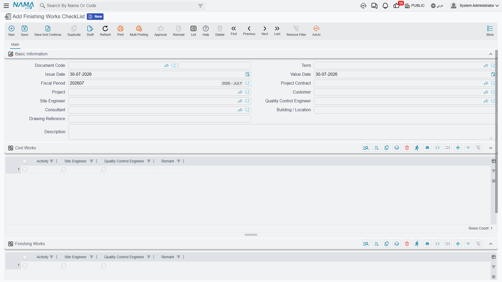
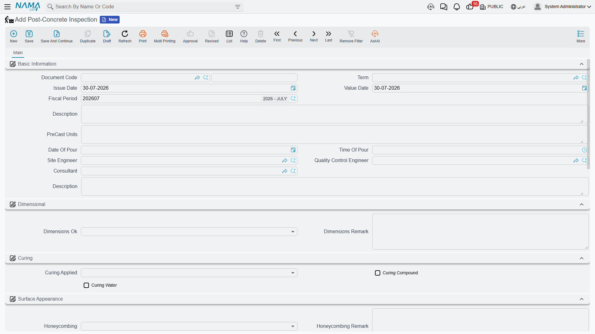

# Site Checklists and Test Reports

Eight of the thirteen screens in the [Quality](/modules/contracting/quality/contracting-quality-overview.md) group are specific site forms — the sheet you fill before a pour, the sheet you fill after it, the one for a buried pipe run, the one for a pressure test. Opened side by side they look like eight different features. They are not. They are **one document with eight different sets of questions printed on it**.

So this page does not enumerate every field of every form. It explains the two shapes they come in, then walks the four families by trade, saying for each one what it is for, what it asks, and how general it is. Once you have used one of them you can use all eight.

## Two Shapes

Every one of the eight starts the same way — book and code, document term, issue date, value date, fiscal period; then **who inspected** (a site engineer, a quality control engineer, usually a consultant); then **where** (some subset of area, building, drawing number, specification number, site location, level); then a description and the standard Dimensions group. That much is the [shared shape](/modules/contracting/quality/contracting-quality-overview.md), and it never varies.

What varies is the middle:

| Shape | How you fill it | Which forms |
|---|---|---|
| **Line list** | a grid you fill freely, row by row, as long as you like | the two activity checklists, the pre-concrete inspection, the underground piping list, cleaning and flushing, the test report |
| **Questionnaire** | a fixed set of tick-box questions in themed groups, each with its own remark box, and no grid at all | the post-concrete inspection, the hydrostatic fire-system test |

A line list adapts to any job because you write the questions as you go. A questionnaire cannot be changed, but it guarantees the same twelve things get looked at every time. Both are useful; they simply suit different work.

None of the eight has any behaviour: committing one posts nothing, moves nothing, and gates nothing. That is covered once on the [overview page](/modules/contracting/quality/contracting-quality-overview.md) and applies here without exception.

## The Two General Activity Checklists

If you are only going to use two screens from this group, use these. They are the most broadly useful documents in the family and — helpfully — the two that need only the plain **`contracting`** licence rather than `contracting-qc`.

| | Finishing Works CheckList | Digging And BackFiling CheckList |
|---|---|---|
| Menu | Contracting > Quality > Finishing Works CheckList | Contracting > Quality > Digging And BackFiling CheckList |
| Licence | `contracting` | `contracting` |

What makes them general is the grid. Instead of fixed questions, every row is **an activity you type yourself**, with tick-boxes beside it for each party who has to sign it off, and a remark box. Thirty activities on one document, each signed individually as it is completed.

Both are also, unlike most of this family, **tied to the job**: their header carries a **Project Contract** and a **Project**, so the checklist belongs to something. See [Project Contracts](/modules/contracting/project-contracting/contracting-project-contract.md).

**Finishing Works CheckList** takes the customer, the site and QC engineers, a proper reference to the [consultant master file](/modules/contracting/setup/contracting-contractors-and-consultants.md) — the only screen in the group that types the consultant properly — a building or location, and a drawing reference. Below that it has **two grids with the same three columns**. The screen does not label them, so know this from the order: **the first grid is civil works, the second is finishing works**. Splitting them is genuinely useful — the blockwork and screeds get signed off by one team, the paint and joinery by another — but you have to remember which is which.

**Digging And BackFiling CheckList** takes the site and QC engineers, the client's **Representative** by name, what the checklist was **Issued For**, a serial number, the building, an activity and a drawing and document number. Its rows carry **three ticks rather than two** — site engineer, client's representative, and QC engineer — which suits earthworks, where the client's man usually has to see the trench before it is filled. Type the activity for each row into the row's **description** column; the header's own activity field describes the document as a whole.

**Worked example.** Excavation for the Tower A raft, on the **Tower A** project for **Al-Fanar Development**, contract `PC-2026-001`. Representative *Eng. S. Mahmoud*, issued for `Substructure`, serial `14`, building `Tower A`, activity `Excavation & backfilling`, drawing `104`, document number `2026014`. Three rows:

| Description | Site | Rep | QC | Remark |
|---|---|---|---|---|
| Excavation to level −4.50 verified by survey | ☑ | ☑ | ☑ | survey report SR-22 |
| Base free of standing water and loose material | ☑ | ☑ | ☑ | |
| Backfill in 250 mm layers, compaction ≥ 95% | ☑ | ☐ | ☑ | awaiting representative's signature |

Read down the Rep column and you can see exactly what is outstanding. That is the whole value of the document.

## Concrete: Before and After the Pour

Two forms bracket a pour, and the question set on each is standard reinforced-concrete practice rather than anything client-specific. Both need `contracting-qc`.

**Pre-Concrete Inspection** — *the formwork and the steel are ready; may we pour?* Its header is a readiness statement: the site engineer, the QC engineer, the consultant by name, the **site location** on the job (the caption is borrowed from the warehouse screens; it means a position on site), the **level**, the **element** being poured, the **concrete grade**, and the date the pour is planned for together with the volume expected. Those last two are typed as free text, so they record the intention rather than being figures the system can sort or total.

Its grid is not a checklist — it is the **paperwork the pour is being checked against**, one row per drawing: the contract drawing number and its revision, then the bending schedule number and its revision. The two revision columns carry the same caption on screen; the first belongs to the **drawing**, the second to the **bending schedule**, and you tell them apart by their position.

**Post-Concrete Inspection** — *the formwork is off; what does the concrete look like?* This one is a pure questionnaire with no grid at all, and it is the best-designed form in the group.

Its header records the precast units involved, the **date and time of the pour**, and the three signatures. Then three themed groups:

- **Dimensional** — is the element the size it should be, yes or no, with a remark.
- **Curing** — was curing applied, and by which method: compound, water, or both.
- **Surface Appearance** — ten questions, each with its own remark box. Honeycombing and other voids answer yes or no. Formwork joints, construction joints and chamfers answer *OK* or *needs treatment*. Tie holes, cracks, formwork marks and sand runs answer *none* or *needs treatment*.

The remark boxes are what make this document worth filling. *"Honeycombing — Yes"* tells a manager there is a problem somewhere; *"Honeycombing — Yes; two patches near column C4, 150 × 200 mm"* tells a foreman what to do on Monday.

**Worked example.** The slab at level +12.00 on Tower A, poured 05/03/2026 at 06:30 — the pour that [`AIR-2026-0142`](/modules/contracting/quality/contracting-activity-inspections.md) cleared the steel for. Formwork struck on the ninth, and the inspection records: dimensional **yes**; curing **yes**, water only; honeycombing **yes** — *"two patches near column C4, 150 × 200 mm"*; formwork joints **needs treatment**; tie holes **needs treatment** — *"grout 12 holes, face B"*; construction joints **OK**; cracks **none**; formwork marks **none**; sand runs **none**.

Four remedial items, each written down with a location. Nothing in the system chases them — but the sheet is unambiguous, which is more than most site paperwork achieves.

## Piping, Flushing and Pressure Testing

Three forms cover the mechanical and fire-protection trades. They only suit contractors doing that work, and they overlap: a pipe run can end up on all three. All need `contracting-qc`.

**Underground Piping Check List** is the simplest document in the module. Its header names the building, the drawing, the **pipe line number**, its **type**, the surveyor, and the site and QC engineers. Its grid has **one column** — a description — so you type one check per row and nothing is ticked. That sounds thin, and it is, but for the ten-minute walk along a trench before it is closed it is enough, and it means the form never fights the job.

**Cleaning And Flushing** certifies that pipework was blown through and flushed before commissioning. Its header adds the area, building, specification and drawing, the three signatures, and the **type of fluid used**. Its grid has five text columns: the **piping line number**, the **P/ID number**, what was **blown at** what pressure, the **flushing** detail, and a spare column for anything else. One row per line flushed.

**HydroStatic Test Report For Fire Protection System** is the most elaborate questionnaire in the module and the most obviously written around a single job: it is a fire-loop pressure test report, section by section, and it will not adapt to anything else. Six groups, no grid:

| Group | What it captures |
|---|---|
| Basic Information | area, building, specification, drawing, and the three signatures |
| **UnderGround Pipes And Joints** | the pipe type and class, the joint type, and three yes/no conformance questions — do the pipes conform, do the fittings conform, are the joints as required — each with a text box, and two of the three with a further box for explaining a *no* |
| **Hydrostatic Test** | the test pressure and its duration, and whether the joints were covered |
| **LeakAge Test** | the leakage measured, over how long, against the allowable leakage, over how long |
| **Hydrants** | how many were installed, their type and make, and whether they operate |
| **Control Valves** | whether they were left open, with a box for explaining a *no* |

Every measured value on this form — pressures, durations, litres, hydrant counts — is a **typed box**, so the document is a written record of the readings rather than a calculator. It captures that the leakage was 1.5 litres against an allowable 3.0; the comparison is made by the engineer reading it.

**Worked example.** Fire loop `FP-LOOP-02` on Tower A, Zone B, specification `SPEC-15-400`, drawing `FP-A-011 Rev.A`. Pipe type and class `DI K9`, joint type `Tyton push-on`; pipes conform **yes**; fittings conform **yes**; joints as required **yes**; hydrostatic test `12` bar for `2` hours; joints covered **no**; leakage `1.5` litre over `2` hours against an allowable `3.0` litre over `2` hours; `4` hydrants installed, `Pillar type, Angus`, and they operate **yes**; control valves left open **yes**. A clean pass, recorded in the terms the fire authority will ask for.

## Test Reports

**Test Report** is the generic pressure or leak test certificate — the one you issue for a tested system rather than for a trade — and its distinguishing feature is that it carries the **schedule of gauges** used, with their calibration dates. It needs only the plain **`contracting`** licence.

| | |
|---|---|
| Menu | Contracting > Quality > Test Report |
| Kind | Document |
| Licence | `contracting` |

Like the two activity checklists, and unlike the rest of this family, it is **tied to the job**: its header carries a **Project Contract** and a **Project**.

Its groups run in the order the test does:

- **Test Information** — the system tested, the boundaries of the test, the pipe class, the design and service pressures, the fluid used, and the reference code the test is run to.
- **The test method** — tick-boxes for hydrostatic, leakage, pneumatic or other, with a box to say what "other" was.
- **The test requirements** — the required pressure in psi or bar, the test duration and the minimum duration, the actual pressure at examination, and the hold time against the minimum hold time. This is the group that says what a pass looks like.
- **A signature row** — the site engineer and the quality control engineer, each with a date beside them. These are the only dated signatures anywhere in the quality family.
- **Test Results** — the start time, the period, the finish time and the test date. One AM/PM selector applies to both times, so record a test that crosses midday by noting it in the description.
- **The equipment grid** — one row per gauge or instrument used: its **type**, its **range**, its calibration date and the date the calibration falls due. This is what a consultant checks first, because a reading from an out-of-calibration gauge is not a reading.

**Worked example.** The Tower A fire loop again, tested 12/03/2026 for **Al-Fanar Development** under contract `PC-2026-001`. System `Fire protection — underground loop`, boundaries `Pump room outlet to hydrant H4`, pipe class `DI K9`, design pressure `16 bar`, service pressure `12 bar`, fluid `Potable water`, reference code `NFPA 24`. Method: **hydrostatic**. Requirements: `12 bar`, duration `2 h` against a minimum of `2 h`, actual pressure at examination `12 bar`, hold time `2 h` against a minimum `2 h`. Results: start `09:00`, finish `11:00`, AM, test date `12/03/2026`. Signed by the site engineer on 12/03 and the QC engineer on 13/03. Equipment: one row — type `Pressure gauge, 0–25 bar`, range `0–25 bar`, calibrated `04/01/2026`, due `04/07/2026`.

## How General Is Each One?

Worth knowing before you build a procedure around any of them, because some of these forms were clearly written for a particular contract and carry its vocabulary.

| Form | How it reads |
|---|---|
| **Finishing Works CheckList**, **Digging And BackFiling CheckList** | fully general. Free-form activity rows with per-party ticks; any contractor can use them for anything. Start here |
| **Pre-Concrete Inspection**, **Post-Concrete Inspection** | general within their trade. The question set is standard reinforced-concrete practice |
| **Underground Piping Check List**, **Cleaning And Flushing** | trade-specific but reusable. Only useful to MEP contractors, but not tied to one job |
| **HydroStatic Test Report For Fire Protection System** | written around a specific fire-system test. Excellent if that is your test, unusable for anything else |
| **Test Report** | broadly usable for pressure and leak testing, though a few of its boxes read as though written for one particular client's paperwork |

If none of the eight fits the check you need to record, the two general activity checklists will hold it — that is what free-form rows are for — and if you need a real gate rather than a record, put a generic approval cycle on the document and enforce the discipline through your site procedure. The [overview page](/modules/contracting/quality/contracting-quality-overview.md) explains why.
