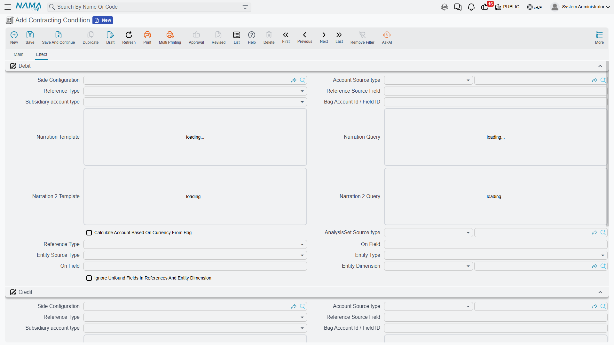
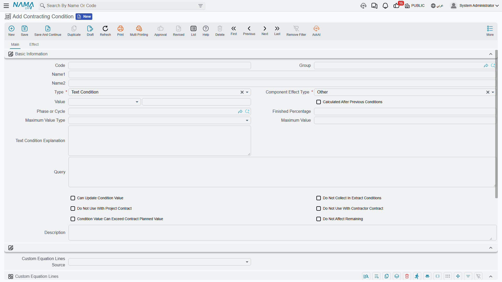
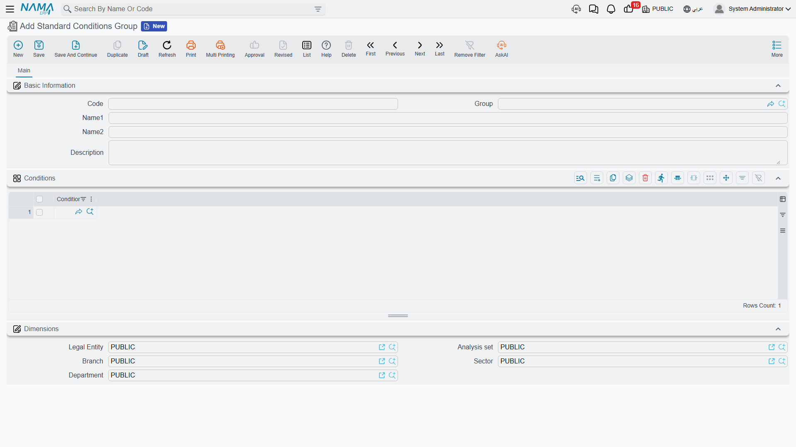

# Contract Conditions

Every construction contract carries clauses that move money without being work: *retain 5% of each
payment until final handover*, *recover the mobilisation advance at 20% of every certificate*, *deduct
1,000 per day of delay*, *pay a 2% bonus for early completion*, *hold back the insurance premium*.

In Nama those clauses are **conditions** (شروط), and a condition is far more than a percentage on a
piece of paper. A condition record says *what kind of clause this is*, *when it applies*, *how its
money is computed*, *what ceiling it must never breach*, and — the part people miss — **which accounts
it books to**. That last point is why this page matters: conditions are how retention, advance
recovery, penalties and bonuses actually reach the general ledger.

- **Where to find it:** Contracting > Master Files > Contracting Condition
- **Licence:** `contracting`
- A **master file**. New conditions start out as a text-only clause with no money effect, which is a
  sensible default: you decide deliberately when a clause becomes financial.

## A Condition Is a Journal Entry, Not a Number

Attach a condition to a contract and it will appear on every extract the contract produces, adding to
or deducting from the amount due. But the extract does not just net the amount off a total — it books
it.

The Effect page carries a **Debit** side, a **Credit** side, and a separate **Tax Debit** and **Tax
Credit** pair. Their behaviour on an extract is worth spelling out, because the fallback is the part
that catches people:

- **When the condition has its own debit and credit accounts, they win.** Retention typically debits a
  retention receivable and credits a retentions-payable account, so the withheld money sits visibly on
  the balance sheet until it is released. That is a proper journal entry, defined once, on the clause.
- **When the condition has no accounts of its own, the amount lands on the extract's own accounting
  sides instead — and a deduction is booked there as a negative.** Nothing is lost and nothing fails;
  the deduction simply reduces the same pair of accounts the extract's value went to, rather than
  parking it in a dedicated account. If you want retention visible as a balance, give the condition
  its own accounts.
- **Tax on a condition is booked separately.** If the condition line carries a tax percentage, the tax
  amount is booked against the condition's tax debit and tax credit rather than being folded into the
  main pair.
- **The amount booked** is whichever of the addition, the deduction or the "other" value the condition
  produced.

So a well-built conditions catalogue is really a small set of pre-written journal entries, and the
accounts on it are as much a part of the clause as its percentage.

## When Does It Apply — Condition Types

The **Type** field decides the *occasion* on which the clause fires. Seven types are available:

| Type | Fires when |
|---|---|
| Text Condition | never — it is a clause you want printed and tracked, not calculated. It has no money effect at all, and the system insists its effect type stays "other" |
| Related To Completion Percent | the term's executed percentage reaches the completion percentage you set on the clause. This is how "release the second half of retention at 80% complete" is modelled |
| Contract End | the contract has been flagged as finished **and** the extract contains the clause's phase |
| With Initial Extract | only on an extract whose type is Initial |
| With Every Extract | on every extract that contains the clause's phase. Leave the phase blank and it means every extract, full stop. This is the type retention and advance recovery normally use |
| With Final Extract | only on an extract whose type is Final — for the release of retention, or a final adjustment |
| Other | always. The catch-all for a clause that has no natural occasion |

The remaining fields on the Main page tune the clause:

| Field | What it does |
|---|---|
| Effect Type | addition, deduction, or other — see below |
| Value Type and Value | how the money is computed, and the number that drives it. Covered in the next section |
| Calculated After Previous Conditions | include the net effect of the clauses already collected in this clause's base, so a chain of deductions compounds rather than each taking its own slice of the gross |
| Phase or Cycle | restrict the clause to one milestone |
| Finished Percentage | required for a completion-percentage clause |
| Maximum Value Type and Maximum Value | the ceiling. See below |
| Text Condition Explanation | the printable wording of the clause, copied onto term and contract lines for you |
| Can Update Condition Value | whether a user may overwrite the computed amount on the extract |
| Do Not Collect In Extract Conditions | keep the clause out of automatic collection entirely — for clauses you always enter by hand |
| Do Not Use With Project Contract / Do Not Use With Contractor Contract | keep the clause out of the lookup on one side or the other, so a subcontractor clause never appears on an owner contract |
| Condition Value Can Exceed Contract Planned Value | allow the clause to go beyond what the contract planned for it |
| Do Not Affect Remaining | the amount does not reduce the contract's remaining value. Use it for clauses that are cash movements rather than consumption of the contract |

## How Much — Value Types

The **Value Type** decides the formula, and the **Value** beside it is the number the formula uses.

| Value type | What it computes |
|---|---|
| Value | a flat amount. The simplest clause there is |
| Percentage From Extract | the percentage of *this extract's* line value. If the clause names a phase, only that phase's value is used. With *calculated after previous conditions* on, the net of the clauses already collected is added to the base first |
| Percentage From Total | the percentage of the **contract** total — or, when the clause is tied to a single term code, of that term's total price |
| Percentage From Total Due Value | the percentage of the extract's total due value |
| Percentage From Term Net Value | the percentage of the matching extract line's net value |
| Percentage From Term Due Value | the percentage of the matching extract line's due value |
| Percent Of Custom Equation | the percentage of a base you define yourself, component by component. See [The Custom Equation](#The-Custom-Equation) |
| Query | the total of a query you write, run against the extract. The escape hatch of last resort, for clauses no formula covers |

::: tip Where the percentage is read from
For most value types the percentage is taken from the **condition line on the contract**, so you can
agree 5% with one client and 10% with another using the same catalogue clause.

Three value types behave differently: **percentage from total due value**, **percentage from term net
value** and **percentage from term due value** take their percentage from the **standard condition
record** itself. For those three, set the percentage here on the master file — editing it on the
contract line has no effect, and the *can update condition value* flag has nothing to act on.
:::

**Addition, deduction or other.** Once the amount is computed, the **Effect Type** decides where it
lands on the extract:

- **Addition** — the amount is added to what is due. Bonuses, escalation, reimbursables.
- **Deduction** — the amount is withheld. Retention, advance recovery, penalties, insurance.
- **Other** — the amount is recorded in a third bucket, for clauses that are neither.

**The ceiling.** Two more fields protect you from a clause that runs away: a **maximum value type** of
either a flat value or a percentage of the total, and the **maximum value** itself. For a
*with every extract* clause the check is against the **running total accumulated across all extracts**
— exactly what you want for retention, which must stop at the agreed percentage of the contract, not
of each certificate. For every other type the check is against the current extract alone. Breach it and
the save is refused with an invalid-condition-value message, and the amount is not written.

## Clauses Satisfied by a Separate Document

Some clauses are not computed from the extract at all — their money comes from a document somebody
raised elsewhere. The **relation with documents** column on a condition line says so:

| Relation | Where the amount comes from |
|---|---|
| Requires Advance Payment | an advance payment document, on either side of the business |
| Requires Other Payment | a subcontractor other-payment document |
| Requires Contract Fine | a fine document |
| None | computed by the formulas above |

A clause with anything other than *none* is skipped when the extract collects its conditions, and then
picked up from the payment or fine document instead: the amount is whatever that document says should
be recovered against this certificate, or — on a final extract — the whole of what remains. Whether it
arrives as an addition or a deduction is the payment document's decision.

That is the mechanism behind
[Project Advance Payments](/modules/contracting/project-contracting/contracting-project-advances) and
[Project Fines](/modules/contracting/project-contracting/contracting-project-fines): the clause on the
contract is the hook, the document is the amount.

## The Custom Equation

Sooner or later a client writes a clause that no single total satisfies: *"retention is 5% of the term
value after the trade discount but before VAT"*. Neither the extract total nor the term net value is
that number. The **percent of custom equation** value type exists for exactly this.

You describe the base you want as an ordered list of steps. Each step names three things:

1. **Which component** of the line to look at — the main price, one of the discounts, the header
   discount, one of the taxes, a custom price, or the running total so far.
2. **Which number** off that component — its money value, its percentage, or the running amount after
   it has been applied.
3. **How to combine it** with the running total — add, subtract, multiply, divide, take a percentage of
   the running total, or extract an embedded percentage out of it.

The steps are applied **in order**, starting from zero, and the result is the base. A separate field
says **which extract lines** feed the equation:

| Lines source | Which lines |
|---|---|
| Current Extract Lines | the lines of the extract being raised |
| Previous Extracts Lines | the lines of all earlier committed extracts of the same contract |
| Current And Previous Extracts Lines | both |
| Current Extract Lines Or Previous Extract Lines If There Is No Current Quantity | the current lines when any matching line has a billing quantity, otherwise the previous ones |

Whatever the source, the lines are narrowed to **leaf lines** only, and — when the clause is tied to a
term code — to that term. The equation is then evaluated **once per line**, the per-line results are
added up, and finally the clause's percentage is applied to the sum. A percentage of zero is read as
100%, which is how you use an equation as the amount itself rather than as a base.

::: tip Building an equation that works
Two habits save a lot of trouble:

- **Never leave the equation grid empty.** A percent-of-custom-equation clause with no steps computes
  zero on every extract, quietly and forever.
- **Only reference components your lines actually carry.** If your extract lines use main price, one
  discount and one tax, build the equation from those three. Referencing a fourth tax or an eighth
  discount that never appears on a line will stop the extract's condition collection in its tracks.

The three columns of the equation grid are captioned in English on both the Arabic and the English
screens.
:::

## Retention

Retention is the clause every contracting implementation needs on day one, so here it is end to end.
The rule: **retain 5% of each certificate, calculated on the term value after the trade discount but
before VAT, and never retain more than 5% of the contract.**

**The catalogue entry.** One standard condition, `RET-05` — *Retention*:

| Field | Value |
|---|---|
| Type | With Every Extract |
| Effect Type | Deduction |
| Value Type | Percent Of Custom Equation |
| Custom equation lines source | Current Extract Lines |
| Maximum Value Type / Maximum Value | Percentage From Total / 5 |
| Debit | Retention receivable |
| Credit | Retentions payable |

**The equation**, two steps:

| # | Component | Which number | Operation | Running total |
|---|---|---|---|---|
| 1 | Main price | value | add | 0 + 100,000 = **100,000** |
| 2 | Discount 1 | value | subtract | 100,000 − 5,000 = **95,000** |

VAT is never referenced, so it is excluded automatically. That is the whole trick: the equation
defines the base by *what it mentions*.

**On the contract**, the condition line for term `1.2` carries a value of 5 — the percentage.

**On the extract.** Certificate number 3 carries term `1.2` with a line value of 100,000 and a 5,000
trade discount, plus 15% VAT that the equation ignores:

1. The lines are selected: the current extract's leaf lines, narrowed to term code `1.2`.
2. The equation runs on that line: 100,000 − 5,000 = **95,000**.
3. One line matched, so the base is **95,000**.
4. The percentage is 5, taken from the contract's condition line.
5. The amount is 95,000 × 5% = **4,750**.
6. The effect type is a deduction, so 4,750 is written to the deduction column and reduces the net
   payable.
7. The ceiling is checked against the *accumulated* retention across all certificates. On a contract
   totalling 2,000,000 the ceiling is 5% × 2,000,000 = **100,000**. If this certificate would push the
   running retained total past that figure, the save is refused.
8. The ledger entry: **4,750 debit retention receivable, 4,750 credit retentions payable.**

Release at handover is the mirror image: a second clause of type *with final extract* and effect type
*addition*, with the debit and credit reversed.

::: details Retaining on a VAT-inclusive value
If your extract lines are stored VAT-inclusive and you need the tax-exclusive base, use
*(main price, value, add)* followed by *(tax 1, value, subtract)* — that subtracts the tax amount and
leaves the net.

There is also an operation that *extracts* an embedded percentage rather than removing it: on a
VAT-inclusive 115,000 at 15%, it yields 115,000 − 115,000 ÷ 1.15 = 15,000, i.e. the **tax portion**,
and it *replaces* the running total with that portion rather than subtracting it. It is the right tool
for a clause computed on the tax itself, and the wrong one for a clause computed on the net.
:::

## Conditions Groups

Nobody wants to key the same five clauses onto forty standard terms. A **conditions group** is a named
bundle: a code, a name, and a list of conditions.

- **Where to find it:** Contracting > Master Files > Standard Conditions Group
- It is consumed in exactly two places, both on the standard term: choosing a group on a term replaces
  the term's Conditions grid with the group's clauses, and a list-view action re-applies each selected
  term's group over its grid in bulk.

Two things to know before you rely on it. The rows are **replaced, not merged** — whatever was in the
term's Conditions grid is overwritten. And the group itself is not validated, so an empty group or a
group listing the same clause twice will save; the clauses are only sanity-checked when they land on a
term.

## Where Conditions Live

A clause travels a fixed road from catalogue to money:

1. **The standard term** carries the clauses that always ride with that kind of work.
2. **A term sheet or a contract template** carries the clauses of a whole bill of quantities. On a
   sheet they are dormant; they are there to be copied forward.
3. **A customer offer or an assay** carries them too, and they are copied forward on conversion — they
   do not affect anything on the offer or the assay itself.
4. **The contract** — [project contract](/modules/contracting/project-contracting/contracting-project-contract)
   or [subcontract](/modules/contracting/contractor-contracting/contracting-contractor-contract) — is
   where the clause becomes real. This is the list the extract reads.
5. **The extract** collects the applicable clauses, computes each one, and books them. That collection
   runs on commit and can also be triggered from a button on the extract screen, so you can see the
   deductions before you save. See
   [Project Extracts](/modules/contracting/project-contracting/contracting-project-extracts) and
   [Subcontractor Extracts](/modules/contracting/contractor-contracting/contracting-contractor-extracts).

At collection time a clause is kept only if it is not excluded from automatic collection, its money
does not come from a separate document, and either it has no term code or its term code is on the
extract. Everything else is filtered out silently — which is precisely why the *do not collect* and
*do not use with…* flags are worth setting deliberately.

## What Blocks a Save

- The value may not be negative, and a percentage-of-extract or percentage-of-total value above 100 is
  refused.
- A text-only clause must keep its effect type as "other".
- A completion-percentage clause needs its completion percentage.
- A maximum value type needs a maximum value, and vice versa. A percentage ceiling above 100 is
  refused, and a flat ceiling below the clause's own flat value is refused.
- A percent-of-custom-equation clause needs its lines source.
