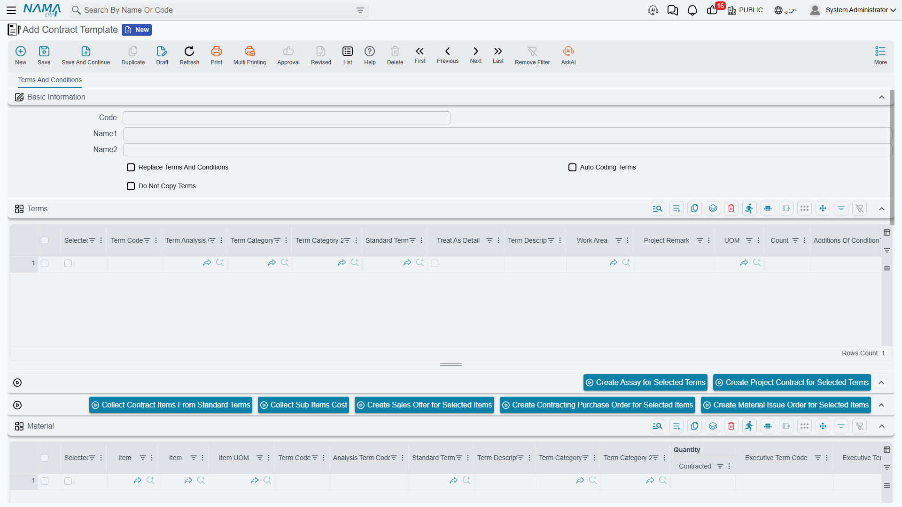

# Contract Templates

Contractors repeat themselves. A developer who builds the same villa type forty times, a fit-out
company that delivers the same floor plan, a substation contractor who wires the same kit — all of them
produce a bill of quantities that is 90% identical every time. Retyping it is slow and, worse, the
fortieth copy is never quite the same as the first.

A **contract template** (نموذج عقد مقاولات) is that bill of quantities saved once: the priced term
tree, the clauses that go with it, and the cost build-up behind the prices. Start a contract from the
template and the whole skeleton arrives priced.

There is a second reason this page matters, and it is the practical one. **The template is how terms
and conditions get onto a contract.** There is no "copy terms" button anywhere in the module. Terms
reach a contract in exactly two ways: from an [assay](/modules/contracting/project-contracting/contracting-assays.md),
or by picking a template on the contract — and picking the template is the act that triggers the copy.

- **Where to find it:** Contracting > Master Files > Contract Template
- **Licence:** `contracting`
- It is a **master file**, even though it carries document-shaped grids: no book, no value date, no
  document term.

## What a Template Holds

Everything sits on a single page, *Terms and Conditions*, and it holds six grids:

| Grid | What goes in it |
|---|---|
| **Terms** | the bill of quantities — the same term-line columns you get on a real contract: standard term, dotted term code, quantity, unit, unit cost, unit price, discounts, taxes, work area, term categories |
| **Conditions** | the clauses that always accompany this product: retention, an advance-recovery rule, a delay penalty |
| **Material** | the materials consumed, per term |
| **Workers** | the labour consumed, per term |
| **Contractors** | the packages you subcontract, per term |
| **Other Expenses** | everything else — plant hire, permits, temporary works |

The four cost grids are the template's own cost analysis. They work exactly like the four families on
a [term analysis card](/modules/contracting/setup/contracting-term-analysis-cards.md): each row names a
cost element from the direct-cost catalogue, typed as material, worker, subcontractor or other.

Three header options control what happens when the template is used:

| Option | What it does |
|---|---|
| **Replace Terms And Conditions** | on selecting the template, the target document's existing terms and conditions are cleared first, then the template's are put in. Leave it off and the template's lines are **appended** to whatever is already there |
| **Auto Coding Terms** | the template renumbers its own dotted term codes each time it is saved |
| **Do Not Copy Terms** | selecting the template copies nothing at all. Use it to retire a template without deleting it, or for a template kept only for its cost grids |

::: warning Replace Terms And Conditions overwrites the grid you are looking at
On a contract that already has a bill of quantities, picking a template whose *Replace Terms And
Conditions* option is ticked empties both the Terms and the Conditions grids before copying. Anything
typed by hand and not yet saved is gone. On a half-built contract, either leave the option off and
tidy up afterwards, or pick the template first and edit second.
:::

The template has no validation of its own. An incoherent term tree, a leaf with no price, a condition
with no value — all of it saves. The complaints arrive when the template is copied into a real
contract and that document's own rules apply. It pays to test a new template by pushing it onto a
throwaway contract once.

## Building the Template's Cost Up, and Rolling It Back Down

Two buttons make a template into a small costing engine, and they are meant to be used as a pair.

**Collect Contract Items From Standard Terms** (تجميع بنود التكلفه من البند القياسية) explodes every
term line into its ingredients. It reads each line's standard term, takes the cost recipe stored on
that term, scales it to the line's quantity, and routes each resulting row into Material, Workers,
Contractors or Other Expenses according to how the cost element is typed. The scaling respects three
things the recipe carries: the quantity the recipe was written *per* (so a recipe expressed per 100 m³
is multiplied up for a 1,200 m³ line), a waste percentage that inflates the requirement, and a
productivity factor.

**Collect Sub Items Cost** (تجميع تكلفة البنود الفرعية) does the reverse. It sums the four cost grids
by term code and writes the result back onto each term line as its total cost and unit cost.

So the working rhythm is: type the quantities → *Collect Contract Items From Standard Terms* → correct
the rates and quantities in the four cost grids where reality differs from the recipe → *Collect Sub
Items Cost* → the term lines now carry a defensible cost per unit, and the margin you add on top is a
decision rather than a guess.

Both buttons overwrite what is in the grids they fill, so run them before hand-editing rather than
after.

There are five more buttons, all of which create a new unsaved document in a pop-up from the rows you
tick:

| From the ticked rows of | Button | What opens |
|---|---|---|
| Terms | Create Assay for Selected Terms | a new [assay](/modules/contracting/project-contracting/contracting-assays.md) |
| Terms | Create Project Contract for Selected Terms | a new [project contract](/modules/contracting/project-contracting/contracting-project-contract.md) |
| the cost grids | Create Sales Offer for Selected Items | a new [contracting offer](/modules/contracting/project-contracting/contracting-offers.md) |
| the cost grids | Create Contracting Purchase Order for Selected Items | a miscellaneous contracting order — see [Miscellaneous Contracting Spend](/modules/contracting/costs/contracting-misc-spend.md) |
| the cost grids | Create Material Issue Order for Selected Items | a [project material issue](/modules/contracting/costs/contracting-project-materials.md) |

The first two are the "start the real thing from the template" route; the last three are how a
template doubles as a procurement list for a job that has been awarded.

## Selecting a Template Is What Copies the Terms

The **Contract Template** field appears on six screens, and picking it there is the mechanism:

- [Project Contract](/modules/contracting/project-contracting/contracting-project-contract.md)
- [Subcontract](/modules/contracting/contractor-contracting/contracting-contractor-contract.md)
- [Contracting Offer](/modules/contracting/project-contracting/contracting-offers.md)
- [Contracting Assay](/modules/contracting/project-contracting/contracting-assays.md)
- [Estimated Budget](/modules/contracting/budgets/contracting-estimated-budget.md)
- [Executive Budget](/modules/contracting/budgets/contracting-executive-budget.md)

What travels is the **term lines and the condition lines**, each one given a fresh identity on the
target document so the two records are independent from then on. Edit the contract afterwards and the
template is untouched; change the template later and contracts already created from it do not move.

What does *not* travel is the four cost grids. They stay on the template — but their effect travels
anyway, because *Collect Sub Items Cost* has already baked the analysed cost into the term lines'
unit cost and total cost. That is the reason to run the pair of buttons before the template goes into
service: the numbers a contract inherits are only as good as the last roll-up.

The other thing worth knowing is what the template does for you on an **assay**. Type a term code on
an assay line that also exists on the chosen template and the whole line is pulled across — the
standard term, the analysis card reference, the term categories, the status, the parent code, the
remarks, the unit cost, the quantity, both units of measure and the totals. It turns the template into
a lookup you can key against rather than a wholesale copy.

## A Standard Tower Template Applied to a New Contract

Al-Fanar's second tower is the same product as the first, so the bill of quantities for Tower A is
saved as a template.

**Template `TWR-STD` — Standard residential tower**

| Term code | Term | Type | Unit | Quantity | Unit price | Total price |
|---|---|---|---|---|---|---|
| `1` | Earthworks | Parent | — | — | — | 50,000 |
| `1.01` | Excavation | Leaf | m³ | 1,000 | 50.00 | 50,000 |
| `2` | Structure | Parent | — | — | — | 54,000 |
| `2.01` | Reinforced concrete | Leaf | m³ | 60 | 900.00 | 54,000 |
| `3` | Masonry and finishes | Parent | — | — | — | 126,000 |
| `3.01` | Blockwork | Leaf | m² | 2,000 | 46.00 | 92,000 |
| `3.02` | Plastering | Leaf | m² | 1,000 | 34.00 | 34,000 |

Conditions grid: one line — 10% retention on every extract. Header: *Auto Coding Terms* on, *Replace
Terms And Conditions* on, *Do Not Copy Terms* off.

Before it went into service, the template was costed: *Collect Contract Items From Standard Terms*
exploded the priced lines into ready-mix, reinforcement, formwork, a labour gang and the excavation
and blockwork subcontracts; the rates were corrected against the last three months of invoices; then
*Collect Sub Items Cost* wrote a cost onto every priced line — 42,000 onto term `1.01` and 44,400
onto `2.01`. Cost per m³ of concrete: 740.

Now Tower B is awarded. Create the project contract `PC-2026-002` for Al-Fanar Development, pick
project *Tower B*, then pick **Contract Template = `TWR-STD`**. On selection:

1. Both grids are cleared, because *Replace Terms And Conditions* is ticked.
2. Seven term lines arrive, coded `1`, `1.01`, `2`, `2.01`, `3`, `3.01`, `3.02`, each with its unit,
   quantity, unit price, unit cost and totals — the contract is already worth 230,000 before anybody
   has typed a number.
3. The retention condition arrives on the Conditions grid, so the 10% withholding will apply to every
   extract on the new contract without being re-keyed.

What is left to do is the part that genuinely differs: the contracting date and end date, the
quantities where Tower B is not identical, the rates you renegotiated, and the phases group. Five
minutes instead of a morning, and the cost side of every line is inherited rather than invented.

## Where to Go Next

- [Standard Terms](/modules/contracting/setup/contracting-standard-terms.md) — the cost recipe on a
  term is what *Collect Contract Items From Standard Terms* reads.
- [Term Analysis Cards](/modules/contracting/setup/contracting-term-analysis-cards.md) — the full
  version of the four cost families, and how analysed cost becomes a selling price.
- [Term Sheets](/modules/contracting/setup/contracting-term-sheets.md) — the other reusable bill of
  quantities, and how it differs from a template.
- [Contract Conditions](/modules/contracting/setup/contracting-conditions.md) — what the clauses on the
  Conditions grid actually compute.
- [Project Contracts](/modules/contracting/project-contracting/contracting-project-contract.md) — the
  document the template exists to fill.
