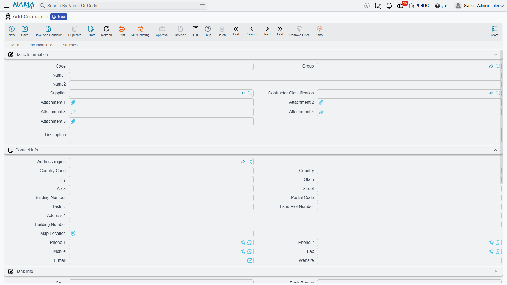
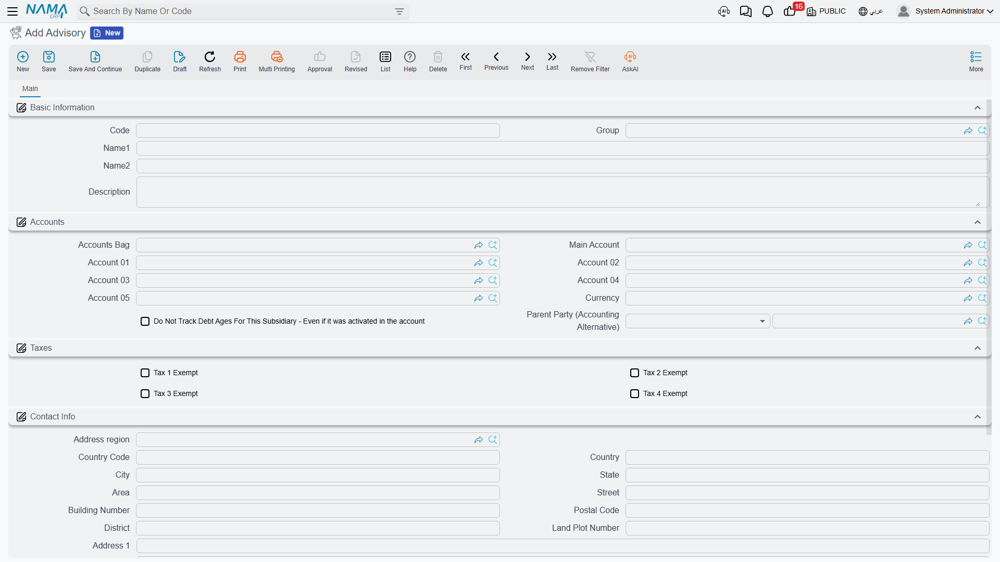

# Contractors and Consultants

Two parties stand beside the project owner on every construction job, and the module keeps a master
file for each of them.

The **subcontractor** (مقاول باطن) is who you give work to: the blockwork gang, the electrical firm,
the plant hire company. He is the party you *pay*, and he needs a full financial identity because his
balance, his retention, his advances and his deductions all have to be tracked.

The **consultant** (إستشاري) is who supervises: the engineering office that inspects, approves and
signs off on behalf of the owner. He is a name you record on the project so that reports, checklists
and letters can say who is supervising. He is not a money-bearing party in this module.

Both live under **Contracting > Master Files** and both need only the `contracting` licence.

## The Subcontractor File

- **Where to find it:** Contracting > Master Files > Contractor
- **Licence:** `contracting`
- A **master file**: code, group, names, no book and no document term.

### It Is Its Own File, and It Needs Its Own Subsidiary

A subcontractor is **not** a kind of supplier in this module. It is a standalone master file with a
**required accounting subsidiary (الذمة)** of its own — the Accounts block on the Main page, with its
accounts bag, main account, five numbered accounts and currency. The record will not save without it,
and that is deliberate: without a subsidiary there is nowhere for his extract, his advance and his
retention to land.

It *may* also point at a **Supplier**, and whether you fill that field is the one real decision on this
screen:

- **Link a supplier** when the same firm also invoices you outside contracting — he sells you material
  as well as labour, say. The supplier then acts as the accounting parent of the contractor, so
  postings can resolve to the supplier's accounts and his purchasing and contracting balances stay in
  one place. When an extract needs the payable side, it uses the contractor's own accounts if they are
  set up and falls back to the linked supplier's otherwise.
- **Leave it empty** for a pure subcontractor. His own accounts are used and his balance lives entirely
  inside contracting.

::: tip Picking the supplier fills the contact block for you
Choose a supplier and the whole contact section is copied down — telephones, mobile, fax, website,
e-mail and every part of the address. Bank details, tax registration and accounts are **not** copied,
so those still have to be filled in deliberately. That is the right split: the contact details are the
same firm's, the bank account you pay and the tax number you report are decisions of their own.
:::

### What the Screen Carries

**Main page**

| Group | What is in it |
|---|---|
| Basic Information | Code, Group, Name1 (Arabic name), Name2 (English name), Supplier, **Contractor Classification**, Attachment 1 … 5, Description |
| Contact Info | the full address block — region, country, city, state, area, street, building number, postal code, district, land plot number, two address lines and a map location — plus two telephones, mobile, fax, e-mail and website |
| Bank Info | Bank, branch, bank address, country, SWIFT code, IBAN and the intermediary bank. This is what a payment run needs |
| Accounts | the required subsidiary block described above |
| Taxes | the four "not subject to tax" flags, for a subcontractor who is exempt or zero-rated |
| Dimensions | legal entity, analysis set, branch, sector, department |

**Tax Information page** — the registration data an e-invoice needs: the unified national number, the
commercial registration number, the tax registration number, the distinguishing number, the legal form
of the company, the file number, the ID card number, the buyer identity type used by the tax authority,
and the two composite blocks for the specified tax office and the nature of the dealing. The
subcontractor can be the counterparty on an electronic invoice, and this page is where that comes from.

**Contractor Classification** (فئة مقاول باطن) is its own tiny master file under the same menu — a
code and a name, nothing more. Companies use it to band their subcontractors (Class A / Class B) or to
group them by trade. It is a reporting and searching tag: nothing in the module restricts, prices,
approves or blocks on the basis of a classification.

::: info There is no licence-expiry or insurance field on the contractor card
Readers coming from a prequalification system look for the subcontractor's trade licence expiry, his
insurance cover, his safety record. Those fields do not exist here. What you have is the five generic
attachments — put the licence and the insurance certificate there — or a screen modifier if the
company needs structured fields with dates. The module itself does no prequalification.
:::

Nothing on the contractor record is validated beyond the required subsidiary. There is no uniqueness
rule on the commercial registration, no mandatory bank account, no approval step.

### What the Subcontractor Record Then Drives

The record is the entry point for the whole cost-side chain. His name is picked on the subcontractor
offer, on the subcontract, and on every document raised against it, and the accounting sides on those
documents resolve their subsidiary to him — or to his linked supplier:

- [Subcontractor Offers](/modules/contracting/contractor-contracting/contracting-contractor-offers.md)
  — the tender he submits.
- [Subcontracts](/modules/contracting/contractor-contracting/contracting-contractor-contract.md) — the
  agreement, which like the owner contract books nothing on signature.
- [Subcontractor Extracts](/modules/contracting/contractor-contracting/contracting-contractor-extracts.md)
  — his payment application, and the only document in that chain that posts.
- [Subcontractor Advances and Other Payments](/modules/contracting/contractor-contracting/contracting-contractor-advances-and-payments.md)
  and [Subcontractor Fines](/modules/contracting/contractor-contracting/contracting-contractor-fines.md)
  — the deductions and pre-payments that reach his extract.
- [Selling Material to a Subcontractor](/modules/contracting/costs/contracting-contractor-materials.md)
  — material out of your store, charged back against him.

## The Consultant

- **Where to find it:** Contracting > Master Files > Advisory
- **Licence:** `contracting`
- A **master file**.

The English menu caption reads *Advisory*, which makes it sound like a document you raise. It is not.
It is the **consulting engineer's office** (إستشاري) as a party record, and the whole file is three
things: the master-file identity (code, Arabic name, English name, group, description, dimensions), a
**required accounting subsidiary** so that the consultant can be an account holder if you ever pay him
directly, and a **contact block** — address, telephones, e-mail.

That is genuinely all of it. There is no validation, no calculation, no accounting effect of its own,
no status and no workflow. Describe it to a new user as a short list of the consultant offices you work
with, kept so that documents can name the right one.

Where the name is then used:

| Where | Field |
|---|---|
| Contracting Project | Advisory |
| Project Contract | Advisory |
| Subcontract, Subcontractor Offer | Advisory |
| Estimated and Executive Budget | Advisory |
| Project Delivery Letter | Advisory |
| The site quality checklists | Consultant — same record, different caption |

Two of those are more than labels, and they are the two auto-fills worth knowing:

1. Pick a **project** on a contract and the project's consultant is copied onto the contract. Fill the
   consultant on the [project](/modules/contracting/setup/contracting-projects.md) once and every
   contract on that site inherits it.
2. Convert a **subcontractor offer** into a subcontract and the consultant is carried across with it.

Everywhere else the consultant is read only by people and reports: it names who signs off on the
[quality records](/modules/contracting/quality/contracting-quality-overview.md), who the submittals are
addressed to under
[Measurements, Submittals and Handover](/modules/contracting/project-contracting/contracting-measurements-and-approvals.md),
and who countersigns the handover letter. It never affects an amount, never gates an approval and never
blocks a save.

## Tower A — a Blockwork Subcontractor and a Consultant

**The consultant, registered once.**

| Field | Value |
|---|---|
| Code | `ADV-002` |
| Name1 / Name2 | مكتب الميزان الهندسي / Al-Mizan Engineering Consultants |
| Accounts | its own subsidiary, main account under professional fees |
| Contact | the office address, the supervising engineer's mobile, the e-mail submittals go to |

Named on project `PRJ-TWR-A`, so contract `PC-2026-001` picked it up automatically when the project was
chosen, and every concrete inspection and material submittal on the tower now shows Al-Mizan as the
consultant.

**The subcontractor, registered before his package is awarded.**

| Field | Value |
|---|---|
| Code | `CTR-0007` |
| Name1 / Name2 | مقاولات البنيان للمباني / Al-Bunyan Blockwork Contracting |
| Supplier | left empty — he does nothing for us but blockwork |
| Contractor Classification | Class B — masonry |
| Accounts | his own subsidiary, main account under subcontractors payable |
| Bank Info | the account the payment run will use, with its IBAN |
| Tax Information | commercial registration and tax registration number, for the e-invoice |
| Attachments | his trade licence and his insurance certificate, scanned |

Because the supplier field is empty, his subsidiary is the one the module posts to. From here his
package proceeds exactly as the owner side does but in the opposite direction: his 80,000 blockwork
subcontract `CC-0042` books nothing when signed; his first extract posts the cost and the payable;
retention is withheld and his 16,000 mobilisation advance is recovered through the conditions grid; and
when we sell him cement out of our own store, the charge comes back as a deduction on his next extract.

## Where to Go Next

- [The Subcontractor Cycle](/modules/contracting/contractor-contracting/contracting-contractor-cycle.md)
  — the whole cost-side chain, and every place it stops being a mirror of the owner side.
- [Contracting Projects](/modules/contracting/setup/contracting-projects.md) — where the consultant is
  named so that contracts inherit it.
- [Units, Tasks and Other Lookups](/modules/contracting/setup/contracting-lookups.md) — fine reasons,
  which is the lookup behind every deduction raised against a subcontractor.
