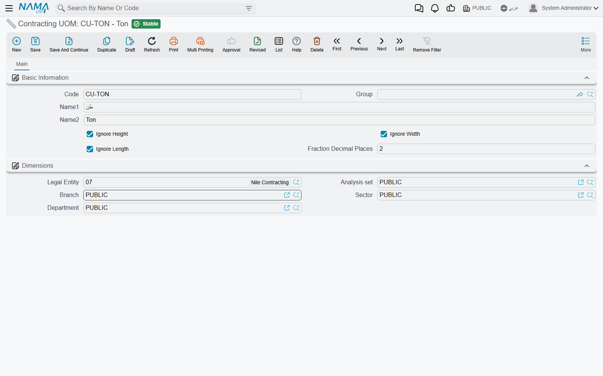

# Units, Tasks and Other Lookups

Six small master files sit under **Contracting > Master Files** and do not deserve a page each. They
are the vocabulary the bigger screens are built from: you fill them once during implementation, add to
them occasionally, and otherwise forget them. All six need only the `contracting` licence, and none of
them posts anything.

This page is a reference. Each section says what the file is, what is on it, and what reads it.

## Contracting Units of Measure

**Menu:** Contracting > Master Files > Contracting UOM · **وحدة قياس مقاولات**

The unit a term is measured in — m, m², m³, ton, number, lump sum. The module keeps its own units
rather than reusing the supply chain's because a contracting unit is a **measuring rule**, not a packing
conversion.

| Field | What it does |
|---|---|
| Code, Group, Name1, Name2 | the usual identity |
| Ignore Length, Ignore Width, Ignore Height | exclude that dimension from the quantity calculation |
| Fraction Decimal Places | the number of decimals term quantities in this unit are held and displayed to |

The three ignore switches are the whole point. A term line can be measured by typing its physical
dimensions — length, width, height and a count — and the quantity is the product of them, **skipping
every dimension the unit says to ignore**:

| Unit | Ignores | 4.0 × 2.5 × 0.2, count 6, gives |
|---|---|---|
| `M` metre | width, height | 24 |
| `M2` square metre | height | 60 |
| `M3` cubic metre | nothing | 12 |
| `NO` number | length, width, height | 6 |

So one unit definition turns a set of site measurements into the right quantity without anybody doing
arithmetic on paper. The three switches appear only when the supply chain **Measures** feature is
licensed; without it, quantity is typed directly.

*Fraction Decimal Places* governs the scale of the quantity columns on every term line — contracted
quantity, quantity from execution, quantity from extract, quantity from cost execution. Set it to 2 for
concrete and 0 for a unit counted in whole numbers, and the grids stop showing quantities like
`5.999999`.

**Read by:** every term line in the module (contract, assay, offer, budget, template, execution,
extract), through the term's unit. Note that the *material inside* a term is measured in an ordinary
supply-chain unit — the two coexist by design, one for the work, one for the stock.

## Contracting Tasks

**Menu:** Contracting > Master Files > Contracting Task · **مهمة مقاولات**

A named obligation attached to a contract: "submit shop drawings", "obtain the municipality permit",
"hand over as-built drawings". The record is a code, a group, both names, a description, and one field
that carries the meaning: **Concerned Party**, which says whether the obligation is the execution
company's or the customer's.

**Read by:** the Tasks grid on the [project contract](/modules/contracting/project-contracting/contracting-project-contract.md),
the [assay](/modules/contracting/project-contracting/contracting-assays.md) and the
[contracting offer](/modules/contracting/project-contracting/contracting-offers.md).

Be clear with users about what that grid is: an **unenforced checklist**. No document requires a task to
exist, no validation checks that a task is complete, and nothing downstream is blocked by an outstanding
one. It is a very useful place to record who owes what — a contract administrator's list of deliverables
— and it is entirely honour-based.

## Term Categories, and Term Categories 2

**Menus:** Contracting > Master Files > Term Category · **تصنيف بند مقاولة**
and Contracting > Master Files > Term Category 2 · **تصنيف بند مقاولة 2**

Two identical files — code, group, both names, description, dimensions — giving two **independent**
classification axes on a term. Nothing in the module dictates what either axis means. The convention
most companies land on is: category 1 = the trade (civil, electrical, mechanical), category 2 = the
nature of the cost (direct, indirect, provisional sum).

Unlike most lookups these two do real work in three places:

1. **Price lookup.** A [price list](/modules/contracting/setup/contracting-price-lists.md) line may be
   keyed on a category, or on a category 2, *instead of* naming a specific standard term — which is how
   you publish "all electrical work at these rates" without listing every term. A price list line must
   name at least one of the three.
2. **Re-pricing.** Changing the category on a term line re-runs the price lookup for that line, so
   correcting a misclassified line also corrects its rate.
3. **Cost reporting.** An [analysis card](/modules/contracting/setup/contracting-term-analysis-cards.md)
   stamps its header's two categories onto every cost row it produces, which is what makes cost
   reporting by trade or by cost nature possible at all.

**Read by:** term lines everywhere as *Term Category* and *Term Category 2*, analysis-card cost lines,
and price list lines as *Category* and *Category 2*.

## Contracting Fine Reasons

**Menu:** Contracting > Master Files > Contracting Fine Reason · **سبب غرامة مقاولات**

The reason behind a deduction: late delivery, failed cube test, safety violation, rework. A plain
code-and-name file with nothing else on it.

**Read by:** the line of every fine document — [project fines](/modules/contracting/project-contracting/contracting-project-fines.md)
and [subcontractor fines](/modules/contracting/contractor-contracting/contracting-contractor-fines.md) —
and the deduction lines of the [daily labour book](/modules/contracting/costs/contracting-daily-labour.md).
When a fine is processed the reason is carried onto the stored fine entry, so deductions stay analysable
by reason for the life of the project.

It is pure classification: the reason does not select an account, a percentage or a condition. Build a
short, disciplined list — a dozen reasons that management will actually report on — rather than letting
site staff invent one per incident.

## Direct-Cost Items

**Menu:** Contracting > Master Files > Contracting Direct Cost · **بند تكلفة مقاولات**

Despite the name this is a **catalogue**, not a document, and it books nothing by itself. It is the list
of chargeable cost elements a contracting business consumes but does not keep in stock: "mason day
rate", "excavator hour", "site electricity", "ready-mix C30". Think of it as the item file for things
that are not items.

| Field | What it does |
|---|---|
| Code, Group, Name1, Name2 | the usual identity |
| **Type** | **required** — Material, Worker, Contractor or Other. This is what routes the element into one of the four cost families |
| Item | an optional link to a stocked supply-chain item, for a cost element that really is a material you also keep |
| Account | the expense or cost account the element is charged to |
| Default Purchase Price | the rate that lands on a line when the element is picked |
| Tax Plan | the tax policy for lines built from it |
| Credit Side | where the credit goes: the supplier's account, a specific account, a specific subsidiary, the current user's subsidiary, or the miscellaneous purchase item's own wiring |
| Subsidiary account type, Subsidiary | the counterparty, where the credit side calls for one |
| Purchase Element | the link into the purchasing element structure |
| Unit, Standard Item Uom | the unit the element is bought and consumed in |

The **Type** field is the important one, because those four values are exactly the four cost families
that appear on every costing screen in the module — Material, Workers, Contractors, Other Expenses. A
cost element typed as *Worker* lands in the Workers grid of an analysis card; one typed as *Material*
lands in the Material grid, and may point at a real stocked item.

**Read by:**

- the four cost grids of a [term analysis card](/modules/contracting/setup/contracting-term-analysis-cards.md),
  a [contracting offer](/modules/contracting/project-contracting/contracting-offers.md) and a
  [contract template](/modules/contracting/setup/contracting-contract-templates.md) — where the planned
  cost of a term is built up;
- the lines of the [miscellaneous contracting](/modules/contracting/costs/contracting-misc-spend.md)
  request, order and invoice;
- the lines of the employee-and-equipment invoice, under
  [Employees, Equipment and Their Costs](/modules/contracting/costs/contracting-equipment-and-allocations.md).

A worked catalogue, three rows deep:

| Code | Name | Type | Unit | Default purchase price | Account | Credit side |
|---|---|---|---|---|---|---|
| `CDC-LAB-01` | Mason day rate | Worker | DAY | 120 | direct labour | supplier's account |
| `CDC-EQP-07` | Excavator hour | Other | HR | 300 | plant hire | supplier's account |
| `CDC-MAT-22` | Ready-mix concrete C30 | Material | M3 | 260 | materials | supplier's account |

Pick `CDC-EQP-07` on a miscellaneous contracting invoice line for 40 hours at 300, and 12,000 of plant
hire is charged to the project's term code — because that invoice, unlike the catalogue behind it, is a
real cost document.

## Tax Extract Terms

**Menu:** Contracting > Master Files > Contracting Tax Extract Term · **بند مستخلص ضريبي**

A tax authority will not accept an invoice listing four hundred free-text bill-of-quantities items. It
wants a handful of recognised products. A **tax extract term** is one of those products, and mapping
your terms onto them is what makes an extract reportable electronically.

| Field | What it does |
|---|---|
| Code, Group, Name1, Name2 | the usual identity |
| Tax Authority Code | the code the authority knows this product by |
| the unit-type field | the unit of measure the authority expects for it. The caption on this one is in English on both language versions of the screen |
| Tax Plan | the tax policy applied when the roll-up is priced |
| Do Not Send To Tax Authority | keep the term out of the electronic submission entirely |

An extract line finds its tax term by looking in three places, in order: the tax term named on the
extract line itself, then the one on the line's standard term, then the one on the contract's term line.
If none of them has one, what happens next is decided by an option on the extract's document term — and
that option is effectively the master switch for electronic invoicing on extracts.

The whole mechanism, including the roll-up grid that is actually submitted, is on
[Taxes on Extracts](/modules/contracting/project-contracting/contracting-extract-taxes.md). Set the
default tax term on your standard terms as you build the catalogue and the mapping never has to be
thought about again.

**Read by:** the tax detail roll-up on the [project extract](/modules/contracting/project-contracting/contracting-project-extracts.md),
and the *Contracting Tax Extract Term* field on [standard terms](/modules/contracting/setup/contracting-standard-terms.md)
and on contract term lines.
