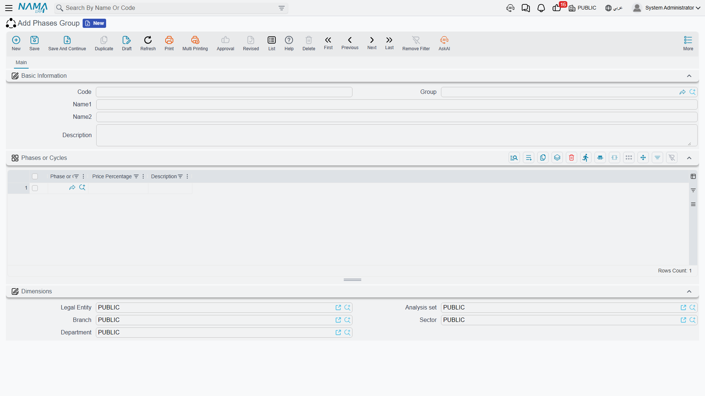
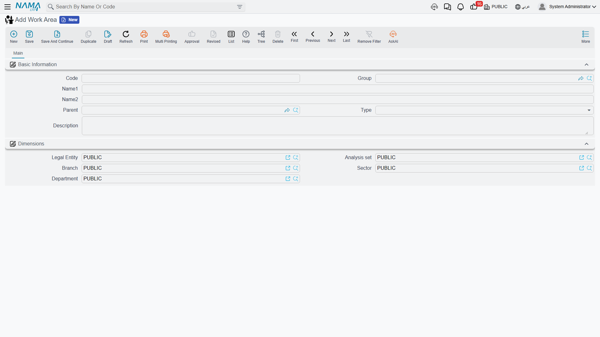

# Phases and Work Areas

A bill of quantities answers *what* work is being done. Two other questions get asked on site every
day, and neither of them is answered by the term tree: **when** in the sequence is this item of work,
and **where** on the site is it? Those are the two axes this page covers — phases and work areas.

They are genuinely independent of each other and of the term hierarchy. It is worth having the shape
in your head before reading further:

```
Contract
├── TERM tree      (البنود)      — headings and priced lines, dotted codes 1, 1.1, 1.1.1 …
│     ├── Work Area (منطقة العمل) — a pointer into a SEPARATE tree of physical locations
│     └── Phases    (المراحل)     — five flat milestone slots on the line
└── CONDITIONS     (الشروط)      — money rules, each optionally tied to a term code and a phase
```

Nothing nests inside anything else here. A term line points at *one* work area and carries *up to
five* phases; the work-area tree has its own parents and children that the term tree knows nothing
about.

## Phases — Milestones on a Line of Work

A term rarely goes from nothing to finished in one step. "Blockwork, 2,000 m²" passes through
setting-out, laying, and making good, and the owner expects to pay for each stage as it completes
rather than paying nothing until the whole item is done. A **phase** (مرحلة مقاولة) is one such
milestone.

- **Where to find it:** Contracting > Master Files > Contracting Phase
- **Licence:** `contracting`

The screen is the smallest in the module: a code, a group, an Arabic name, an English name, a
description and the usual dimensions. That is the whole record — a phase is a name and nothing more.
There is no start date, no duration, no dependency and no status. All the behaviour lives in how
phases are *used*, not in the phase itself.

### Exactly Five Slots — the Ceiling to Plan Around

Here is the single fact to take away from this page.

::: warning A term line has five phase slots, not a phase list
Five is a hard structural limit, not a default that can be raised. Each contract, assay, offer,
budget and template term line carries five fixed slots, and a phase group with six or more phases
fills only the first five — the rest simply never arrive on the line. Because the line's phase
percentages are then checked against 100%, the shortfall surfaces later as a validation failure on the
*contract*, which sends people looking in the wrong place. Design every phase group with five phases
or fewer.
:::

Each slot holds:

| On the slot | What it is for |
|---|---|
| Phase | which milestone this slot represents |
| Quantity | the quantity of the line attributed to this milestone |
| Price Percentage | the share of the line's price billed when this milestone completes |
| Payment Percentage | the share of the money payable at this milestone |
| Executed / Extracted / Cost-executed quantity | system counters, filled by executions, extracts and the cost roll-up |

The line also carries **Last Achieved Phase** (المرحلة الحالية), the progress marker. You do not type
it: extracts advance it as work passes each milestone, and cancelling an extract puts it back.

## Phase Groups — the Progress-Billing Template

Nobody types five phases onto four hundred term lines. A **phase group** (مجموعة مراحل) is a named,
weighted set of phases — "Standard build = Substructure 20%, Superstructure 40%, Blockwork 20%,
Finishes 20%" — that seeds every term line at once.

- **Where to find it:** Contracting > Master Files > Phases Group
- **Licence:** `contracting`



The screen is a basic identity block plus one grid, **Phases** (English caption *Phases or Cycles*).
Each row names a phase — required — the **Price Percentage** billed at that phase, and a description.

Two rules block a save: the grid may not be empty, and the same phase may not appear twice. Notably
the group itself does **not** check that the percentages add up to 100. That check happens later, on
the contract, where the five slots of each priced line are summed and rejected if they do not total
100% — and there is a configuration switch that relaxes it, described in
[Contracting Configuration](/modules/contracting/contracting-configuration.md). So a group weighted
20/40/20/10 saves quite happily and only bites when a contract that uses it is saved. Get the
arithmetic right in the group and the problem never arises.

### How a Group Reaches a Term Line

A group is chosen in two places: on the **contract header**, where it applies to every line, or on an
**individual term line**, which wins over the header. That is how a single contract can bill its
concrete in three stages and its finishes in five.

::: tip Pick the group on the screen, not by import
Choosing the phase group interactively on the contract fills each slot's phase, quantity **and** its
price percentage. A contract that arrives by conversion, import or web service gets the phases and the
quantities but not the percentages, and then fails the 100% check on save. If you build contracts that
way, either re-pick the group on the screen once, or type the percentages in.
:::

Phases show up in three more places worth knowing:

- **Standard terms** can carry a default phase group, so the right milestones arrive with the work.
- **Condition lines** may name a phase, which records the milestone a clause relates to. What a
  condition actually computes is covered in
  [Contract Conditions](/modules/contracting/setup/contracting-conditions.md).
- **Extracts** can be configured to show a per-phase breakdown of each billed line; that page appears
  only when the corresponding module setting is on.

## Work Areas — Where on Site

Where the phase axis is about time, the **work area** (منطقة عمل مقاولات) axis is about space. It is a
tree of physical locations: the plot, the block, the building, the unit. A contractor building a
compound uses it to say that 120 m³ of ready-mix belongs to *Block B / Building 3*, so executions,
extracts and penalties can afterwards be reported by location instead of only by item of work.

- **Where to find it:** Contracting > Master Files > Work Area
- **Licence:** `contracting`



The screen is a plain master file: Code, Group, Name1, Name2, **Parent**, **Type**, Description and
dimensions. **Parent** is what builds the tree — the module maintains the full path behind the scenes,
which is what makes "everything under Block B" queries work. A work area with no parent is perfectly
valid, so the tree may have as many roots as you have sites.

**Type** exists to keep the tree sane, and the rules it enforces are specific:

| Type | Must sit under |
|---|---|
| Square | anything, or nothing — it is the natural root |
| Block | a Square |
| Land | a Square |
| Building | a Block |
| Garage | a Building |
| Unit | a **Building** |
| Unit component | a Unit |
| Unit component branch | a Unit component |
| Floor | anything — no rule is applied |

Read that table before you design your first tree, because two entries in it surprise people. A
**Unit** must hang directly off a **Building**, so the intuitive Building → Floor → Unit chain will
not save; put the units directly under the building. **Floor** is unconstrained, which makes it useful
as a free label you can insert anywhere the site's own vocabulary needs one. Every rule is skipped
when the parent is empty or the parent has no type of its own.

::: info The work area is a reporting dimension, and only that
The work area you set on a contract term line is copied forward to the execution line, to the extract
line and to the fine line, so it travels with the work and is always available to a report or a list
view filter. But nothing in the module compares, filters, totals or prices on it: it never changes an
amount, never blocks a save, and it plays no part in price lookup. Use it freely for analysis, and do
not expect it to enforce anything.
:::

## Tower A — Four Phases and the Site Beneath Them

The tower is billed in four stages, so the phase group is:

| Phase | Price Percentage |
|---|---|
| Substructure | 20 |
| Superstructure | 40 |
| Blockwork | 20 |
| Finishes | 20 |

Four lines, adding to 100, one slot to spare — and it could as easily have been three lines or five.
Attach the group `PG-TOWER` to the header of contract `PC-2026-001` and every priced line is seeded
with those four milestones. Term `3.01` *Blockwork*, 2,000 m² at 46.00 = 92,000, therefore carries:

| Slot | Phase | Quantity | Price Percentage | Value billed at this milestone |
|---|---|---|---|---|
| 1 | Substructure | 2,000 | 20 | 18,400 |
| 2 | Superstructure | 2,000 | 40 | 36,800 |
| 3 | Blockwork | 2,000 | 20 | 18,400 |
| 4 | Finishes | 2,000 | 20 | 18,400 |
| 5 | — | — | — | — |

As the tower rises, extracts advance the line's Last Achieved Phase from Substructure to
Superstructure and onward, and the executed and extracted counters on each slot fill in behind them.

The site itself is described on the other axis, and the two have nothing to do with each other:

```
TWR-PLOT      Square           Tower A plot
└── BLK-A     Block            Block A
    └── BLD-1 Building         Tower A
        ├── U-101  Unit        Flat 101
        ├── U-102  Unit        Flat 102
        └── GRG-1  Garage      Basement garage
```

Note that the flats sit directly under the building, not under a floor — that is the Unit rule above.
Where floors matter to the site team, add them as Floor work areas under the building alongside the
units and use them as labels.

Now a term line can say *both* things at once: term `3.01` *Blockwork*, work area `BLD-1`, four phases.
The extract that bills part of it inherits both, and the resulting revenue is reportable by item of
work, by milestone and by location.

## Where to Go Next

- [Standard Terms](/modules/contracting/setup/contracting-standard-terms.md) — the term tree, the
  third and most important axis, and the default phase group that rides on a term.
- [Project Contracts](/modules/contracting/project-contracting/contracting-project-contract.md) — where
  all three axes meet on one screen.
- [Contract Conditions](/modules/contracting/setup/contracting-conditions.md) — clauses, some of which
  are tied to a phase.
- [Units, Tasks and Other Lookups](/modules/contracting/setup/contracting-lookups.md) — the rest of
  the small master files, including the two term-classification axes.
