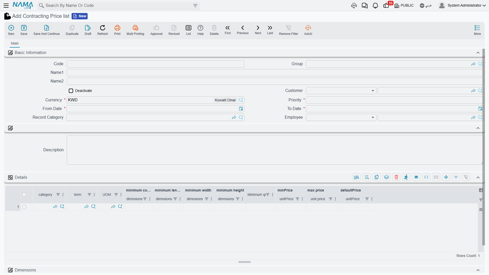

# Contracting Price Lists

Typing a unit rate onto every line of every bill of quantities is how estimating mistakes happen. A
**contracting price list** is the alternative: a dated rate card that says what your company charges
for each kind of work, for which customers, in which currency — so the rate arrives on the line by
itself.

The interesting question is not how to build one. It is *which* list wins when several of them could
apply, and the answer is short: **priority, and nothing else.**

- **Where to find it:** Contracting > Master Files > Contracting Price list
- **Licence:** `contracting`
- A **master file**.

## The Rate Card

**The header** scopes the whole list:

| Field | What it does |
|---|---|
| Code, Group, Name1, Name2 | the usual identity |
| Customer | who the list is for. It accepts either one customer or a whole customer class, so you can publish a government rate card and a private-sector one |
| Currency | required. A list prices in one currency |
| **Priority** | required. The tie-breaker when more than one list matches. The **lowest number wins** |
| From Date, To Date | both required. Outside this window the list does not exist as far as the lookup is concerned |
| Record Category | an optional extra scope, matched against the document's own record category |
| Employee | an optional restriction to a salesperson, a department, a job position or a group — so a particular team's rates apply only to their own documents |
| Deactivate | takes the list out of service. See below |

**The rate lines** are the card itself. Each line answers "what do we charge for this?", and it can be
keyed three ways: on a specific standard term, on a term category, or on the second term category.
That is deliberate — category pricing lets you publish "all civil works at these rates" without listing
every term. At least one of the three must be filled in, and the save tells you the line number if you
leave all three empty.

Reading the columns by purpose rather than by their captions, a rate line carries:

| Purpose | Columns |
|---|---|
| What is being priced | standard term, term category, term category 2, unit |
| From what size upwards | a minimum count, a minimum length, a minimum width, a minimum height and a minimum quantity — thresholds, not filters: a line applies from that size **upwards** |
| The rate | a minimum, a maximum and a **default** unit price |
| Extra keys | five free text keys and, where they are switched on, up to five sales-price classifiers |

The **default price** is the one that lands on the term line. The minimum and maximum are recorded on
the card as reference figures for your commercial team; the lookup does not police the price against
them.

::: info The English column captions on this grid are rough
Several headers on the rate-line grid are unpolished, with a couple of misspellings and a few raw field
names showing through. Read them by position and purpose using the table above — the behaviour is
exactly as described, whatever the caption says.
:::

Each standard term's own **Statistics** page carries the mirror image of this screen: a read-only list
of every price list line that mentions that term, with its dates, minimum quantity, prices and
customer. It is the quickest way to answer "what are we charging for excavation this year?".

## Publishing and Withdrawing a List

A price list is edited as a normal master file, but the lookup does not read the screen you edit. When
you save, the system projects the rate lines into a flat, heavily indexed matching table, and that is
what is queried at lookup time. Before it does so it pushes the header's dates, record category and
price classifiers down onto every line, so a line always carries its own copy of the scope it was
published under.

Two consequences follow:

- **A list takes effect when you save it**, not when you write it.
- **Ticking Deactivate withdraws the list by removing its matching rows.** It is not a soft flag the
  lookup consults — the rows are gone, so a deactivated list can never match anything. Untick it and
  save, and they are rebuilt. Deleting the list does the same thing permanently.

::: tip Duplicating a list for next year
Use the duplicate action, change the date window and the priority, adjust the rates, and save. The copy
re-points its lines at itself, so the original is untouched.
:::

## How a Price Is Found

When a term line needs a rate, the system asks the price service for one. The search runs in three
stages.

**1. Gather the candidate rows.** A matching row must satisfy all of these, and "or blank" genuinely
means blank rows are wildcards:

- its standard term is the line's standard term, **or blank**;
- its term category is the line's, **or blank** — and the same for term category 2;
- the document's value date falls inside its date window;
- its customer scope is blank, **or** it names the document's customer, the customer's class or any of
  the classifier classes on the customer, the customer's group, or the paying customer;
- its record category matches the document's, when one was supplied;
- each of the five dimensions matches exactly, or is the "no dimension" value;
- each price classifier matches, or is blank.

**2. Order by priority.** The candidates come back sorted by the priority you gave the list, lowest
number first.

**3. Narrow in memory, then take the first survivor.** A candidate is dropped when:

- its minimum count, length, width, height or quantity is **greater than** the line's — the thresholds
  are floors, so a row keyed "from 500 m³ upwards" is discarded for a 300 m³ line;
- its unit differs from the line's unit;
- one of its five text keys is filled in and differs from the line's;
- it does not apply to the employee on the document.

**The first row still standing wins.** Its default price becomes the line's unit price, and its minimum
and maximum come back alongside for reference — plus any extra amount carried by a sales-price
classifier, where a classifier on the line beats one on the document.

If nothing matches at all, nothing is written and the line keeps whatever it had.

::: info The fallback chain for a unit price
When you pick a standard term on a line, the rate is resolved in this order:

1. the price returned by the price-list lookup;
2. failing that, the standard term's **default unit price**;
3. failing that, whatever is already on the line.

Then the price before discount is worked out from the quantity, and any discount percentage on the line
is converted into a discount value.
:::

## Priority Decides — Two Overlapping Lists

This is the example to keep in mind, because the intuitive answer is the wrong one.

**List `PL-2026-A`** — the general government rate card:

- customer: the customer class *Government*; currency: the local currency
- priority: **10**; valid 1 January – 31 December 2026
- one rate line: standard term `EXC-01` (excavation), unit m³, minimum quantity 500, minimum price 78,
  maximum price 95, **default price 85**

**List `PL-2026-B`** — a rate card negotiated with one authority:

- customer: the specific customer *Riyadh Development Authority* (a member of the *Government* class)
- priority: **20**; valid 1 January – 31 December 2026
- one rate line: standard term `EXC-01`, unit m³, minimum quantity 0, **default price 92**

Now enter `EXC-01`, 1,200 m³, on a project contract for the Riyadh Development Authority dated
March 2026.

1. Both rows are candidates. `PL-2026-A` matches through the customer's class, `PL-2026-B` through the
   customer itself; both date windows cover March; both terms and units match.
2. They come back ordered by priority: `PL-2026-A` (10) first, `PL-2026-B` (20) second.
3. Both survive the threshold filter — 500 ≤ 1,200 and 0 ≤ 1,200 — and neither is dropped for unit or
   text keys.
4. **The first survivor wins: 85**, from the general list.

The customer-specific list *lost*, even though it names the customer explicitly and the general one only
names their class. There is no notion of "more specific"; there is no preference for the tighter
threshold. **Overlapping lists are resolved by priority alone.**

To make the negotiated rate win, give `PL-2026-B` a priority of **5** and re-save it. Now it sorts
first and the line is priced at 92. The working rule for a rate-card structure is therefore:

::: tip Number your priorities by how specific the list is
Reserve the low numbers for the narrow lists and the high numbers for the fallbacks — for example
customer-specific lists at 10, customer-class lists at 50, the company-wide default list at 100. Leave
gaps so you can slot a new tier in later without renumbering.
:::

And notice what the thresholds do once priority has decided. Change the quantity on that line from
1,200 to **300** and the `PL-2026-A` row is dropped — its minimum quantity of 500 is greater than 300 —
so `PL-2026-B` becomes the first survivor and the rate is 92. Quantity bands work, they just work
*within* the priority order rather than instead of it.

## Where the Lookup Fires, and Where It Does Not

The lookup runs on the documents where a rate to the customer is being struck:

- [project contracts](/modules/contracting/project-contracting/contracting-project-contract) and
  [project contract updates](/modules/contracting/project-contracting/contracting-project-contract-updates)
- [subcontracts](/modules/contracting/contractor-contracting/contracting-contractor-contract) and
  subcontract updates
- [subcontractor offers](/modules/contracting/contractor-contracting/contracting-contractor-offers)
- [contracting assays](/modules/contracting/project-contracting/contracting-assays)
- [customer offers](/modules/contracting/project-contracting/contracting-offers)
- the [estimated](/modules/contracting/budgets/contracting-estimated-budget) and
  [executive](/modules/contracting/budgets/contracting-executive-budget) budgets

On those screens it fires when you change the standard term, the term category, one of the price
classifiers, the discounted quantity, or a dimension. Two conditions have to hold or it does not bother
asking: the line must have **at least one** of a standard term, a term category or a term category 2,
and it must have a **non-zero quantity**. That second one explains most "why did no price appear?"
questions — enter the quantity first, or re-pick the term afterwards.

::: warning Term sheets are excluded
The price-list lookup does **not** run on a
[term sheet](/modules/contracting/setup/contracting-term-sheets). A rate on a term sheet line comes from
the standard term's default unit price, or from whatever the estimator types or derives from a margin.

If published rates must drive your pricing, price the work on an assay or an offer rather than on a
sheet.
:::
