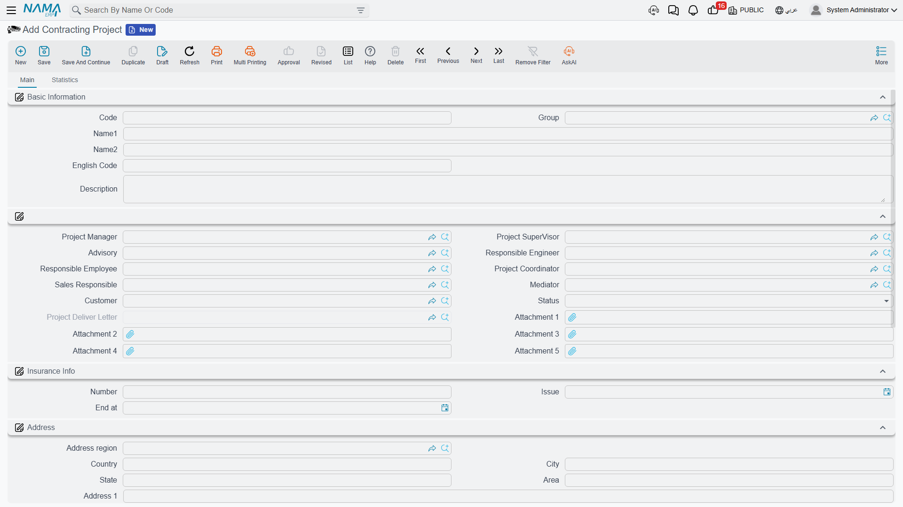

# Contracting Projects

Ask a site manager what he is working on and he will not answer "contract PC-2026-001". He will say
"Tower A". The **project** (مشروع مقاولات) is that answer written down: the site, the development, the
job everybody on it names in conversation. Everything else in the module — the offer that won the
work, the contract that governs it, the material that goes to site, the labour that builds it, the
inspection records, the extracts that get you paid — carries a reference back to one project so that
a single site can be pulled together into one picture.

It is deliberately a thin record. A project holds who is responsible, who the client is, who
supervises, where the site is, and which insurance covers it. It holds no quantities, no rates and no
money.

- **Where to find it:** Contracting > Master Files > Contracting Project
- **Licence:** `contracting`
- It is a **master file**, not a document: no book, no value date, no document term (توجيه).

## A Project Has No Accounting Life of Its Own

Creating a project posts nothing. Neither does creating a contract against it — that is the
[rule that governs the whole module](/modules/contracting/contracting-overview.md): revenue reaches
the ledger only when an extract (مستخلص) is raised. So the project record is a container and a
reporting key, not an accounting event.

That said, a project *can* be an account holder, which is a different thing and easy to confuse with
the first. The screen carries the standard **Accounts** block, so a project may be used as an
accounting subsidiary (ذمة) in its own right: give it a main account and an accounts bag and every
posting that resolves its subsidiary "from the project" lands on that project's own balance. Sites
run as separate cost and revenue centres are usually set up this way; sites that only need dimension
reporting are not.

## What the Record Carries

**Identity** — Code, Group, Name1 (Arabic name), Name2 (English name), English Code and Description.
The group tree is worth using from the start: developments, maintenance jobs and internal works
filter very differently in every list view in the module.

**The people** — this is the bulk of the screen, and it is all reference fields:

| Field | Who it names |
|---|---|
| Project Manager, Project Supervisor, Responsible Engineer, Responsible Employee, Project Coordinator | your own staff on the job |
| Sales Responsible | who owns the commercial relationship |
| Advisory | the supervising consultant — see [Contractors and Consultants](/modules/contracting/setup/contracting-contractors-and-consultants.md) |
| Customer | the project owner you will bill |
| Mediator | the broker or intermediary, where one is involved |
| Status | a descriptive state you maintain by hand |
| Attachment 1 … 5 | the site drawings, the award letter, the permit |

::: info The consultant field earns its keep on the contract
Filling **Advisory** here is not just labelling. When you later create a project contract and pick
this project on it, the project's consultant is copied onto the contract for you. It is one of only
two places the consultant is read at all, and it saves the most commonly forgotten field on the
contract screen.
:::

**Status** is a plain descriptive label — in progress, suspended, finished, and so on. Nothing in the
module reads it: it does not lock the project, does not stop documents being raised against it, and
does not drive any report logic on its own. Treat it as a filterable note that your team keeps
honest, and if you need a hard stop use the platform's *Prevent Usage* action instead.

**Insurance Info** — the policy number and its issue and expiry dates. One policy per project, which
is the normal case for a CAR or a third-party policy taken out per site.

**Address** — region, country, city, state, area, two address lines, the building number and a map
location. This is the site address, not the customer's, and it is what a driver or an inspector needs.

**Accounts and Taxes** — the subsidiary block described above, plus four "not subject to tax" flags
for the four tax slots, which matter on projects that are exempt or zero-rated.

**Dimensions** — legal entity, analysis set, branch, sector and department, as on every master file.

**Fixed Asset Creation Doc** is the one button on the screen. When a project you built is going to
stay on your own books — a head-office building, a rented tower you developed for yourself — press it
and a new, unsaved Fixed Asset Creation Document opens with one line already pointing at this project
as both the project and the subsidiary. Save the project first, because the button needs a saved
record. The document itself is described under
[Employees, Equipment and Their Costs](/modules/contracting/costs/contracting-equipment-and-allocations.md).

::: tip Nothing on this screen is required
There is no validation on a project at all: no mandatory customer, no date rules, no status
transitions, nothing that must be filled before it saves. That is convenient on day one and expensive
in month six, when half the projects have no customer and reporting by client becomes guesswork.
Decide the handful of fields your company insists on — customer, project manager, group — and enforce
them by habit or by a screen modifier, because the system will not.
:::

## One Project, Several Contracts

A project is not the same thing as a contract, and the module deliberately keeps them one-to-many. The
project is the container; a **project contract** — the priced agreement with the owner — names it, and
several contracts may name the same project. That is how you model:

- a development let in packages: enabling works under one contract, superstructure under another;
- a project with an owner contract *and* the subcontracts that deliver parts of it, all sharing one
  project;
- addenda, where a second contract is attached to the first as its main contract, giving a second
  layer of grouping.

The project's second page, **Statistics**, is where that becomes visible: a read-only list of every
project contract raised against this project, with its customer, contracting date, end date and total
price. It is the fastest answer to "what have we signed on this site?".

The full anatomy of the contract itself is in
[Project Contracts](/modules/contracting/project-contracting/contracting-project-contract.md).

## Tower A

Here is the project record that the rest of this documentation set uses.

| Field | Value |
|---|---|
| Code | `PRJ-TWR-A` |
| Name1 / Name2 | برج A / Tower A |
| Group | Residential developments |
| Customer | Al-Fanar Development |
| Project Manager | the tower's site manager |
| Advisory | Al-Mizan Engineering Consultants |
| Status | In Progress |
| Insurance | policy `CAR-2026-118`, issued 1 January 2026, expiring 31 December 2027 |
| Address | the plot address, with the map location dropped on the site gate |

Saved, it has produced no journal entry and no stock movement whatsoever. What it has produced is a
key. From this point on:

1. The **project contract** `PC-2026-001`, worth 230,000, is created against `PRJ-TWR-A`, and picking
   the project copies Al-Fanar Development and Al-Mizan onto it.
2. The **subcontract** `CC-0042` for the blockwork names the same project, so the cost of the
   blockwork and the revenue from it sit on one site.
3. Every **material issue**, **daily labour book**, **equipment allocation** and **miscellaneous
   invoice** for the tower names `PRJ-TWR-A` and a term code, which is what makes actual cost per
   item of work possible at all.
4. Every **extract** — owner side and subcontractor side — carries the project, so cash in and cash
   out are reportable against it.
5. When the tower is handed over, the **Project Delivery Letter** records the handover date and
   stamps itself back onto this project record. See
   [Measurements, Submittals and Handover](/modules/contracting/project-contracting/contracting-measurements-and-approvals.md).

## Where to Go Next

- [Standard Terms](/modules/contracting/setup/contracting-standard-terms.md) — the catalogue of work
  the contract will be built from. This is the next thing to get right.
- [Phases and Work Areas](/modules/contracting/setup/contracting-phases-and-work-areas.md) — the two
  other ways a project's work is broken down: milestones, and physical locations on site.
- [Contractors and Consultants](/modules/contracting/setup/contracting-contractors-and-consultants.md)
  — the subcontractors you will award packages to, and the consultant you just named here.
- [The Project Contracting Cycle](/modules/contracting/project-contracting/contracting-owner-cycle.md)
  — offer, contract, execution, extract, collection.
- [How Project Cost Is Built](/modules/contracting/costs/contracting-cost-model.md) — where the
  actual cost that appears against this project comes from.
