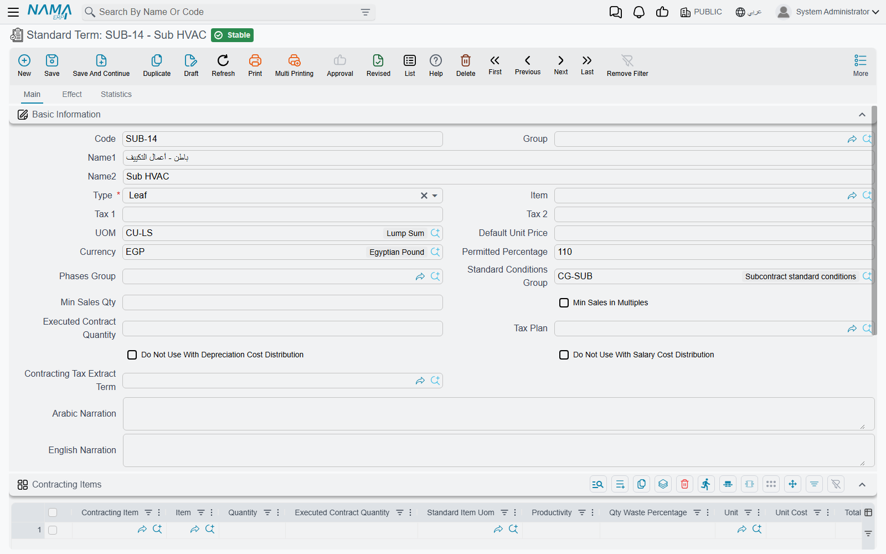
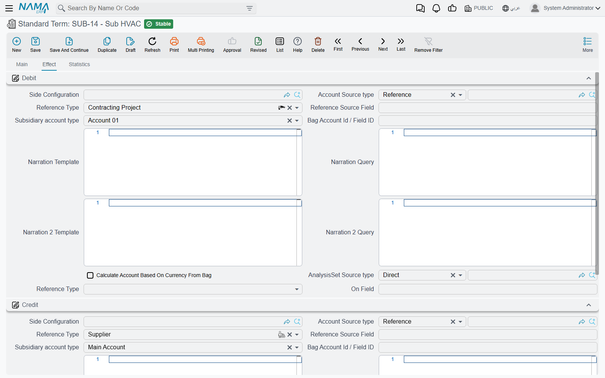
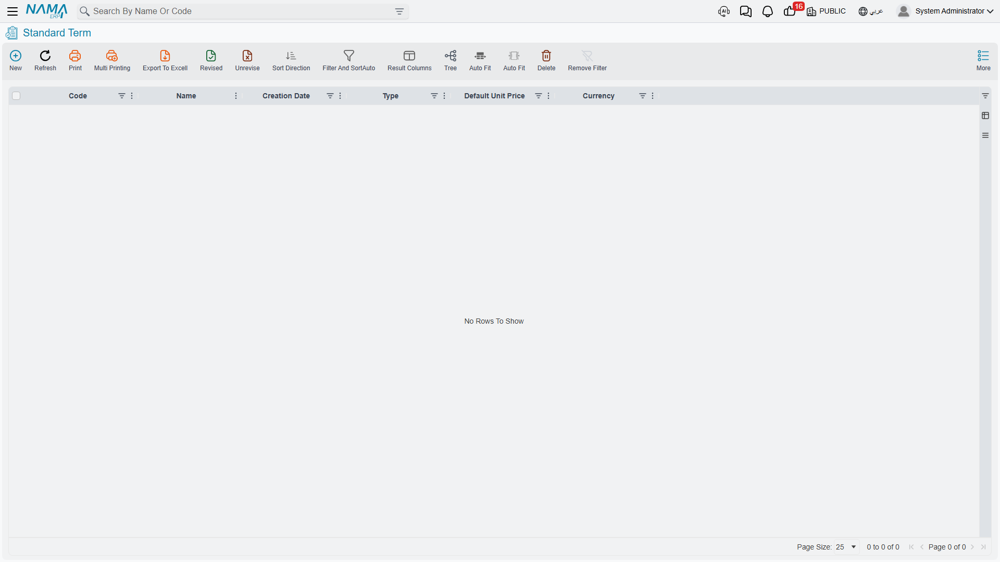

# Standard Terms

A contracting company does not sell things. It sells *work*: so many cubic metres of excavation, so
many square metres of plastering, so many linear metres of kerbstone. Each of those lines has a unit,
a quantity, a rate, and a percentage of completion that grows month by month until the line is
finished. That line is called a **term** (بند), and the whole of Nama's contracting module is built
around it.

Before you enter a single contract, you build a catalogue of the kinds of work your company does.
Each entry in that catalogue is a **standard term**. A quantity surveyor defines "Excavation in
ordinary soil" once — its unit is m³, its usual rate is 85, it attracts VAT, it costs roughly this
much per unit to deliver, and it always comes with a retention clause — and from then on every
bill of quantities, every contract, every extract and every cost report in the system refers back to
that one definition.

This page is the foundation. Term sheets, analysis cards, price lists, contracts and extracts all
lean on what you decide here.

- **Where to find it:** Contracting > Master Files > Standard Term
- **Licence:** `contracting`
- It is a **master file**, not a document: no book, no value date, no document term.

## What a Term Is, and Why It Is Not an Item

Readers arriving from the supply chain module usually try to model contracted work as items, and it
never quite fits. The two are genuinely different animals, and the module keeps them apart on
purpose:

| | A term | An item |
|---|---|---|
| What it is | work you contract to perform | material you buy, store and consume |
| Measured in | a contracting unit of measure (m, m², m³, ton, number, lump sum) | a stock unit with packing conversions |
| Moves stock? | never | always |
| Priced to | the project owner, on an extract | nobody directly; it is a cost |
| Progresses? | yes — a percentage of completion that grows over the life of the contract | no |
| Costed how? | by everything charged against its term code | by inventory valuation |

Nothing moves in a warehouse when you contract a term, and nothing is billed to a customer when you
issue an item to site. The two meet in one place: the **cost element catalogue** (Contracting >
Master Files > Contracting Direct Cost), where every ingredient of a term is registered and typed as
*material*, *worker*, *subcontractor* or *other*. A material cost element can point at a real
supply-chain item; a worker cost element cannot, because there is nothing in stock called "a
labourer". That catalogue is what the [analysis card](/modules/contracting/setup/contracting-term-analysis-cards)
uses to explode one term into the things that deliver it.

::: info Three things are called "term"
It helps enormously to keep these three apart from the first day:

1. **The standard term** — the catalogue entry described on this page. Reusable, has a code like
   `EXC-01`, defines a *kind* of work.
2. **The term sheet** — a whole priced bill of quantities saved as a reusable document. Covered in
   [Term Sheets](/modules/contracting/setup/contracting-term-sheets).
3. **The term line** — one row inside a real contract, assay, budget or extract. It points at a
   standard term, and it carries the dotted outline code (`1`, `1.1`, `2.3`) that the extract pays
   against.

So `EXC-01` is a catalogue code; `1.2` is where that catalogue entry sits in one particular bill of
quantities. Both are called codes and they are not the same thing.
:::

## The Standard Term Catalogue



The Main page holds everything a term needs in order to be picked on a bill of quantities.

**Identity and measurement**

| Field | What it does |
|---|---|
| Code, Group, Name1, Name2 | the usual master-file identity. Name1 is the Arabic name, Name2 the English one |
| Type | Parent or Leaf — see [Parent and Leaf Terms](#Parent-and-Leaf-Terms) below. New terms start as Parent |
| UOM | the contracting unit the work is measured in |
| Default Unit Price | the rate that lands on a term line when no price list matches |
| Currency | defaults to the currency of the company you are working in |
| Item | an optional link to a supply-chain item, for the rare term that maps one-to-one onto something sellable |

**Commercial defaults**

| Field | What it does |
|---|---|
| Tax 1, Tax 2 | the sales-tax percentages copied onto every term line. Neither may be negative or above 100 |
| Tax Plan | the tax policy applied to lines built from this term |
| Contracting Tax Extract Term | the tax-authority-facing product this term is reported as. See [Taxes on Extracts](/modules/contracting/project-contracting/contracting-extract-taxes) |
| Permitted Percentage | how much over the contracted quantity site may execute before the system objects. Only meaningful on a leaf term, and switched off on a parent |
| Min Sales Qty, Min Sales in Multiples | selling constraints on the quantity |
| Phases Group | the default set of milestones for lines built from this term. Cleared and switched off on a parent |
| Standard Conditions Group | pick a bundle and the term's Conditions grid is filled from it |

**Cost attribution switches**

Two checkboxes decide whether this kind of work is allowed to absorb overhead that is spread across
a project: *Do Not Use With Depreciation Cost Distribution* and *Do Not Use With Salary Cost
Distribution*. Tick them on terms that should carry only their own direct cost — a supply-only term,
for example, has no business absorbing a share of the site crane's depreciation.

**The cost recipe — the Contracting Items grid**

This grid is the standard term's answer to "what does one unit of this cost us?". Each row names a
cost element, the quantity of it consumed, its unit, and its unit and total cost. Picking a cost
element fills the unit and the cost from the element's own default purchase price, and quantity, unit
cost and total cost stay in step with each other as you type.

The quantities are not "per unit" unless you say so. The header field **Executed Contract Quantity**
declares the term quantity that the recipe is expressed *per*, and it is stamped onto every recipe
row when you save. Write the recipe for 100 m³ and set Executed Contract Quantity to 100, and a
contract line for 1,200 m³ will scale it up twelvefold when an analysis card explodes it.

::: warning A leaf term cannot be saved without a recipe
This is the rule that surprises everybody on their first day. Save a term whose Type is **Leaf**
with an empty Contracting Items grid and the save is refused. Parent terms are exempt, because they
never carry cost. If you genuinely do not know the recipe yet, enter one placeholder row for the
dominant cost element and correct it later.
:::

**The Conditions grid**

Clauses that always ride with this kind of work — retention, an insurance deduction, a performance
bonus — are listed here, and every bill of quantities built from the term inherits them. Each row
names a standard condition and repeats its value and value type so you can vary them for this
particular term. Pick a condition and those figures are copied down for you; for a text-only clause
the value columns are switched off and the clause's explanatory text is copied instead, and the
completion percentage is available only for a clause that fires at a given percentage of completion.
The clauses themselves are defined in
[Contract Conditions](/modules/contracting/setup/contracting-conditions).

Rather than key the same five clauses onto forty terms, define a **conditions group** once and pick
it in the header. There is also a list-view action that re-applies each selected term's conditions
group over its Conditions grid — useful after you change a group and want the change to reach the
terms that use it. Terms with no group are skipped, and the rows are replaced rather than merged.

## Parent and Leaf Terms

A bill of quantities is a tree. "Earthworks" is a heading; "Excavation in ordinary soil" is a priced
line underneath it. The **Type** field on the standard term is what decides which of the two a line
becomes:

- A **Leaf** carries the money. Quantity, unit, unit cost, total cost, unit price, total price,
  discount, taxes and tolerance are all editable on a leaf line.
- A **Parent** carries nothing of its own. Every one of those columns is switched off on a parent
  line, and the system fills the parent's cost and price totals by adding up its children. Quantity
  is deliberately *not* rolled up — a parent that groups square metres and cubic metres has no
  meaningful quantity, so the column stays empty.

Because the type lives on the standard term rather than on the line, one catalogue entry is always a
heading and another is always a priced line. The escape hatch is the **Treat As Detail** checkbox on
the line itself: tick it and a term whose catalogue type is Parent behaves as a leaf just this once.

**Dotted outline codes.** Term codes are outline codes — `1`, `1.1`, `1.1.1`, `1.2`, `2` — and the
system generates them for you every time a document with terms is saved. Two buttons on the term
grids let you regenerate them on demand: one renumbers everything, the other fills only the codes
that are still blank, which is what you want after inserting rows into a numbered sheet.

Two per-line fields let you override the outline without dragging rows around. **Manual level**
forces a line to a particular depth. **Manual parent term code** is the more useful of the two: type
`2.3` on a line and the line is physically moved to sit after the last descendant of term `2.3`, the
field is cleared, and the whole sheet is renumbered. It is the "file this line under that heading"
gesture.

::: info The switch that changes how parents are derived
How the system works out which parent a line belongs to depends on one setting in
[Contracting Configuration](/modules/contracting/contracting-configuration), *Calculate Parent Term
Based On Term Codes*:

- **Off** (the default) — **row order is the hierarchy.** The system walks the grid from top to
  bottom: a leaf after a heading descends a level, a heading after a leaf closes the previous group.
  Move a row and you have re-parented it.
- **On** — **the dotted code is the hierarchy.** A line coded `2.3.1` is filed under the nearest
  heading above it whose code is a prefix of its own. Row order no longer matters; the code does.

Pick one and stay with it. Teams that hand-code their bills of quantities want it on; teams that
build sheets by inserting rows want it off. Automatic coding itself can also be switched off
module-wide, or for named document types only, from the same configuration screen.
:::

**The worked example carried through these pages.** A small catalogue, five leaves under three
headings:

| Catalogue code | Name | Type | Unit | Default unit price |
|---|---|---|---|---|
| `ERT-00` | Earthworks | Parent | — | — |
| `CLR-01` | Site clearance | Leaf | m² | 12 |
| `EXC-01` | Excavation in ordinary soil | Leaf | m³ | 85 |
| `STR-00` | Structure | Parent | — | — |
| `PC-01` | Plain concrete | Leaf | m³ | 420 |
| `BLK-20` | Blockwork, 200 mm | Leaf | m² | 78 |
| `FIN-00` | Finishes | Parent | — | — |
| `PLS-01` | Internal plastering | Leaf | m² | 28 |

Put onto a bill of quantities, those eight catalogue entries produce this outline:

```
1        Earthworks              (heading — totals only)
1.1      Site clearance          m²   2,000 @ 12  =  24,000
1.2      Excavation              m³   1,200 @ 85  = 102,000
2        Structure               (heading — totals only)
2.1      Plain concrete          m³     300 @ 420 = 126,000
2.2      Blockwork, 200 mm       m²   3,400 @ 78  = 265,200
3        Finishes                (heading — totals only)
3.1      Internal plastering     m²   6,000 @ 28  = 168,000
```

Line `1` shows 126,000, line `2` shows 391,200 and line `3` shows 168,000, all of them added up from
their children. Those dotted codes are the identifiers that executions, extracts, analysis cards,
material issues and cost documents will all quote for the rest of the project's life.

## Accounts on a Term

Here is the link between this quiet master file and the general ledger, and it is the single most
important thing on the screen.

**Signing a contract books nothing.** Not a line. Revenue reaches the ledger only when an extract
(مستخلص) is raised against the contract — and the accounts that extract books to are the **Debit**
and **Credit** account settings on the Effect page of the standard term behind each billed line.



Each of the two sides is configured the same way any accounting side is configured in Nama: you name
the source the account is taken from — a fixed account, the customer's receivable account, the
project's subsidiary, and so on — and the extract resolves it at processing time. Both sides are
required, so a term with only one side filled in is an accident waiting to happen; and the sources
that make sense here are the ones an extract can actually resolve, because it is the extract that
does the resolving.

A few consequences worth stating plainly:

- **One term, one revenue treatment.** If site work and supply-only work must land in different
  revenue accounts, they must be different standard terms. There is nowhere else on the chain to
  make that distinction.
- **Extract document terms supply the surrounding accounts.** Taxes, discounts, retention, actual
  cost and cost variance are configured on the extract's document term (توجيه), not here. See
  [Extract Document Terms](/modules/contracting/document-terms/contracting-terms-extracts).
- **Conditions can override.** A retention or a penalty carries its own pair of accounts on the
  condition record, and when it does those win for that amount. When it does not, the amount lands on
  the extract's own sides instead — as a negative for a deduction. That mechanism is explained under
  [Contract Conditions](/modules/contracting/setup/contracting-conditions).
- **A wrong or unresolvable account shows up late.** The extract saves happily; it is the background
  business request that fails. Power users find it in the Business Requests list view, fix the term,
  and use More > Reprocess. Nothing is lost.

## Where a Term Goes Next

Every term line anywhere in the module is required to point at a standard term, which makes this
catalogue the spine of the whole module. Choosing a standard term on a line copies the unit, both tax
percentages, the permitted percentage and the default unit price onto the line, and sets its parent
or leaf behaviour.

From here, the natural reading order is:

- [Term Sheets](/modules/contracting/setup/contracting-term-sheets) — assemble the catalogue into a
  priced bill of quantities.
- [Term Analysis Cards](/modules/contracting/setup/contracting-term-analysis-cards) — cost one term
  properly, and let that cost drive the selling price.
- [Contract Conditions](/modules/contracting/setup/contracting-conditions) — retention, advance
  recovery, penalties and bonuses.
- [Contracting Price Lists](/modules/contracting/setup/contracting-price-lists) — publish rates
  instead of typing them.
- [Contract Templates](/modules/contracting/setup/contracting-contract-templates) — the practical way
  a whole bill of quantities reaches a contract.



The list view is where day-to-day catalogue maintenance happens: filter by group or unit, select a
batch of terms, and use the More menu to re-apply their conditions groups.
