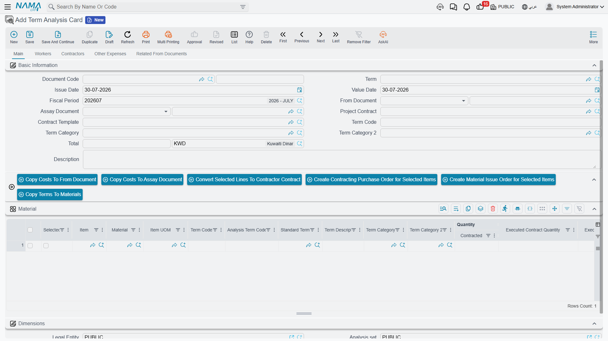
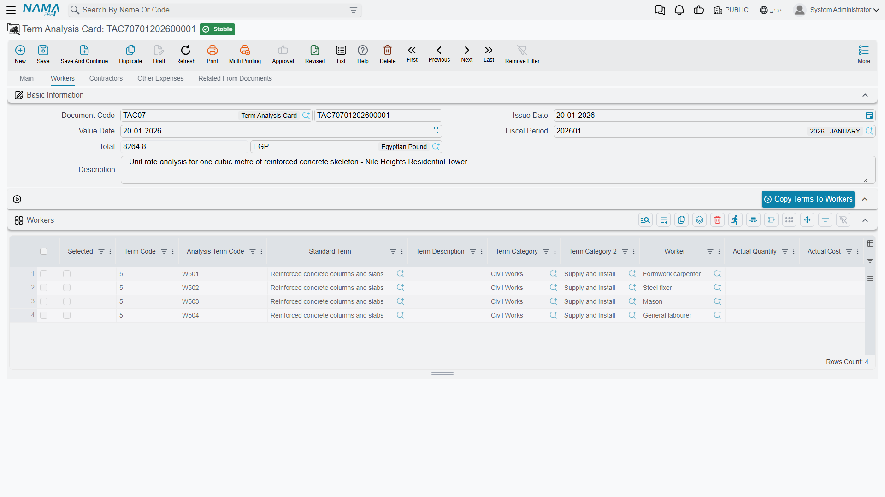

# Term Analysis Cards

A term line says *"plain concrete, 300 m³, 420 each"*. The analysis card answers the question that
decides whether the job is worth taking: **and what will it cost us?**

The card takes one term and explodes it into the four families of cost that deliver it — raw
materials, your own labour, subcontracted work, and other expenses. Add them up and you have the term's
cost. Divide by the quantity and you have its unit cost. Declare a margin and you have your selling
price. That is why this document sits at the centre of estimating rather than off to one side: **the
analysis card is ultimately what drives the price you quote.**

And it earns its keep twice. The same card is where the *actual* cost incurred on site is collected
back, line by line, against the estimate — so the card you built to win the job becomes the card you
manage it with.

- **Where to find it:** Contracting > Project Contracting > Term Analysis Card
- **Licence:** `contracting`
- It is a document with a book, a code and a document term, but it has **no accounting effect** — the
  card never books anything. It informs costs on other documents.

## One Card, One Term



The header says which term is being analysed and in whose context:

| Field | What it does |
|---|---|
| Document code, document term, issue date, value date, period | the usual document header |
| **From Document** | the source bill of quantities — a term sheet, an assay, a project contract or a customer offer. It supplies the list of term codes you are allowed to analyse, and it can fill the cost grids for you |
| **Assay Document** | the priced document the card belongs to. Filled from the From Document when you leave it empty |
| Project Contract | derived for you: the assay document itself if it is a contract, otherwise the contract that was created from it |
| Contract Template | choosing one copies the template's four cost grids into the card |
| **Term Code** | the term this card analyses. One card, one term |
| Term Category, Term Category 2 | the two classification axes, stamped down onto every cost line so that cost reporting by trade or by cost nature becomes possible |
| Total | the sum of all four grids, calculated for you |

A term with a serious build-up gets its own card. A trivial term does not need one — you can type a
unit cost straight onto the bill of quantities.

## The Four Cost Families

The card has one page per family, and they are all the same shape:

| Page | What belongs there |
|---|---|
| Main | **Material** — cement, blocks, rebar, everything you buy and consume |
| Workers | your **own labour** — the crew, in hours or days |
| Contractors | work you **subcontract**, with the subcontractor named on the line |
| Other Expenses | everything else — plant hire, permits, curing water, consumables |



Which page a cost element belongs on is not your decision at data-entry time — it is decided by the
element's own kind in the cost catalogue. A cost element typed *material* can only be picked in the
Material grid, a *worker* element only in Workers, and so on. Register your cost elements once, with
the right kind, and the card sorts itself out. See
[Units, Tasks and Other Lookups](/modules/contracting/setup/contracting-lookups).

The columns are identical on all four grids: a selection tick, the term code and the analysis term
code, the standard term and its description, the two categories, the cost element, quantity,
productivity, waste percentage, unit cost and total cost, a free description — plus the read-only
actual quantity, actual cost and ordered quantity that fill in later. The Material grid adds the
supply-chain item, its unit, and the item's colour, size and revision where those are used.

The arithmetic is the simplest in the module: **total cost = quantity × unit cost** on every line, and
the header total is the sum of all four grids.

::: info One grid or four?
There is a configuration option that replaces the four pages with a single grid, for teams who prefer
to key everything in one place. If your database has it on, you will see one combined grid instead of
four tabs; on save the rows are split back into the four families by the kind of each cost element.
The four families remain the system of record either way.
:::

## Analysis Term Codes

Every cost line gets its own code, generated automatically: a **letter for the family**, then the
**term code**, then a **two-digit sequence**.

| Family | Prefix | Example on term `2.1` |
|---|---|---|
| Material | `M` | `M2.101`, `M2.102`, `M2.103` |
| Workers | `W` | `W2.101` |
| Contractors | `C` | `C2.101` |
| Other Expenses | `O` | `O2.101` |

Four things are worth knowing about them:

- They are generated only once the card knows its contract or assay — a card floating free of any
  priced document gets none.
- The sequence continues **across all the other cards of the same contract**, so the codes are unique
  per contract, not per card. Two cards on the same contract will never collide.
- A code you typed yourself is never overwritten.
- Duplicating a card clears them, so the copy gets a fresh set.
- Automatic coding can be switched off from
  [Contracting Configuration](/modules/contracting/contracting-configuration) if your organisation
  codes cost lines by its own scheme.

**Why this matters far beyond the card.** The analysis term code is the key that *actual cost is
collected against*. When a material issue, a subcontractor extract, a labour book or a purchase
invoice charges money to the project, the line quotes an analysis term code, and that is how the
figure finds its way back to the estimate row it belongs to. Get the codes right and you get a
line-by-line estimate-versus-actual comparison for free. Leave them blank and the cost still reaches
the project — but only at term level, not at cost-element level.

## Filling the Card Automatically

Keying a card by hand is the exception, not the rule. Three mechanisms fill it for you.

**1. Choosing the From Document explodes the standard recipe.** This is the big one. Every leaf term
on the source document points at a standard term, and every standard term carries a cost recipe (see
[Standard Terms](/modules/contracting/setup/contracting-standard-terms)). Pick the From Document and
the system walks those recipes and creates one cost line per recipe row, in the right family, with the
quantity scaled to the contracted quantity:

```
line quantity = term quantity ÷ recipe's executed contract quantity
                × (1 + waste percentage ÷ 100)
                × productivity
```

::: tip Scaling in practice
Standard term `EXC-01`, measured in m³, has its recipe written per 100 m³ and one row: *excavator
hours, quantity 8*, no waste, productivity 1. A contract term line for 1,200 m³ therefore explodes to
1,200 ÷ 100 × 8 = **96 excavator hours**. At a unit cost of 300 that row costs 28,800.
:::

If the source contract was itself created from a customer offer, the offer's own cost grids are copied
first, so nothing an estimator already did is lost. The explosion can be switched off on the card's
document term for organisations that always cost by hand — see
[Other Contracting Document Terms](/modules/contracting/document-terms/contracting-terms-other).

**2. The four seeding buttons.** *Copy Terms To Materials*, *…To Workers*, *…To Contractors* and
*…To Expenses* each seed the corresponding grid with **one row per leaf term** of the source document,
carrying the term code, the category, the standard term and the description across. They give you the
skeleton to cost, without any recipe. They work when the source is a term sheet, an assay or a project
contract.

**3. A contract template.** Choosing a contract template on the card copies its four cost grids in
wholesale — the fastest route when you build the same product repeatedly.

## From Analysed Cost to Selling Price

This is the payoff, and it works by pushing the cost back onto the document you analysed.

Two actions do it: one pushes the costs onto the **From Document**, the other onto the **Assay
Document**. There is a third entry point on the assay itself. Whichever you use, the mechanism is the
same:

1. Every **committed** analysis card that points at the target document is gathered — not just the
   card you are standing on.
2. All their cost lines, from all four families, are pooled and **grouped by term code**.
3. For each term code, the target document's term line is updated: **total cost** becomes the summed
   cost, and **unit cost** becomes that total divided by the line's quantity.
4. The target document is saved and committed for you.

If a card carries a term code the target document does not have, you are told which code could not be
matched, and nothing silently disappears.

And then the margin does its work. Because a term sheet or an assay derives the unit price from the
unit cost and the profit percentage, the number your analysis produced becomes the number your
customer sees.

::: tip One cubic metre of plain concrete, costed and then priced
Term `2.1` on the villa sheet: plain concrete, 300 m³. Analysed per cubic metre:

| Family | Cost element | Quantity | Unit cost | Cost |
|---|---|---|---|---|
| Material | Cement | 0.35 t | 600 | 210 |
| Material | Sand | 0.50 m³ | 40 | 20 |
| Material | Coarse aggregate | 0.80 m³ | 50 | 40 |
| Workers | Concrete gang | 1.20 h | 25 | 30 |
| Contractors | Pumping and placing | 1.00 m³ | 35 | 35 |
| Other Expenses | Curing and consumables | 1.00 | 15 | 15 |
| | | | **Total per m³** | **350** |

On the real card the quantities are for the whole term, so they are these figures multiplied by 300 —
105 t of cement, 150 m³ of sand, 240 m³ of aggregate, 360 gang-hours, 300 m³ of pumping — and the card
header totals **105,000**. Pushing that back onto term `2.1` sets total cost 105,000 and unit cost
105,000 ÷ 300 = **350**.

Now the margin: a profit percentage of 20% on the sheet turns a unit cost of 350 into a unit price of
**420** — exactly the rate the villa sheet quotes. The cost analysis produced the price; nobody typed
it.
:::

## Actual Cost Against the Estimate

Once the job is running, cost documents start charging money to the project, each line quoting an
analysis term code. Those charges are matched back onto the card's own lines and aggregated into three
read-only columns:

| Column | What it holds |
|---|---|
| Actual Quantity | how much of this cost element has actually been consumed |
| Actual Cost | what it actually cost |
| Purchase Order Quantity | how much has been *ordered* but not yet consumed |

The card also keeps an available quantity — the estimated quantity less the actual — which is your
remaining budget for that cost element. And the **Related From Documents** page carries a read-only
list of every actual-cost entry raised against the card, showing the analysis term code, the term
code, the contract, the originating document, and the quantity and cost it contributed. It is the
audit trail from an estimate row to the material issue or subcontractor extract that consumed it.

Which documents contribute, and which surprisingly do not, is set out in
[How Project Cost Is Built](/modules/contracting/costs/contracting-cost-model). The document that
converts the pooled cost into an actual unit cost per term is
[Cost Execution](/modules/contracting/costs/contracting-cost-execution) — which is where you compare
the 350 you estimated with the figure site actually achieved.

## Turning Analysis Lines into Real Documents

An analysed cost line is a purchasing instruction waiting to happen, and the card knows it. Tick the
**selection** column on rows across any of the four grids and three actions become useful:

- **Convert the selected lines to a subcontract** — the natural move for rows in the Contractors grid.
- **Create a contracting purchase order for the selected lines** — for material and expense rows.
- **Create a material issue order for the selected lines** — for material already in stock.

Each opens the new document for you to review before saving. With nothing ticked, you are simply asked
to select some rows.

## What Blocks a Save

- **All four grids empty.** A card must analyse something.
- **Every line needs a term code**, and it must be one of the terms of the From Document — unless the
  configuration option that allows a card without an assay or contract is on.
- **Analysis term codes must be unique within the card.**
- **A colour, size or revision typed on a material line must actually exist on that item**, and the
  message names the line.

Get those right and the card becomes the one place where estimate and reality sit side by side for the
life of the term.
