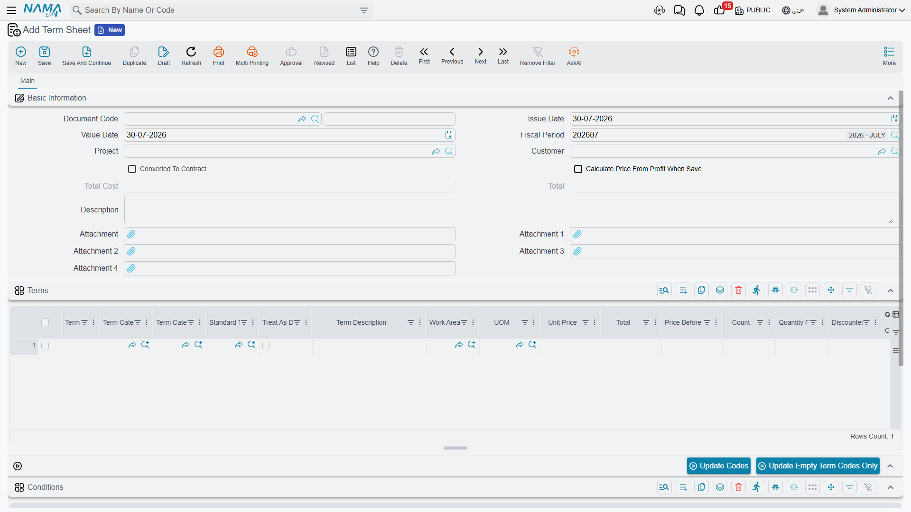

# Term Sheets

A term sheet is a **bill of quantities saved as a document**. Not a contract, not an offer — a
working sheet where the estimating department measures quantities, builds up cost, adds a margin and
arrives at a selling price, weeks before anybody signs anything. Build one for "Villa type A" and you
can reuse it for the next twenty villas.

It is the natural next step after
[Standard Terms](/modules/contracting/setup/contracting-standard-terms): the catalogue gives you the
vocabulary, the sheet is the first place you write a sentence with it.

- **Where to find it:** Contracting > Project Contracting > Term Sheet
- **Licence:** `contracting`
- It is a document — it has a book and a code, an issue date, a value date and a fiscal period — but
  it has **no document term and no accounting effect at all**. Committing a term sheet moves no money
  and touches no stock.

## Anatomy of a Sheet



Everything lives on one page.

**The header** carries the book and code, the issue date, the value date and the period; the
**Project** and the **Customer** the sheet was priced for; a *Calculate Price From Profit When Save*
switch; and the two calculated totals, total cost and total price. There is also a marker showing
whether the sheet has already been converted into a contract, kept by the system, plus remarks and up
to four attachments for the drawings the quantities were taken off.

**The Terms grid** is the sheet. Reading its columns left to right, they fall into five families:

| Family | Columns |
|---|---|
| Identification | term code, term category, term category 2, standard term, treat as detail, term description, work area |
| Measurement | unit, count, length, width, height, quantity from dimensions, discounted quantity, quantity |
| Cost | unit cost, total cost before additional, additional costs, total cost |
| Price and margin | unit price, price before discount, discount, profit percentage, profit, total price |
| Housekeeping | attachment, and a note of the document the row was copied from |

The length, width and height columns appear only when the module is configured to show dimension
columns on contracts, extracts and executions.

**The Conditions grid** lists the clauses attached to the sheet — retention, an advance recovery
schedule, a penalty — each optionally tied to one term code and one phase, with its value, value type
and completion percentage. They do nothing on the sheet itself; they are carried forward when the
sheet is picked up by an assay and eventually a contract, which is where they start moving money. See
[Contract Conditions](/modules/contracting/setup/contracting-conditions).

**Two buttons** sit above the terms grid. One regenerates every term code in the sheet; the other
fills only the codes that are still blank, which is what you want after inserting rows into a sheet
that is already numbered.

## Measuring Quantity from Dimensions

Most quantity surveying is not typing a number, it is multiplying a set of dimensions and subtracting
the openings. The sheet does that for you.

Fill in **count**, **length**, **width** and **height** on a line, and the moment you leave any of
them the system:

1. works out the count from the quantity and the dimensions you have already typed, unless the module
   is configured not to;
2. multiplies count by length by width by height — treating each factor you left empty as 1 — and puts
   the answer in **quantity from dimensions**;
3. subtracts **discounted quantity** from it and puts the result in **quantity**;
4. recalculates the cost and the price of the line from the new quantity.

Which dimensions take part is a property of the **unit**, not of the line. A contracting unit of
measure carries three *ignore* flags, so a unit of m² ignores height, m³ ignores nothing, and a unit
of "number" ignores all three so the quantity is simply the count. See
[Units, Tasks and Other Lookups](/modules/contracting/setup/contracting-lookups).

::: tip A wall, measured
A wall term measured in m², on a unit with *ignore height* ticked. Length 6, width 3, count 4:

- quantity from dimensions = 4 × 6 × 3 = **72**
- discounted quantity = 2 (a door opening) → quantity = **70**
- unit cost 55 → total cost before additional = 3,850; additional costs 150 → total cost = **4,000**
- profit percentage 20% with *Calculate Price From Profit When Save* → unit price ≈ **68.57**, total
  price = **4,800**

The discounted quantity column is where openings, deductions and "measured but not chargeable"
allowances go. It is subtracted, never added.
:::

## From Cost to Price

The arithmetic on a term line is small and worth knowing by heart, because the same four formulas
appear on the assay, the contract and the extract:

```
total cost before additional  = quantity × unit cost
total cost                    = total cost before additional + additional costs
price before discount         = quantity × unit price
total price                   = price before discount − discount value
```

The relationships work in both directions, which is what makes the grid pleasant to use. Type a total
cost and the unit cost is back-solved from the quantity. Type a unit price on a line with no quantity
and the quantity is back-solved from the price. Type a discount percentage and the discount value is
worked out from the price before discount.

**The margin.** Enter a **profit percentage** on a line and tick *Calculate Price From Profit When
Save* in the header, and the sheet derives the unit price from the unit cost when you save, rather
than the other way round. This is the estimator's normal way of working: get the cost right, declare
the margin, let the price fall out. It is also the mechanism that makes the
[analysis card](/modules/contracting/setup/contracting-term-analysis-cards) so consequential — the
card pushes an analysed cost onto the term, and the margin turns it into the price you quote.

When you commit, the sheet tidies itself up in a fixed order: term codes and the parent/leaf
structure are regenerated, quantities are re-derived from the dimensions, the price is recalculated
from the margin if you asked for that, the tax percentages are applied to each line, and finally the
header totals are added up — **from the leaf lines only**, so headings never double-count.

**A twelve-line villa sheet.** Two of these lines were measured from dimensions rather than typed:
blockwork (count 20, length 6.0, width 4.0 → 480, less 10 for openings = 470) and internal plastering
(count 44, length 5.0, width 4.0 → 880, less 20 = 860).

| Code | Description | Unit | Quantity | Unit price | Total price |
|---|---|---|---|---|---|
| `1` | Earthworks | | | | **20,100** |
| `1.1` | Site clearance | m² | 400 | 12 | 4,800 |
| `1.2` | Excavation | m³ | 180 | 85 | 15,300 |
| `2` | Structure | | | | **161,030** |
| `2.1` | Plain concrete | m³ | 36 | 420 | 15,120 |
| `2.2` | Reinforced concrete | m³ | 95 | 1,150 | 109,250 |
| `2.3` | Blockwork, 200 mm | m² | 470 | 78 | 36,660 |
| `3` | Finishes | | | | **91,000** |
| `3.1` | Internal plastering | m² | 860 | 28 | 24,080 |
| `3.2` | Ceramic floor tiling | m² | 240 | 95 | 22,800 |
| `3.3` | Painting | m² | 860 | 22 | 18,920 |
| `3.4` | Aluminium windows | No. | 18 | 1,400 | 25,200 |

Sheet total: **272,130**. The three heading lines carry no quantity and no rate of their own; their
totals are the sum of the leaves beneath them.

## Term Sheets Do Not Use Price Lists

State this to your estimators before they hunt for the reason their published rates are not appearing:
**the price-list lookup does not run on a term sheet.** Price lists fire on contracts and contract
updates, on subcontracts and subcontractor offers, on assays, on customer offers and on both budgets
— but not here.

On a term sheet, the unit price on a new line comes from the standard term's default unit price, and
after that from whatever you type or whatever the margin calculation derives. If you need published
rates to drive your pricing, build the priced document as a
[contracting assay](/modules/contracting/project-contracting/contracting-assays) or an
[offer](/modules/contracting/project-contracting/contracting-offers) rather than a sheet, or accept
that the sheet is where you price by hand. See
[Contracting Price Lists](/modules/contracting/setup/contracting-price-lists) for the full list of
screens the lookup does run on.

## Where a Sheet Goes Next

A term sheet does not push itself anywhere. The receiving document pulls it, and there is exactly one
pull: the **assay**.

On a [contracting assay](/modules/contracting/project-contracting/contracting-assays) there is a
*term sheet* field. Choose your sheet and the assay copies the sheet's project and customer, then
clones **every** term line and **every** condition line into itself. The lookup on that field is
filtered by the assay's own customer and project, so an estimator does not have to wade through
sheets priced for somebody else.

From the assay, terms travel onward into a project contract or a subcontract by conversion. And that
is worth being blunt about:

::: warning There is no "copy terms from a sheet" button on a contract
Terms reach a contract in one of three ways, and none of them is a button on the contract's terms
grid:

1. through an **assay** that was populated from the sheet, then converted;
2. by choosing a **contract template** on the contract — picking the template is what triggers the
   copy. See [Contract Templates](/modules/contracting/setup/contracting-contract-templates);
3. from the template's own list actions, which create a contract or an assay directly from the rows
   you tick.

An action on the assay whose English caption reads *Collect Terms* does something else entirely: it
pulls **analysed costs** onto the assay's existing terms. It will not fetch you a bill of quantities.
:::

## What Blocks a Save

Four checks, all of them cheap to satisfy:

- **No repeated term code.** Two lines with the same code are refused, because every downstream
  document identifies a line by its code.
- **Every leaf line needs a quantity.** Headings do not.
- **No term code may carry the same condition twice.**
- **Every condition's term code must exist among the sheet's term codes.** Delete a term and its
  conditions have to go with it.

Once the sheet is clean, hand it to an assay and let the priced bill of quantities begin its journey
towards a signed contract.
