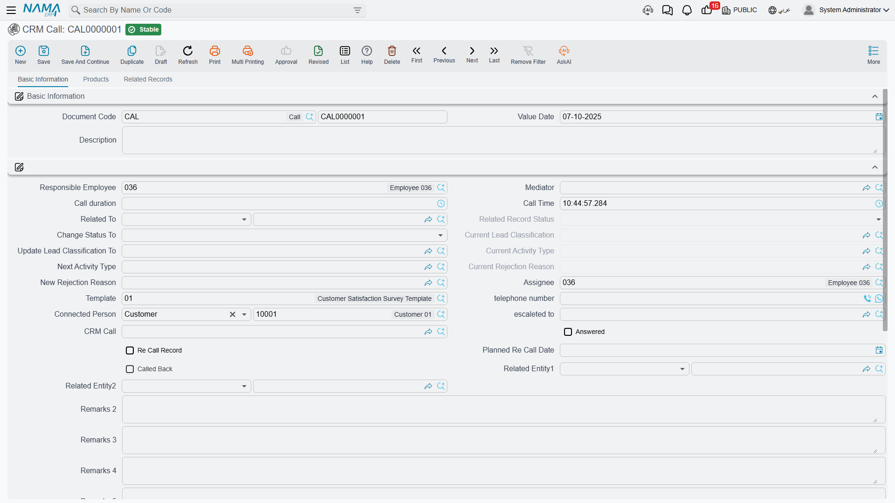

# Calls

::: info Required licence
`crm`. The Call screen lives at **Customer Relationship Management > Support > CRM Call**
(*خدمة العملاء > الدعم > اتصال*).
:::

Most of the CRM module records things. The Call screen is one of only **two** screens in the whole
module that *change* something: when a Call is committed against a lead or a potential, it reaches
into that lead and rewrites its status, its classification, its next activity and its rejection
reason. The other screen that does this is [the Visit](/modules/crm/activities/crm-visits).
Everything else in the Activities folder is a log.

That makes the Call worth reading about properly. Hala (`EMP-1042`) does not move `LD-00417` —
Marina Plaza Hotels — from *Initial* to *Contacted* to *Qualified* by editing the lead. She moves it
by logging the calls she made, and the lead follows along behind her.

A Call needs **no document term** — a book and a code are all it asks for. It has no accounting
effect, no inventory effect, and it never sends anything: no e-mail, no SMS, no reminder.

## What a Call can be logged against

There is a single **Related To** (*يرتبط بـ*) field, and exactly one subject goes in it. It accepts a
Lead, a Potential, a CRM Project, a Campaign, a Trouble Ticket, a Complaint, a Customer, a CRM Task
or a Development Request.

Only the first two — Lead and Potential — trigger the write-back described below. A call logged
against a trouble ticket or a customer is a plain record of a conversation.

Beside it sits **Connected Person** (*المتصل به*), which is the person you actually spoke to: a
contact, a customer, or the lead itself. On `CALL-0342` the subject is the lead `LD-00417` and the
connected person is `CNT-0905`, Ms. Mona Shaaban in purchasing. Two more boxes, **Related Record 1**
and **Related Record 2**, accept a reference to anything at all; nothing in the product reads them,
so treat them as free storage and narrow them with a generic reference overrider if your site uses
them.

**Responsible Employee** and **Assignee** are stamped with the logged-in user's employee on every new
Call, always. The CRM setting *Fill Responsible Employee With Current Employee* does not switch this
off — it is honoured by the Lead screen only. See [CRM Settings](/modules/crm/crm-configuration).

## The state machine

Pick a Lead or a Potential in **Related To** and four read-only boxes fill themselves in from that
record: **Related Record Status**, **Current Lead Classification**, **Current Activity Type** and
**Current Rejection Reason**. They are a snapshot of where the lead stood when the call started, and
they are filled only while they are still empty — so they keep showing the "before" picture even
after the call has changed it.

Underneath each snapshot sits its lever — a box you type into, which is written back onto the lead
when the Call is committed:

| Lever on the Call | What it overwrites on the lead or potential |
|---|---|
| **Change Status To** (*تغيير الحالة إلي*) | Status |
| **Update Lead Classification To** (*تحديث تصنيف العميل المرتقب إلي*) | Lead Classification |
| **Next Activity Type** (*نوع النشاط التالي*) | Activity Type |
| **New Rejection Reason** (*سبب الرفض الجديد*) | Rejection Reason |
| **Planned Re Call Date** (*التاريخ المخطط لمعاودة الإتصال*) | Planned Re-Call Date — **Calls only** |

Each one is applied only if you filled it in and only if the value is actually different from what
the lead already holds. Leave a lever empty and that part of the lead is untouched. Re-committing an
edited Call applies the levers again.

This is why a well-run pipeline in NaMa is driven from the activity screens rather than from the lead
itself. The lead's status is not something a salesperson maintains by hand; it is the residue of the
last call or visit that touched it.

::: warning Cancelling a Call does not undo what it did
The write-back is one-way. If a Call is committed with *Change Status To = Cold* and then cancelled
because it was logged against the wrong lead, the lead **stays Cold**. Nothing remembers what the
status was before, and nothing puts it back. Open the lead and correct it by hand.
:::

### The worked example

`CALL-0342` — 14 January 2026, 09:00, twenty minutes, Hala (`EMP-1042`), connected person
`CNT-0905`:

| Field on the Call | Value | Result on `LD-00417` |
|---|---|---|
| Change Status To | Contacted (*تم الأتصال*) | Status becomes Contacted |
| Update Lead Classification To | `LC-B` Mid-Market | Classification becomes Mid-Market |
| Next Activity Type | `AT-02` Site Visit | Activity Type becomes Site Visit |
| Planned Re Call Date | 22 January 2026 | Planned Re-Call Date is set |
| Re Call Record | ticked | *(see the next section)* |

Nothing else changed. The Sales Stage stayed at *Qualification* and the Probability stayed at 40 —
those two are metadata that no button and no calculation ever touches; they are moved by hand on the
lead when the salesperson judges it is time.

## Calling back

Ticking **Re Call Record** (*سجل معاودة الاتصال*) and setting a **Planned Re Call Date** puts the
call into a waiting list. On a later Call, the field **CRM Call**, labelled *بناءا على اتصال (المعاود
الإتصال به)*, offers exactly the calls that are waiting: those ticked as a re-call record and not yet
called back, optionally narrowed to the same subject.

Pick one and two things happen. The earlier call is stamped **Called Back** and drops out of the
waiting list, and the new Call copies the earlier call's duration, time, telephone number, subject,
mediator, assignee and connected person so you are not re-typing them.

That is `CALL-0357` on 22 January: it points at `CALL-0342`, which is now marked Called Back, and it
carries the lead the rest of the way — *Change Status To = Qualified*, *Update Lead Classification To
= `LC-A` Key Account*.

::: warning The waiting list waits for you
Nothing in the module reminds anybody that a call-back is due. There is no scheduler, no alarm, no
notification and no inbox anywhere in CRM. The Planned Re-Call Date is copied onto the lead and
stored, and that is all; the only thing that surfaces an overdue call-back is somebody opening the
pick-list or filtering the Calls list view. Treat the re-call chain as a **pull** mechanism and give
someone the daily job of pulling it.
:::

Cancelling the follow-up call releases the earlier one back into the waiting list, and re-pointing
the field at a different call clears the previous target — so the chain stays honest even when it is
edited.

## The Products tab

The Products tab records what was discussed: **Product**, a **Selected Product** tick, a **machine**,
a **Competitor Company** and a **Competitor Company Item**, plus a description per row.

Two helpers make it quicker. Picking a machine fills the row's product from that machine's item. And
picking a competitor item narrows the Product search list to the items your site has mapped to that
competitor's product — so if the customer says "we are also looking at the Ufuq Chiller 300 TR"
(`CITM-011`), the search shows only the chillers you would pitch against it.

No stock moves and no price is calculated. These lines are a record of the conversation, and the tick
box **Selected Product** matters in exactly one place — the real-estate shortcut described below.

## The Responses grid

The grid at the bottom of the first tab holds question-and-answer rows: a question, a text answer, a
numeric answer, a date answer and a description.

::: warning Type the questions in yourself
There is a **Template** (*القالب*) field on the Call that offers questionnaire templates. Choosing
one does **nothing**: no question rows appear and nothing is copied. The Responses grid is a manual
grid, row by row. If you need a real questionnaire with a template behind it, use
[the Questionnaire screens](/modules/crm/questionnaires/crm-questionnaire-templates) instead.

The English column heading also reads **Criteria** where it means *question* — the Arabic label
(*السؤال*) is the correct one. Do not go hunting for a criteria feature; there is none.
:::

## The buttons

| Button | What it does |
|---|---|
| **escaleted to** (*تصعيد الي*) | Asks for an employee, writes it into the Escalated To box, then saves and commits the Call and refreshes the screen. **Nobody is notified** — the escalation is a field, not a message. |
| **create CRM Task** (*إنشاء مهمة خدمة العملاء*) | Opens a new [CRM Task](/modules/crm/activities/crm-tasks-and-follow-ups) in a pop-up with this Call as its subject. The task is not saved for you. |
| **Instant Temporary Reservation** (*حجز مؤقت مباشر*) | A shortcut into the Real Estate module. It needs a Lead or Potential in Related To and one Products line ticked as **Selected Product**. If the lead has already been converted to a customer it reuses that customer; otherwise it creates and commits a real-estate owner from the lead's data, then opens a new reservation document with buyer, mediator, sold estate and salesman filled. This is the only place in the Activities folder that creates a record in another module, and it needs the Real Estate module to be licensed. |

The usual platform actions — export, audit trail, remarks, approvals, favourites, **Add To Agenda** —
are on this screen as on any document. Add To Agenda is the closest thing to a calendar anywhere in
CRM, it is generic to the whole ERP, and the user has to press it.

## What is not on the Call screen

Two absences surprise people, so it is worth naming them:

- **There is no incoming/outgoing indicator.** The underlying data has a call-direction concept and
  it is fully translated, but it is not placed on the screen, so there is no supported way to record
  whether a call was inbound or outbound. Use the Description if you need to note it.
- **There is no From Document box.** When a Call is produced by a
  [Work Plan](/modules/crm/activities/crm-work-plans) the link is recorded, but only the plan side of
  it is visible: the plan's line shows its **Generated Document**, while the Call gives no on-screen
  hint of where it came from. The Visit screen, confusingly, does show it.

## What the system will not stop you doing

Nothing. There is no business validation in this area at all. The only required fields on a Call are
the book, the code and your dimensions; a Call with no subject, no telephone number and no employee
commits cleanly. Sites that need a rule here — a mandatory subject, a mandatory outcome — add it with
an entity flow or an approval definition.

**Reporting: none.** This module ships no system reports, and this screen has no print form. To
review calling activity, use the Calls list view with its filters and Excel export, or build a BI
dashboard over it.
