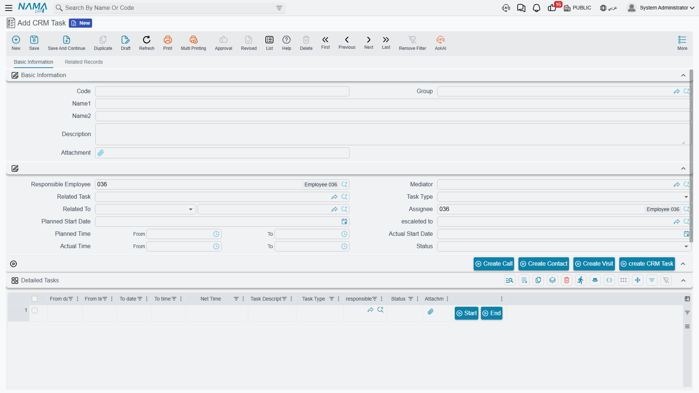

# Tasks and Follow-Ups

::: info Required licence
`crm`. The CRM Task lives at **Customer Relationship Management > Support > CRM Task**
(*خدمة العملاء > الدعم > مهمة خدمة عملاء*). The Follow Up Document lives at **Customer Relationship
Management > Questionairs > Follow Up Document** (*خدمة العملاء > استبيانات > سند متابعة*) — yes, in
the questionnaires group, not with the other support documents.
:::

Two small screens share this page because they have the same shape: both are places to write
something down, and neither one makes anything else happen. The CRM Task is a genuinely useful to-do
card with a time sheet on it. The Follow Up Document is a bare log — an honest description of it is
short, and this page gives it plainly rather than dressing it up.

## The CRM Task

A CRM Task is a **master file**, not a document. That has practical consequences worth stating once:
there is no book, no document term, no value date, no document number and no document approval cycle.
It has a code, an Arabic name, an English name and a group, like any other master file, and it is
saved rather than committed.

### What it holds

The first block is the master-file identity: **Code**, **Group**, the Arabic name, the English name,
a Description and an attachment.

Then the working block:

| Field | Notes |
|---|---|
| **Responsible Employee**, **Assignee**, **Mediator**, **escaleted to** | Responsible Employee and Assignee are stamped with the logged-in user's employee on every new task, always |
| **Related To** (*يرتبط بـ*) | The subject: a Lead, Potential, Project, Campaign, Trouble Ticket, Complaint, Customer, Development Request, another CRM Task, or a Visit |
| **Related Task** | Point at a parent task and its task information, subject and assignee are copied down |
| **Task Type** | Visit, Call, Support, training or preparation — a label only |
| **Planned Start Date**, **Planned Time** (from/to) | What you intend |
| **Actual Start Date**, **Actual Time** (from/to) | What happened — typed by hand, see the warning below |
| **Status** | Planned, In Progress or Finished — a label only |

Below that is a full contact block, **Task Information** (*موقع المهمة*): address with map location,
phones, mobile, fax, e-mail and website. It is there for tasks that are about going somewhere or
calling someone who is not already a contact record.

The **Related Records** tab lists the contacts, tasks, calls and visits that point back at this task.

### The time sheet

The **Detailed Tasks** (*مهام تفصيلية*) grid is the part people actually use: one row per stretch of
work, with a from date and time, a to date and time, a calculated **Net Time**, a description, a task
type, who did it, a status and an attachment. Each row carries **Start** and **End** buttons that
stamp the current moment into the from and to columns.

`TSK-0219` in the worked example is *Prepare the technical proposal*, assigned to Hala (`EMP-1042`),
related to the lead `LD-00417`, planned 20 to 26 January 2026:

| From | To | Net time |
|---|---|---|
| 2026-01-20 09:00 | 2026-01-20 12:00 | 3:00 |
| 2026-01-21 10:00 | 2026-01-21 13:30 | 3:30 |
| 2026-01-23 09:30 | 2026-01-23 11:00 | 1:30 |
| | **Total** | **8:00** |

::: warning The time sheet does not roll up, and the status does not advance
The header's **Actual Start Date** and **Actual Time** are **not** derived from the grid. Fill in
every row of the time sheet and the header stays exactly as you typed it — or empty. In the same way,
setting every row to *Finished* leaves the task's own **Status** wherever the user last put it;
nothing advances it.

If your site reports on task effort, read the grid rows, not the header.
:::

The Net Time figure has the same small quirk as the work plan's: the value shown while you type is
computed in the browser and the value stored on save is computed on the server, and the two use
slightly different rules. Same-day rows agree to within seconds; a row that crosses midnight looks
wrong until you save it and then corrects itself.

### The buttons

**Create Call**, **Create Visit**, **Create Contact** and **create CRM Task** each open the
respective new record in a pop-up with this task as its subject. Nothing is saved for you — you
review the pop-up and save it yourself.

**escaleted to** (*تصعيد الي*) asks for an employee, writes it into the Escalated To box, saves and
commits the record and refreshes the screen. **Nobody is notified.** Escalation here means a field
now holds a name.

::: info A small quirk when a task is created from another screen
When a task is opened from a lead, a potential or another task with a Create Task button, the
**escaleted to** box in the pop-up arrives either blank or holding something that is not an employee
at all. Clear it and pick the employee you meant.
:::

### What a CRM Task is not

::: warning No scheduler, no reminder, no notification
A CRM Task has **no relationship whatsoever** to the platform's task schedule, its notification engine
or any approval inbox. Nothing watches the Planned Start Date. Nothing changes the status when a date
passes. Nothing e-mails the assignee when a task is created or when it becomes overdue.

This is true of the whole CRM module, not just this screen — there is no scheduler anywhere in it.
Everything that looks scheduled happens because somebody pressed a button.

The only calendar-adjacent feature available is the generic **Add To Agenda** action, which is a
platform feature on every document and which the user has to press themselves.
:::

Tasks *are* counted, in one place: [Target Plans](/modules/crm/marketing/crm-target-plans) count
calls, visits, leads and tasks per employee per month when somebody asks them to. That is a different
document, on demand, and it counts against the task's **Assignee**.

## The Follow Up Document

The Follow Up Document is a single-block screen: a document code, a value date, a description, and
then **Follow Up Date**, **Follow Up Time**, **Related Record**, **Follow Up Type**, **Status** and
**Sub Status**. The Related Record accepts a Lead or a Potential — nothing else.

- **Follow Up Type** offers SMS, Call, Meeting, Email and WhatsApp.
- **Status** offers Start Action, Ongoing and Interested.
- **Sub Status** offers Follow, No Answer, Expected Visit, Hold, Negotiation, Cancel and Not Reached.

Like the Visit, this screen shows its Description box twice; both are the same field.

::: danger Nothing in the system reads any of this
The Follow Up Document is inert, and it is important not to plan around it:

- **Choosing a Follow Up Type sends nothing.** Picking *SMS*, *Email* or *WhatsApp* does not send an
  SMS, an e-mail or a message. The field is a label describing something the user did outside the
  system.
- **Status and Sub Status drive nothing.** Setting a follow-up to *Ongoing / Expected Visit* changes
  no other record. In particular the lead or potential in Related Record is **not** touched — no
  status, no classification, no activity type. Only [Calls](/modules/crm/activities/crm-calls) and
  [Visits](/modules/crm/activities/crm-visits) do that.
- **It does not chain.** A follow-up cannot point at the previous follow-up, so there is no sequence
  and no "next contact due" anywhere.
- **Nothing creates one and nothing consumes one.** No screen lists follow-ups except the Follow Up
  Document's own list view.

Document it to your users for what it is: a manual log of a contact attempt. If you need a follow-up
process that actually moves the pipeline, log a Call or a Visit instead — those change the lead.
:::

::: warning The Trouble Ticket's "Create CRM Follow Up" button opens a different screen
On the Trouble Ticket there is a button labelled *عمل متابعة / Create CRM Follow Up*. It does **not**
create a Follow Up Document. It opens a
[Ticket Follow-Up](/modules/crm/support/crm-ticket-follow-ups) — a different screen, with different
fields, belonging to the support side of the module.

The Follow Up Document described here is reachable from its menu item and nowhere else.
:::

**Reporting: none.** This module ships no system reports, and neither of these two screens has a
print form. Use the list views, Excel export or BI.
