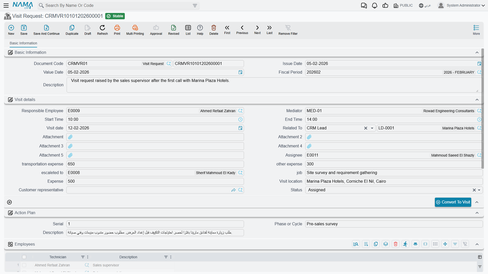

# Visit Requests

::: info Required licence
`crm`. The screen lives at **Customer Relationship Management > Support > Visit Request**
(*خدمة العملاء > الدعم > طلب زيارة*).
:::

A Visit Request is a note that says *somebody should go and see this customer*. It holds who, when,
where, which technicians and roughly what it will cost — and then it waits for a human being to act
on it.

It is worth being direct about what it is not, because the name invites the wrong expectation. This
is **not** a request-and-approval document. Nothing reviews it, nothing approves it, nothing marks it
as handled, and it never turns into a Visit by itself. Think of it as a **prefill template**: a tidy
place to write down a planned visit so that whoever creates the real Visit does not have to gather
the details again.

Like the Visit, it needs no document term — a book and a code are enough — and it has no accounting
or inventory effect.

## What is on it

The screen is a single tab, and it is the [Visit](/modules/crm/activities/crm-visits) screen's *Visit
details* block with the parts that only make sense after the fact taken out. You get responsible
employee, mediator, assignee, escalated-to, job, start and end times, visit date, visit location,
address, customer representative, status, the three expense boxes, the Action Plan group, an
**Employees** grid and a remarks grid.

What is deliberately missing, compared with the Visit: Visit Cost, Payment Status, the coordinates,
the signatures, and the four levers that write onto a lead. A Visit Request cannot change a lead's
status — only Calls and Visits do that.

::: info Some fields exist but do nothing here
The lead action-plan columns (change status to, update classification to, next activity type, new
rejection reason) still exist behind the scenes because the request shares its structure with the
Visit, and they are correctly kept off the screen. If a site puts them back with a screen modifier,
or fills them through an import, nothing will happen — this document has no write-back behaviour.
:::

## Convert To Visit

One button, **Convert To Visit** (*تحويل إلى زيارة*). Pressing it opens a **new, unsaved Visit** in a
pop-up, pre-filled from the request with: the subject (Related To), escalated-to, visit date, start
and end times, visit location, job, the three expense boxes, responsible employee, mediator, customer
representative and status, plus the remarks lines and the employee lines copied row for row.

Then it is over to you. Review it, finish it and save it.

::: warning There is no approval step, and the request is never consumed
The button opens a pop-up and does nothing else. It does not save the Visit, it does not write a link
from the Visit back to the request, and it does not mark, close or flag the request in any way — a
Visit Request has no "converted" state to set.

That means:

- **Press it twice, get two unrelated Visits** from one request. Press it five times and get five.
  Nothing objects.
- **A used request looks exactly like an unused one.** There is no column, tick or status to filter
  a list view by.
- **From the Visit there is no way back** unless somebody sets **From Document** on the Visit by
  hand.

If your site relies on visit requests, agree a manual convention — a remark, a status value your
staff maintain themselves, or an entity flow — and stick to it. The product will not keep score for
you.
:::

A few fields do not survive the trip either: the visit cost, the address, the payment status, the
attachments and the Action Plan group are not carried over. Setting **From Document** on a Visit and
pointing it at the request copies a very slightly different set — the two routes were built
separately — so it is worth doing the copy one way consistently rather than mixing them.

In the worked example, `VREQ-0044` was raised on 24 March 2026 for a commissioning visit on 26 March.
Convert To Visit was pressed once and produced `VISIT-0131`, which Hala saved by hand. `VREQ-0044`
itself is still sitting there today looking exactly as it did before the button was pressed.

## Where visit requests come from

Only from this screen. **Nothing in the product generates a Visit Request** — not a work plan, not a
lead, not a trouble ticket, and not a maintenance document. Somebody types it.

Do not assume the mobile app can raise one either; that path is not confirmed to work, and the app's
visit screen is built around the Visit document. Raise visit requests from the web screen.

## What the system will not stop you doing

Nothing. The only required fields are the book, the code, your dimensions and — if you add a row to
the Employees grid — the employee on that row. A request with no subject, no date and no location
commits cleanly.

**Reporting: none.** This module ships no system reports, and this screen has no print form. Use the
Visit Requests list view with its filters and Excel export.
