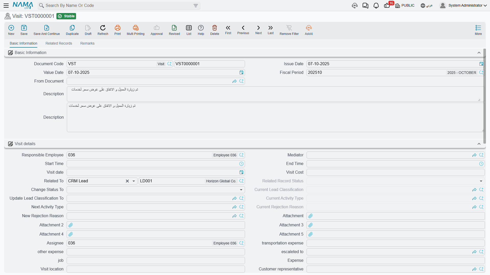

# Visits

::: info Required licence
`crm`. The Visit screen lives at **Customer Relationship Management > Support > Visit**
(*خدمة العملاء > الدعم > الزيارة*).
:::

The Visit is the Call's twin. It records that somebody went somewhere — and, exactly like
[the Call](/modules/crm/activities/crm-calls), it pushes a new status, classification, activity type
and rejection reason onto the lead or potential it was logged against. These two screens are the only
places in CRM where committing a document changes another record's state.

The Visit adds three things the Call does not have: an **Employees** grid, so a site visit can carry
the technician who went along; a **mobile check-in and check-out** flow with coordinates and
signatures; and the module's only printed form.

Like the Call, it needs **no document term** — book and code only — and it has no accounting or
inventory effect of any kind.

## The screen

The first tab opens with the usual document block: Document Code, Issue Date, Value Date, Fiscal
Period, **From Document** (*بناءا على*) and a Description.

::: info Two Description boxes
Description appears twice on this screen, both bound to the same field. Type into either one; they
are the same box shown twice.
:::

Then comes **Visit details** (*تفاصيل الزيارة*), which is where the work is:

| Group of fields | What goes there |
|---|---|
| Responsible Employee, Assignee, Mediator, escaleted to, job | Who owns the visit |
| Start Time (*من*), End Time (*إلى*), Visit date | When |
| Visit location, Address, Customer representative | Where, and who received you |
| Related To, and the six lead fields | The subject and the state machine — see below |
| Expense, other expense, transportation expense, Visit Cost, Payment Status | Money boxes — see the warning below |
| Status | A free label; nothing enforces any transition |
| Map Location ×2, Building Number ×2, Client Signature, Employee Signature, Attachment…Attachment 5 | Filled by the mobile app — see below |

**Status** uses the same list of values as the trouble ticket (Initial, Assigned, In Progress,
Cancelled, Closed, Finished, Done, Postponed, Re-Open, Development Request, Customer Feedback, Out Of
Warranty). It starts at *Initial* and is otherwise entirely free — there are no transition rules and
nothing reads it. One entry in that list has no translation in either language and shows as a raw
key; ignore it.

The **Action Plan** (*خطة التنفيذ*) group — Serial, Phase or Cycle, Description — is meaningful only
when the subject is a CRM Project. There, the Serial field suggests the project's preparation and
training lines, and picking one fills in the phase and the description. For any other subject the
group does nothing.

Below that sit the **Employees** grid (a technician and a note per row — the employee is the only
truly required field on the whole screen), and a second one-column remarks grid whose heading has no
translation and renders as a raw key. The **Remarks** tab holds three more free-text grids: customer
remarks, technician remarks and supervisor remarks. They are three parallel comment logs and nothing
reads any of them.

::: warning The money boxes on a Visit reach nothing
**Expense**, **other expense**, **transportation expense**, **Visit Cost** and **Payment Status** are
free-form boxes. They are never added up, never compared with one another, and never reach
accounting, payroll or any claim process. If you need visit expenses reimbursed, raise them through
the normal expense route — this screen will not do it for you.
:::

## What a Visit writes onto the lead

Pick a Lead or a Potential in **Related To** and the four "Current …" boxes fill from that record as a
before-picture. Then four levers write back when the Visit is committed:

| Lever on the Visit | What it overwrites on the lead or potential |
|---|---|
| **Change Status To** (*تغيير الحالة إلي*) | Status |
| **Update Lead Classification To** (*تحديث تصنيف العميل المرتقب إلي*) | Lead Classification |
| **Next Activity Type** (*نوع النشاط التالي*) | Activity Type |
| **New Rejection Reason** (*سبب الرفض الجديد*) | Rejection Reason |

The one lever the Call has and the Visit does not is Planned Re-Call Date; call-back chaining belongs
to the Call screen alone.

`VISIT-0118` is the example: 19 January 2026, 11:00 to 13:00, Hala (`EMP-1042`) with the technician
Mahmoud (`EMP-2011`) on the Employees grid, visit location *فندق مارينا بلازا – الإسكندرية*. On
commit it sets the lead `LD-00417` to **Warm** and its next activity type to `AT-03`, Technical
Presentation. Nobody edited the lead.

::: warning Cancelling a Visit does not undo what it did
As with the Call, the write-back is one-way. Cancel a Visit that made a lead Warm and the lead stays
Warm. There is no stored "previous value" and no rollback. Correct the lead by hand.
:::

The subject may also be a Trouble Ticket, a Complaint, a Customer, a Campaign, a CRM Project or a
Development Request — in which case the Visit is a plain log and the levers do nothing.

## Visits on the phone

Where the Nama Mobile app is deployed, field staff do not open this screen at all — the app does. The
technician checks in on arrival and checks out on departure, and the ERP receives:

- **arrival coordinates** and a reverse-geocoded address, written into the first Map Location and
  Building Number pair;
- **departure coordinates** and address, written into the second pair;
- **start time** on check-in and **end time** on check-out;
- the **client signature** and the **employee signature**, stored as image attachments;
- the visit **status** as the app last set it.

That is a genuinely useful record: where the technician was, when, and two signatures to prove the
customer accepted the work.

::: danger Check-in does not detect a faked location
The app sends flags saying whether it believes the device is reporting a mock location, and it sends
the GPS accuracy of each fix. **The server keeps none of them.** They are received and thrown away,
and the Visit has nowhere to store them.

The practical consequence: a visit recorded with a mock-location app is indistinguishable from a
genuine one, and there is no field a supervisor can check. Do not present the check-in as proof of
attendance, and do not build a policy on it. If location integrity matters, it has to be handled
outside this document.
:::

A few more things worth knowing before you rely on the mobile figures:

- **Visit Date and Start Time are rewritten on every sync** until the visit is checked out. A visit
  that is synced the following morning is stamped with the sync date, and the arrival time keeps
  sliding forward until check-out closes it.
- **When the phone cannot get a fix**, the Map Location box is stored as the literal text
  `null,null` rather than being left empty.
- **The two Map Location boxes carry identical labels**, and so do the two Building Number boxes —
  there is no on-screen hint which is arrival and which is departure. The first of each pair is
  arrival, the second is departure. And "Building Number" is a misnomer: what the app puts there is
  the full reverse-geocoded street address.
- **"Prevent new CRM visit if there are open ones"**, the tick box on the mobile app configuration,
  is enforced **by the phone only**. The server never checks it, so a Visit created from the web
  screen, an import, a web service or an older build of the app is not affected. Treat it as an app
  convenience, not a control.
- Do not assume the app can create a **Visit Request** — that path is not confirmed to work. Raise
  visit requests from the web screen.

## The print form

The Visit is the one document in the entire CRM menu with a system print form:
**`SYSF-CRM001`**, filed under *18. Customer Relationship Management*. It prints the visit's code,
dates, start and end times and its details, and it is what a technician leaves behind or a supervisor
files.

**Reporting: none.** The module ships no system reports and no dashboards; this one print form is the
whole story. See [Reports and Printed Forms](/modules/crm/crm-reports-and-forms) for what to use
instead — list views, Excel export and BI.

## Where Visits come from

A Visit can be typed from scratch, but it usually arrives one of three ways:

1. **Generated in bulk from a [Work Plan](/modules/crm/activities/crm-work-plans).** Tick the plan's
   visit lines, press the generate button, and one committed Visit appears per line, linked both
   ways. `VISIT-0118` came from `WPLAN-0026` this way.
2. **Converted from a [Visit Request](/modules/crm/activities/crm-visit-requests).** The request
   opens a pre-filled but unsaved Visit that you save yourself. `VISIT-0131` came from `VREQ-0044`
   this way, on 26 March 2026.
3. **From the lead or potential screen**, with the Create Visit button, which opens a pop-up with the
   subject already set.

If you point **From Document** at a Visit Request or an earlier Visit by hand, the same set of
fields — subject, dates and times, location, job, the expense boxes, responsible employee, mediator,
customer representative, status, plus the remarks and employee lines — is copied across.

## What the system will not stop you doing

Nothing at all. A Visit with no subject, no date and no employee lines commits cleanly; the only
required fields are the book, the code, your dimensions, and an employee on each Employees row if you
add one. If your site needs the visit report filled in before the document can be committed, that is
an entity flow or an approval definition, not a built-in rule.
