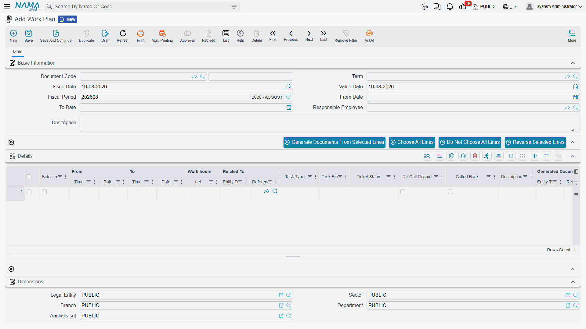

# Work Plans

::: info Required licence
`crm`. The screen lives at **Customer Relationship Management > Support > Work Plan**
(*خدمة العملاء > الدعم > خطة عمل*).
:::

Everything else in the Activities folder records work that has already happened. The Work Plan is the
one document that **creates** work: a supervisor lists next fortnight's contacts on a grid, ticks the
ones to release, presses one button, and a committed [Call](/modules/crm/activities/crm-calls) or
[Visit](/modules/crm/activities/crm-visits) appears for each ticked line — linked back to the line
that produced it.

That is genuinely useful, and it is the closest thing CRM has to scheduling. It is also worth
knowing, up front, exactly where the usefulness stops: a Work Plan is a **release list**, not a
plan-versus-actual report. More on that below.

## Setting the term up first

The Work Plan is the only document in this folder that **requires a document term**, and the term is
not decoration — it is what tells the generator which book to file the new Calls and Visits under.
The term has one Settings tab with four fields:

| Field | What it decides |
|---|---|
| **Call Document Book** (*دفتر سند إتصال*) | The book every generated Call is filed under |
| **Call Document Term** (*توجيه سند إتصال*) | The term stamped on every generated Call |
| **visit Document Book** (*دفتر سند زيارة*) | The book every generated Visit is filed under |
| **visit Document Term** (*توجيه سند زيارة*) | The term stamped on every generated Visit |

In the worked example the plan is filed under book `WPLAN` with term `T-WPLAN-STD`, which names book
`CALL` for calls and book `VISIT` for visits.

::: warning A missing book stops that half of the generation
If any ticked line is a Call line and the term has no Call Document Book, generation fails with a
message telling you to select the book in the term. The same applies to Visit lines and the visit
book. This is not silent — but it is easy to hit on the day you go live, so set both books before
anyone raises a plan. See [How CRM Document Terms Work](/modules/crm/document-terms/crm-terms-basics).
:::

## The screen

The header is short: Document Code, **Term**, Issue Date, Value Date, Fiscal Period, **From Date**,
**To Date**, **Responsible Employee** and a Description. The From/To dates describe the period the
plan covers; nothing checks them against each other or against the line dates.

Everything else is the **Details** (*التفاصيل*) grid, one row per planned contact:

| Column | What it is for |
|---|---|
| **Selected** (*اختيار*) | Tick the lines you want to release now |
| **From Date / From Time**, **To Date / To Time** | When the contact is planned |
| **Work hours \| net** | Calculated from the four columns above |
| **Related To** | Who the contact is with — a Lead, Potential, Project, Campaign, Trouble Ticket, Complaint, Customer or Development Request |
| **Task Type** | **Call** or **Visit** — this is what decides which document the line produces |
| **Ticket Status**, **Re Call Record**, **Called Back** | Values pushed into the generated document |
| **Task Status** | See the note below |
| **Description** | Copied into the generated document |
| **Generated Document** | Filled by the system once the line has produced its document |

Three helper buttons above the grid — **Choose All Lines**, **Do Not Choose All Lines** and **Reverse
Selected Lines** — just tick, untick and invert the Selected column, which saves a lot of clicking on
a fifty-line plan.

::: info The Task Status column does nothing
Setting a line to *Finished* changes nothing anywhere, and it is never read back from the generated
document. If you want to know whether a planned contact happened, look at the line's Generated
Document column and open it.
:::

## Generating the documents

1. Build the plan: period, responsible employee, and one row per planned contact with a subject, a
   date-and-time window and Task Type set to Call or Visit.
2. Tick the lines you are ready to release. You do not have to release the whole plan at once —
   a plan can be generated from repeatedly as the fortnight goes on.
3. Press **Generate Documents From Selected Lines** (*إنشاء مستندات من السطور المختارة*).
4. For each ticked line the system creates a Call or a Visit, files it under the book and term named
   on the plan's term, copies the plan's responsible employee, copies the line's subject, description,
   ticket status, re-call flags and spare columns, **commits it**, and writes it back into the line's
   **Generated Document** column.
5. If a line already has a generated document, it is re-opened and updated rather than duplicated —
   so pressing the button twice does not produce two Calls for the same line.

In the worked example, `WPLAN-0026` — *January contact plan – Marina Plaza*, 12 to 31 January 2026,
responsible employee Hala (`EMP-1042`) — carries two lines against the lead `LD-00417`:

| Line | Task Type | From | To | Net | Generated |
|---|---|---|---|---|---|
| 1 | Call | 2026-01-14 09:00 | 2026-01-14 09:20 | 0:20 | `CALL-0342` |
| 2 | Visit | 2026-01-19 11:00 | 2026-01-19 13:00 | 2:00 | `VISIT-0118` |

Both lines were ticked, the button was pressed once, and both documents arrived committed and linked
both ways. Hala then opened each one and recorded what actually happened — including the levers that
moved the lead's status.

::: warning Generating with nothing ticked reports success
If you press the button without ticking a single line, you get a success message and no documents.
Nothing warns you. Check the Generated Document column before you walk away.
:::

::: warning Two columns are dropped depending on the line type
**Re Call Record** and **Called Back** typed on a **Visit** line are lost — the Visit has no such
concept. **Ticket Status** typed on a **Call** line is lost too. Fill Re Call Record and Called Back
only on Call lines, and Ticket Status only on Visit lines.
:::

## The link back, and how it stays fresh

The link runs in both directions. The plan's line points at its **Generated Document**; the Visit
shows the plan in its **From Document** box. (The Call screen records the same link but does not
display it — from a generated Call there is no on-screen way to see which plan produced it.)

Editing a generated Call or Visit and committing it again refreshes the matching plan line: its
subject, description, re-call flags, ticket status and spare columns are copied back onto the line.
Cancelling the generated document clears the line's Generated Document column, which frees the line
to be generated again — a clean way to re-issue a contact that was logged by mistake.

::: info A newly generated Call refreshes its line one commit late
A Call that has just been generated does not push anything back to its plan line until it is edited
and committed a second time. In practice this rarely matters — the line is where the data came from
in the first place — but if a plan line looks stale immediately after generation, this is why. Visits
do not have this quirk.
:::

## Start, End, and why there is no plan versus actual

Each row carries **Start** (*بدء*) and **End** (*إنهاء*) buttons. Start stamps the row with the
current date and time; End stamps the finish.

::: warning Start and End overwrite the plan
They write into the **same four columns that hold the planned times** — From Date, From Time, To
Date, To Time. There are no separate "actual" columns on a work plan line. The moment a rep presses
Start, the scheduled start time is gone and cannot be recovered.

So a Work Plan structurally **cannot** show planned versus actual. Use it as a release list: what we
intend to do, and which document each intention produced. If you need planned-versus-actual figures,
that lives on [Target Plans](/modules/crm/marketing/crm-target-plans), which count activity per
employee per month.
:::

One more small thing about the times. The **Work hours | net** figure you see while typing is
computed in the browser, and the figure stored on save is computed on the server with a slightly
different rule: the browser ignores the To Date, and the server rounds to about half a minute. For an
ordinary same-day line the two agree to within a few seconds. For a line that crosses midnight the
grid shows nonsense until you save, and then it corrects itself. Do not chase the difference — save
and read the stored value.

## What the system will not stop you doing

Nothing beyond the term's books. The From and To dates are not validated against each other or
against the line dates; a plan with no lines commits happily; a line with no subject commits happily
and will generate a document with no subject.

**Reporting: none.** This module ships no system reports, and this screen has no print form. The Work
Plan list view does let you filter by Responsible Employee, which is the usual way supervisors find
their own plans; beyond that, use Excel export or BI.
