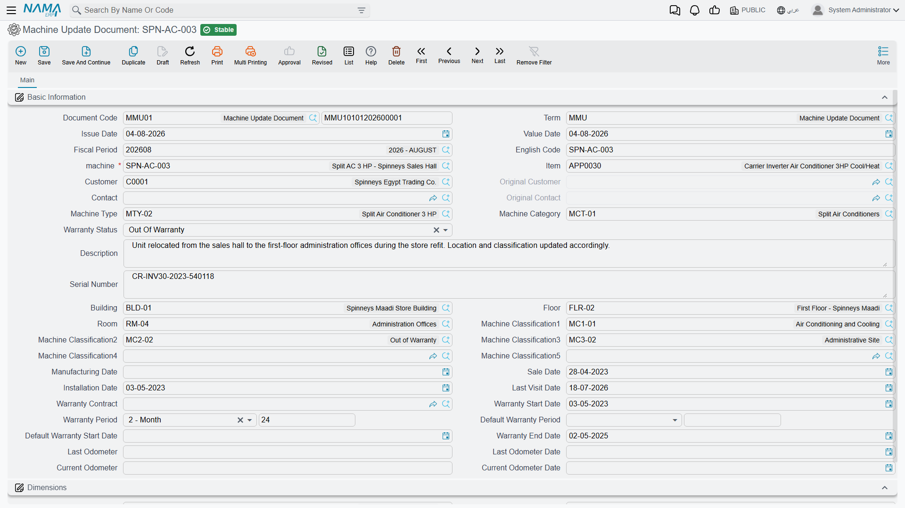

# Machine Updates, Transfers and Site Previews

The [machine file](/modules/crm/maintenance-setup/crm-machines.md) is a master file, and you can
edit it directly. So why are there documents that edit it for you? Because a master file keeps no
history: change the room and yesterday's location is gone. These three documents exist to leave a
dated, numbered trail — one for changing a machine's data, one for changing its owner, and one for
recording a site survey before an installation.

Two of the three do what they promise, with traps. The third does nothing at all.

::: info Required licence
`crm-maintenance`
:::

## The Machine Update Document

A document with a book, a term, an issue date and a value date, whose body is a near-copy of the
machine's own attribute set: item, customer, contact, original customer and contact, machine type,
category, warranty status, remarks, serial number, building, floor and room, the five
classifications, the manufacturing, sale, installation and last-visit dates, warranty contract,
warranty start, warranty period, default warranty period, default warranty start date, warranty end,
the odometer readings and their dates, and the dimensions.

On 10 June 2026 the air-handling unit `MCH-00318` is moved out of the equipment room into the pump
room `RM-MP01-B3`. The maintenance office types `MUPD-0007` against that machine, changes the room,
and saves. On save the document rewrites the machine, and because the machine's own calculations and
checks run afterwards, its warranty dates are recomputed at the same time.

**Ledger: none. Stock: none.** The document has no term configuration of its own, so its Term
carries only the generic document settings.

::: danger Two traps that lose data silently

**1. It writes every field on its screen, whether you filled it in or not.** Picking the machine
pre-fills *most* of the boxes from the current record — but not all of them. The alternative code,
the manufacturing, sale, installation and last-visit dates, the default warranty start date and the
warranty status are **not** pre-filled, and they are still written onto the machine when you save.
Leave them as they arrived and the machine's installation date, sale date and warranty status are
**blanked**, quietly, with nothing on screen to tell you.

Treat this document as "retype the machine", not "change one field". Before committing, work down
the screen and make sure every box holds the value you want the machine to end up with.

**2. Cancelling the only update reverts nothing.** Cancelling restores the values of the
**previous** Machine Update document for that machine. If this is the first — and for most machines
it always is — there is no previous document to restore from, and the machine simply keeps
everything the cancelled document wrote. Cancelling `MUPD-0007` would leave `MCH-00318` in the pump
room.

To undo a first update you must open the machine and put the old values back by hand, which is
exactly why you should note them down before you commit.
:::

Two more behaviours worth knowing:

- The document is **refused** if a later Machine Update already exists for the same machine — later
  by value date, then by creation date. You cannot slot a correction in behind history.
- If you re-point a saved update at a **different** machine, the machine it used to point at is
  re-synchronised from its own latest remaining update document.

Finally, some of the machine's data is **not** on this screen and therefore cannot be changed
through it: the second serial number, the task template and the tasks grid, the dependent-machines
grid, the spare-parts grid and the attachments. Those are edited on the machine file itself.

::: warning This document is the only writer of two fields that look automatic
*Last Visit Date* and *Warranty Status* on the machine are never maintained by any process — no
visit, order or execution touches them. The Machine Update is the only thing in the system that ever
writes them, and as described above it writes them blank unless you fill them in. Read *Warranty End
Date* for the real warranty answer.
:::

## The Machine Ownership Transfer Document

A hotel sells a chiller with the building; a branch is handed to another company. The transfer
document records that, and keeps the chain.

Five fields carry the meaning:

| Field | Behaviour |
|---|---|
| Machine | Mandatory |
| From Customer | Filled by the system from the machine's current owner |
| To Customer | Mandatory, typed |
| From Contact | Filled by the system from the machine's current contact |
| To Contact | Typed — but see the warning below |
| Description | Free text |

On save, the document gathers **every** committed transfer for that machine, adds itself, sorts them
by value date and then creation date, and rebuilds the chain: the first document's "from" side is
stamped with the machine's **original** customer and contact, each later document's "from" side is
taken from the one before it, and the machine's current customer and contact are set from the last
document in the chain. The machine's *original* customer and contact are frozen by the **first**
transfer, so a machine that has never been transferred has no original owner recorded yet.

Cancelling a transfer is well behaved: the chain is rebuilt without it, falling back to the original
owner when no transfers remain. This is the opposite of the Machine Update's cancel, and it is worth
remembering which is which.

::: warning The contact half of the chain is wrong from the second transfer onward
The customer chain is correct. The **contact** chain is not: from the second transfer on, each
document's *From Contact* repeats the very first document's contact instead of the previous
document's *To Contact*. On the machine's transactions tab you will see a From Contact column that
disagrees with the From Customer column beside it. Read the customer chain; treat the contact column
as unreliable.
:::

::: warning You cannot choose the new contact
The *To Contact* lookup only ever offers **the machine's current contact** — the one you are
transferring away from — and on a machine with no contact at all it produces an error instead of an
empty list. Treat ownership transfer as a **customer-level** operation: leave *To Contact* empty,
save the transfer, then set the new contact on the machine file afterwards.
:::

## The Pre-Installation Preview

The site survey before an installation: customer, contact, machine, machine type and category, a
from date and a to date, an attachment, *From document*, the serial number, a maintenance-groups
grid and a discussion checklist. Picking the machine fills the serial, customer and contact.

::: danger The Pre-Installation Preview does nothing at all
There are no buttons on this screen, no document term configuration, no validation and no effect of
any kind. It creates no machine, feeds no order, no contract and no work plan, and no other document
reads it. Once saved, the survey is invisible to the rest of the system.

If your process depends on a survey happening before installation, that dependency has to be
enforced by your own procedures. And if you need the survey's findings to reach the technician, put
them on the [maintenance order](/modules/crm/maintenance-cycle/crm-maintenance-orders.md) — nobody
downstream will see them here.
:::

The document that *does* create machines is *Generate Machine* on the maintenance sales order — see
[Maintenance Sales](/modules/crm/maintenance-cycle/crm-maintenance-sales.md), and note that it
creates shells which must then be completed by hand.

## None of this exists for the services suite

The [service documents](/modules/crm/services-suite/crm-services-suite-overview.md) have no machine
update, no ownership transfer and no pre-installation preview. A serviced site's data is edited on
the site record directly, with no document trail.

**Reporting: none.** This module ships no system reports, and these screens have no print form. The
machine file's own transactions tab is where the ownership chain is read; for update history use the
list view filtered by machine, and its Excel export.
