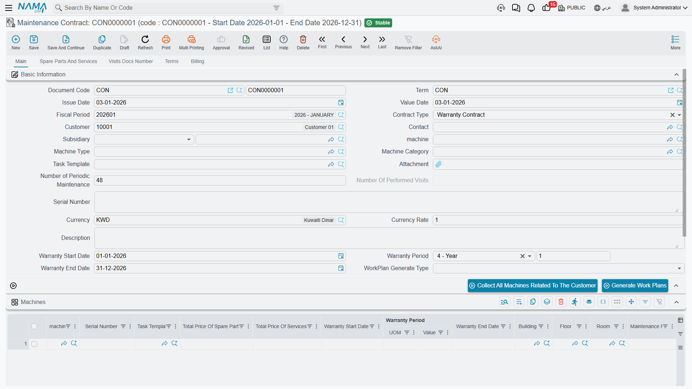

# Maintenance Contracts

The maintenance contract is the centre of gravity of the whole suite. It answers four questions at once: **which machines** are covered, **how often** each one is visited, **what has been pre-paid** and **how the customer pays**. Every preventive work plan, every drawn-down spare part and every contract-priced invoice line comes back to it.

We will follow one contract all the way through: `MC-0021`, signed with Marina Plaza Hotels on 18 February 2026 and running from 1 March 2026 to 1 March 2027.

Menu: **CRM → Maintenance Documents → Maintenance Contract**.

::: info Required licence
`crm-maintenance`. A **document term (توجيه) is required**, and it carries two things the contract cannot work without: the **work-plan book and term** that the generate button writes into, and — if you want the contract to reach the ledger — **both** a debit and a credit accounting side. See [Maintenance Document Terms](/modules/crm/document-terms/crm-maintenance-terms.md).
:::

## The Dates Are Not Called What You Expect

Start here, because nobody guesses it.

::: warning The contract's start and end dates live in fields labelled *Warranty Start Date* and *Warranty End Date*
There is no field called "contract start". The contract period is the **Warranty Start Date** and **Warranty End Date** pair in the header, with the **Warranty Period** between them. On `MC-0021` those read 2026-03-01, 12 Month and 2027-03-01.

Both must be filled before you press **Generate Work Plans**, or the generation refuses to run — the whole visit series is stepped out between those two dates.
:::

The rest of the header is unsurprising: contract type (*Maintenance Contract* here, as opposed to a *Warranty Contract* — see below), customer `C-01188`, contact `CNT-0904`, subsidiary (الذمة) the customer, responsible employee `EMP-3001` Nahed El Gindy, machine, machine type and category, task template, serial number, currency and rate, number of periodic maintenances, a read-only **number of performed visits**, and the **work-plan generation type**.

## The Machines Grid — Where the Schedule Really Lives

This is the important grid, and the seven **Visit Type** columns are the important part of it. Each machine line can carry up to seven frequencies, and each frequency has its own task template next to it, so the same machine can have a light monthly checklist and a heavier quarterly one.

`MC-0021` covers three machines:

| Machine | Visit Type 1 | Template | Visit Type 2 | Template | Technician | Building |
|---|---|---|---|---|---|---|
| `MCH-00311` Chiller No. 1 | Monthly | `TT-CHL-M` | Quarterly | `TT-CHL-Q` | `EMP-2011` | `BLD-MP01` |
| `MCH-00312` Chiller No. 2 | Monthly | `TT-CHL-M` | Quarterly | `TT-CHL-Q` | `EMP-2011` | `BLD-MP01` |
| `MCH-00318` AHU – Basement | Monthly | `TT-AHU-M` | — | — | `EMP-2011` | `BLD-MP01` |

The same grid also carries the serial number, the machine's own warranty dates, building, floor and room, the maintenance period and number of visits, a planned visit date, the maintenance group, the technician, five classification columns and per-machine totals that are recalculated from the detail grids on every save.

**Collect All Machines Related To The Customer** is a shortcut worth knowing: it replaces the grid with every machine belonging to that customer that is not a sub-machine of another. On a customer with forty split units that saves an afternoon — but it *replaces*, so use it before you start hand-editing lines, not after.

::: warning The Visit schedule grid does nothing
Further down the main page there is a grid headed **Visit schedule**, holding a machine and a visit date. It looks exactly like the place you would enter "chiller 1, 1 April; chiller 1, 1 May; …" — and nothing reads it. The only code that touches it is a validation checking that the machine you picked also appears in the Machines grid.

No work plan, no order and no visit is ever produced from it. The visit series comes from the **Visit Type** columns above and the contract's start and end dates. Leave the visit-schedule grid empty.
:::

The **Terms** page is in the same category: a grid of trouble level, trouble description, response time and remarks. It is an SLA table, it prints nicely if your implementer builds a form for it, and no code in the module reads it. Nothing measures a response time against it.

## Pre-Paid Entitlement

The **Spare parts and services** page is where coverage actually lives, and coverage here means one thing only: **a quantity, at a price**.

*Spare parts:*

| Item | Quantity | Unit price | Net value |
|---|---|---|---|
| `SP-FLT-14` Air filter 14 in | 24 | 300.00 | 7,200.00 |
| `SP-OIL-05` Compressor oil 5 L | 4 | 600.00 | 2,400.00 |
| **Total spare parts** | | | **9,600.00** |

*Services:*

| Service | Quantity | Unit price | Net value |
|---|---|---|---|
| `MSV-01` Chiller periodic maintenance visit | 44 | 1,200.00 | 52,800.00 |
| **Total services** | | | **52,800.00** |

Those 44 visits are not a coincidence — they are exactly the 44 visits the work-plan generator will produce from the machine lines above. Pricing the contract and scheduling it are two sides of the same arithmetic, and it is worth doing them together.

Each line carries **quantity**, **sold quantity** and **remaining quantity**. As orders, invoices and returns are committed against this contract, the sold quantity rises and the remaining quantity falls, and a document that asks for more than is left is refused with a message naming the item and the contract. After the April order `MO-0513`, `MC-0021` shows `SP-FLT-14` sold 6 / remaining 18, `SP-OIL-05` sold 1 / remaining 3, and `MSV-01` sold 3 / remaining 41.

::: tip The contract price wins
`MSV-01` is priced at 1,500.00 on the service catalogue and 1,200.00 on this contract; `SP-FLT-14` is 350.00 on the sales price list and 300.00 here. When a document is raised against the contract, the **contract price** is what lands on the line. That is the mechanism sites use to give contract customers a better rate — and, if you price a line at zero, it is also the only sense in which covered work is "free".
:::

::: warning What contract coverage does not do
Nothing compares the date of the work to the contract period or to any warranty. An order raised on a machine whose contract ended last year is priced and billed exactly like one on a live contract, with no warning. There is no free-versus-billed flag anywhere: the decision to charge the customer or absorb the cost is made by a person, every time.
:::

## Money and Payments

The contract carries a full money block, and on `MC-0021` it reads:

| | |
|---|---|
| Total (52,800.00 services + 9,600.00 spare parts) | **62,400.00** |
| Sales tax 14 % | **8,736.00** |
| Net value | **71,136.00** |

The **Billing** page holds the payment schedule. Marina Plaza pays quarterly:

| # | Date | Amount |
|---|---|---|
| 1 | 2026-03-01 | 17,784.00 |
| 2 | 2026-06-01 | 17,784.00 |
| 3 | 2026-09-01 | 17,784.00 |
| 4 | 2026-12-01 | 17,784.00 |
| | **Total** | **71,136.00** |

::: tip The schedule must add up
The contract is refused if the payment-schedule lines do not sum to exactly the money net value. That is a genuine, useful validation — if the contract will not save, add the schedule up first.
:::

The buttons on that page — **Generate Payments**, **Generate Receipt Voucher For Selected Payments**, **Generate Receipt Voucher** and **Collect Receipt Vouchers** — are the standard payment-schedule helpers. Generating a receipt voucher opens a pre-filled voucher that you review and save; nothing is created behind your back.

## What Committing the Contract Does

**Accounting: yes, when the term is configured for it.** Saving `MC-0021` creates a full invoice-style entry over the spare-part and service lines — in our example debit receivable 71,136.00, credit spare-parts revenue 9,600.00, service revenue 52,800.00 and sales tax 8,736.00.

::: warning Both sides or nothing
The contract books only when its document term carries **both** a debit and a credit accounting side. With only one side filled it books **nothing at all**, silently and with no error message. If a signed contract shows no entry, that is the first thing to check — see [How CRM Document Terms Work](/modules/crm/document-terms/crm-terms-basics.md).
:::

**Stock: none.** A maintenance contract never moves inventory.

The entry is created as a **business request** and processed in the background, which is why the save is instant. If processing fails, retry it from the Business Requests list view: filter for failed requests, select the rows, then More menu → Reprocess / Recommit.

## Generating the Work Plans

This is press one of the two that make preventive maintenance happen. On 1 March 2026 Nahed opens `MC-0021` and presses **Generate Work Plans**.

The generator walks every machine line, reads its Visit Type columns, and steps a date forward from the contract start date until it passes the contract end date. Then it groups the resulting rows into work-plan documents according to the header's **work-plan generation type**:

| Generation type | One work plan per… |
|---|---|
| Generate WorkPlan Based On Contract Priority *(the default when the field is left empty)* | calendar month of the expected order date |
| Generate WorkPlan Based On Visit Type | visit type |
| Generate WorkPlan Based On Visit Type And Contract Priority | visit type, per month |

`MC-0021` uses the first, and produces **44 expected-visit rows spread over 12 work-plan documents**, `WP-0087` through `WP-0098`. The arithmetic — why 44, why 12, and what each work plan contains — is on [Maintenance Work Plans](/modules/crm/maintenance-cycle/crm-maintenance-work-plans.md), which is also where you press the second button.

Two things must be in place before the button will work: the contract's start and end dates, and a **work-plan book and term** on the contract's document term. If either is missing the generation stops with a message and produces nothing.

::: danger Pressing Generate Work Plans again deletes work plans
This is not a safe refresh. When you press the button a second time, the generator keeps the work plans whose grouping key still matches — and **deletes every other work plan this contract produced**, together with the links from their machine lines to any orders already generated from them.

Add one machine to the contract, or change a visit type, or shift the contract end date, and work plans that used to exist can vanish. Before regenerating on a live contract, note which work plans have already produced orders. The orders themselves are not deleted, but the trail back from the work plan to them is.
:::

## Warranty Contracts

*Contract type* has a second value, **Warranty Contract**, and it is mostly not typed by hand: committing a maintenance order whose **Order Type** is *Installation* creates one automatically, copying the warranty period, the machine, the serial number, the customer, the contact and the spare-part, machine and service grids.

::: warning A generated warranty contract carries the full money block
Because the generated contract is a copy, it arrives with the same totals as the order it came from. If the warranty-contract term has accounting sides configured, the same amount is booked twice — once by the order or invoice, once by the generated contract. Leave the warranty-contract term **without** accounting sides. The mechanism is described on [Maintenance Orders](/modules/crm/maintenance-cycle/crm-maintenance-orders.md).
:::

## The Visits Number Page

The last page of the contract is a read-only list of the **Maintenance Visit** documents that point back at it. It fills up as visits are typed, and each one raises the header's *number of performed visits* — `MC-0021` goes from 0 to 1 when `MVIS-0055` is saved on 1 April 2026.

It is a genuinely useful "has anyone actually been there?" view, with one honest caveat: nothing generates those visit documents, so the counter only reflects the trips somebody bothered to type in. See [Maintenance Visits](/modules/crm/maintenance-cycle/crm-maintenance-visits.md).

## Reporting

**Reporting: none.** This module ships no system reports, and this screen has no print form. To review contracts across customers, use the list view with saved criteria (المعايير) and export to Excel, or build a BI dashboard over the contract data.
