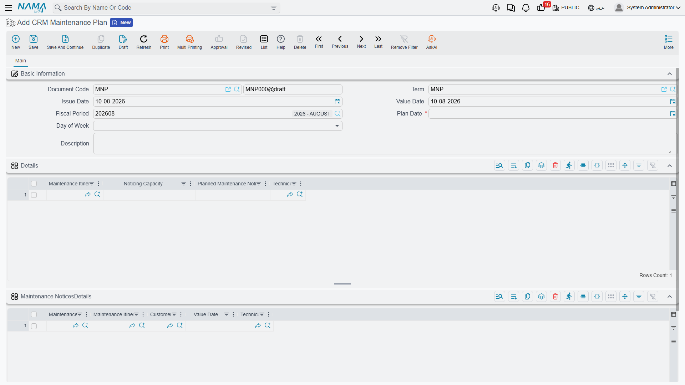

# Daily Dispatch

A call-centre takes fault reports all day. Somebody then has to decide who goes where tomorrow, and
in which order. That is what the **CRM Maintenance Plan** and the **Maintenance Itinerary** are for:
a route sheet for a single day, and the named routes it draws on.

::: danger This is not preventive-maintenance scheduling
The words *plan* and *itinerary* invite the assumption that this is where periodic visits are
scheduled. It is not, and the two features never meet. Preventive maintenance is planned on the
[maintenance contract](/modules/crm/maintenance-cycle/crm-maintenance-contracts.md), expanded into
[maintenance work plans](/modules/crm/maintenance-cycle/crm-maintenance-work-plans.md) and then into
maintenance orders — all by pressing buttons, since there is no scheduler in this module.

The daily plan described on this page deals only with **maintenance notices** that already exist. It
creates nothing, it schedules nothing in the future, and it never produces an order or a visit.
:::

::: info Required licence
`crm-maintenance`
:::

## The itinerary — a named route

The Maintenance Itinerary is a master file, filed under **Maintenance Files** rather than with the
documents. It holds a route name, a **noticing capacity** — how many call-outs the route is thought
to absorb in a day — five free description boxes, and a grid of the address regions the route
covers.

That is all it holds, and the capacity figure is the one to be careful about: nothing enforces it,
and it is not even carried onto the plan for you. See the warning below.

## The plan — one document per day

The plan itself is a short document:

**Header.** A **plan date**, which is mandatory, and a **day of week** that the system calculates
from it.

**Routes grid.** One line per route working that day: the itinerary, its noticing capacity, the
planned number of notices, and the **technician** assigned to it.

**Notices grid.** The actual call-outs to be served: the maintenance notice, the itinerary it has
been put on, and the notice's customer, value date and technician. Pick an itinerary on a line and
the technician is filled in for you from the matching route line, so the assignment stays
consistent.

Three rules are enforced, and no others: there must be at least one route line, the same itinerary
may not appear twice, and the same notice may not appear twice.

## What committing the plan does

One thing, to each notice listed on it:

| Written onto the notice | From |
|---|---|
| Responsible employee (the technician) | The route line's technician |
| Maintenance itinerary | The route the notice was put on |
| Planned visit date | The plan's date |

That is the plan's entire effect. **Ledger: none. Stock: none.** Its document term has no settings
at all — there is nothing to configure on it.

Take the refrigerant leak reported at Marina Plaza on 20 May 2026, notice `MNOT-0140`. The
dispatcher types the day's plan, adds a route line with technician `EMP-2014` (Sayed Abdullah
Morsy), lists `MNOT-0140` against that route, and saves. Open the notice afterwards and its
responsible employee, itinerary and planned visit date are filled in. Nothing else about it has
changed — it is still a fault log, and the work still becomes real only when somebody raises a
[maintenance order](/modules/crm/maintenance-cycle/crm-maintenance-orders.md) with the notice in
*From document*.

::: warning Capacity is a note, not a limit
The route's *noticing capacity* and *planned number of notices* are typed by hand and never compared
with the number of notice lines. A route with a capacity of 5 accepts 30 notices and saves happily.
The capacity is not even copied from the itinerary master onto the plan line — you retype it, and
nobody checks that you retyped it correctly.
:::

::: warning Nothing tells the technician
Saving the plan writes onto the notices and stops. No notification, no message, no mobile push, no
e-mail — there is no notification mechanism anywhere in this module. The route sheet is something a
supervisor reads on screen or exports; getting it to the crew is a manual step.
:::

## Where the notices come from

Only from the call-centre. A notice is typed when a customer calls; nothing generates one. See
[Notices and Requests](/modules/crm/maintenance-cycle/crm-maintenance-notices-and-requests.md) for
what a notice holds, and for the important fact that a notice's money totals and payment schedule
reach nothing at all.

Notices also double as the mobile technician's attendance document — check-in and check-out are
recorded against the notice, not against the plan.

**Reporting: none.** This module ships no system reports, and this screen has no print form. A
day's route sheet is read from the plan document itself or from the notices list view filtered by
planned visit date, technician or itinerary; the list view's Excel export is the practical way to
hand it out.
