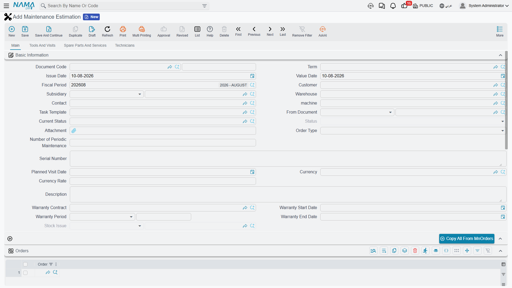

# Maintenance Estimations

The Maintenance Estimation (مقايسة صيانة) is the most misunderstood screen in the maintenance suite. Its name promises a quotation — price the repair, show it to the customer, and turn it into a work order when they agree. That is not what it is, and reading it that way is how installations end up with stock leaving the warehouse for work nobody has approved.

Read this whole page before you let anybody use the screen.

Menu: **CRM → Maintenance Documents → Maintenance Estimation**.

::: info Required licence
`crm-maintenance`. A **document term (توجيه) is required** — and its screen does not show the settings that actually govern this document. See [Maintenance Document Terms](/modules/crm/document-terms/crm-maintenance-terms.md) and the warning below.
:::

## The One Thing to Know First

::: danger Committing a maintenance estimation can issue stock
A Maintenance Estimation is an **invoice-class document**. If its document term is configured for stock-issue generation, saving it **issues the listed spare parts and service items out of the warehouse** — a real supply-chain stock issue, created and committed in the background, with the estimation holding a read-only reference to it.

It is not a neutral quotation. And because the [maintenance invoice](/modules/crm/maintenance-cycle/crm-maintenance-invoicing.md) generates its own stock issue from the very same lines, the same parts can leave stock **twice** for one job: once when the estimate is saved and again when the invoice is saved. Nothing links, nets or blocks the two — there is no "already issued" quantity anywhere.

**Enable stock-issue generation on exactly one document term in your installation — normally the maintenance invoice term — and leave the estimation term without it.**
:::

There is a small mercy here, and it is worth understanding rather than relying on: the four generation fields shown on the estimation's term screen are not the ones this document reads, so on an installation where nobody has gone out of their way, the real settings are empty and no stock moves. But they can be set by a screen modifier or by an import, and a term configured that way issues stock silently. If your estimations are relieving stock, that is where it is coming from.

## What About the Ledger?

::: warning The estimation's accounting pages do not take effect when you save it
The estimation's term screen shows Debit, Credit, tax and discount pages, exactly like an invoice term. **Those pages have no effect when the estimation is committed** — saving an estimation creates no accounting entry and no receivable.

They are not harmless, though. If somebody presses **Regenerate Accounting Effects** on the document, or a ledger-regeneration task is run over it, the estimation books a full invoice-style entry from those pages. Leave them empty unless that is deliberately wanted.
:::

So the honest summary is: **the money side is dormant until somebody triggers it by hand; the stock side is automatic.** That is the opposite of most people's expectation, which is why the two boxes above are worth re-reading before configuring the term.

## What the Estimation Really Is

It is a **costing sheet built from work that already exists**.

Nothing produces an estimation — no button, no generation, no other document creates one. And an estimation produces nothing: there is no convert-to-order action, no approve action, and no gate anywhere. The status field has a value that reads like customer approval, and no code in the module reads it.

Look at the direction of its one useful button and the picture clicks into place. The estimation's main page starts with an **Orders** grid and a button labelled **Copy All From MnOrders** — an oddly worded label, but the right one to look for on screen. You list one or more existing maintenance orders and the button appends all of their lines to the estimation. Lines flow **from** the orders **into** the estimation. It sits *after* the order, not before it.

::: warning Do not document or describe this as a quote-to-order step
The customer's approval of an estimation gates nothing, and there is no path from an estimation to a maintenance order. If the customer accepts, somebody types the work into a [maintenance order](/modules/crm/maintenance-cycle/crm-maintenance-orders.md) by hand — or copies it across with the order's own *From document* field. Whatever the estimation contains, no other document ever reads it.
:::

Used within those limits it is genuinely useful: a place to assemble the cost of a big repair on `MCH-00311` out of the lines of the orders already raised against it, price it, print nothing, and show the total to a customer or a manager.

## The Screen

**Main page.** The header is the order's header plus two additions: a **warehouse**, which is mandatory, and a read-only **stock issue** reference that fills in if the document generates one. Then the **Orders** grid and its **Copy All From MnOrders** button, a **Machines** grid, a **Dysfunctions** grid, and a totals group.

**Tools and visits page.** A tools grid, a **Tools Issue Request** button, and a read-only list of the maintenance visits pointing at this document.

**Spare parts and services page.** The spare-parts grid with a **Spare Parts Issue Request** button and totals, then the services grid and its totals. The price block here is noticeably thinner than the invoice's: unit price, discount percentage and value, and net value — **no tax columns at all**. An estimation therefore shows a net figure, not a figure a customer would pay after tax; add the tax yourself when you quote.

**Technicians page.** Technicians and their rewards.

The document refuses to save when: the warehouse is empty; the per-technician rewards do not sum to the header reward; a machine used in the spare-part, service, dysfunction or tools grids is not listed in the machines grid; the same machine appears twice in the machines grid; a spare-part line has an item but no quantity; or a service line has a service or item but no quantity.

::: warning List every machine in the Machines grid yourself
On the other maintenance documents, a machine typed in the header is added to the machines grid automatically. Do not rely on that here — on the estimation it is not dependable, and a header machine that is not already in the grid can produce a technical error when you save. Add the machines to the grid first, then set the header.
:::

## The Manual Issue Buttons

**Spare Parts Issue Request** and **Tools Issue Request** open a pre-filled supply-chain document in a popup for you to review and save. They are an **alternative** to term-driven generation, never a supplement.

If the estimation term already generates a stock issue and somebody also presses the button, the parts leave twice. The same applies across documents: the order, the execution, the estimation and the invoice all carry issue buttons of their own, and none of them checks what the others have already issued. Decide once, per installation, where stock leaves the store, and tell the technicians.

## How to Use It Safely

1. Leave the estimation's document term **without** stock-issue generation, and with its Debit, Credit and tax pages **empty**.
2. Use the estimation as a costing sheet: list the relevant maintenance orders, press **Copy All From MnOrders**, adjust quantities and prices, and read the total.
3. Remember there is no tax on the screen — quote the customer the net plus tax.
4. When the work is agreed, raise a real [maintenance order](/modules/crm/maintenance-cycle/crm-maintenance-orders.md) and let the normal chain — order, execution, invoice — do the stock and the money.

## Reporting

**Reporting: none.** This module ships no system reports, and this screen has no print form. There is nothing shipped that prints an estimation for a customer; if you need one, that is a custom print form your implementer builds.
