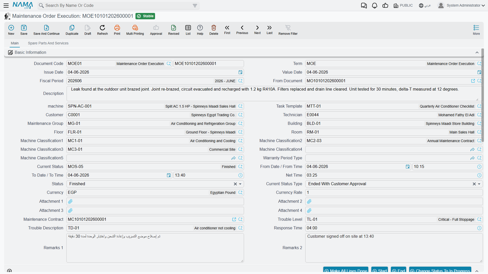

# Order Executions

The execution sheet is the technician's document. One is produced for each machine on the
[maintenance order](/modules/crm/maintenance-cycle/crm-maintenance-orders.md), it carries that
machine's checklist, it has a start button and an end button that time the job, and it has a grid
where the technician writes down the spare parts he actually fitted.

Everything in that sentence is true and useful. But there is one thing the sheet does not do, and
getting it wrong is the single most expensive mistake in this module.

::: danger The execution moves no stock and no money
The spare-parts grid on an execution looks exactly like an inventory document — warehouse, locator,
lot, serial, quantity. **It is not one.** Committing an execution creates no accounting entry and
issues nothing from any store. The parts the technician records here stay in stock as far as the
system is concerned until a
[maintenance invoice](/modules/crm/maintenance-cycle/crm-maintenance-invoicing.md) is saved, or
until somebody presses *Spare parts issue* and saves the supply-chain document that opens.

Nothing checks that either happened. A branch that treats the execution as the stock-consuming
document will have a warehouse that never reconciles, and the discrepancy grows with every job.
:::

::: info Required licence
`crm-maintenance`
:::

## Producing the executions

Executions are never typed from scratch in normal use. On the committed order you press one of two
buttons:

- **Create execution for all lines** — one execution per machine line;
- **Create execution for selected lines** — the same, limited to the machine lines you ticked.

Both require the order's [document term](/modules/crm/document-terms/crm-maintenance-terms.md) to
name an **execution book and term**; without them the buttons fail. Each execution is created and
committed for you, its reference is written back into the order's machine line, and the order's
status type moves to *In Progress*.

On 1 April 2026 the three machine lines of order `MO-0513` produce three executions:

| Execution | Machine | Checklist | Start | End | Net time |
|---|---|---|---|---|---|
| `OEX-0771` | `MCH-00311` Chiller No. 1 | Chiller Monthly Checklist (3 tasks) | 08:00 | 11:30 | 3:30 |
| `OEX-0772` | `MCH-00312` Chiller No. 2 | Chiller Monthly Checklist (3 tasks) | 11:45 | 13:15 | 1:30 |
| `OEX-0773` | `MCH-00318` Air Handling Unit | AHU Monthly Checklist (3 tasks) | 14:00 | 15:00 | 1:00 |
| | | | | **On site** | **6:00** |

Which checklist arrives depends on one option on the order's term. Normally the tasks come from the
**machine line's own task template**; tick *Consider task templates tasks when creating executions*
and they come from the **header** template instead. See
[Task Templates](/modules/crm/maintenance-setup/crm-maintenance-task-templates.md).

Pressing the buttons again does not duplicate anything — the existing executions are updated in
place.

## What the technician sees

**Main page.** The order in *From document*, the machine, the task template, customer, technician,
maintenance group, building, floor, room, the five machine classifications, warranty period type,
current status, a *from date and time* pair, a *to date and time* pair, the calculated **net time**,
a **status** (*In Progress* / *Finished* / *Re-Open*), currency and rate, six attachment slots, the
maintenance contract, trouble level, trouble description, response time and two remark boxes.

**Tasks grid.** The checklist itself: a *done* tick, the task, a second task column, remarks and two
attachments per line. **Mark all lines done** ticks the lot in one press.

**Dysfunctions grid.** Faults found while working, with the same old-warranty / new-warranty blocks
as the order.

**Spare parts and services page.** Two grids — the parts fitted and the services performed — each
with item, machine, quantity, unit of measure, unit price, discount, net value and the item
dimensions.

On the three executions of `MO-0513` the technician records `SP-FLT-14` × 4 and `SP-OIL-05` × 1 on
`OEX-0771`, `SP-FLT-14` × 2 on `OEX-0772`, and nothing on `OEX-0773` — six filters and one oil in
total, matching the order's grid exactly.

## The three timing buttons

**Start** sets the status to *In Progress* and stamps today's date and the current time into the
*from* pair if they are empty. **End** sets the status to *Finished*, stamps the *to* pair and
computes the net time as the difference. **Re-Open** sets the status back to *Re-Open*.

All three only write values into the screen in front of you — **the document is not saved by
pressing them.** If the technician presses End and closes the browser, nothing was recorded.

## What committing an execution does

| Effect | Result |
|---|---|
| **Ledger** | None. There is no accounting logic on this document at all, and its document term has no accounting pages — only tax plan, taxable, modifiable tax and "allow editing header tax in details". |
| **Stock** | **None.** See the box at the top of this page. |
| **On the order** | The execution's status is written into the matching machine line's *execution status*; the order's status type becomes *In Progress* while any line is still running and *Finished* once they all report finished; the execution's current status is pushed onto the order. |

Nothing else changes. In particular the contract entitlement is untouched — that was drawn down when
the order was committed — and the machine's *Last Visit Date* is **not** updated, here or anywhere
else.

## Getting the parts out of the store

Two buttons on the spare-parts page open a supply-chain document pre-filled from the execution's
lines:

| Button | Opens |
|---|---|
| Spare parts issue request | A stock issue **request**, which somebody then approves and issues |
| Spare parts issue | A stock **issue** — the real inventory document |

Both open in a pop-up as an unsaved draft. Nothing moves until you save it.

::: warning One route, not two
The maintenance invoice can generate its own stock issue from the same lines when its term says so.
These buttons are an **alternative** to that, never a supplement — saving both takes the same parts
out of stock twice, with no netting and no link between the documents. Decide once, per
installation, which route you use, and train the branch on it.
:::

A third button, **Create sales quotation for priceless lines**, collects every spare-part and
service line whose unit price is empty or zero and opens a supply-chain sales quotation containing
just those items. It is the "we need a price for this before we can bill it" helper.

## Straight to the invoice

**Create maintenance invoice** on the execution opens an unsaved invoice draft: the header is
copied, the execution's machine is promoted into an invoice machine line, and the spare-part and
service grids come across. Review it and save it — see
[Maintenance Invoicing](/modules/crm/maintenance-cycle/crm-maintenance-invoicing.md).

::: warning The execution validates nothing
An execution can be saved with no machine, no dates, no tasks ticked and no parts at all. There is
no completeness rule of any kind on this document, so whatever discipline you want around it has to
come from your own procedures. In particular, an execution reporting *Finished* is not evidence that
the work was done, that the checklist was worked through, or that the parts left the store.
:::

**Reporting: none.** This module ships no system reports, and this screen has no print form. The
order screen carries an embedded list of the executions raised against it, which is the closest
thing to a job-card report the module offers; beyond that, use the list view and its Excel export.
