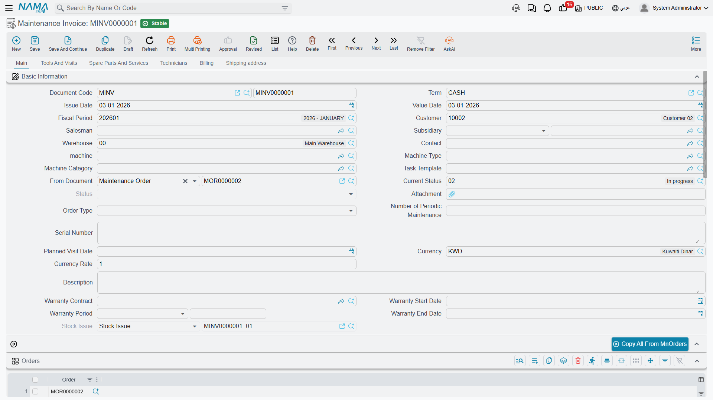

# Maintenance Invoicing

The maintenance invoice is the document that makes everything real. Up to this point the
[order](/modules/crm/maintenance-cycle/crm-maintenance-orders.md) has drawn quantities down from the
contract and the [executions](/modules/crm/maintenance-cycle/crm-maintenance-executions.md) have
recorded what the technician did — but no money has moved and no part has left the store. The
invoice does both.

::: danger The invoice is where stock and money move
Say this out loud to anybody learning the module: **the execution sheet records the parts, the
invoice issues them.** If your branch treats the technician's execution as the stock-consuming step,
the store will never reconcile — the parts are still there in the system and the customer was never
charged.
:::

::: info Required licence
`crm-maintenance`
:::

## Raising the invoice

On 5 April 2026 the back office presses **Create Maintenance Invoice** on order `MO-0513`. An
unsaved draft opens in a pop-up with the header and every grid already copied; the clerk checks it
and saves it as `MINV-0298`. The same button exists on the execution, and produces the same kind of
draft from the execution's lines.

Three other routes fill an invoice:

- type it, list the relevant orders in the *Orders* grid and press **Copy all lines from orders** —
  every detail line of every listed order is appended;
- type it and pick a predecessor in *From document*, letting the standard copier bring the header
  and grids across;
- type the lines by hand.

Nothing links these routes to each other. Listing the same order on two invoices copies its lines
twice, and no warning appears.

## What `MINV-0298` looks like

| Header | Value |
|---|---|
| From document | `MO-0513` |
| Customer | `C-01188` Marina Plaza Hotels |
| Salesman | `EMP-1042` Hala Samir Abdel Rahman |
| Warehouse | `WH-ALX` Alexandria Store |
| Maintenance contract | `MC-0021` |
| Stock issue *(read-only, filled on save)* | `SI-1904` |

| Spare parts | Quantity | Unit price | Net value |
|---|---|---|---|
| `SP-FLT-14` Air filter 14 in | 6 | 300.00 | 1,800.00 |
| `SP-OIL-05` Compressor oil 5 L | 1 | 600.00 | 600.00 |
| **Total spare parts** | | | **2,400.00** |

| Services | Quantity | Unit price | Net value |
|---|---|---|---|
| `MSV-01` Chiller periodic maintenance visit | 3 | 1,200.00 | 3,600.00 |
| **Total services** | | | **3,600.00** |

| Invoice totals | |
|---|---|
| Total (2,400.00 + 3,600.00, no returns) | **6,000.00** |
| Sales tax 14 % (336.00 on parts + 504.00 on services) | **840.00** |
| Net value | **6,840.00** |

The invoice does **not** compute itself from the execution's hours or from the contract's totals. It
bills the lines that are physically on it — the spare-parts grid plus the services grid, minus the
returned-spare-parts grid — and the header totals are simply the sum of those grids.

## Where the prices come from

| Line | Default price | Overridden by |
|---|---|---|
| Spare part | The supply-chain **sales price list** | The **maintenance contract**, when the same item is on the contract with quantity remaining |
| Service | The service catalogue record's own price | The same contract line rule |

So on `MINV-0298` the filters are 300.00 apiece, the contract price, not the 350.00 on the price
list; and the periodic visit is 1,200.00, not the 1,500.00 on the
[service catalogue](/modules/crm/maintenance-setup/crm-maintenance-service-catalogue.md). Every
price remains editable; nothing stops an operator typing something else.

::: danger Coverage is checked by quantity only — there is no date check anywhere
The invoice copies the machine's warranty contract and its start and end dates into its header
boxes, and then does nothing with them. **No code compares the work date to a warranty period or to
a contract end date, and no code decides whether the customer should be charged.** The only sense in
which work is "covered" is that the contract still has quantity left, at the contract's price — a
contract that prices a service at zero produces a zero-value line, and that is the whole mechanism.

A machine whose contract expired last year is priced, drawn down and billed exactly like a machine
under a live contract. Whether to charge is a human decision, taken on this screen.
:::

## What committing the invoice does

| Effect | Result |
|---|---|
| **Ledger** | **Yes.** On `MINV-0298`: debit the customer receivable (subsidiary `C-01188`) 6,840.00; credit spare-parts revenue 2,400.00, maintenance-service revenue 3,600.00 and sales tax payable 840.00. The sides come from the invoice's [document term](/modules/crm/document-terms/crm-maintenance-terms.md). |
| **Stock** | **Yes**, when the term names a stock-issue book and term and ticks *Generate stock issue with spare parts* and/or *with service items*. A supply-chain **Stock Issue** `SI-1904` is created from `WH-ALX` carrying `SP-FLT-14` × 6 and `SP-OIL-05` × 1, and its reference appears read-only on the invoice. |
| **Contract entitlement** | **Unchanged here.** The draw-down happened when the order was committed; this invoice's *From document* is the order, not the contract. An invoice raised directly from a contract does draw the contract down. |
| **Machine fault-warranty history** | Only if the invoice term ticks *Update Machine Dysfunction Warranties* — and then only if the order term does **not**, see below. |

Both effects are created as **business requests** and processed in the background, so the document
saves instantly. If one fails, retry it from the **Business Requests** list view: filter by status,
select the rows and use **More → Reprocess**.

Cancelling the invoice deletes the generated stock issue and withdraws the accounting entry;
re-saving the invoice updates the stock issue in place, and removing every generating line deletes
it altogether.

## The rules that keep it honest

::: warning Enable stock generation on exactly one document term
The [Maintenance Estimation](/modules/crm/maintenance-cycle/crm-maintenance-estimations.md) can also
generate a stock issue, from the same order lines, with no netting and no link between the two
documents — and the *Spare parts issue* buttons on the order, the execution and this screen open
supply-chain documents from those same lines as well. Any two of these routes used together issue
the parts twice.

Choose **one** — normally the maintenance-invoice term — and leave stock generation off everywhere
else.
:::

::: warning *Update Machine Dysfunction Warranties* may be ticked on the order term or the invoice term, but not both
With both ticked, the invoice raised from that order is refused outright, with a message telling you
to select the option in only one of the two.
:::

::: warning The generated stock issue keeps almost none of your line detail
Only the **item, quantity and unit of measure** are carried across, plus the header: the CRM
document's book and term pairing, the **header warehouse**, the subsidiary and the source document.

That means the **per-line warehouse and locator are dropped**, and so are prices, item dimensions
and remarks. A repair whose parts come from two different stores cannot be issued correctly from
this document — everything leaves the header warehouse. And if the header warehouse is empty, the
invoice fails at save with a technical error rather than a clear validation message, so fill it
before you save.

One related trap: an invoice saved on a document term whose configuration was never filled in also
fails with a technical error instead of a readable message. If saving an invoice produces an
unexplained failure, check the term first.
:::

::: warning An account side that takes its subsidiary from the salesman does nothing here
The same configuration works on the maintenance order and the order request, and is silently ignored
on the invoice, even though the invoice has a salesman on it. Use the customer subsidiary on the
invoice's account sides.
:::

## Payments on the invoice

The invoice carries the full payments block: a payment-schedule template, a **Generate payments**
button that expands it into schedule lines, and buttons to generate a receipt voucher for the
selected payments, generate one receipt voucher, or collect existing receipt vouchers. The totals
group shows the total, discount, cash amount, technicians' reward, net value, vouchers' payments,
total paid and remaining. None of this changes what was billed — it is collection, not pricing.

## The invoice return

**Maintenance Invoice Return** is the mirror document, raised with the invoice in *From document*.
Its spare-parts grid *is* the return (there is no separate returned-parts grid), and instead of a
stock issue it carries a read-only **stock receipt** reference. Its term is shaped like the
invoice's, with a stock-**receipt** book and term and *Generate stock receipt with spare parts / with
service items*.

Committing it reverses the accounting entry and receipts the parts back into the header warehouse.

::: danger A return does not give contract entitlement back — it consumes more
Returning two filters against a contract does not restore two to the remaining quantity. It draws
**two more** down, in the same direction as the invoice: sold goes up, remaining goes down. Later
orders are then wrongly refused for exceeding the remaining quantity.

There is no button that fixes this. After a return, open the maintenance contract and correct the
sold and remaining quantities on the affected lines by hand.
:::

The return also inherits the header-warehouse rule above: the generated stock receipt takes item,
quantity and unit of measure only, and everything comes back into the header warehouse.

**Reporting: none.** This module ships no system reports, and this screen has no print form. For
revenue and consumption figures use the list views and their Excel export, the general ledger, or
BI over the generated stock and accounting documents.
