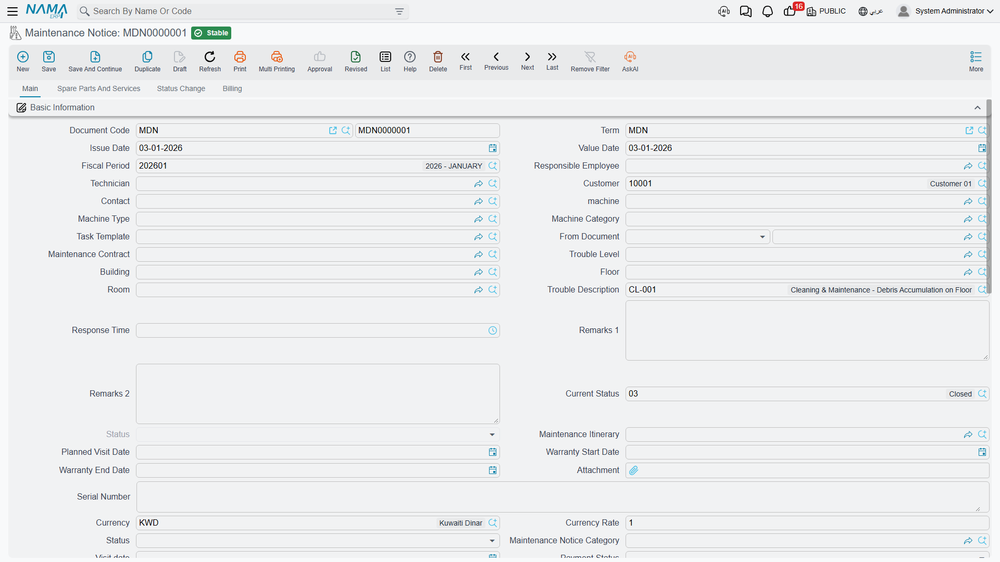
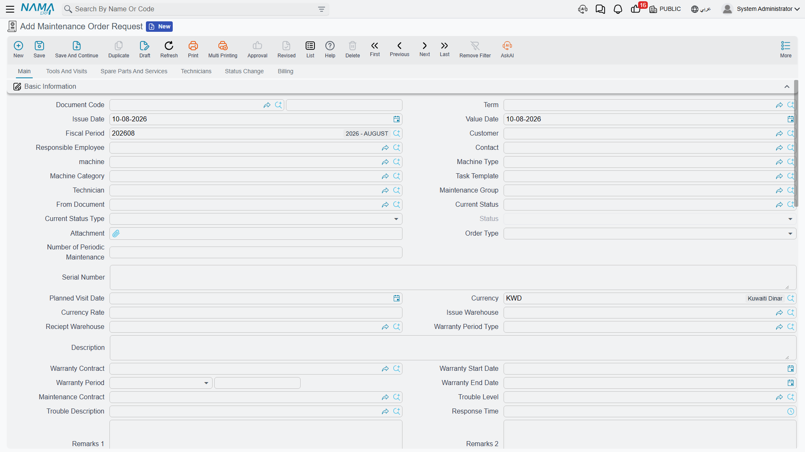

# Notices and Requests

Not all maintenance is planned. On 20 May 2026 Marina Plaza rings Al Nokhba: chiller 2 is losing cooling capacity and there is a smell of refrigerant in the plant room. Nobody has a work plan for that. What the call centre types is a **Maintenance Notice** — `MNOT-0140` — and from there the reactive path runs to a maintenance order in exactly the same way the preventive path does.

This page covers the two documents that sit in front of a maintenance order: the **notice**, which is the customer's call-in, and the **maintenance order request**, which looks like an approval step and is not one.

Menu: **CRM → Maintenance Documents → Maintenance Notice** and **… → Maintenance Order Request**.

::: info Required licence
`crm-maintenance`. The notice has **no document term (توجيه) at all**, so there is nothing to configure on it. The request shares the maintenance order's term — and that is where the trouble is; see below.
:::

## The Maintenance Notice

A notice is a fault log with a customer's name on it. `MNOT-0140` reads:

| Field | Value |
|---|---|
| Value date | 2026-05-20 |
| Customer | `C-01188` Marina Plaza Hotels |
| Machine | `MCH-00312` Chiller No. 2 |
| Notice category | `NC-01` Customer call-in |
| Trouble level | `TL-02` Medium |
| Trouble description | `TD-07` Reduced cooling capacity |
| Dysfunction | `DYS-021` Refrigerant leak |
| Technician | `EMP-2014` Sayed Morsy |

Picking the machine does most of the typing for you: the customer, contact, serial number, warranty dates and the building, floor and room all fill in from the machine file. The categories on the right come from the fault catalogues — see [Fault Catalogues](/modules/crm/maintenance-setup/crm-fault-catalogues.md).

**The main page** also carries the responsible employee, machine type and category, task template, the maintenance contract, a full address block with a map location, an attachment, a ticket status, a visit date, a payment status, and two fields written by the dispatch document: **maintenance itinerary** and **planned visit date**. Below the header sit a **Machines** grid, a **Dysfunctions** grid — the fault, the machine, a free-text detail, a proposed solution — and a totals group.

**The spare parts and services page** holds the parts and services expected for the repair, with prices, taxes and totals.

**The status change page** shows a system-written history of status changes (from status, to status, date, user, remark). You cannot add, edit or remove a line in it — only the system writes there when the current status changes. Underneath it sits something more interesting, which the next section covers.

**The Billing page** has a payment-schedule template, a **Generate Payments** button, schedule lines, payment documents and payment methods.

::: danger A notice records money and does nothing with it
The notice recalculates the spare-part totals, the service totals, the header money block and the whole payment schedule as you type — and then **none of it reaches anything**. There is no accounting entry, no stock movement, no receivable, no customer balance and no document term to configure one. A notice is a **fault log**, and pricing it is bookkeeping for your own eyes only.

Two matching quirks to expect while you are on the screen:

- Every machine line's **Total Price Of Services** is written as **zero**, whatever you put in the services grid.
- The document is nevertheless refused if the payment-schedule lines do not add up to the money net value — a validation on a schedule that has no effect. If a notice will not save, that is usually why.
:::

## Technician Attendance from the Mobile App

The notice doubles as the attendance document for field technicians. When a technician using Nama Mobile checks in and out on a call, the entries are recorded against the notice and are visible as a read-only list on the notice's **status change** page — who was on site, and between which times.

That is the whole feature: a visible record of arrival and departure against the job. Nothing is compared to a shift, nothing reaches payroll, and no rule stops a technician checking in twice.

## From a Notice to a Maintenance Order

There is no *Convert to Order* button. On 21 May somebody creates a **Maintenance Order** by hand and picks `MNOT-0140` in **From document**. That copies the header machine and the common header data across, along with the maintenance-group, spare-part, service, dysfunction, machine, tool and technician grids — unless the order's document term ticks *Do not copy header data of from-doc* or *Do not copy details of from-doc*.

The result is `MO-0527`, a normal maintenance order carrying everything the call centre recorded. From there the cycle is the same as the preventive one — see [Maintenance Orders](/modules/crm/maintenance-cycle/crm-maintenance-orders.md).

::: tip Dispatching a day's notices
If your branch works by route rather than by call, the **CRM Maintenance Plan** and **Maintenance Itinerary** pair is the tool: a plan lists the day's routes with a technician on each and the notices to be served, and saving it stamps the technician, the route and the planned visit date onto every notice listed. That is a genuine automatic effect — the one place in this area where saving a document changes another one.

It is daily dispatch, not preventive scheduling, and the route capacity figures are never enforced. See [Daily Dispatch](/modules/crm/maintenance-cycle/crm-maintenance-dispatch.md).
:::

## The Maintenance Order Request

The request exists so that work can be reviewed before it becomes an order. It shares the maintenance order's screen almost exactly — the same header, the same machines, dysfunctions, spare parts, services, technicians and status-change pages — with the working parts taken out. On a request there is no **Create execution** button, no **Create maintenance invoice**, no **Spare parts issue**, no **Spare parts receipt**, no **Tools issue**, no embedded visits list and no shipping address page.

It also validates like an order: the per-technician rewards must sum to the header reward, every machine used in a detail grid must appear in the machines grid, the same machine and task template may not appear twice, and a quantity greater than what the contract has left is refused.

::: warning Nothing converts a request into an order
There is no approve action and no convert action. When the work is agreed, somebody creates a **Maintenance Order** and picks the request in **From document** — the same manual step as from a notice. The request is not marked, not closed and not consumed, and the same request can be used as the source of any number of orders. The review it is named for is a human procedure, not a system one.
:::

::: danger A request creates an accounting entry if its term has accounts on it
The request shares the maintenance order's document term, and that term has an **Effect** page with a debit and a credit side. Those sides are read on the request exactly as they are on the order: fill both in, and saving a document whose entire purpose is to *ask* for work books a journal entry against the customer.

Leave the debit and credit sides on the maintenance order term **empty** unless you deliberately want orders and requests to book — in the normal configuration the [maintenance invoice](/modules/crm/maintenance-cycle/crm-maintenance-invoicing.md) is the only document in the cycle that reaches the ledger. See [Maintenance Document Terms](/modules/crm/document-terms/crm-maintenance-terms.md).
:::

Requests move no stock in any configuration.

## When to Use Which

| Situation | Document |
|---|---|
| A customer reports a fault | **Maintenance Notice** — it is the only document with the fault catalogues, the address block and the mobile attendance record on it |
| Work needs signing off internally before a technician is committed | **Maintenance Order Request**, understood as a piece of paper someone has to read — with its accounting sides left empty |
| A planned preventive visit | Neither. Those come from the [work plan](/modules/crm/maintenance-cycle/crm-maintenance-work-plans.md) |

## Reporting

**Reporting: none.** This module ships no system reports, and this screen has no print form. To review open call-ins, use the notice list view with saved criteria (المعايير) — filtered by notice category, trouble level or planned visit date — and export to Excel.
