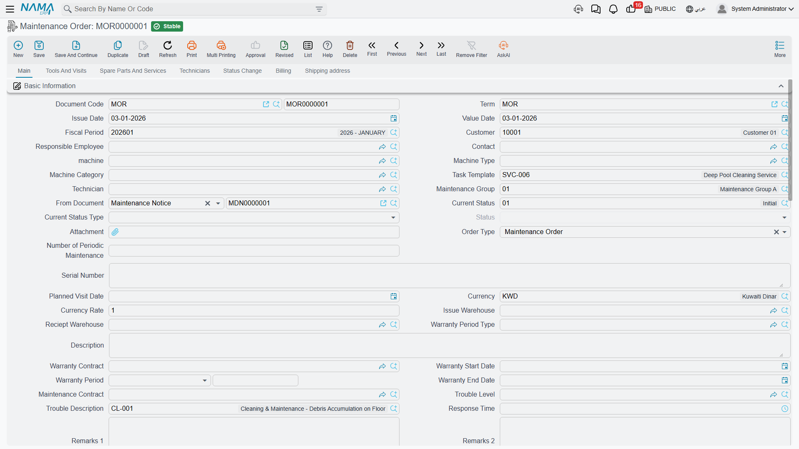

# Maintenance Orders

On 1 April 2026 Nahed El Gindy opens maintenance work plan `WP-0087` and presses **Generate
Maintenance Orders**. The plan holds three lines — the April monthly visit for chiller `MCH-00311`,
the same for chiller `MCH-00312`, and the monthly visit for the air-handling unit `MCH-00318`. All
three share the same expected date, the same technician (`EMP-2011`, Mahmoud Adel Hassan) and the
same building, so the system groups them into **one** document: maintenance order `MO-0513`.

That order is where the maintenance suite does its real work. It says which machines are being
worked on, what faults were found, which spare parts and services the job needs, who the technicians
are and what each of them is owed. It draws the pre-paid quantities down from the contract, it can
write a fresh warranty onto a repaired fault, and — if you configure it that way — it can create a
journal entry. What it does **not** do is move a single part out of the store; that only ever
happens through the [invoice](/modules/crm/maintenance-cycle/crm-maintenance-invoicing.md).

::: info Required licence
`crm-maintenance`
:::

## Where an order comes from

There are five routes onto this screen, and only one of them is automatic:

| Route | How | Automatic? |
|---|---|---|
| From a **maintenance work plan** | *Generate Maintenance Orders* on the work plan | Yes — the orders are created and committed for you |
| From a **maintenance notice** | Type the order, pick the notice in *From document* | No |
| From a **maintenance order request** | Type the order, pick the request in *From document* | No |
| From a **maintenance contract** | Type the order, pick the contract in *From document* | No |
| From nothing at all | Type it | No |

When you pick a predecessor in *From document*, a copier brings the header data and the maintenance
group, spare-part, service, fault, machine, tool and technician grids across — unless the order's
[document term](/modules/crm/document-terms/crm-maintenance-terms.md) ticks *Do not copy header data
of from-doc* or *Do not copy details of from-doc*. A **contract** is the exception: from a contract
only the maintenance-group lines are copied.

::: warning Nothing converts a request or an estimation into an order
The Maintenance Order Request looks like an approval step before the order, and the
[Maintenance Estimation](/modules/crm/maintenance-cycle/crm-maintenance-estimations.md) looks like a
quotation that becomes one. Neither is. There is no button on either that produces an order — the
order is typed by hand with the earlier document named in *From document*, and the earlier document
is not marked, closed or consumed in any way.
:::

## The screen, page by page

**Main.** Customer, responsible employee, contact, machine, machine type, machine category, task
template, technician, maintenance group, *From document*, **current status** and **status type**
(see below), attachment, **order type** (*Installation* / *Maintenance Order* / *Periodic
Maintenance*), number of periodic maintenances, serial number, planned visit date, currency and
rate, **issue warehouse** and **receipt warehouse**, warranty period type, warranty contract,
contract start / warranty period / contract end, maintenance contract, trouble level, trouble
description, response time and two remark boxes.

Picking a machine fills the customer, contact, serial number, warranty dates, building, floor and
room from the [machine file](/modules/crm/maintenance-setup/crm-machines.md). By default the
machine's customer **overwrites** anything already typed in the customer box; the CRM setting *Create
invoice with different customer* is what stops that. In the same spirit, the machine lookup only
offers machines belonging to the selected customer unless the CRM setting *Do not filter machine by
customer* is on — which is exactly why machines created by *Generate Machine* with no customer are
invisible here (see [Maintenance Sales](/modules/crm/maintenance-cycle/crm-maintenance-sales.md)).

**Machines grid.** One line per machine being worked on, each with its own task template, odometer
columns, a read-only *execution document* and *execution status*, and a *selected* tick-box that
drives *Create execution for selected lines*. On `MO-0513` there are three lines: `MCH-00311` and
`MCH-00312` with the Chiller Monthly Checklist, `MCH-00318` with the AHU Monthly Checklist.

The header machine is copied into this grid automatically when the document is saved, taking the
place of a blank line. Two rules are enforced: every machine used anywhere else on the document must
also appear in this grid, and the same machine-plus-task-template pair may not appear twice.

**Dysfunctions grid.** The faults found. For chiller 1 the crew records `DYS-014` *High discharge
pressure*, with a free-text detail and a proposed solution. The read-only *old warranty* block on
the line — period type, start, end and remaining days — is filled from the machine's own fault
warranty history, so the technician can see at a glance whether this fault is still covered from a
previous repair. On `MO-0513` it is empty, because this is chiller 1's first recorded fault. The
right-hand columns are the **new** warranty the repair grants: period type `WPT-03M`, start
2026-04-02, end 2026-07-02.

**Spare parts and services.** Two priced grids plus a third for returned parts. Each spare-part line
carries item, machine, quantity, a full price block with four taxes, warehouse and locator, remarks
and the supply-chain item dimensions. Service lines carry a service from the
[service catalogue](/modules/crm/maintenance-setup/crm-maintenance-service-catalogue.md), a
quantity, the price block and their own warranty fields. On `MO-0513`:

| Spare parts | Quantity | Unit price | Net value |
|---|---|---|---|
| `SP-FLT-14` Air filter 14 in | 6 | 300.00 | 1,800.00 |
| `SP-OIL-05` Compressor oil 5 L | 1 | 600.00 | 600.00 |
| **Total spare parts** | | | **2,400.00** |

| Services | Quantity | Unit price | Net value |
|---|---|---|---|
| `MSV-01` Chiller periodic maintenance visit | 3 | 1,200.00 | 3,600.00 |
| **Total services** | | | **3,600.00** |

Order total: **6,000.00**.

**Technicians.** A header *Technicians Reward* box and a grid of technicians with their individual
rewards. The document is refused if the grid does not sum to the header — on `MO-0513`, 300.00 in
the header against `EMP-2011` 200.00 plus `EMP-2014` 100.00. Choosing a maintenance group fills the
grid from that group's members.

**Tools and visits.** A tools grid, a *Tools issue* button, and an embedded read-only list of the
[maintenance visits](/modules/crm/maintenance-cycle/crm-maintenance-visits.md) that point at this
order.

**Status change.** The status history: from status, to status, change date, user and remark. It is
written by the system only — adding, removing or editing a line has the document refused.

**Billing** and **Shipping address** hold the payment-schedule and delivery details; they behave as
they do on any other document of this family.

## Statuses, and the setup step that decides whether any of it works

The *Current Status* box points at an **Order Status** record you defined yourself, and each of
those records carries a **status type** — *Open*, *In Progress*, *On Hold*, *Closed*, *Initial*,
*Re-Open* or *Finished*. That status type is what the system actually reads: it is copied into the
order's own read-only *Status Type*, and the
[executions](/modules/crm/maintenance-cycle/crm-maintenance-executions.md) overwrite it as work
starts and finishes. On `MO-0513` the order opens at `MOS-NEW` (*Open*) and moves to `MOS-WIP`
(*In Progress*) as soon as the first execution is under way.

::: warning A status with no status type records nothing
If the Order Status records in your installation were created without a status type, the whole
lifecycle silently stops working: the order's status type stays blank, the executions have nothing
to move, and no screen tells you why. Check this first — see
[Order and Visit Statuses](/modules/crm/maintenance-setup/crm-maintenance-statuses.md).
:::

There is a second status box, *Current Status Type* (*Reviewed*, *Pending Review*, *Rejected*,
*Ended With Customer Approval*). It is stored and displayed and **nothing reads it**. Treat it as a
note to your colleagues, not as a review cycle.

## Where the prices come from

A spare part is priced from the supply-chain **sales price list** — unless the same item appears on
the maintenance contract this order came from with quantity still remaining, in which case the
**contract price wins**. A service is priced from the service catalogue record, again overridden by
the contract line when there is one. That is why the filters on `MO-0513` are 300.00 each and not
the 350.00 on the price list: `MC-0021` prices them at 300.00.

Every price stays editable on screen. Nothing prevents an operator from typing a different figure.

## Contract entitlement — the only meaning of "covered"

The maintenance contract does not carry a covered/not-covered flag. What it carries is a
**quantity** of pre-paid parts and services at a contract price, and the order draws that quantity
down. Committing `MO-0513` changes `MC-0021` like this:

| Contract line | Was remaining | Ordered | Now sold / remaining |
|---|---|---|---|
| `SP-FLT-14` | 24 | 6 | 6 / **18** |
| `SP-OIL-05` | 4 | 1 | 1 / **3** |
| `MSV-01` | 44 | 3 | 3 / **41** |

Ask for more than the contract has left and the order is refused, naming the item and the contract.

::: danger Coverage is a quantity, not a date
The order fills its *Warranty Contract*, *Contract Start* and *Contract End* boxes from the machine
and then stops. **No code compares the work date to the warranty period or the contract end date,
and no code decides whether the customer should be charged.** Work on a machine whose contract
expired last year is priced, drawn down and billed exactly like covered work. Deciding what to
charge for is entirely a human decision, taken on this screen.
:::

## What committing the order does

| Effect | Result |
|---|---|
| **Ledger** | Only if both the debit and the credit side are configured on the order's document term. Then the order creates a plain two-sided journal entry — one line per spare-part line, one per service line, and one **negated** line per returned spare part. On `MO-0513` the term deliberately leaves both sides empty, so no entry is created; the invoice is what reaches the ledger. |
| **Stock** | **None.** No part leaves any store because of this document. |
| **Contract entitlement** | Drawn down as shown above. |
| **Machine fault-warranty history** | If the term ticks *Update Machine Dysfunction Warranties*, each fault line that grants a new warranty writes a row into the machine's own warranty history. `MCH-00311` gains: `DYS-014` · `MO-0513` · 2026-04-01 · `WPT-03M` · start 2026-04-02 · 92 days · end 2026-07-02. Cancelling or editing the order cleans those rows up again. |
| **Warranty contract** | Only for an *Installation* order — see the next section. |

The accounting entry, where there is one, is created as a **business request** and processed in the
background, so the document itself saves instantly. If processing fails, the request is retried from
the **Business Requests** list view: filter by status, select the rows and use **More → Reprocess**.

::: warning Tick *Update Machine Dysfunction Warranties* in one place only
The same option exists on the order term and on the invoice term. If both carry it, the invoice
raised from that order is **refused outright** with a message telling you to select it in only one
of the two files. Pick one — normally the order term, since that is where the fault is recorded.
:::

## An Installation order creates a contract behind your back

When *Order Type* is **Installation** and the order's document term names a warranty-contract book
and term, committing the order **creates and commits a maintenance contract** of type *Warranty
Contract*. It copies the warranty period and dates, the machine, serial, customer and contact, and
the machines, spare-part and service grids. Cancelling the order — or changing its type away from
Installation — deletes that contract again.

::: danger The generated warranty contract carries the full money block
The copy includes the whole money block, not just the coverage. A maintenance contract has its own
full invoice-style accounting effect, so if the term you nominated for the generated contract has
debit and credit sides configured, **the same amount is booked twice** — once by the order (or later
by the invoice) and once by the contract that appeared on its own. Nothing warns you. Nominate a
warranty-contract term with **no** accounting sides.
:::

## The Maintenance Order Request

The request shares this screen and is meant to be the "please do this work" step before the order.
In practice it is the order screen with most of its buttons removed: no executions, no invoice, no
spare-parts issue, no tools issue, no visits list, no shipping address. It is covered with the
notices on
[Notices and Requests](/modules/crm/maintenance-cycle/crm-maintenance-notices-and-requests.md).

::: warning A request creates a journal entry
Despite being a request, it uses the same accounting logic as the order: if its document term has
debit and credit sides configured, saving it creates an accounting entry. Leave those sides empty on
the request term unless you genuinely want a document that only *asks* for work to hit the ledger.
:::

## The buttons that push parts out of the store

Three buttons on this screen open a supply-chain document in a pop-up, pre-filled from the order's
grids. Nothing is saved until you save it:

| Button | Opens |
|---|---|
| Spare Parts Issue Request | A stock issue request for the spare-part lines |
| Returned Spare Parts Receipt Request | A stock receipt request for the returned spare-part lines |
| Tools Issue Request | A stock issue request for the tools grid |

::: warning These are an alternative to invoice-driven issuing, never a supplement
The invoice generates its own stock issue from the same lines. If a technician issues the parts from
here and the back office then saves an invoice whose term generates stock, **the parts leave the
store twice** — there is no netting, no "already issued" flag and no link between the two documents.
Decide once, per installation, which of the two routes you use.

One more oddity on this screen: two buttons are both labelled **Tools Issue Request**, and one of
them actually opens a stock **receipt** request. Read the document that opens before you save it.
:::

## Moving on

From a committed order the normal path is *Create execution for all lines* (or tick the machines you
want and use *Create execution for selected lines*), then billing. Both are covered on their own
pages: [Order Executions](/modules/crm/maintenance-cycle/crm-maintenance-executions.md) and
[Maintenance Invoicing](/modules/crm/maintenance-cycle/crm-maintenance-invoicing.md). The button
*Create Maintenance Invoice* on this screen opens an unsaved invoice draft with the header and every
grid copied across — review it and save it yourself.

**Reporting: none.** This module ships no system reports, and this screen has no print form. Use the
list view, its Excel export, or BI.
