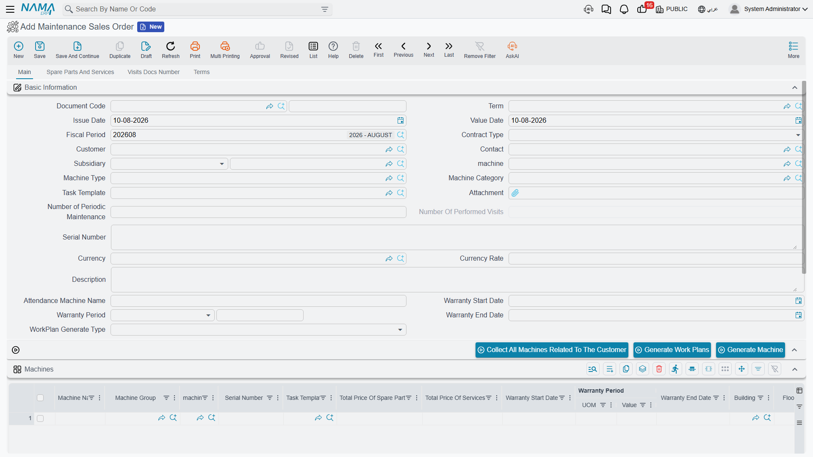

# Maintenance Sales Quotations and Orders

Before Al Nokhba can maintain anything at Marina Plaza, it has to sell the hotel the plant and the maintenance deal. That conversation runs on two documents: a **Maintenance Sales Quotation** on 3 February 2026 (`MSQ-0033`) offering two 300 TR chillers, one air-handling unit and a one-year maintenance contract, and a **Maintenance Sales Order** a week later (`MSO-0029`) once the hotel says yes.

Both live under **CRM → Maintenance Documents**, and both are best understood as what they are: paperwork with one useful button on it.

::: info Required licence
`crm-maintenance`. Neither document has a document term (توجيه) at all, so there is nothing to configure for them and no accounting or generation settings to get wrong.
:::

## What They Actually Do

::: warning These two documents have no effects of any kind
A maintenance sales quotation and a maintenance sales order **create no accounting entry, move no stock, generate no supply-chain document and do not create the maintenance contract**. Saving one changes nothing anywhere else in the system. Treat them as a record of the offer and the acceptance, not as a step that makes something happen.
:::

That is not a criticism of using them — a signed sales order is a perfectly good thing to have on file, and it is the natural predecessor of the contract. It just means nobody should wait for something to happen after saving one.

Two smaller consequences of the same fact are worth knowing so that you do not chase them as bugs:

- The **per-machine totals** on the Machines grid (total price of spare parts, total price of services) are never filled in on these two documents. They stay empty however you price the lines.
- The **remaining quantity** column on the spare-parts and services grids simply mirrors the quantity you typed. Nothing on these documents consumes anything, so nothing is ever subtracted.

## The Screen

The quotation, the order and the [Maintenance Contract](/modules/crm/maintenance-cycle/crm-maintenance-contracts.md) share one screen layout, so most of what the contract page explains applies here too. The differences are small and easy to list.

**Main page.** Contract type (*Maintenance Contract* or *Warranty Contract*), customer, contact, subsidiary (الذمة), machine, machine type, machine category, task template, number of periodic maintenances, serial number, currency and rate, the warranty start date, warranty period and warranty end date, and the work-plan generation type. On top of the shared fields these two documents add a free-text **machine name** in the header, and **machine name** and **machine group** columns in the Machines grid — those two columns are the ones the *Generate Machine* button reads.

**Machines grid.** The same wide grid as the contract: machine, serial, task template, warranty dates, building, floor and room, maintenance period, number of visits, the seven **Visit Type** columns each followed by its own task template, planned visit date, maintenance group, technician, the five classifications and remarks.

**Spare parts and services page.** The items and services being offered, with quantities, unit prices, discounts, taxes and net values, and their totals.

There is no Billing page on either document — the payment schedule belongs to the contract.

## Generate Machine

This is the one button that does something. It appears on the **Maintenance Sales Order** only, and it creates a real machine file for every line in the Machines grid that does not already point at one, naming it from the typed machine name and coding it from the chosen machine group.

On 10 February Hala presses it on `MSO-0029` and three machine files appear: `MCH-00311`, `MCH-00312` and `MCH-00318`.

::: danger Generate Machine creates shells, not finished machines
The button copies only the **building, floor and room**, the **task template**, the **warranty period** and the line's dimensions (محددات). It does **not** copy the customer.

That matters because the machine lookup on every later maintenance document is filtered to the selected customer's machines. A machine created this way and left alone is therefore **invisible** on the next maintenance order, contract or notice — the user searches for it, finds nothing, and assumes it was never created.

After pressing the button, open each generated machine and fill in at least:

- **Customer** (and contact)
- **Item**
- **Machine Type** — this is where the spare-parts list and the task defaults really live
- **Serial Number**
- **Sale Date** and **Installation Date** — the warranty dates are computed from these

Only then is the machine usable. See [The Machine File](/modules/crm/maintenance-setup/crm-machines.md) for the full record and [Machine Types and Categories](/modules/crm/maintenance-setup/crm-machine-types-and-categories.md) for where the defaults come from.
:::

In our example that second step happens on 11 February: each of the three machines is opened and given its customer `C-01188`, its item (`AC-CHL-300` twice, `AC-AHU-12` once), its machine type, its serial number (`CHL300-2026-0021`, `CHL300-2026-0022`, `AHU12-2026-0004`) and its sale and installation dates.

## The Button That Does Not Work Here

::: warning Generate Work Plans is visible on these screens and fails when pressed
Because the quotation, the order and the contract share a layout, the **Generate Work Plans** button appears on all three. It only functions on a maintenance contract. Pressed on a maintenance sales quotation or a maintenance sales order it produces a technical error and no work plans.

Work plans come from the contract, and only from the contract — see [Maintenance Work Plans](/modules/crm/maintenance-cycle/crm-maintenance-work-plans.md).
:::

The same is true of **Collect All Machines Related To The Customer**, which is a genuine convenience on the contract but has nothing useful to do here, since these documents are usually about machines that do not exist yet.

## Moving On to the Contract

There is no button that turns a sales order into a maintenance contract. You create the contract yourself and pick the sales order in **From document**, which brings across the customer, the salesman and the contact — and nothing else. Everything that makes a contract a contract (the machine lines with their visit types, the pre-paid quantities, the start and end dates, the payment schedule) is typed on the contract.

In our example, `MC-0021` is created on 18 February 2026 with `MSO-0029` in **From document**. That is the whole handover.

::: tip Pick the quotation on the sales order
Between the quotation and the order the copying is richer: choosing `MSQ-0033` in the sales order's **From document** brings the header machine and common header data across, plus the maintenance-group, spare-part, service, dysfunction, machine, tool and technician grids — unless the document term switches that copying off. Since neither of these two documents has a term, on these two you always get the full copy.
:::

## Reporting

**Reporting: none.** This module ships no system reports, and this screen has no print form. If you need a printed quotation for the customer, that is something your implementer builds as a custom print form, or you export the list view to Excel.
