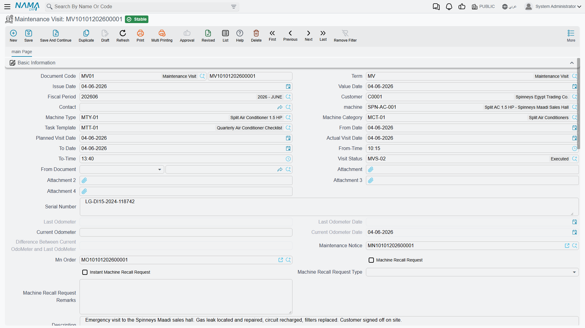

# Maintenance Visits

A Maintenance Visit is a log entry. Somebody went to the site, the visit happened, and afterwards a
document is typed to say so. That is the whole of it — and saying it plainly at the start saves a
great deal of confusion, because everything about the name suggests the opposite.

::: warning A maintenance visit is never generated by anything
Not by the contract, not by the work plan, not by the order, not by a scheduler — there is no
scheduler anywhere in this module. The preventive series you set up on a
[maintenance contract](/modules/crm/maintenance-cycle/crm-maintenance-contracts.md) expands into
[work plans](/modules/crm/maintenance-cycle/crm-maintenance-work-plans.md) and then into
[maintenance orders](/modules/crm/maintenance-cycle/crm-maintenance-orders.md). It never produces a
single Maintenance Visit document. If you want visits recorded, somebody types them.
:::

::: info Required licence
`crm-maintenance`
:::

## Why you would type one

Because it is the only document that moves the contract's **performed-visit counter**, and the only
one that updates the machine's odometer.

On 1 April 2026, after the three chiller and AHU jobs are executed, the Alexandria office types
`MVIS-0055`: *From document* = the maintenance contract `MC-0021`, machine `MCH-00311`, visit status
`MVS-DONE` (*Visit Completed*), actual visit date 2026-04-01, current odometer (running hours)
1,240.

Saving it does three things and nothing else:

| Effect | Result |
|---|---|
| **On the contract** | *Number Of Performed Visits* on `MC-0021` is recounted — from 0 to **1**. |
| **On the machine** | The machine's odometer pair is brought up to date from the visit's readings. |
| **On the order** | Any lines in the visit's *Additional spare parts* grid are pushed into the linked order's own *Additional spare parts* grid. |

**Ledger: none. Stock: none.** A visit is not a billable document and never becomes one; to charge
for a visit you invoice the service line on the order.

## The screen

It is a single page. Customer, contact, machine, machine type and category, task template; a *from
date* and *to date* with *from time* and *to time*; a **planned visit date** and an **actual visit
date**; the **visit status**; *From document*; four attachments; the serial number; the odometer
block (last odometer and its date, current odometer and its date, and a calculated difference); the
linked notice and the linked order; and a **machine recall request** block — a flag, an "instant"
flag, a recall type and free-text remarks.

Below that: an *Additional spare parts* grid (item and quantity), a *Maintenance groups* grid, a
*Discussion lines* checklist, and an *Orders* grid with a **Copy all lines from orders** button that
appends the listed orders' detail lines.

::: warning Three fields on this screen do less than they look
- **Visit Status** drives nothing whatsoever. It is a label for your own reporting; no rule, no
  status change and no validation reads it. See
  [Order and Visit Statuses](/modules/crm/maintenance-setup/crm-maintenance-statuses.md).
- The **machine recall request** block is stored and displayed only. Nothing acts on it, nothing
  lists it, nothing chases it.
- **Current Odometer Date** is silently overwritten with the document's value date every time you
  save, so whatever you type there will not survive.
:::

## The two rules the document does enforce

The visit is refused when the current odometer date is the same as the last odometer date, and when
the current odometer reading is **lower** than the reading already on the machine for a visit dated
on or after the machine's own odometer date. Both exist to keep the odometer history monotonic. They
are the only checks on this document.

## Not the same thing as a CRM Visit

The maintenance suite's Maintenance Visit and the sales side's
[CRM Visit](/modules/crm/activities/crm-visits.md) share a word and nothing else. The CRM Visit is a
sales activity against a lead or a potential, with mobile check-in and check-out — and it is the one
document in the whole CRM module that has a shipped print form. This document has none.

**Reporting: none.** This module ships no system reports, and this screen has no print form. The
maintenance contract screen carries an embedded read-only list of the visits raised against it, and
the order and invoice screens carry the same list scoped to themselves; beyond those, use the list
view and its Excel export.
