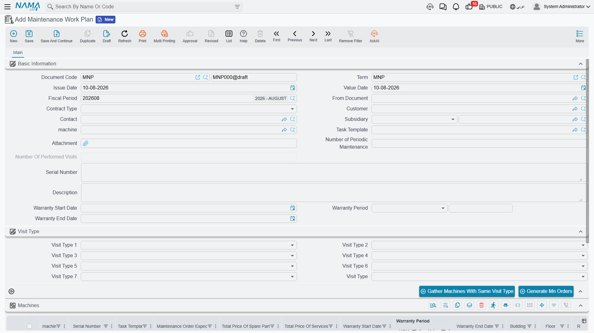

# Maintenance Work Plans

A maintenance contract says "chiller 1 gets a monthly visit and a quarterly visit for twelve months". A work plan is that sentence turned into dated rows — 44 of them, in our example — and then those rows turned into real maintenance orders. It is the only scheduling document in the module that produces anything, and it sits exactly halfway between the two button presses that make preventive maintenance happen.

Menu: **CRM → Maintenance Documents → Maintenance Work Plan**.

::: info Required licence
`crm-maintenance`. A **document term (توجيه) is required**, and it carries exactly one thing that matters: the **maintenance-order book and term** that *Generate Mn Orders* writes into. Without that pair the button produces nothing. See [Maintenance Document Terms](/modules/crm/document-terms/crm-maintenance-terms.md).
:::

## Where Work Plans Come From

You do not create a work plan by hand. They arrive in a batch when somebody opens a [maintenance contract](/modules/crm/maintenance-cycle/crm-maintenance-contracts.md) and presses **Generate Work Plans** — press one of two.

On 1 March 2026 Nahed El Gindy presses that button on `MC-0021`, and twelve work plans appear: `WP-0087` through `WP-0098`.

## How the Dates Are Produced

The generator takes each machine line on the contract, reads its **Visit Type** columns, and steps a date forward from the contract's start date. Two details decide everything:

1. **It steps first, then records.** The contract start date itself never produces a visit. A monthly series on a contract starting 1 March 2026 begins on 1 April 2026.
2. **It keeps stepping while the date is on or before the contract end date.** The last row lands on or before the end date, never after it.

The step depends on the visit type, and one of them is not what its name suggests:

| Visit type | Step the system takes |
|---|---|
| Daily | 1 day |
| Weekly | 7 days |
| **Bimonthly** | **14 days** |
| Monthly | 1 month |
| Quarterly | 3 months |
| Biannual | 6 months |
| Yearly | 12 months |

::: danger "Bimonthly" steps 14 days, not two months
The option reads *Bimonthly* in English and *نصف شهرية* in Arabic, and the step the system takes is **fourteen days**. Read as "every two months" it produces roughly four times as many visits as expected; read as "twice a month" it is still not quite right, because 14 days is not half of every month.

Worked illustration: had `MCH-00318` been given *Bimonthly* instead of *Monthly* on `MC-0021`, its series would run 2026-03-15, 2026-03-29, 2026-04-12 … stepping 14 days each time and ending on **2027-02-28** — **26 rows instead of 12** (the next date, 2027-03-14, falls past the contract end). Always think of this option as *every 14 days*, and price the contract accordingly.
:::

For `MC-0021` the expansion works out like this:

| Visit type | Step | Applies to | First date | Last date | Rows per machine |
|---|---|---|---|---|---|
| Monthly | +1 month | all three machines | 2026-04-01 | 2027-03-01 | 12 |
| Quarterly | +3 months | `MCH-00311`, `MCH-00312` | 2026-06-01 | 2027-03-01 | 4 |

Which totals (12 + 4) + (12 + 4) + 12 = **44 rows** — matching the 44 pre-paid visits priced on the contract.

## How the Rows Are Grouped into Documents

44 rows do not mean 44 documents. The contract's **work-plan generation type** decides how they are packed:

| Generation type | Produces |
|---|---|
| Generate WorkPlan Based On Contract Priority *(the default when the field is empty)* | one work plan per **calendar month** of the expected order date, with the work plan's value date set to the first of that month |
| Generate WorkPlan Based On Visit Type | one work plan per **visit type** |
| Generate WorkPlan Based On Visit Type And Contract Priority | one work plan per visit type, per month |

`MC-0021` uses the first, so its 44 rows land in twelve monthly documents:

| Work Plan | Value date | Lines | Which |
|---|---|---|---|
| `WP-0087` | 2026-04-01 | 3 | monthly × 3 machines |
| `WP-0088` | 2026-05-01 | 3 | monthly × 3 |
| `WP-0089` | 2026-06-01 | 5 | monthly × 3 + quarterly × 2 |
| `WP-0090` | 2026-07-01 | 3 | monthly × 3 |
| `WP-0091` | 2026-08-01 | 3 | monthly × 3 |
| `WP-0092` | 2026-09-01 | 5 | monthly × 3 + quarterly × 2 |
| `WP-0093` | 2026-10-01 | 3 | monthly × 3 |
| `WP-0094` | 2026-11-01 | 3 | monthly × 3 |
| `WP-0095` | 2026-12-01 | 5 | monthly × 3 + quarterly × 2 |
| `WP-0096` | 2027-01-01 | 3 | monthly × 3 |
| `WP-0097` | 2027-02-01 | 3 | monthly × 3 |
| `WP-0098` | 2027-03-01 | 5 | monthly × 3 + quarterly × 2 |
| **12 documents** | | **44 lines** | |

## The Work Plan Screen

A work plan is a single page, and most of its header arrives pre-filled from the contract the moment **From document** is set: contract type, customer, contact, subsidiary (الذمة), machine, task template, serial number, number of periodic maintenances and performed visits, and the contract's start date, warranty period and end date. The machines grid is pre-filled from the contract's machines at the same moment.

The header also has its own **visit type** group — the seven visit-type fields plus the plan's own visit type. Those are the input to the **Gather Machines With Same Visit Type** button, which filters the machine grid down to the contract's machine lines matching any of the visit types selected in the header. It is a "show me only the quarterly ones" convenience for a work plan that arrived carrying everything.

The **Machines** grid is where the work is: machine, serial number, task template, and then the column that drives the next step —

- **Expected order date** — the date the generator computed. This is what maintenance orders are grouped on.
- **Maintenance group** and **technician** — who is going.
- **Building, floor and room** — where.
- The **generated maintenance order**, read-only. Empty until you press the next button, then filled with the order that came out of this line.
- The warranty columns, the visit types, the planned visit date, the five classifications and remarks.

Alongside those, the same per-machine spare-part and service totals as the contract, and a warranty end date that recalculates as soon as a start date and period are typed.

::: warning A work plan checks nothing when you save it
Beyond the framework's own required fields — book, code and dimensions (محددات) — a maintenance work plan has no validation at all. An empty one saves happily, as does one whose machine lines have no dates. Do not expect this screen to catch a mistake for you.
:::

## Generating the Orders

This is press two of two. Open a work plan and press **Generate Mn Orders**.

Machine lines are grouped by **(expected order date, technician, building)** — one maintenance order per group. On `WP-0087`, all three lines share 1 April 2026, technician `EMP-2011` and building `BLD-MP01`, so a **single** order comes out: `MO-0513`, carrying all three machines.

Each generated order arrives with **From document** pointing back at the work plan and its **maintenance contract** field set to the contract the work plan came from — which is what makes contract pricing and entitlement draw-down work on it later. The order's reference is written back into the work-plan line it came from, so pressing **Generate Mn Orders** again on the same work plan **edits the same orders** rather than creating duplicates.

If the button does nothing, check the work plan's document term for the maintenance-order book and term.

::: tip Two things worth knowing before you press it
Split the work sensibly first. Because grouping is by date, technician and building, changing a line's technician before generating is how you split one day's work between two crews; leaving them identical is how you keep it in one order. And because the generated order carries the contract, it is the order — not the work plan — that draws down the pre-paid quantities.
:::

## What a Work Plan Does Not Do

::: warning A work plan has no effects of its own
Saving a work plan creates **no accounting entry** and **moves no stock**. It is a planning document. All it ever produces is the maintenance orders you generate from it, and even those only exist because somebody pressed the button.
:::

And to say it once more, because it is the fact people most often assume away: **nothing generates work plans or orders on a schedule.** There is no task schedule, reminder or alarm anywhere in this module. If nobody opens each of `WP-0087` … `WP-0098` in turn and presses **Generate Mn Orders**, twelve months of planned visits sit on screen and no technician is ever dispatched. See [The Maintenance Cycle](/modules/crm/maintenance-cycle/crm-maintenance-overview.md).

::: danger Regenerating from the contract can delete work plans
Pressing **Generate Work Plans** again on the contract keeps the work plans whose grouping key still matches and **deletes the rest** — along with the links from their machine lines to the orders already generated from them. Adding a machine, changing a visit type or moving the contract end date is enough to change a grouping key. Treat regeneration as a rebuild, not a refresh.
:::

## Reporting

**Reporting: none.** This module ships no system reports, and this screen has no print form. To see the whole preventive calendar in one place, use the work-plan list view with saved criteria (المعايير) and export to Excel.
