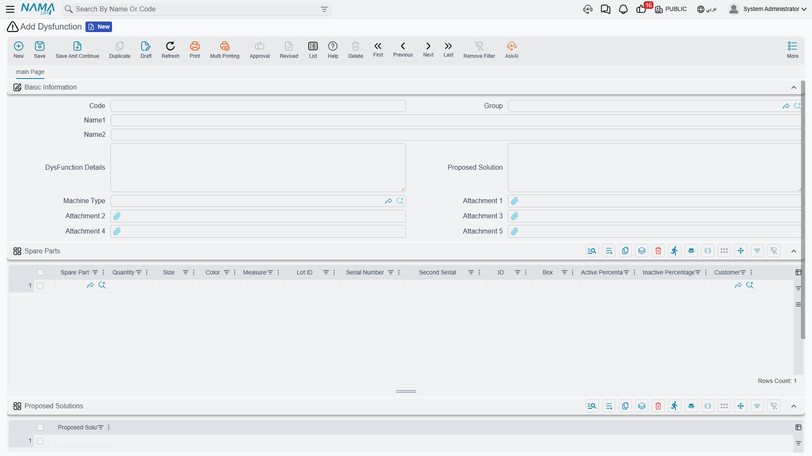

# Fault Catalogues

When the Marina Plaza crew opens a chiller and finds high discharge pressure, three people need to understand what happened: the technician writing it up, the supervisor deciding how urgent it is, and whoever answers the phone the next time the same fault appears. The maintenance suite gives them four small files to say it in the same words every time.

One of them, the **Dysfunction**, does real work — it carries the standard diagnosis, the standard remedy and the standard parts, and it feeds the [per-fault warranty ledger on the machine](/modules/crm/maintenance-setup/crm-machines). The other three are vocabularies: **Trouble Description**, **Trouble Level** and **Notice Category**.

::: info Required licence
`crm-maintenance`. All four are under **Customer Relationship Management → Maintenance Files** — **Dysfunction** (عطل), **Maintenance Trouble Description** (وصف مشكلة صيانة), **Maintenance Trouble Level** (مستوى مشكلة صيانة) and **Maintenance Notice Category** (فئة بلاغ الصيانة).
:::

::: info These are the maintenance suite's catalogues, not the support desk's
The CRM core has its own [problem and complaint catalogues](/modules/crm/master-files/crm-problem-and-complaint-catalogues) used by complaints and trouble tickets. The two sets are entirely separate files with no link between them, and neither can be picked on the other's screens. If your business needs one vocabulary for both worlds, you have to maintain the same list twice.
:::

## The Dysfunction — Your Fault Library

A dysfunction is one recognised fault, described once so it does not have to be re-explained on every document. Al Nokhba keeps `DYS-014` ارتفاع ضغط الطرد / High discharge pressure and `DYS-021` تسريب غاز التبريد / Refrigerant leak, among others.

| Field (Arabic / English) | What it holds |
|---|---|
| الكود / **Code**, names, group | The usual master-file identity. |
| نوع الآلة / **Machine Type** | The model this fault belongs to — `MT-CHL300` for the two chiller faults. |
| تفاصيل العطل / **Dysfunction Details** | The standard description of the symptom, in the words you want on documents. |
| الحل المقترح / **Proposed Solution** | The standard remedy. |
| مرفق 1..5 / **Attachment 1..5** | Diagnostic charts, manufacturer bulletins. |

Then two grids:

- **قطع الغيار / Spare Parts** — the parts this fault normally consumes, with quantities.
- **الحلول المقترحة / Proposed Solutions** — a list of alternative remedies, one per line.

Header fields and the two grids all sit on one screen:

### What Happens When Somebody Picks It

The point of filling all this in is what happens on a [maintenance notice or order](/modules/crm/maintenance-cycle/crm-maintenance-notices-and-requests). When a fault line names a dysfunction:

1. The dysfunction's **details** and **proposed solution** are copied onto the line, so the technician starts from the standard text and edits it rather than writing from scratch.
2. Its **spare parts** are pulled into the document's spare-parts grid, with their quantities.
3. The **machine** lookup on that fault line narrows to machines of the dysfunction's machine type — pick a chiller fault and you are offered chillers.
4. The alternative remedies from the *Proposed Solutions* grid appear as suggestions while typing in the document's own Proposed Solution field.

That is a good return on a few minutes of setup, and it is worth doing properly for the twenty or thirty faults that make up most of your work.

::: warning The spare-part lookup on this screen is not filtered by machine type
When you build the Spare Parts grid on the dysfunction itself, the item lookup offers **every item in the company that is flagged *Spare Part / قطعة غيار* on the item master** — it does not narrow to the parts of the dysfunction's machine type, despite the machine type sitting right there on the screen.

So the only rule in force is the spare-part flag. Pick carefully: nothing will stop you attaching a lift part to a chiller fault.
:::

## Trouble Level and Trouble Description

These two are deliberately thin — code, names, and a single **العميل / Customer** field for sites that want a per-customer vocabulary. Al Nokhba uses `TL-02` متوسط / Medium and `TD-07` انخفاض كفاءة التبريد / Reduced cooling capacity.

They are picked on the headers of maintenance orders, notices and execution sheets, and they can also be listed on the terms grid of a contract, a sales quotation or a sales order.

There is one piece of genuine behaviour: **on a notice, the Trouble Level lookup is restricted to the levels listed in the selected contract's terms.** If the Marina Plaza contract's terms grid lists only Medium and High, those are the only two levels the notice offers.

::: warning A trouble level does not create a service level
The contract's terms grid pairs each trouble level with a response time, which makes it look like a service-level agreement. Nothing reads it. No clock starts, no due date is set, no escalation happens and no report compares a response time against a promised one — there is no scheduler, alarm or notification anywhere in this module.

Trouble Level is a priority label that helps a human decide what to do first. Treat it as exactly that.
:::

## Notice Category

The smallest file in the suite: code and names, nothing else. Its only consumer is the **فئة بلاغ الصيانة / Notice Category** field on the [maintenance notice](/modules/crm/maintenance-cycle/crm-maintenance-notices-and-requests), where it answers "where did this fault report come from". Al Nokhba keeps `NC-01` بلاغ عميل / Customer call-in alongside categories for faults found during a routine visit and faults reported by the building's own engineers.

Because a notice is the reactive intake point of the whole maintenance cycle, this small field is what later lets you filter the notice list into "what customers reported" versus "what we found ourselves". Keep the list short — five or six categories is plenty, and a long list simply gets used inconsistently.

## Setting the Four Up

Work in this order, and expect the catalogue to grow for the first six months:

1. **Notice categories** and **trouble levels** first — a handful of each, agreed with the supervisor who triages incoming reports.
2. **Trouble descriptions** as the symptoms your customers actually report.
3. **Dysfunctions** last, because each one wants a machine type, standard text and a parts list. Start with the faults you see weekly rather than trying to be exhaustive; a dysfunction with an empty parts list and no standard text saves nobody any time.

None of the four has any accounting or inventory effect, none generates any document, and none of them is validated beyond the ordinary master-file rules. And as everywhere in this module, there are **no reports or dashboards** over them — to see which faults dominate, filter the notice or order list screens and export.
