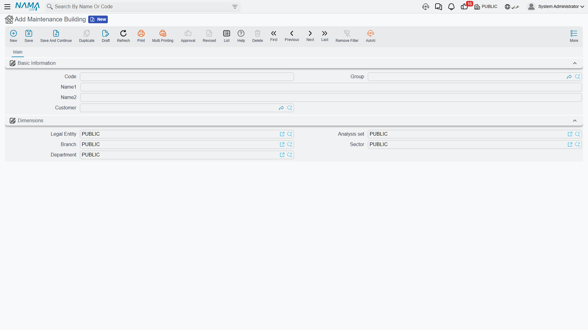

# Buildings, Floors and Rooms

Marina Plaza's chillers are not just "at Marina Plaza". They are in the chiller plant room, on the roof level, of the main tower — and when a technician is dispatched at seven in the morning, that is the difference between finding the machine and phoning the site engineer.

The maintenance suite records that address in three small master files that nest inside each other: **Building** → **Floor** → **Room**. Al Nokhba's Alexandria site looks like this:

```
BLD-MP01  Marina Plaza Alexandria – Main Tower
   ├── FLR-MP01-R  Roof Level
   │        └── RM-MP01-R1  Chiller Plant Room   →  MCH-00311, MCH-00312
   └── FLR-MP01-B  Basement
            └── RM-MP01-B2  Equipment Room       →  MCH-00318
```

::: info Required licence
`crm-maintenance`. The three screens are under **Customer Relationship Management → Maintenance Files** — **Maintenance Building** (مبنى صيانة), **Maintenance Floor** (طابق صيانة) and **Maintenance Room** (غرفة صيانة).
:::

## The Three Files

All three are plain master files — code, group, Arabic and English names, and the dimensions group — plus a customer and the link upward:

| File | Extra fields |
|---|---|
| **Maintenance Building** (مبنى صيانة) | العميل / **Customer** |
| **Maintenance Floor** (طابق صيانة) | العميل / **Customer**, المبنى / **Building** |
| **Maintenance Room** (غرفة صيانة) | العميل / **Customer**, المبنى / **Building**, الطابق / **Floor** |

Everything is scoped by customer, which is what makes the location files usable at all: `BLD-MP01` belongs to Marina Plaza Hotels, so when you are working on a Marina Plaza machine the building lookup shows their sites and nobody else's. The list screens follow the same shape — buildings filter by customer, floors by customer and building, rooms by building and floor.

Build them downwards, one customer at a time: the buildings on a site, then the floors in each building, then the rooms on each floor. The screens help: pick a floor on the room screen and the building and customer fill themselves in.

The Building screen is the shortest of the three, and the shape the other two follow:



## Filling the Location in on a Machine

On the [machine screen](/modules/crm/maintenance-setup/crm-machines) the quickest route is to work in reverse and pick the **room** — the screen then fills the floor, the building and even the customer from it. Picking a floor fills the building and customer. Picking a building fills nothing further, since a building has nothing above it.

::: warning The hierarchy is a screen convenience, not a rule
Nothing anywhere enforces that a room belongs to its floor, or that a floor belongs to its building, or that a machine's room is on the floor written beside it. The three files are ordinary references to each other, and none of them is validated on save.

Two consequences worth knowing:

- On the machine screen, the **room lookup filters by customer and building but not by the selected floor**. So you can pick a room from another floor of the same building — and the screen then silently rewrites the Floor field to match the room you chose. If the floor changes when you did not expect it, this is why.
- **Imported location data is not checked at all.** A load of buildings, floors and rooms can be arbitrarily inconsistent and nothing will complain. If you import an installed base, validate the parentage in the spreadsheet before you load it, because the system will not do it for you.
:::

## What the Location Is Actually Used For

Location is a **reporting and filtering dimension**, and a good one. It is carried forward automatically: when a machine goes onto a maintenance notice, or a technician's execution sheet is created, the machine's building, floor and room come with it, so the paperwork the technician receives says where to go.

It is not a routing input. Nothing in the module plans a route from a building, and nothing groups work by floor. The [daily dispatch documents](/modules/crm/maintenance-cycle/crm-maintenance-dispatch) work from address regions, not from these files. Work plans and maintenance visits carry no location fields of their own at all.

And as everywhere else in this module, there are **no reports and no dashboards** over the location files. To answer "how much work did we do in the basement last quarter", filter a list screen and export it, or build it in BI.

## Naming Them Well

Because nothing enforces the hierarchy and nothing reports over it, the value you get out of these files is exactly the value your naming convention puts in. Two habits pay for themselves:

- Put the customer or site into the building's name — "Marina Plaza Alexandria – Main Tower", not "Main Tower". Buildings are listed across customers on the list screen, and "Main Tower" will not be the only one.
- Keep floor and room codes prefixed with the building code, as `FLR-MP01-R` and `RM-MP01-R1` are. When somebody looks at a room in isolation — on an execution sheet, say — the code is the only thing that tells them where it is.
