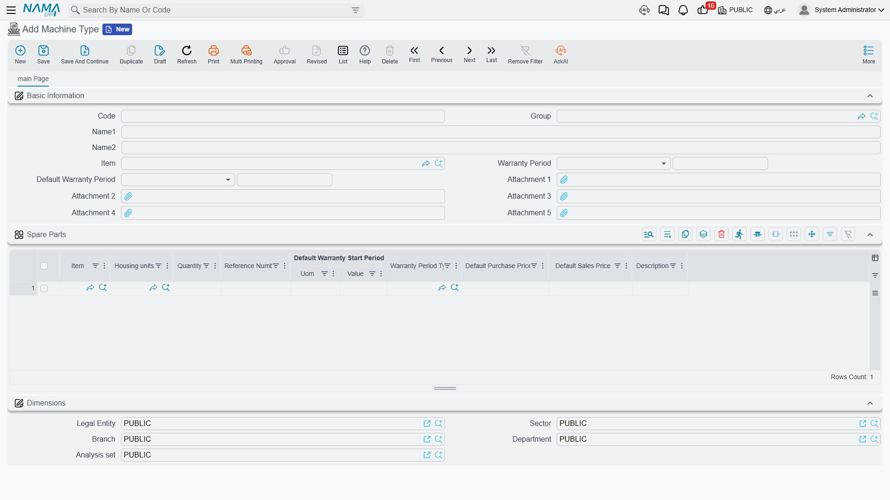

# Machine Types and Categories

Al Nokhba maintains a few hundred units for its customers, but they are not a few hundred different things. They are chillers, air handling units and split units — three or four models of each. **Machine Type** is where you describe the model once, and **Machine Category** is the broad family the model belongs to.

The distinction matters more than it looks, because one of the two files does real work and the other is a label. The Machine Type is where the warranty defaults live and where the spare-parts list that drives every lookup in the suite is kept. The Machine Category is a grouping you filter and report by.

::: info Required licence
`crm-maintenance`. Both screens are under **Customer Relationship Management → Maintenance Files** — **Machine Type** (نوع آلة) and **Maintenance Machine Category** (تصنيف آلة).
:::

## Machine Category — The Broad Family

The category screen is short: the standard code, group and two names, an **item** (الصنف), two warranty period fields, and the dimensions group.

Al Nokhba keeps two: `MCT-CHL` تبريد مركزي / Central Cooling, and `MCT-SPL` وحدات منفصلة / Split Units. Every chiller and air handling unit is Central Cooling; every wall-mounted split is Split Units. The category is carried onto machines, and [task templates](/modules/crm/maintenance-setup/crm-maintenance-task-templates) are tied to a category so that a checklist can be recognised as "the one for cooling plant".

::: warning The warranty fields on the category do nothing
The category screen shows **مدة الضمان / Warranty Period** and **مدة الضمان الافتراضي / Default Warranty Period**, which reads exactly like a place to set a default warranty for a whole family of equipment. Nothing reads them. A machine never takes its warranty periods from its category.

Set warranty defaults on the **Machine Type**, described below. If you have already filled the category's warranty fields, no harm is done — they simply have no effect.
:::

## Machine Type — The Model

This is the file that earns its keep. One record per model you maintain:

| Field (Arabic / English) | What it does |
|---|---|
| الكود / **Code**, الاسم العربي / الاسم الإنجليزي | `MT-CHL300`, تشيلر 300 طن / Chiller 300 TR. |
| الصنف / **Item** | The stock item this model corresponds to — `AC-CHL-300`. It is what ties the type to the machine: on the machine screen, the Machine Type lookup offers only types whose item matches the machine's item, plus any type that has no item at all. |
| مدة الضمان / **Warranty Period** | The standard warranty for this model — 12 Month for the chillers. Copied onto a machine the moment you pick this type. |
| مدة الضمان الافتراضي / **Default Warranty Period** | The grace period between sale and the start of the warranty — 3 Month. Also copied onto the machine. |
| مرفق 1..5 / **Attachment 1..5** | Manuals, drawings, data sheets. |

Then one grid, **قطع الغيار / Spare Parts**, with the same columns as the machine's own spare-parts grid: item, unit of measure, quantity, reference number, a default warranty start period, a [warranty period type](/modules/crm/maintenance-setup/crm-machines), a default purchase price, a default sales price and a description.

**This is the grid the system actually uses.** When a technician fills the spare-parts grid on a maintenance notice, order or invoice for a machine, the item lookup is restricted to the parts listed on that machine's Machine Type. So `MT-CHL300` lists `SP-FLT-14` (14-inch air filter), `SP-CMP-30` (30 HP compressor), `SP-GAS-410` (R-410A refrigerant) and `SP-OIL-05` (compressor oil), and those are what the crew can pick when working on either Marina Plaza chiller.

::: warning Two prerequisites that catch people out
**An item is only ever offered as a spare part if it is flagged *Spare Part / قطعة غيار* on the item master.** That flag is set in the supply-chain item file, not here. A part listed on the Machine Type but not flagged on the item master will never appear in a lookup, and the message you get is simply an empty list.

And the equivalent grid on the **machine record itself is read by nothing at all**. Maintaining parts per machine feels more precise and achieves nothing — keep the list here, on the type.
:::

One cosmetic point, so it does not surprise you: the unit-of-measure column in this grid is headed **وحدة سكنية / "Housing units"**, a caption borrowed from the real-estate module. The column works normally; only the heading is wrong.

The type screen holds the header fields and that spare-parts grid, borrowed heading and all:

## The Warranty Defaults in Practice

Setting the two period fields on the type is what makes the machine's warranty dates fall out on their own. On `MT-CHL300`, Al Nokhba sets Warranty Period = 12 Month and Default Warranty Period = 3 Month. When somebody creates `MCH-00311` and picks that type, both periods are copied onto the machine. They then fill the sale date (2026-02-16) and the installation date (2026-02-24), save, and the machine's warranty start and end dates — 2026-02-24 and 2027-02-24 — are calculated for them. The full arithmetic is on [the machine page](/modules/crm/maintenance-setup/crm-machines).

The periods are copied as **defaults**, not as a permanent link. Change the type's warranty period next year and the machines created last year keep the periods they were given; only new machines (and machines where somebody re-picks the type) get the new values.

## Setting the Two Files Up

For a fresh installation, work from broad to narrow:

1. Create the categories first — a handful is usually enough. Al Nokhba's two cover everything they touch.
2. Create one machine type per model, tie it to its stock item, set the two warranty periods, and list its standard spare parts.
3. Check the item master: every part you listed must be flagged as a spare part.
4. Only then start creating machines. Picking type and category on a machine will fill in the warranty periods and give the spare-part lookups something to offer.

Neither file has any accounting or inventory effect, neither generates anything, and neither is validated beyond the usual master-file rules. There are no reports or dashboards over them — the list screens and their filters, plus Excel export, are what you have.
