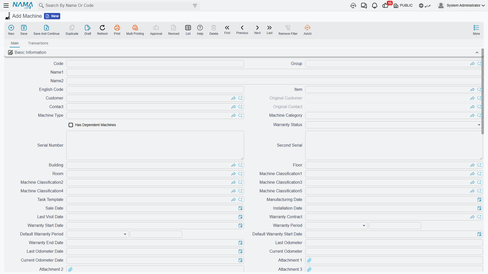

# The Machine File

Al Nokhba Air Conditioning Systems sold Marina Plaza Hotels two 300-ton chillers and an air handling unit for their Alexandria tower, and then signed a maintenance contract to look after them. From that moment on, almost every screen the maintenance department touches names one of three records: `MCH-00311` and `MCH-00312` (the chillers, in the plant room on the roof) and `MCH-00318` (the air handling unit, in the basement equipment room).

Those three records are **machines**, and the machine file is the spine of the whole maintenance suite. A maintenance contract covers machines. A work plan schedules visits per machine. An order is executed on machines. An invoice bills the work done on machines. Get this file right and everything downstream has something solid to hang off; get it wrong — most commonly by leaving the customer blank — and the machine quietly disappears from every lookup that matters.

::: info Required licence
`crm-maintenance`. The screen sits under **Customer Relationship Management → Maintenance Files → Machine** (خدمة العملاء ← ملفات الصيانة ← الة).
:::

::: warning The machine file is not connected to the support desk
The machine register belongs to the maintenance product. It is not visible to trouble tickets, complaints or the CRM warranty register, and **a trouble ticket cannot be raised against a maintained machine**. If a customer phones about a chiller you maintain, that call becomes a [maintenance notice](/modules/crm/maintenance-cycle/crm-maintenance-notices-and-requests), not a ticket.
:::

Here is the screen as it opens for a new machine; the Basic Information group carries on well below the bottom of the picture:

## Set the Supporting Files Up First

The machine screen is mostly a set of pointers at other files, and it is much less painful to create those first:

- The [machine type and category](/modules/crm/maintenance-setup/crm-machine-types-and-categories) — the type is where the warranty defaults and the real spare-parts list live.
- The [building, floor and room](/modules/crm/maintenance-setup/crm-machine-locations) the unit is installed in.
- A [task template](/modules/crm/maintenance-setup/crm-maintenance-task-templates) if this model has a standard checklist.
- The [five classification files](/modules/crm/maintenance-setup/crm-machine-classifications), if your site uses them.
- The item itself, on the supply-chain item master.

## The Main Tab

The whole of the first tab is one long **Basic Information** (المعلومات الأساسية) group of roughly fifty fields, followed by three grids and the dimensions group. It reads better in themed blocks, so that is how it is presented below.

### What the Unit Is

| Field (Arabic / English) | What it holds |
|---|---|
| الكود / **Code** | Your reference for the unit. `MCH-00311`. |
| الكود الإنجليزي / **English Code** | A second, alternative code. |
| الاسم العربي / الاسم الإنجليزي — **Arabic Name / English Name** | تشيلر رقم 1 – مارينا بلازا / Chiller No. 1 – Marina Plaza. |
| المجموعة / **Group** | The usual master-file grouping. |
| الصنف / **Item** | The stock item this unit is an instance of — `AC-CHL-300`. It also restricts the Machine Type lookup. |
| نوع الآلة / **Machine Type** | `MT-CHL300`. The lookup offers only types whose own item matches this machine's item, or types with no item at all. |
| تصنيف آلة / **Machine Category** | `MCT-CHL`, the broad family. |
| الرقم المسلسل / **Serial Number** | Free text — `CHL300-2026-0021`. |
| الرقم المسلسل الثاني / **Second Serial** | A second free-text serial, for units that carry two plates. |
| لديه آلات تابعة / **Has Dependent Machines** | Tick this to enable the Dependent Machines grid below. |
| حالة الضمان / **Warranty Status** | A manual classification — see the warning further down. |
| مرفق 1..10 / **Attachment 1..10** | Ten attachment slots for manuals, photographs and delivery notes. |

::: warning Serial numbers are free text
Nothing checks that a serial number is unique, and the field has **no connection at all** to the supply-chain serial-number and sub-item mechanism. Two machines can carry the same serial, and a serial issued by the warehouse when the unit was delivered does not flow into this field. Treat it as a label you maintain by hand.
:::

### Who Owns It and Where It Is

| Field (Arabic / English) | What it holds |
|---|---|
| العميل / **Customer** | `C-01188` Marina Plaza Hotels. **The single most important field on the screen** — see below. |
| العميل الأصلي / **Original Customer** | The first owner. Stamped once by the system, then never changed. |
| جهة إتصال / **Contact** | `CNT-0904` Eng. Ramy Abdel Moneim. The lookup offers only contacts of the selected customer. |
| جهة الإتصال الأصلية / **Original Contact** | The first contact, stamped alongside the original customer. |
| المبنى / الطابق / الغرفة — **Building / Floor / Room** | `BLD-MP01` / `FLR-MP01-R` / `RM-MP01-R1`. Pick the room and the screen fills the floor, the building and the customer for you. |
| تصنيف آلة1..5 / **Machine Classification1..5** | Five free classification dimensions. |

The customer matters more than anything else on this screen because **the machine lookup on later documents is filtered by customer by default**. A maintenance order raised for Marina Plaza offers only machines whose Customer is Marina Plaza. A machine with a blank customer is therefore invisible to the entire cycle, even though its record is perfectly saved and searchable from the menu. If your site genuinely needs to raise documents against machines regardless of owner, the *Do Not Filter Machine By Customer* (عدم الفلترة على الآلة بالعميل) option on the [CRM settings screen](/modules/crm/crm-configuration) removes the restriction.

Ownership is not meant to be edited casually once the machine is in service — there is a dedicated [ownership transfer document](/modules/crm/maintenance-cycle/crm-machine-updates-and-transfers) that keeps a history and re-chains the previous owners.

### Dates, Warranty and the Odometer

| Field (Arabic / English) | Typed or worked out? |
|---|---|
| تاريخ التصنيع / **Manufacturing Date** | Typed. |
| تاريخ البيع / **Sale Date** | Typed. 2026-02-16 for all three Marina Plaza units. |
| تاريخ التركيب / **Installation Date** | Typed. 2026-02-24 for the chillers, 2026-02-26 for the air handling unit. |
| تاريخ آخر زيارة / **Last Visit Date** | Typed, and only ever typed — see the warning below. |
| عقد الضمان / **Warranty Contract** | A reference to the maintenance contract that carries this unit's warranty. An [installation order fills it in automatically](/modules/crm/maintenance-cycle/crm-maintenance-orders); otherwise it is typed. |
| مدة الضمان الافتراضي / **Default Warranty Period** | Typed as a number plus a unit (3 Month). Defaulted from the Machine Type when you pick one. |
| تاريخ بداية الضمان الافتراضي / **Default Warranty Start Date** | **Worked out** — Sale Date + Default Warranty Period. |
| تاريخ بداية الضمان / **Warranty Start Date** | **Worked out** — the earlier of the Installation Date and the Default Warranty Start Date. |
| مدة الضمان / **Warranty Period** | Typed as a number plus a unit (12 Month). Defaulted from the Machine Type. |
| تاريخ نهاية الضمان / **Warranty End Date** | **Worked out** — Warranty Start Date + Warranty Period. |
| حالة الضمان / **Warranty Status** | Typed. Never derived from the dates above. |
| قراءة العداد السابقة وتاريخها / **Last Odometer and its date** | Shown greyed out. The system rolls the current reading into it when a newer reading arrives. |
| قراءة العداد الحالية وتاريخها / **Current Odometer and its date** | Typed here, and also written by a [maintenance visit](/modules/crm/maintenance-cycle/crm-maintenance-visits) when the technician records a reading. |

### How the Three Warranty Dates Are Calculated

This is worth walking through slowly, because the fields look like ordinary date boxes and behave like formulas. Every time the machine record is saved, the system re-runs three steps in order:

1. If Sale Date and Default Warranty Period are both filled, **Default Warranty Start Date = Sale Date + Default Warranty Period**.
2. If either the Installation Date or the Default Warranty Start Date is filled, **Warranty Start Date = whichever of the two is earlier**.
3. If Warranty Start Date and Warranty Period are both filled, **Warranty End Date = Warranty Start Date + Warranty Period**.

For the Marina Plaza units, with a 3-month default warranty period and a 12-month warranty period:

| Step | `MCH-00311` and `MCH-00312` | `MCH-00318` |
|---|---|---|
| Default Warranty Start Date = Sale Date + 3 months | 2026-02-16 + 3 M = **2026-05-16** | **2026-05-16** |
| Warranty Start Date = earlier of Installation Date and the line above | earlier of 2026-02-24 and 2026-05-16 = **2026-02-24** | earlier of 2026-02-26 and 2026-05-16 = **2026-02-26** |
| Warranty End Date = Warranty Start Date + 12 months | **2027-02-24** | **2027-02-26** |

::: warning These three dates are recomputed on every save
Warranty Start Date, Default Warranty Start Date and Warranty End Date are **overwritten every time the machine is saved**, whenever the fields that drive them are filled. If you type a warranty end date by hand and save, the typed value is replaced. The only way a typed date survives is if the sale date, installation date and the two periods are all empty — which is rarely what you want.

To change a warranty, change the inputs: the sale date, the installation date, or the two period fields.
:::

::: warning Warranty Status and Last Visit Date look automatic — they are not
**حالة الضمان / Warranty Status** is a manual classification. Nothing recalculates it, so a machine whose Warranty End Date passed months ago still reads *Under Warranty* until somebody edits it. Read **Warranty End Date** for the real answer.

**تاريخ آخر زيارة / Last Visit Date** is a manual note. Maintenance visits, orders, executions and work plans never touch it, no matter how many are carried out on the machine. The only thing that ever writes it is a [Machine Update document](/modules/crm/maintenance-cycle/crm-machine-updates-and-transfers) — and that document writes it whether you meant it to or not.
:::

## Warranty Period Types

**نوع فترة الضمان / Warranty Period Type** is a tiny master file in the same menu folder: a code, a name, and a warranty period expressed as a number plus a unit. `WPT-03M` is "3-Month Warranty", `WPT-06M` is "6-Month Warranty".

It exists so that a warranty duration can be picked by name instead of typed as a number, in the two places where a warranty is attached to *part of* a machine rather than the whole unit:

- On the machine's (and machine type's) spare-parts lines, as the warranty that comes with that part.
- On the fault lines of maintenance orders and invoices — and this is the important one. When a technician repairs a fault and the work carries its own warranty, the fault line names a Warranty Period Type. If the line's new warranty end date is left blank, **the end date is worked out from the Warranty Period Type**, and the result lands in the machine's dysfunction-warranty ledger described below.

So the machine's overall warranty comes from the period fields on the machine itself, while the per-fault warranties come from these named period types. Create one record per duration you actually quote — three months, six months, a year — and no more.

## The Three Grids

**المهام / Tasks.** The checklist for this unit, two columns of free text (Task and Task 2). You rarely type into it: pick a [task template](/modules/crm/maintenance-setup/crm-maintenance-task-templates) in the header and the grid is rebuilt from the template's lines. Note the word *rebuilt* — picking a template **replaces** whatever was in the grid.

**الآلات التابعة / Dependent Machines.** For units that are made of other units — a chiller plant with two circuits, a system with an indoor and an outdoor half. Tick *Has Dependent Machines*, then list the child machines. The lookup offers only machines that are not already a child of something else, and the record is refused on save if:

- the tick box is off but the grid has lines, or it is on and the grid is empty;
- the same machine is listed twice;
- a listed machine already belongs to another parent;
- a listed machine has dependants of its own — **only one level of nesting is allowed**;
- the machine lists itself.

When the record is saved, each child is stamped with this machine as its parent, and children you removed are released. Deleting the parent releases them all.

**قطع الغيار / Spare Parts.** This is a grid of items, quantities, reference numbers, default purchase and sales prices and a warranty period type.

::: warning The machine's own Spare Parts grid is read by nothing
Nothing in the system reads this grid. It does not restrict a lookup, does not price anything and does not reach any document. It is a reference list you keep for your own eyes.

The grid that genuinely drives spare-part lookups on notices, orders and invoices is the **identical grid on the [Machine Type](/modules/crm/maintenance-setup/crm-machine-types-and-categories)**. Maintain your parts lists there. And remember the underlying rule that applies everywhere in the suite: an item is offered as a spare part only if it is flagged **Spare Part / قطعة غيار** on the item master.

One cosmetic oddity while you are in this grid: the unit-of-measure column is headed **وحدة سكنية / "Housing units"**, a label borrowed from the real-estate module. It is the unit of measure; only the caption is wrong.
:::

Below the grids sits the usual **المحددات / Dimensions** group — legal entity, sector, branch, department and analysis set.

## The Transactions Tab — The Unit's Service History

The second tab, **الحركات / Transactions**, is the part of the machine file that most repays a support call, because it is genuinely maintained by the documents themselves. Four lists and one grid:

| Block | What it shows |
|---|---|
| أوامر الصيانة / **Maintenance Orders** | Every [maintenance order](/modules/crm/maintenance-cycle/crm-maintenance-orders) that named this machine, with the owning document and the totals for services and spare parts on that line. |
| بلاغات صيانة / **Maintenance Notices** | Every [notice](/modules/crm/maintenance-cycle/crm-maintenance-notices-and-requests) raised against it. |
| عقود الصيانة / **Maintenance Contracts** | Every [contract](/modules/crm/maintenance-cycle/crm-maintenance-contracts) that covers it. |
| سندات نقل مكلية آلة / **Machine Owner Transfer Documents** | The ownership history: document, from and to customer, from and to contact, value date. |
| ضمانات الأعطال / **Dysfunction Warranties** | The per-fault warranty ledger, maintained by the system. |

Because the module ships **no reports and no dashboards at all**, these four lists are the whole of the ready-made reporting on a machine's history. For anything wider — all machines out of warranty this quarter, all faults of one type across a customer's site — use the list screens with their filters, export to Excel, or build it in BI.

::: warning The ownership history's contact column is unreliable
The **From Customer** chain on the transfer list is correct. The **From Contact** column is not: from the second transfer onwards it repeats the very first document's contact instead of the previous document's new contact, so the two columns disagree with each other. Read the customer chain; treat the contact chain as decoration.
:::

### The Dysfunction Warranty Ledger

This grid is filled in by the system and cannot be typed into. It answers one question: *when we last repaired this fault on this machine, what warranty did we give, and is it still running?*

Follow the Marina Plaza thread. On 2026-04-01 the crew carries out the monthly service under order `MO-0513` and finds high discharge pressure on chiller 1. They record fault `DYS-014` on the order's dysfunctions grid and give the repair a three-month warranty (`WPT-03M`) starting the next day. When the order is committed, chiller 1's ledger gains a row:

| Dysfunction | Document | Value Date | Warranty Period Type | Warranty Start | Days | Warranty End |
|---|---|---|---|---|---|---|
| `DYS-014` | `MO-0513` | 2026-04-01 | `WPT-03M` | 2026-04-02 | 92 | 2026-07-02 |

The day count is end minus start, plus one.

From then on, whenever anybody records `DYS-014` against chiller 1 on a notice, order or invoice, the fault line's read-only *old warranty* block is filled from this row — period type, start, end and remaining days — so the person on the screen can see at a glance whether the previous repair is still under warranty. Editing or cancelling the source document tidies up after itself: rows that no longer apply are removed.

::: warning The ledger only fills in if the document term says so
Writing to this grid is switched on by the option **Update Machine Dysfunction Warranties** (تحديث جدول ضمانات الأعطال في الآلة) on the [maintenance order term and the maintenance invoice term](/modules/crm/document-terms/crm-maintenance-terms). With it off, nothing is written and any rows that document had written previously are removed.

Switch it on for **one** of the two, not both. If both the order term and the invoice term carry it, the invoice is refused outright when you try to save it.
:::

## Where Machines Come From

There are three routes, and only one of them gives you a complete record.

1. **By hand**, from the menu. This is the normal route and the one to prefer.
2. **Generated from a maintenance sales order.** The *إنشاء الآلة / Generate Machine* button on a saved [maintenance sales order](/modules/crm/maintenance-cycle/crm-maintenance-sales) creates one machine per line that does not already point at one. On the Marina Plaza deal, `MSO-0029` produced `MCH-00311`, `MCH-00312` and `MCH-00318` in a single press on 2026-02-10.
3. **By import or web service**, using the standard record-import tooling — useful when a site takes over an existing installed base.

::: warning Generate Machine creates shells, not finished machines
The button copies only building, floor, room, task template, warranty period and the line's dimensions. It does **not** copy the customer, the item, the machine type, the category, the serial number or any date — even though the sales order knows the customer perfectly well.

Because the machine lookup is filtered by customer, those generated machines are then **invisible** on the next maintenance order for that customer. Treat the button as a shell-creation step: on the Marina Plaza deal the crew opened each of the three machines the following day and filled in customer, item, machine type, serial number and the sale and installation dates before anything else could be raised against them.
:::

Some things that sound as though they create machines do not. A **pre-installation preview** creates nothing at all. An **installation order** creates a warranty *contract*, not a machine. And no supply-chain document — delivery, invoice or issue — ever produces a machine record.

## Changing a Machine Later

Two documents exist for changing a machine after it is in service, and both are covered on the [machine updates and transfers page](/modules/crm/maintenance-cycle/crm-machine-updates-and-transfers): the **Machine Update** document for attributes and the **Machine Ownership Transfer** document for the owner. Read that page before you use either — the update document writes every field on its screen to the machine, so fields you did not retype are blanked, and cancelling it does not necessarily put things back.
