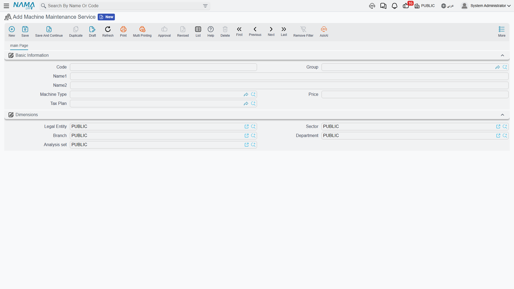

# The Service Catalogue

A maintenance business does not only sell parts. It sells **visits, inspections, charges and call-outs** — the labour half of the invoice. The machine suite keeps those in a priced catalogue so that a periodic chiller visit costs the same 1,500.00 on every quotation, every contract and every invoice unless somebody deliberately agrees otherwise.

That catalogue is the file called **Machine Maintenance Service** (خدمة صيانة ماكينة).

::: warning Read this before you open anything
There are **two different files with almost the same name**, under two different licences, in two different menu folders. Picking the wrong one costs an afternoon.

> **Machine Maintenance Service** (خدمة صيانة ماكينة, licence `crm-maintenance`) is the **priced service catalogue** of the machine suite — a named service with a price and a tax plan that you put on an order line and charge for. **This page is about that file.**

> **Maintenance Service** (خدمة صيانة, licence `crm-maintenance-services`) is the **thing being serviced** — a site, branch, floor or area with a customer, a location and a task checklist. It is the [services suite](/modules/crm/services-suite/crm-services-suite-overview)'s equivalent of the Machine, **not** a list of services you can sell.

If you open a screen expecting Price and Tax Plan and find Customer, Machine Category and a tasks grid, you are in the second file. Go back and pick the one whose English caption starts with *Machine*. And if your installation holds both licences, ask whoever configures it to rename the second one to something like "Serviced Location" using the platform's Translation Change File — the confusion is not worth living with.
:::

::: info Required licence
`crm-maintenance`. The screen is under **Customer Relationship Management → Maintenance Files → Machine Maintenance Service** (خدمة صيانة ماكينة).
:::

## The Whole Screen

It is one of the shortest master files in the module, which is a good sign — a catalogue entry should be quick to create:

| Field (Arabic / English) | What it holds |
|---|---|
| الكود / **Code**, group, Arabic and English names | `MSV-01`, زيارة صيانة دورية للتشيلر / Chiller periodic maintenance visit. |
| نوع الآلة / **Machine Type** | The model this service applies to — `MT-CHL300`. |
| السعر / **Price** | The standard price. 1,500.00 for a chiller periodic visit. |
| سياسة الضريبة / **Tax Plan** | The tax plan a document uses when it works out the tax on this line. Al Nokhba's services carry the standard 14 % sales tax plan. |
| المحددات / **Dimensions** | Legal entity, sector, branch, department, analysis set. |

That is all of it. There is no unit of measure, no cost, no duration, no skill requirement and no link to an item — a service in this catalogue is a name with a price.

The whole screen, on a new record:

Al Nokhba keeps a short list: `MSV-01` for a periodic chiller visit and `MSV-02` شحن غاز التبريد / Refrigerant charging, plus a handful of others for emergency call-outs and annual overhauls.

## Where the Catalogue Is Used

Services are one of the two money grids that run through the whole machine suite — spare parts is the other. The service grid appears on maintenance sales quotations and sales orders, contracts, notices, orders, estimations, invoices and work plans. Wherever you see **الخدمات / Services**, the item you pick in it comes from this catalogue.

Two behaviours are worth knowing, because they decide what your customer is actually charged.

**The contract price beats the catalogue price.** On the Marina Plaza contract `MC-0021`, Al Nokhba pre-sells 44 chiller visits at **1,200.00** each — below the catalogue's 1,500.00, because the customer committed to a year. When maintenance order `MO-0513` bills three of those visits, it prices them at 1,200.00, not 1,500.00. The catalogue price is the list price; the contract price is what a contracted customer pays. Full detail is on the [maintenance invoicing page](/modules/crm/maintenance-cycle/crm-maintenance-invoicing).

**Contract "coverage" is a quantity, not a date range.** The 44 visits on the contract are simply 44 units of `MSV-01` at 1,200.00, drawn down as work is billed. Nothing anywhere compares the work date to a warranty period or a contract end date to decide whether a service is free. Coverage in this suite means "there is quantity left at the contract's price" and nothing more — see the [maintenance contracts page](/modules/crm/maintenance-cycle/crm-maintenance-contracts).

## Building the Catalogue

Keep it short and priced honestly. A useful shape for a fresh installation:

1. One entry per **thing you actually put on an invoice line** — a periodic visit, an emergency call-out, a gas charge, an annual overhaul. Not one per task; the task detail belongs on the [task template](/modules/crm/maintenance-setup/crm-maintenance-task-templates).
2. Tie each entry to a **machine type** where the price genuinely differs by model. A periodic visit to a 300-ton chiller is not a periodic visit to a wall split, and pricing them as one entry will cost you money.
3. Set the **tax plan** on every entry. A service line with no tax plan is a line that quietly bills no tax.
4. Review the prices when you review your price list — nothing links this catalogue to the sales price list, so it will not update itself.

::: warning The services suite has no catalogue like this at all
If you also hold the `crm-maintenance-services` licence, do not go looking for the equivalent file there. In that suite **services carry no price whatsoever**: the *Total Price Of Services* box on every service document is permanently 0.00, and a service invoice can bill spare parts only. To charge for labour in the services suite, sites register it as a stock item and put it in the spare-parts grid. That is covered on the [service invoicing page](/modules/crm/services-suite/crm-service-invoicing).
:::

The catalogue itself has no accounting or inventory effect, generates nothing and validates nothing beyond the ordinary master-file rules. And, as everywhere in this module, there is **no report and no dashboard** telling you which services sold best — filter and export the order or invoice list screens, or build it in BI.
