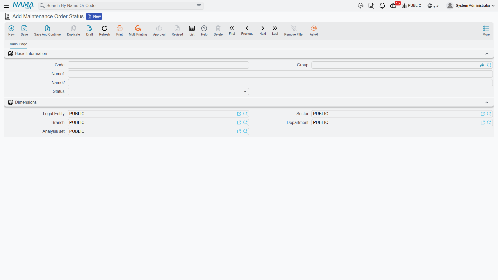

# Order and Visit Statuses

Everything about how a maintenance order behaves — whether the system understands it as open, running, held or done — comes down to one small field on one small master file. Get it right in the first hour of setting the module up and the lifecycle works. Miss it, and you get a workflow that looks perfectly normal on screen and records nothing at all.

::: danger Fill in the Status field on every order status
The **Maintenance Order Status** file has one field that matters: a drop-down captioned **الحالة / Status**, which tells the system what your status *means*. The names are entirely yours — *Open*, *Awaiting Parts*, *Waiting for the customer*, anything — but each name must be tied to one of seven built-in meanings.

A status saved with that field **left blank carries no meaning to the system**. Documents using it are treated as though they were still at their initial state, so nothing registers that work opened, was held or finished. The screens keep working, the status names appear as expected, and the whole lifecycle silently records nothing.

If you inherit an installation where the order statuses look right but nothing behaves, open the status records and check this field first.
:::

::: info Required licence
`crm-maintenance`. Both files are under **Customer Relationship Management → Maintenance Files** — **Maintenance Order Status** (حالة أوامر الصيانة) and **Visit Status** (حالة الزيارة).
:::

## The Maintenance Order Status

The screen is four standard master-file fields plus the one that matters:

| Field (Arabic / English) | What it holds |
|---|---|
| الكود / **Code**, المجموعة / **Group** | The usual identity. |
| الاسم العربي / الاسم الإنجليزي — **Arabic Name / English Name** | The name your staff sees on the order — this is entirely yours to choose. |
| الحالة / **Status** | The built-in meaning. Seven values, listed below. |
| المحددات / **Dimensions** | The usual dimensions group. |

The caption on that last field reads simply **الحالة / Status**, on a file called *Maintenance Order Status* — which is confusing the first time you see it, because it reads like a repeat of the record's own name. It is not: it is the *kind* of status this record is.

It is the fourth field down on an otherwise ordinary master file:

### The Seven Meanings

| Value | What the system understands by it |
|---|---|
| **Initial** (مبدئي) | Not started. This is also what a document is treated as when no status is chosen at all. |
| **Open** (مفتوحة) | Raised and live, but work has not begun. |
| **In Progress** (قيد التنفيذ) | Work is under way. |
| **On Hold** (معلقة) | Live but stalled — waiting for parts, access or a decision. |
| **ReOpen** (معاد فتحه) | Brought back after having been finished or closed. |
| **Finished** (منتهي) | The work is done. |
| **Closed** (مغلقة) | The order is done with administratively. |

Al Nokhba's five statuses cover the whole of their working life:

| Code | Name | Status |
|---|---|---|
| `MOS-NEW` | مفتوح / Open | Open |
| `MOS-WIP` | قيد التنفيذ / In Progress | In Progress |
| `MOS-HLD` | معلق بانتظار قطع الغيار / On Hold – Awaiting Parts | On Hold |
| `MOS-FIN` | منتهي / Finished | Finished |
| `MOS-CLS` | مغلق / Closed | Closed |

Notice that `MOS-HLD` says *why* it is on hold. That is the point of separating the name from the meaning: you can keep three different on-hold statuses — awaiting parts, awaiting customer access, awaiting approval — and the system treats all three as On Hold while your supervisor can see at a glance which is which.

## What the Status Actually Drives

Three things happen once your statuses carry meanings.

**The document takes the status's meaning as its own.** When you set the **الحالة الحالية / Current Status** on a maintenance order, notice or request, the document copies that status's meaning into its own state. That is what later screens, filters and buttons read. Choose no status at all and the document is treated as Initial.

**Every status change is logged.** Change the current status — or even just its remark — and a line is appended automatically to the document's status-change grid: from which status, to which status, when, and by whom. Nobody types it and nobody can skip it. On `MO-0513` that grid is the record of the order moving from `MOS-NEW` to `MOS-WIP` on the morning of 2026-04-01.

**Executions move it for you.** When a technician's [execution sheet](/modules/crm/maintenance-cycle/crm-maintenance-executions) starts, the parent order is pushed to In Progress; when the executions finish, it is pushed to Finished. This is the one part of the lifecycle that moves without somebody choosing a status by hand.

::: warning There is no transition table
Any status can be set from any other status. Nothing prevents an order going straight from Open to Closed, or from Finished back to Open without passing through ReOpen. There is no approval, no gate and no rule about who may move what.

The status-change grid means you can always see what happened; it does not stop anything from happening.
:::

## Setting the Statuses Up

Do this before you raise a single order:

1. Write down the states your workshop actually recognises. Five or six is typical.
2. Create one record per state, name it in both languages the way your staff talk about it, and **set the Status field on every single one**.
3. Cover at least Open, In Progress, Finished and Closed. On Hold pays for itself the first time a job waits three weeks for a compressor.
4. Use ReOpen deliberately — it is what makes "we had to go back" visible rather than looking like a job that was never finished.
5. Check for statuses somebody created later with an empty Status field. This is the single most common configuration fault in the suite.

## Visit Status

The second file looks like the first one's twin: code, names, and a **نوع الزيارة / Visit Type** drop-down offering Daily, Weekly, Bimonthly, Monthly, Quarterly, Biannual and Yearly. Al Nokhba keeps one record, `MVS-DONE` تمت الزيارة / Visit Completed, and puts it on maintenance visits as they are logged.

::: warning Visit Status is a label and nothing more
Unlike the order status, **the visit status drives nothing at all**. Nothing reads the status you put on a [maintenance visit](/modules/crm/maintenance-cycle/crm-maintenance-visits) — no total, no counter, no filterable state, no downstream document. The Visit Type drop-down on this file is not read either.

So keep the list very short. One or two records — "Visit Completed", perhaps "Visit Not Possible" — are enough to make a visit list readable when somebody scans it. Anything more elaborate is effort spent on a label.
:::

Neither file has any accounting or inventory effect, generates nothing, and validates nothing beyond the ordinary master-file rules. There are, as everywhere in this module, **no reports and no dashboards** — to see how many orders sit on hold, filter the order list screen and export it.
