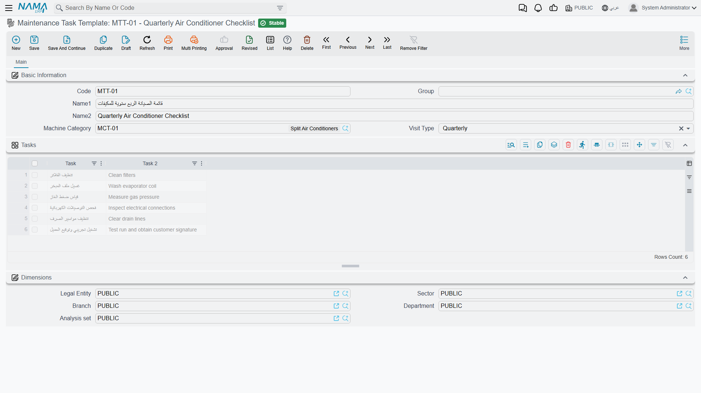

# Task Templates

A monthly chiller service is three things: replace the air filter, check the oil level, record the running hours. Every month, on both Marina Plaza chillers, for the whole year of the contract. Nobody wants to retype that on forty-four execution sheets, and nobody wants a technician deciding from memory what "the monthly service" includes.

A **task template** is that checklist, written once. Al Nokhba keeps four:

| Code | Name | Used for |
|---|---|---|
| `TT-CHL-M` | قائمة الفحص الشهرية للتشيلر / Chiller Monthly Checklist | the monthly visit on both chillers |
| `TT-CHL-Q` | قائمة الفحص الربع سنوية للتشيلر / Chiller Quarterly Checklist | the deeper quarterly visit |
| `TT-AHU-M` | قائمة الفحص الشهرية لوحدة المناولة / AHU Monthly Checklist | the air handling unit |
| `TT-BRN-B` | قائمة الفحص نصف الشهرية للفروع / Branch Fortnightly Checklist | the bank branches in the services suite |

::: info Required licence
`crm-maintenance`. The screen is under **Customer Relationship Management → Maintenance Files → Maintenance Task Template** (قالب مهام).
:::

## What Is on the Template

| Field (Arabic / English) | What it holds |
|---|---|
| الكود / **Code**, group, Arabic and English names | `TT-CHL-M`, Chiller Monthly Checklist. |
| تصنيف آلة / **Machine Category** | The family this checklist belongs to — `MCT-CHL` Central Cooling. |
| نوع الزيارة / **Visit Type** | Which cycle it is meant for: Daily, Weekly, Bimonthly, Monthly, Quarterly, Biannual or Yearly. |
| Tasks grid | Two columns — **المهمة / Task** and **مهمة 2 / Task 2** — one line per thing to be done. |

`TT-CHL-M` holds three lines: تغيير فلتر الهواء / Replace air filter · فحص مستوى الزيت / Check oil level · تسجيل ساعات التشغيل / Record running hours.

The tasks are free text. There is no duration, no skill, no sequence number, no mandatory flag and no signature column — a task is a sentence a technician reads and ticks. Keep them short and unambiguous, because they are what the person on the roof at eight in the morning actually sees.

The template screen is the header block above and the Tasks grid below it:

::: tip "Bimonthly" means every fourteen days
The visit-type list contains an option whose English label reads **Bimonthly**. Everywhere in this module that option steps **14 days**, not two months. If you name templates after their cycle, name them by what the cycle really is — see the [maintenance work plans page](/modules/crm/maintenance-cycle/crm-maintenance-work-plans) for the full stepping table.
:::

## The Three Places a Template Is Used

**On the machine.** Pick a template in the header of a [machine record](/modules/crm/maintenance-setup/crm-machines) and the machine's own Tasks grid is rebuilt from the template's lines. Note *rebuilt* — anything already in the grid is replaced. `MCH-00311` and `MCH-00312` carry `TT-CHL-M`; `MCH-00318` carries `TT-AHU-M`.

**On the contract, per visit type.** This is where a template earns most of its value. Each machine line on a [maintenance contract](/modules/crm/maintenance-cycle/crm-maintenance-contracts) can carry up to **seven visit types, each with its own template**. On `MC-0021`, both chillers are set to Monthly with `TT-CHL-M` and Quarterly with `TT-CHL-Q`; the air handling unit is Monthly with `TT-AHU-M` only. When the work plans and orders are generated, each visit carries the right checklist for its cycle — the quarterly visit is a different list from the monthly one, and neither has to be remembered by anyone.

**On the execution sheet.** When a [maintenance order generates its execution documents](/modules/crm/maintenance-cycle/crm-maintenance-executions), the checklist is copied onto each one so the technician has it in front of him. The three executions from order `MO-0513` each arrived with their machine line's template — three ticks each — and the crew closed them with *تحديد كل السطور كمنتهية / Mark All Lines Done*.

Which template the generated execution uses is a setting, not a guess: the option **Consider Task Templates Tasks When Creating Executions** (اعتبار مهام قوالب المهام عند إنشاء عمليات التنفيذ) on the [maintenance order term](/modules/crm/document-terms/crm-maintenance-terms) chooses between the execution document's own template and the order line's template. Pick one convention for the installation and leave it alone; switching it later changes what appears on new executions and confuses the crew.

There is a fourth, smaller route: if somebody creates an execution sheet by hand and picks a machine on it, the **machine's own** Tasks grid is copied across — which is the other reason to keep a sensible template on every machine.

::: warning Nothing enforces the checklist
A checklist with unticked lines does not block anything. The execution sheet can be committed with every line untouched, the order still moves on, and nothing reports on which tasks were skipped. The checklist is a memory aid and a record of what the technician says he did — not a control.
:::

## Building Your Templates

1. One template per **machine family and cycle** — monthly chiller, quarterly chiller, monthly AHU. Resist one giant template with conditional lines; the technician cannot see conditions.
2. Tie each to its **machine category** so it is recognisable in a lookup, and set its **visit type** to the cycle it belongs to.
3. Write each task as an instruction, not a heading. "Replace air filter" is a task; "Filters" is not.
4. Attach the everyday template to the machine, and set the per-visit templates on the contract's machine lines when the contract is written.

Task templates have no accounting or inventory effect, generate nothing, and have no validation beyond the ordinary master-file rules. Nothing reports over them either — to see what was done, read the execution sheets on the order.

## Maintenance Groups — The Crews

Sitting beside the task templates in the same menu folder is one more small file: **Maintenance Group** (مجموعة صيانة). It is even simpler — a code, names, and a grid of **الفنيين / technicians** with a remark against each.

Al Nokhba keeps `MG-01` فريق التبريد – الإسكندرية / Cooling Crew – Alexandria, listing Mahmoud Adel Hassan (`EMP-2011`) and Sayed Abdullah Morsy (`EMP-2014`).

A maintenance order names both an individual **technician** and, optionally, a **maintenance group** — the crew that went out. On order `MO-0513` the technician is `EMP-2011` and the group is `MG-01`. The group is a record of who was on the job and a convenient way to write "the cooling crew" instead of naming three people; it does not assign work, does not check availability, and does not divide the technicians' reward — that grid on the order is filled in by hand and must sum to the header figure.
