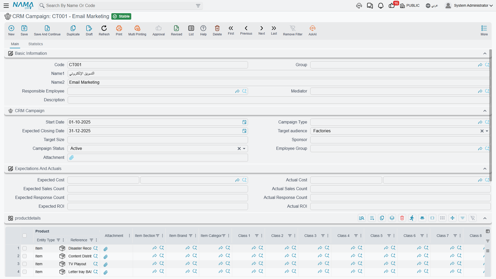

# Campaigns

In January 2026, Al Nokhba Air Conditioning Systems took a stand at the International Cooling Expo.
The marketing department booked the space, printed the brochures, staffed the stand with two
salespeople for three days, and expected to come away with around 120 qualified visitors. Somebody
has to write that down somewhere — what the campaign is, who owns it, which products it pushes, who
is working it — and then, months later, somebody has to answer the question *"was it worth it?"*.

The **CRM Campaign** screen (حملة) answers the first half of that very well. It is an honest,
useful register card for a marketing effort. The second half — *was it worth it* — it does not
answer, and the most important thing this page can do is tell you that clearly enough that you plan
around it from day one.

::: info Required licence
`crm`
:::

| What | Where |
|---|---|
| CRM Campaign | Customer Relationship Management > Marketing > CRM Campaign |
| Campaign Type | Customer Relationship Management > Marketing > Campaign Type |

## A campaign is a file, not a document

Although the campaign carries dates, money boxes and a status, it is a **master file**. It has no
document book, no document term, no document
number, no value date and no approval cycle. Saving it does not process anything, does not create a
business request and has no accounting effect whatsoever. It is a card in a drawer, and everything
on it was typed there by a person.

That is worth internalising before reading the rest of the screen, because several of the boxes on
it look like they belong to a document that calculates.

## What you fill in

The top of the screen is the campaign's identity: code, group, Arabic and English names, the
responsible employee, the mediator, and a free-text description.

The **CRM Campaign** group underneath is the campaign itself:

| Field | Notes |
|---|---|
| تاريخ البداية / Start Date | the date the campaign begins |
| نوع الحملة / Campaign Type | a reference to the Campaign Type file — exhibition, mailshot, road show |
| تاريخ الإغلاق المتوقع / Expected Closing Date | the only "end" the campaign has; there is no enforced end date |
| الجمهور المستهدف / Target Kind | a fixed list: Factories, Projects, Trade Shows |
| الحجم المستهدف / Target Size | **free text** — `120 qualified visitors` is a perfectly normal value |
| الراعي / Sponsor | **free text** — a department, a partner, a budget holder |
| حالة الحملة / Campaign Status | Planning, Active, InActive, Completed, Cancelled |
| مجموعة موظفين / Employee Group | present on the screen but read by nothing — see the note below |
| مرفق / Attachment | one file slot |

For our expo, that reads: type `CT-03` معرض / Exhibition, start 8 January 2026, expected closing
31 March 2026, target kind Trade Shows, target size `120 qualified visitors`, sponsor
`Marketing Department`, status Active.

::: tip Two things that are not on this screen at all
There is **no channel field** — nothing records whether this was e-mail, SMS, social media, print or
a stand at a fair. If channel matters to you, put it in the campaign name or use the Campaign Type
file for it, which is what most sites end up doing.

And there is **no employee-group behaviour**. The *Employee Group* box accepts a value and no part
of the system ever reads it. The grid below is what actually assigns people.
:::

### The products grid — mandatory, and easy to be surprised by

The **productdetails** grid (its title is untranslated, so it shows literally as `productdetails` in
both languages) lists what the campaign promotes: one row per item or rental unit, with the item's
section, brand, category, classifications and dimensions alongside.

**At least one row is required.** A campaign with an empty products grid cannot be saved, which
catches people out on the very first campaign they create. For the expo we list `AC-CHL-300`
(the 300 TR central chiller) and `AC-SPL-24` (the 24,000 BTU split unit).

### The Assigned To grid — this one genuinely does something

*مسند إلي / Assigned To* lists the employees working the campaign, with a remarks column. The
employee picker offers only employees flagged as **salesmen** on their employee file, so if a
colleague is missing from the list, that flag is the reason.

This grid is the campaign's one piece of real machinery. When a salesperson later opens a
[lead](/modules/crm/sales-pipeline/crm-leads.md) and picks this campaign in its *Campaign* box, the
campaign's Assigned To rows are copied into the lead's own assigned-employees grid. On our expo
campaign the two rows `EMP-1042` (Hala) and `EMP-1001` (Tarek) arrived on lead `LD-00417` that way,
without anyone typing them.

## Expectations and Actuals — read this before you use it

The group titled **المتوقع والفعلى / Expectations And Actuals** looks like a small business case:
expected and actual cost, expected and actual sales count, expected and actual response count,
expected and actual return on investment.

::: danger Nothing here is calculated, and nothing here is posted
All eight boxes are **free-typed numbers**. Nothing sums the campaign's real spend, nothing counts
responses, nothing counts sales, and nothing divides one number by another to produce a return on
investment. The *actual* boxes are not filled by the system at any point, under any condition —
they are yours to type.

The campaign has **no accounting effect** either. The cost you type here never becomes a journal
entry, is never compared with a supplier invoice or an expense voucher, and never appears in any
financial statement. If the marketing spend has to reach the ledger, it reaches it the ordinary way —
through purchase invoices and expense vouchers in Accounting — and this box is a separate note you
keep in step by hand.
:::

So for the expo, the eight boxes read: expected cost 180,000.00 against actual cost 196,500.00;
12 sales expected against 5 recorded; 120 responses expected against 94 recorded; expected return
3.5 against actual 2.1. Every one of those ten figures was typed by a person reading them off
somewhere else. That is a perfectly reasonable way to keep a campaign scorecard — as long as
everybody knows that is what it is.

## Where campaigns and leads meet

A campaign does not produce leads. There is no button on this screen that creates a lead, imports a
response list or opens a pipeline record. **The link is made in the other direction, one record at a
time**: the salesperson opens a [lead](/modules/crm/sales-pipeline/crm-leads.md) or a
[potential](/modules/crm/sales-pipeline/crm-potentials.md) and picks the campaign in its *Campaign*
box.

::: warning The campaign picker shows every campaign
The picker on the lead and potential screens was meant to hide cancelled and inactive campaigns. It
does not — the filter never excludes anything, so a campaign you closed two years ago is still
offered alongside this quarter's. Give campaigns dated names (`Cooling Expo 2026`, not `Expo`) so
the person choosing can tell them apart.
:::

The second tab, **الإحصائيات / Statistics**, is where the attributions come back to you. It holds
three read-only lists — the leads that carry this campaign, the potentials that carry it, and the
customers that carry it. Nothing there is editable; it is a live look at who pointed at this
campaign.

The Customers list deserves a word, because it fills up less often than people expect. A customer
only carries a campaign when *Convert To Customer* was pressed **on a Lead** that already had the
campaign. In our example the lead was first converted to a potential — and conversion to a potential
does not carry the campaign across — so when the customer `C-01188` was finally created from the
potential, it arrived with no campaign, and the expo campaign's Customers list stayed empty even
though the deal came from the expo. See [Converting a Lead](/modules/crm/sales-pipeline/crm-lead-conversion.md)
for what each conversion button carries. If campaign attribution on customers matters to you, decide
early that leads are converted straight to customers, because there is no other route: the campaign
field does not appear on the customer screen, so it cannot be set or corrected afterwards.

## The question this screen cannot answer

::: danger A won deal can never be traced back to the campaign that produced it
Attribution stops at the customer. **No sales quotation, sales order, invoice, delivery or revenue
document anywhere in NaMa carries a campaign.** There is no campaign box on those screens, no
campaign column in their lists and no campaign filter in their exports.

That means the chain "campaign → lead → customer → order → invoice → revenue" is broken at the
fourth link, permanently. The system cannot tell you what a campaign earned, cannot compare two
campaigns by revenue, and cannot produce a cost-per-lead or a return-on-investment figure. The
*Actual ROI* box is where somebody types the answer they worked out elsewhere.
:::

That is not the end of the road, though — it just means the arithmetic happens outside the screen.
What works in practice:

1. **Be strict about the campaign field on leads.** It is the only attribution point that exists, so
   a lead created without it is invisible to the campaign forever.
2. **Read the counts off the Statistics tab**, or from the CRM Lead list view filtered by campaign.
   That gives you a real, trustworthy *number of leads* for the campaign — the one figure in this
   whole area the system does compute for you.
3. **Export and pivot.** The CRM Lead and CRM Potential list views export to Excel with the campaign
   column included. Cross that with a sales export by customer and you have the revenue side of the
   equation, once, in a spreadsheet.
4. **Ask for a BI dashboard** if this is a recurring question. The data is all in the database; what
   is missing is a screen that joins it, and BI is where a site builds one.
5. Then type the answer into *Actual ROI* so the campaign card carries the conclusion.

## Campaign Type

The **Campaign Type** file (نوع حملة) is a plain label — a code, an Arabic and English name, a
responsible employee and a mediator. It carries no defaults, no cost account, no channel and no
behaviour; picking a type on a campaign changes nothing else on the screen. It is covered with the
other CRM classification files in
[Classification Files](/modules/crm/master-files/crm-lead-classification-files.md).

## Two smaller things worth knowing

::: warning Two extra fields exist outside the screen
Besides the *Target Kind* list and the *Sponsor* text box, the campaign record carries two further
stored fields that look like a target-audience text and a sponsor text. They are not on the screen
and nothing reads them — but they **do** appear in imports, exports and list-view column pickers,
where they are indistinguishable from the real ones. When you build an import file or a list layout,
make sure you picked *Target Kind* and *Sponsor*, not their look-alikes; data written into the other
two is silently invisible.
:::

Unlike every other screen in this area, the campaign does **not** fill the Responsible Employee with
the logged-in user's employee when you create it. If you want an owner on the card, set it yourself.

::: info Reporting
Reporting: none. This module ships no system reports, and this screen has no print form. Use the
campaign, lead and potential **list views**, their Excel export actions, or a BI dashboard built by
your site.
:::
