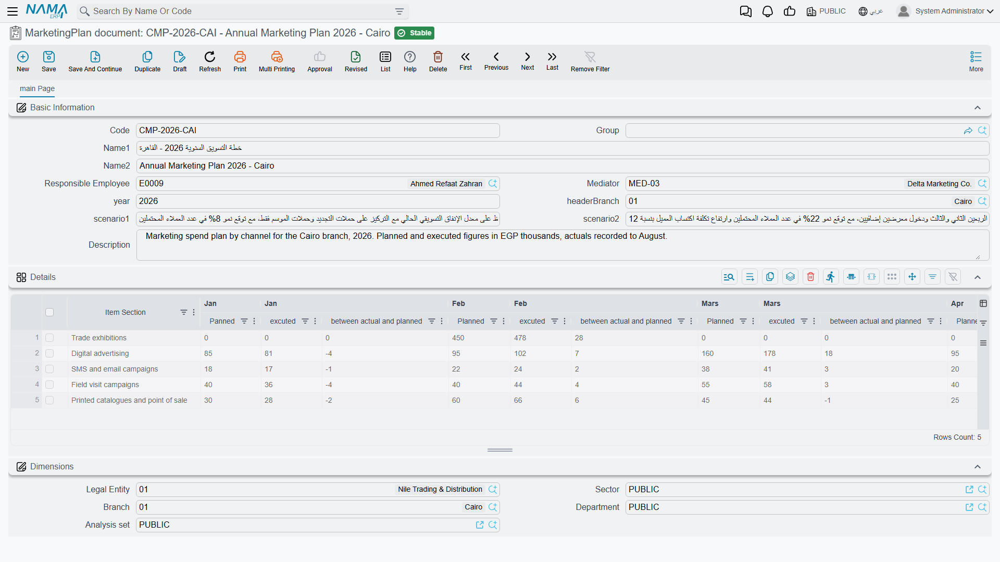

# Marketing Plans

Every December the sales director sits down and writes the year out on one sheet: central AC units
should bring in 400,000 a month, spare parts 90,000, maintenance contracts 150,000. Twelve columns
across, one row per line of business, and a running comparison against what actually happened.

The **MarketingPlan document** screen (خطة تسويق) is exactly that sheet, moved into NaMa. It is
honest about what it is once you know one thing: **it is a sheet, not an engine.** Every planned
figure and every actual figure on it is typed by a person. What the screen gives you in return is
the arithmetic — row totals and monthly deviations that keep themselves up to date as you type — and
a single place where the whole year lives instead of a spreadsheet on somebody's laptop.

::: info Required licence
`crm`
:::

| What | Where |
|---|---|
| MarketingPlan document | Customer Relationship Management > Marketing > MarketingPlan document |

::: tip The menu calls it a document; it is a master file
Despite the name in the menu, this is a **master file**: no document book, no document term, no
document number, no value date and no approval cycle. Saving it processes nothing and has no
accounting effect. The same is true of the Target Plan next door.
:::

## The header

Four boxes matter, and one of them will surprise you:

- **سنة خطة التسويق / Year** — the plan year, and it is **free text**, not a number. `2026` and
  `2026 – revised` are both accepted. Pick one convention and hold to it across the site, because
  nothing sorts, groups or validates this field for you.
- **الفرع / Branch** — the branch the plan belongs to, `BR-CAI` in our example.
- **سناريو1 / Scenario 1** and **سناريو2 / Scenario 2** — two free-text boxes. Nothing reads them
  and nothing branches on them; they are a place to write "optimistic" or "board-approved" if that
  helps you tell two plans apart.
- Plus the usual responsible employee, mediator and remarks.

## The details grid — one row per section, twelve months across

Each row of the grid is one line of business, and its first column is labelled **قسم الصنف / Item
Section**.

::: warning "Item Section" is free text, not a reference
The column is labelled like a link to the item-section master file, but it is an ordinary text box.
Nothing validates what you type, nothing looks it up, and nothing joins your plan to actual item
sections anywhere in Supply Chain.

The practical consequence is spelling. `Spare parts`, `Spare Parts` and `spare-parts` are three
different rows to anybody reading the sheet, and next year's plan will not match this year's unless
somebody copies the wording exactly. Agree the section names once, write them down, and reuse them.
:::

After the section come the twelve months. Each month is three columns:

| Column | Meaning |
|---|---|
| مخطط / Planned | what you intend to achieve that month |
| فعلي / Actual | what actually happened — **typed by hand** |
| الانحراف / Deviation | calculated: **actual − planned** |

and the row ends with two totals: **إجمالي المخطط / Total Planned** and **إجمالي المنفذ / Total
Executed**, the sums of the twelve planned and the twelve actual cells.

Al Nokhba's 2026 plan (`MKP-2026`) has three rows, with the same planned figure every month and
only the first quarter's actuals entered so far:

| Section | Planned / month | Total planned | Jan actual | Feb actual | Mar actual | Total executed |
|---|---|---|---|---|---|---|
| Central AC units | 400,000.00 | 4,800,000.00 | 320,000.00 | 455,000.00 | 400,000.00 | 1,175,000.00 |
| Spare parts | 90,000.00 | 1,080,000.00 | 84,000.00 | 97,500.00 | 91,000.00 | 272,500.00 |
| Maintenance contracts | 150,000.00 | 1,800,000.00 | 140,000.00 | 165,000.00 | 150,000.00 | 455,000.00 |
| **Totals** | | **7,680,000.00** | | | | **1,902,500.00** |

which gives, for the first quarter:

| Section | Jan | Feb | Mar |
|---|---|---|---|
| Central AC units | −80,000.00 | +55,000.00 | 0.00 |
| Spare parts | −6,000.00 | +7,500.00 | +1,000.00 |
| Maintenance contracts | −10,000.00 | +15,000.00 | 0.00 |

## Which way does the deviation point?

On this screen the deviation is **actual − planned**. A **positive** number means you beat the plan;
a **negative** number means you fell short. January was 80,000 behind on central units; February was
55,000 ahead.

::: warning The Target Plan reads the other way round
The [Target Plan](/modules/crm/marketing/crm-target-plans.md) has a grid that looks identical —
same twelve months, same three columns, same Arabic column header — but its deviation is
**planned − actual**, so a positive number there means a **shortfall**.

Two screens, same layout, opposite meaning. Whenever you put a deviation figure in front of somebody
who did not open the screen themselves, say which of the two plans it came from.
:::

## Where the actual figures come from

They come from you. There is **no *Actual update* button on this screen**, no query behind it, no
service call, and nothing anywhere in NaMa that pushes a sales figure into a marketing plan. The
system never reads a sales order, an invoice or a revenue account on this screen's behalf.

That is not as bleak as it sounds — it just means the plan is a review sheet rather than a live
report. In practice, once a month somebody:

1. runs the sales figures they trust — from the Sales list views and their Excel export, from an
   accounting report, or from a BI dashboard the site has built;
2. opens the marketing plan and types the month's actuals into the three rows;
3. reads the deviations and the two totals, which update as they type.

If you want the actual figures to arrive by themselves, that is a BI question, not a marketing-plan
question. The marketing plan is where the **target** lives and where the conversation happens.

::: warning The deviation cells do not always refresh
The deviation only recalculates when the month's **actual** cell holds a non-zero value. Two
consequences follow, and both bite in ordinary use:

- Type a *planned* figure into a month whose actual is still empty, and the deviation cell stays
  blank or keeps its old value.
- Clear an actual back to zero, and the old deviation stays on screen.

Saving does not clean this up — unlike the Target Plan, this screen has no recalculation on save.
The fix is simply to re-enter the month's *actual* value; the whole row's arithmetic then catches up.
When you are reading a plan somebody else filled in, trust the *Total Planned* and *Total Executed*
columns over an individual deviation cell, and if a deviation looks impossible, retype the actual
next to it.
:::

## What the plan does not touch

Nothing. The marketing plan generates no document, is read by no other screen, has no accounting
effect and no inventory effect, and no button on any other screen creates one. It is a standalone
sheet — which is why the only real risks with it are the spelling of the section names and the two
sign conventions.

::: info Reporting
Reporting: none. This module ships no system reports, and this screen has no print form. To get the
plan out, use the list view's Excel export and work in the spreadsheet.
:::

::: tip A note on the English column headers
Several English headers in the twelve-month grid are misspelt in the shipped screen — you will see
`Jan|Panned`, `Mars|Planned`, `Jan |excuted`, `Sept|Planned` and `total Excuted`. They are cosmetic;
the columns behave exactly as the Arabic labels describe. The Arabic month headers are correct.
:::
