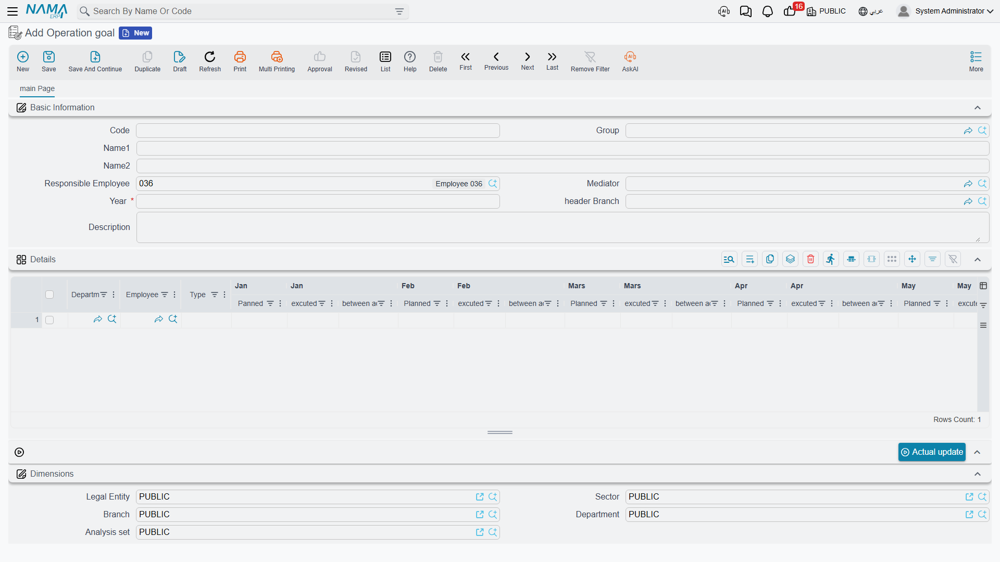

# Target Plans

Hala is expected to make forty calls in January, eight site visits, and to open six new leads.
Karim, over in maintenance, is expected to record twenty-five ticket executions a month. That is a
quota — and it is a quota of **activities**, not of money.

The screen the menu calls **Operation goal** (هدف تشغيل) is where that quota lives. It is the
closest thing the CRM module has to a sales-target sheet, and the single most important sentence
about it is this: **a target plan counts activities.** Calls, visits, leads, tasks, potentials,
projects and ticket executions. It has no amount column, no currency, no item and no product, and it
is never compared with an order, an invoice or a revenue figure. If you came looking for "Hala must
sell 4 million this year", this screen cannot hold that sentence.

::: info Required licence
`crm`
:::

| What | Where |
|---|---|
| Operation goal | Customer Relationship Management > Marketing > Operation goal |

Like the [Marketing Plan](/modules/crm/marketing/crm-marketing-plans.md) next to it, this is a
**master file** — no document book, no document term, no document number, no approval cycle, no
accounting effect.

## The header

- **السنة / Year** — a whole number, and it is **required**. Unlike the marketing plan's free-text
  year, this one is a real number, so `2026` it is.
- **الفرع / Branch** — the branch. Record it for your own filing; nothing filters or restricts by it.
- Responsible employee, mediator and remarks.

## One row per employee, per activity type

The details grid is where the quota is written. Each row answers "who, and what are we counting?":

| Column | Meaning |
|---|---|
| الإدارة / Department | the department the target belongs to |
| الموظف / Employee | **whose** quota this row is |
| النوع / Type | **what** is being counted |
| مخطط · فعلي · الانحراف, twelve times | planned count, actual count and deviation for each month |
| إجمالي المخطط / Total Planned | the sum of the twelve planned counts |
| إجمالي المنفذ / Total Executed | the sum of the twelve actual counts |

The *Type* column offers seven things to count, and only these seven:
**CRM Call**, **Visit**, **CRM Lead**, **CRM Potential**, **CRM Task**, **CRM Project** and
**Ticket Execution**.

So an employee with three kinds of quota gets three rows. Al Nokhba's plan for 2026 (`TGT-2026`)
looks like this:

| Department | Employee | Type | Monthly plan | Total planned | Jan | Feb | Mar | Total executed |
|---|---|---|---|---|---|---|---|---|
| `DPT-SLS` | `EMP-1042` Hala | CRM Call | 40, 40, 40, 45, 45, 45, 30, 30, 45, 50, 50, 40 | **500** | 36 | 44 | 41 | **121** |
| `DPT-SLS` | `EMP-1042` Hala | Visit | 8 every month | **96** | 7 | 9 | 8 | **24** |
| `DPT-SLS` | `EMP-1042` Hala | CRM Lead | 6 every month | **72** | 5 | 8 | 6 | **19** |
| `DPT-MNT` | `EMP-1055` Karim | Ticket Execution | 25 every month | **300** | 22 | 27 | 24 | **73** |

::: danger This quota can never be expressed in money
There is no amount, no currency, no item and no price anywhere on this screen, and nothing in the
system compares a target plan with a sales order, an invoice, a contract value or a collection. A
target plan says "forty calls", never "four hundred thousand".

That is a real limitation, not a setting you can switch on. If your sales targets are monetary, the
target plan is the wrong sheet for them — use the
[Marketing Plan](/modules/crm/marketing/crm-marketing-plans.md), which is at least denominated in
money (per section rather than per employee), or keep the monetary target outside NaMa and use this
screen for the activity discipline that supports it.
:::

## The deviation, and the trap next door

Deviation on this screen is **planned − actual**. A **positive** number is a **shortfall** — Hala
planned 40 calls in January and made 36, so January reads `+4`. A **negative** number means she beat
the target: February planned 40, achieved 44, deviation `−4`.

::: warning The Marketing Plan reads the other way round
The [Marketing Plan](/modules/crm/marketing/crm-marketing-plans.md) grid looks identical and
calculates **actual − planned**, so there a positive number is good news. Same layout, same Arabic
column header, opposite sign.

Whenever a deviation figure leaves the screen — in an e-mail, a meeting, an exported sheet — say
which plan it came from.
:::

The good news is that this screen's arithmetic is reliable. Both totals and all twelve deviations
are recalculated on the server every time the record is saved, so a target plan you open is always
internally consistent, however it was filled in.

## The *Actual update* button

The screen carries a button labelled **تحديث فعلي / Actual update**, sitting in the actions block on
the main page. Its intention is obvious and appealing: press it, and the twelve *actual* cells fill
themselves with the real number of calls, visits and leads the employee recorded that year.

::: danger *Actual update* does not work — it fails with a database error
Pressing the button returns a database error instead of filling anything in. The query behind it
refers to a table that does not exist in the database, so it fails before a single row is read. This
happens on every installation, on every target plan, every time.

**Target achievement is therefore never measured automatically.** Treat the target plan as a sheet
you fill in and read by eye: the planned counts are typed, and so are the actual counts.
:::

::: warning Do not try to make the button work
It is worth saying plainly, because the failure looks like a small database problem somebody could
patch. It is not, and repairing the query would make things worse rather than better:

- Each employee-and-type row comes back from the query carrying **one** month's count, and the
  screen would copy that single value across all twelve months — writing a real figure into one
  month and **zero into the other eleven**, wiping any actual counts already typed there.
- The query has no filters at all: no year, no branch, no legal entity, no dimensions, and no
  distinction between a saved document and a draft. It would count everything in the database,
  including other companies' records and unfinished drafts, towards an employee's target.

So the honest position is not "this feature is broken and will be fixed shortly by your database
administrator" — it is "this feature does not exist yet". Fill the actual columns by hand.
:::

## Getting the real counts by hand

Typing actuals is less painful than it sounds, because every count this screen wants is one filtered
list view away. For each employee and month:

1. Open the matching list view — CRM Call, Visit, CRM Lead, CRM Potential, CRM Task, CRM Project or
   Ticket Execution.
2. Filter by the employee and the month's date range.
3. Read the record count off the list, or export the filtered list to Excel and count there.
4. Type the number into the month's *فعلي / Actual* cell.

If this is a monthly ritual for a dozen employees, it is worth building a small BI dashboard that
produces the whole matrix in one place — the underlying data is complete and perfectly countable;
what is missing is only a screen that adds it up. Then transcribing twelve numbers per row takes a
few minutes and the target plan stays the single sheet everybody reviews.

::: tip Keep an eye on the year
Because the plan's *actual* figures are typed and nothing re-derives them, a target plan is a
snapshot of whoever last updated it. Nothing in the module reminds anybody that a month has
closed — there is no scheduler, no alarm and no notification anywhere in CRM. Put the update in
someone's monthly routine, and use the
*Remarks* box to record how far the actuals have been brought up to date — there is no "last
updated" indicator that means anything on this screen.
:::

::: info Reporting
Reporting: none. This module ships no system reports, and this screen has no print form. The
activity list views, their Excel export and BI are where achievement figures actually come from.
:::

::: tip A note on the English column headers
As on the marketing plan, some English month headers in this grid are misspelt (`Jan|Panned`,
`Mars|Planned`, `Jan |excuted`, `Sept|Planned`, `total Excuted`). They are cosmetic; the Arabic
headers are correct and the columns behave as described above.
:::
