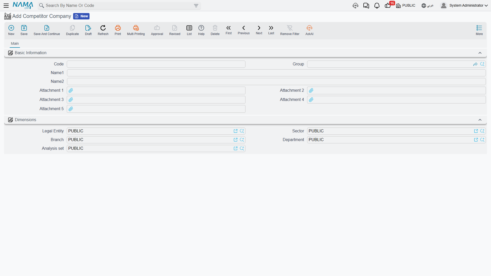

# Competitors

**Competitor Company / شركة منافسة** —
`Customer Relationship Management > Marketing > Competitor Company`.
**Competitor Company Item / صنف شركة منافسة** —
`Customer Relationship Management > Marketing > Competitor Company Item`.

::: info Required licence
`crm`.
:::

When Hala loses a chiller deal at Marina Plaza, the useful question afterwards is not *why* so much
as *to whom, and with what*. These two files let the sales team record that on the product line
itself: which rival company was in the room, and which of their products was quoted against yours.

Set the expectation first, though, because it saves disappointment later.

::: warning This is data capture, not competitive analysis
Nothing in the product reads the competitor you recorded. There is **no report, no dashboard, no
list view and no win/loss analysis** anywhere in CRM that looks at competitor data, and a competitor
line has no connection to the lead's status or its rejection reason. What you type here comes back
out only through the list views, an Excel export, or a view your site builds in BI.
:::

## The two files, and the direction they point

**Competitor Company** is the rival firm. Its screen is genuinely just a name:

| Field | Notes |
|---|---|
| Code, Group, Name1, Name2 | The usual basic block. |
| Attachment 1 … Attachment 5 | Where a brochure or a price list you got hold of can live. |

Then the **Dimensions / محددات** group, and that is the entire record. There is no address, no
contact, no market share, no notes box.

**Competitor Company Item** is one of *their* products — and its grid lists the products of *yours*
that it competes with. That direction is the thing to get straight: you are not describing your item
and listing rivals for it; you are describing a rival item and listing the items of yours it turns
up against.

| Field | Notes |
|---|---|
| Code, Group, Name1, Name2 | The usual basic block. |
| Competitor Company / الشركة المنافسة | Which rival makes it. |
| Grid: *Items corresponding to competitor Item* / *الأصناف المقابلة للصنف المنافس* | Your items that compete with it. |

The grid ships with **two columns — Item and Remark**. The row is capable of carrying eight more
values (two references, two texts, two dates and two numbers), but they are not on the screen as
shipped, so a site that wants to record, say, the competitor's list price has to have that column
added to the layout first.

In the worked example, `COMP-03` **Ufuq Air Conditioning Co.** (شركة الأفق للتكييف) is the rival,
`CITM-011` **Ufuq Chiller 300 TR** (تشيلر أفق 300 طن) is their machine, and the grid on `CITM-011`
lists `AC-CHL-300`, Al Nokhba's own 300-TR chiller.

## Where the competitor files actually do something

Three small conveniences, all of them on the **Products** grid of a
[Lead](/modules/crm/sales-pipeline/crm-leads.md), a
[Potential](/modules/crm/sales-pipeline/crm-potentials.md) or a
[Call](/modules/crm/activities/crm-calls.md). That grid has a *Competitor Company* column and a
*Competitor Item / صنف الشركة المنافسة* column next to each product you are quoting.

1. **Pick the competitor item and the company fills itself.** Choose `CITM-011` on a product line
   and *Competitor Company* becomes `COMP-03` without being asked.
2. **The competitor-item picker narrows itself.** Once the line has a competitor company and a
   product, the picker offers only that company's items, and only those whose grid lists the product
   on the line. On lead `LD-00417`, line `AC-CHL-300` offers `CITM-011`; line `AC-AHU-12` offers
   nothing, because no Ufuq item lists the AHU.
3. **On a Call, the arrow reverses.** Choose the competitor item first and the *Product* picker
   narrows to the items listed inside that competitor item's grid — useful when the customer opens
   the conversation by naming the rival's model.

That is the complete functional footprint. Nothing else in the module consults these two files.

::: tip If an old competitor item stops appearing in the picker
The narrowing in point 2 relies on an index that each competitor item rebuilds when it is saved. A
record that was created before the item grid was filled in, or imported without going through the
screen, can be missing from it — the symptom is a competitor item that exists but never appears once
a product has been chosen on the line. Open the competitor item and save it again.
:::

## Setting them up

Create the **Competitor Company** first, then a **Competitor Company Item** for each of their
products you regularly meet, and list your own competing items inside each one. Do not try to build
a catalogue of everything a rival sells — build only the pairings your salespeople actually collide
with, because the pairing is what makes the picker useful.

Neither screen validates anything on save, neither auto-fills a responsible employee, and neither
has a Remarks box.

## Reporting

Reporting: none. This module ships no system reports, and this screen has no print form. Getting the
competitive picture back out means exporting the leads, potentials or calls with their product lines
to Excel, or building the analysis in BI.
