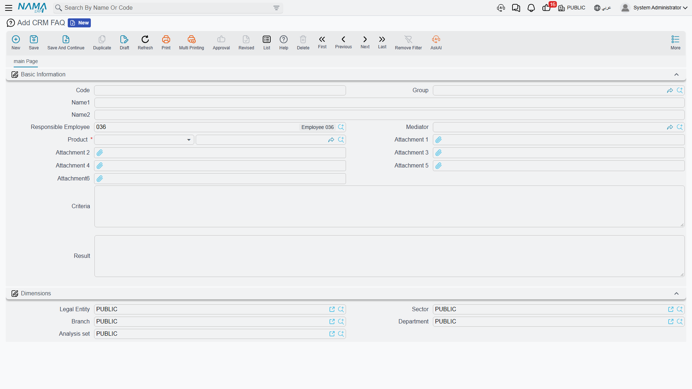

# FAQ

**CRM FAQ / سؤال شائع** — `Customer Relationship Management > Support > CRM FAQ`.

::: info Required licence
`crm`.
:::

Every support desk eventually notices that the same three questions arrive every week, and wants a
place to write down the answers. The CRM FAQ file is that place — a list of question-and-answer
records, each tied to a product, that a support agent fills as a by-product of closing a ticket.

Before you build anything on it, be clear about its reach.

::: warning This is a notebook, not a knowledge base
The system never surfaces an FAQ entry anywhere. There is **no FAQ panel on the
[trouble ticket](/modules/crm/support/crm-trouble-tickets.md) screen**, none on the
[Complaint](/modules/crm/support/crm-complaints.md), none on the ticket execution; there is no
suggestion as you type, no search across FAQ text from anywhere else, and no customer portal. The
only way anybody reads an FAQ entry is by opening the FAQ list screen and looking for it.

Write entries here if a shared internal notebook is useful to your team. Do not promise a
self-service knowledge base, and do not plan a support process that depends on agents being shown
the right answer automatically — nothing does that.
:::

## Where an FAQ comes from

You can create one from the menu like any other record, but the intended route is the
**Convert To FAQ / تحويل إلي سؤال شائع** button on a trouble ticket. The story it is built for goes
like this: a ticket comes in, the technicians work it, they write up what they did in their
execution notes, the ticket is closed — and the agent presses one button to turn the whole episode
into a reusable entry.

Pressing it does this:

1. It checks the ticket first, and refuses if the ticket has **no Product** ("You must enter the
   product") or **no description** ("You must enter the ticket description").
2. It opens a **new, unsaved** FAQ record with the ticket's **Product** copied in, the ticket's
   description as the question, and the notes from **every ticket execution** on that ticket run
   together into the answer, oldest execution first.
3. You edit it into shape and **save it yourself**. Nothing is saved for you, and the ticket is not
   marked, linked or changed in any way — press the button twice and you get two records.

In the worked example that is how `FAQ-0031`
(الوحدة لا تعمل بعد انقطاع التيار / *Unit does not start after a power cut*) came into being, out of
ticket `TKT-0451` on the split unit at Marina Plaza.

## The screen

One page.

| Field | Notes |
|---|---|
| Code, Group, Name1, Name2 | The usual basic block. There is no Remarks box. |
| Responsible Employee / الموظف المسئول | Filled with your user's employee when you press New — **unconditionally**, whatever the *Fill Responsible Employee With Current Employee* [setting](/modules/crm/crm-configuration.md) says. That option is honoured by the Lead screen only. |
| Mediator / الوسيط | Optional. |
| Product / المنتج | **Required.** An inventory item, or a rental unit. |
| Attachment 1 … Attachment 6 | Six slots here, rather than the usual five — room for a photograph of the fault or a wiring sheet. |
| **Criteria** / السؤال | **The question.** See the warning below. |
| **Result** / الإجابة | **The answer.** |

Then the **Dimensions / محددات** group.

::: warning The English labels say "Criteria" and "Result"
On an English interface the two large boxes at the bottom of the screen are labelled **Criteria**
and **Result**. They are not criteria and they are not a result — they are the **question** and the
**answer**, and they are the two boxes the *Convert To FAQ* button fills. The Arabic interface reads
correctly: **السؤال** and **الإجابة**.

Nothing is wrong with the data; only the two English captions are wrong. Tell new English-language
agents this once, or they will hunt for a Question box that is not there.
:::

## Getting entries back out

The FAQ list screen shows the **Product** column, and you can filter it by **Product** and by the
question text. That, plus the Excel export, is the whole retrieval story — so the practical advice
is to make the list itself readable:

- Put a short, searchable summary in **Name1 / Name2**. That is what you will be scanning down the
  list, not the question text.
- Always set the **Product**, because it is the only filter that behaves like a category.
- Trim the answer the button generated. Raw execution notes read as a work log, not as an answer,
  and nobody will reuse them in that state.

## Reporting

Reporting: none. This module ships no system reports, and this screen has no print form.
