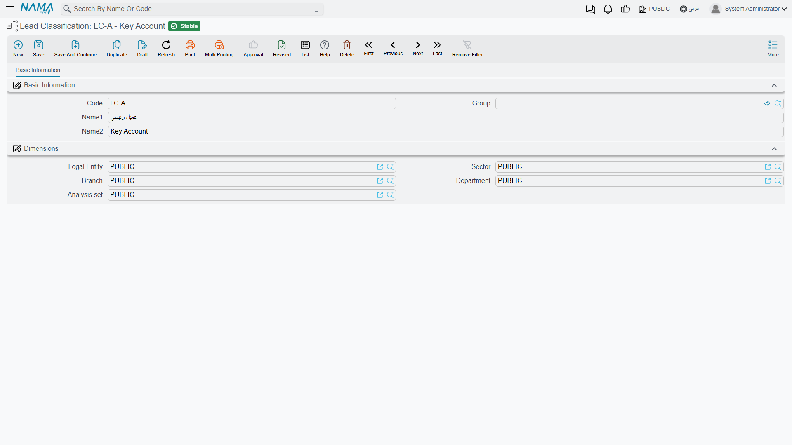

# Classification Files

::: info Required licence
`crm`.
:::

Six small lists give the sales side of CRM its vocabulary: what industry a prospect is in, how
valuable you think they are, what kind of activity is due next, why you lost them, and what kind of
campaign brought them in. They are all plain reference lists — a code and two names, sometimes one
extra box — and none of them does anything on its own.

What is worth knowing is that they split into two very different halves. **Three of them are part of
a real state machine**: every [Call](/modules/crm/activities/crm-calls.md) and every
[Visit](/modules/crm/activities/crm-visits.md) can push a new value from these lists back onto the
lead it was logged against. **The other three are labels** — you pick one when you create the
record and nothing ever changes it again.

## The six files

| File | Where it lives in the menu | Where it is selected |
|---|---|---|
| **Lead Classification / تصنيف العميل المرتقب** | Support / الدعم | Lead and Potential; and the *current* / *update to* pair on Calls and Visits |
| **Activity Type / نوع النشاط** | Support / الدعم | Lead and Potential; and the *current* / *next* pair on Calls and Visits |
| **Rejection Reason / سبب الرفض** | Support / الدعم | Lead and Potential; and the *current* / *new* pair on Calls and Visits |
| **Main Category / التصنيف الرئيسي** | Support / الدعم | Activity Type — and nowhere else |
| **CRM Industry / مجال خيط البيع** | Marketing / التسويق | Lead and Potential |
| **Campaign Type / نوع حملة** | Marketing / التسويق | Campaign |

Build them in this order, because only one dependency exists: **Main Category first, then Activity
Type** (each activity type points at a main category). Everything else is flat and can be entered in
any order.

## The three that Calls and Visits drive

This is the one genuinely dynamic mechanism in the CRM master files, and it is easy to miss because
it lives on the Call and Visit screens rather than here.

A Call or a Visit carries **paired** boxes. The first of each pair reads the lead's present value;
the second says what it should become:

| On the Call or Visit | Reads / writes |
|---|---|
| Current Lead Classification / تصنيف العميل الحالي | Filled from the lead when the box is still empty |
| Update Lead Classification To / تحديث تصنيف العميل إلى | Written back onto the lead on commit |
| Current Activity Type / نوع النشاط الحالي | Filled from the lead when the box is still empty |
| Next Activity Type / نوع النشاط التالي | Written back onto the lead on commit |
| Current Rejection Reason | Filled from the lead when the box is still empty |
| New Rejection Reason / سبب الرفض الجديد | Written back onto the lead on commit |
| Change Status To / تغيير الحالة إلى | Written back onto the lead on commit |
| Planned Re-Call Date / التاريخ المخطط لمعاودة الإتصال | Written back onto the lead on commit |

So in the worked example, `CALL-0342` on 14 January sets *Change Status To* = Contacted, *Update
Lead Classification To* = `LC-B` (عميل متوسط / Mid-Market) and *Next Activity Type* = `AT-02`
(زيارة موقع / Site Visit). When the call is committed, lead `LD-00417` carries those three values.
Eight days later the call-back `CALL-0357` moves the classification up to `LC-A`
(عميل كبير / Key Account). Nobody edited the lead directly; the activity documents did it.

::: warning A cancelled Call or Visit does not undo what it wrote
The push onto the lead is one-way. If you cancel `CALL-0357`, lead `LD-00417` keeps the `LC-A`
classification and the status the cancelled call gave it. Somebody has to open the lead and correct
it by hand.
:::

A **Visit Request** carries the very same boxes underneath, but they are not on its screen and it
never pushes anything. Only Calls and Visits do this.

## The screens

Four of the six are as plain as a master file gets — **Code, Group, Name1, Name2** and the
**Dimensions / محددات** group, with no notes box:

- **Lead Classification**, **Rejection Reason**, **Main Category** — nothing else at all.
- **Activity Type** — one extra box, **Main Category / التصنيف الرئيسي**.

Lead Classification shows how little there is to one of them:

The two Marketing files are slightly fuller. **CRM Industry** and **Campaign Type** each add
**Responsible Employee / الموظف المسئول**, **Mediator / الوسيط** and a spanned **Remarks** box.

::: warning Responsible Employee fills itself, whatever the settings say
Press New on an Industry or a Campaign Type and Responsible Employee is filled with the employee
attached to your user. This happens **unconditionally**. The
[CRM setting](/modules/crm/crm-configuration.md) named *Fill Responsible Employee With Current
Employee* looks as though it governs this and does not — it is honoured by the Lead screen and
nowhere else. Switching it off changes nothing here.
:::

## Main Category classifies exactly one thing

It sits in the menu as a top-level entry with an ambitious name, so it is worth saying plainly:
**Main Category is the grouping level above Activity Type, and it groups nothing else.** No lead, no
complaint, no problem and no campaign points at it. In the worked example `MCAT-01`
(أنشطة ما قبل البيع / Pre-Sales Activities) is the parent of `AT-01` Follow-up Call, `AT-02` Site
Visit and `AT-03` Technical Presentation, and that is the whole of its job.

## Two labels that do not match their master file

Both of these are cosmetic, but they trip people up when they are told to "fill in the Industry" and
cannot find a box with that name.

- **CRM Industry** appears in the menu as **مجال خيط البيع** and as *CRM Industry* in English — but
  the box on the Lead and Potential screens is labelled **المجال / Industry**. Same file, two
  different words.
- **Activity Type** is called **نوع النشاط** as a master file, but its box on the Lead and Potential
  screens reads **نوع النشاط للفرع** — "activity type for the branch". Nothing about the file has
  anything to do with a branch.

## Reporting

Reporting: none. This module ships no system reports, and this screen has no print form. Counting
leads by industry or by classification is a list-view, Excel-export or BI exercise.
