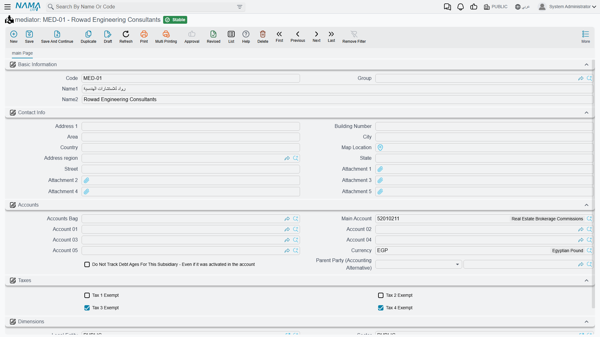

# Mediators and Agents

**mediator / وسيط** — `Customer Relationship Management > Support > mediator`.
**Agent / وكيل** — `Customer Relationship Management > Support > Agent`.

::: info Required licence
`crm`.
:::

Almost nobody sells air-conditioning plant to a hotel without somebody in the middle. A consulting
office writes the specification and puts you on the tender list; a technical agency in another
governorate carries your name and closes deals you never visit. NaMa keeps both kinds of party in
the CRM module, in two files called **mediator** and **Agent**.

The honest starting point is this: **the two files are identical**. Same fields, same screen, same
groups, in the same order. Nothing in the product stops you from entering the same company in both,
and nothing tells you which one you were supposed to use. The one real difference — the only
distinction the product actually enforces — is *where each of them can be picked from*.

## Which one do I use?

**Mediator is the load-bearing one.** A Mediator box sits on roughly twenty-five screens across the
module: [Leads](/modules/crm/sales-pipeline/crm-leads.md) and
[Potentials](/modules/crm/sales-pipeline/crm-potentials.md),
[Calls](/modules/crm/activities/crm-calls.md) and [Visits](/modules/crm/activities/crm-visits.md),
visit requests, [Campaigns](/modules/crm/marketing/crm-campaigns.md) and campaign types,
[Complaints](/modules/crm/support/crm-complaints.md) and their type and source files,
[trouble tickets](/modules/crm/support/crm-trouble-tickets.md) and their executions and follow-ups,
tasks, projects, questionnaires and their templates and questions, marketing and target plans,
[warranties](/modules/crm/master-files/crm-warranties.md), [FAQ entries](/modules/crm/master-files/crm-faq.md),
industries, and the [CRM service contract](/modules/crm/support/crm-service-contracts.md) in four
separate places. If you are going to maintain one of these two files properly, maintain this one.

**Agent reaches three fields in the whole system**, and all three are on documents most sites never
touch: the *Agent* box on the CRM service contract, the second *Agent* box on that contract's
Fixing Contract tab, and the *Agent* box on a CRM project. If you do not use CRM service contracts
or CRM projects, the Agent file has nowhere to be selected and there is no reason to fill it in.

In the worked example, `MED-07` **Rowad Engineering Consultants** (مكتب الرواد للاستشارات الهندسية)
is the consulting office that introduced Al Nokhba to Marina Plaza Hotels, and it is carried on the
lead, on the service contract and on everything in between. `AGT-02` **Delta Technical Services
Agency** (وكالة الدلتا للخدمات الفنية) exists only because the service contract has a box for it.

## The screen

Both files open the same single page.

### Basic Information

| Field | Notes |
|---|---|
| Code | The record's code. |
| Group | The master-group tree, if you use grouping. |
| Name1 | The Arabic name. |
| Name2 | The English name. |

There is no Remarks box on either screen — if you need a note about a mediator, it has to go into
the name or an attachment.

### Contact Info

Nine address boxes and five attachment slots, and that is all:

| Field | Notes |
|---|---|
| Address 1, Address 2 | Free text. |
| Street, Area, Region, City, State, Country | The address breakdown. |
| Map Location | A map reference. |
| Attachment 1 … Attachment 5 | Files you want kept with the record. |

::: warning "Contact Info" contains an address and nothing else
The group is titled **Contact Info / معلومات الاتصال**, but there is **no telephone, no mobile, no
fax, no e-mail and no website box** on it. The record is capable of storing all of them — they
simply are not on the screen as shipped.

Two consequences worth knowing before you plan your data:

- A mediator's phone number and e-mail cannot be typed in at all. They can only arrive by importing
  the data or through a web service, or after somebody adds those boxes to the screen layout.
- Saving a mediator or an agent writes it into the system-wide contact-information index — the one
  that lets you find a party by e-mail address. With the e-mail box off the screen, that index is
  written empty, so a mediator will not be found that way.
:::

### Subsidiary Accounts and Dimensions

Both files carry a **Subsidiary Accounts / حافظة الحسابات** block, and both are registered as
accounting subsidiary types. That means a mediator or an agent can be a party on an accounting entry
exactly like a customer or a supplier — fill this block in if the accounts team will ever post
against them.

::: warning Nothing in CRM ever posts to a mediator or an agent
Filling in the subsidiary block makes the party *available* to Accounting. It does not make CRM use
it. In particular, the mediator share, agent share and main-centre share percentages on the
[CRM service contract](/modules/crm/support/crm-service-contracts.md) are free-typed numbers: they
are not validated, not totalled, not turned into a commission, not turned into a payable and not
processed anywhere. If commissions matter to you, they are an Accounting exercise, not a CRM one.
:::

The page closes with the usual **Dimensions / محددات** group — legal entity, sector, branch,
department and analysis set.

## Setting them up

There is nothing to sequence and nothing to switch on. Create the mediators you actually work
through, early, because so much of the module points at them; add the accounting block to the ones
you pay; and create Agent records only if you have reached the point of using service contracts or
CRM projects.

Neither screen fills anything in for you when you press New, and neither validates anything on save
beyond the code.

## Reporting

Reporting: none. This module ships no system reports, and this screen has no print form. To get a
list of mediators or agents out, use the list view's filters and its Excel export, or build the view
you need in BI.
